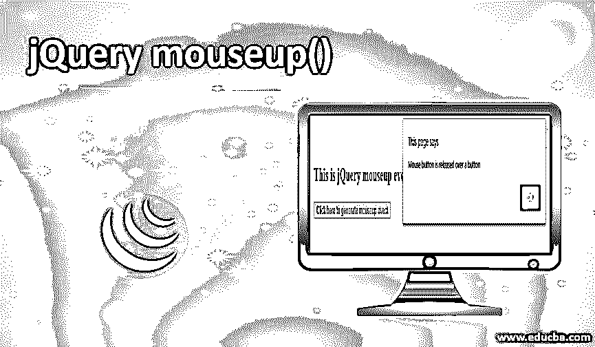

# jQuery mouseup()

> 原文：<https://www.educba.com/jquery-mouseup/>




## jQuery mouseup()简介

jQuery mouseup()方法用于处理鼠标按钮释放事件。jQuery mouseup()方法是 jQuery 的内置方法。jQuery mouseup()方法接受一个 html 元素的事件处理函数，当在 html 元素上按下(如果任何鼠标按钮)后释放鼠标按钮左键、右键或中键(如果任何鼠标按钮被释放)时，执行该函数。当因为在选定的 html 元素上按下按钮而释放任何鼠标按钮时，就会生成 mouseup()事件。当 mouseup()事件生成时，mouseup()方法执行指定的函数。mouseup()事件通常与 mousedown()事件一起使用。

**语法:**

<small>网页开发、编程语言、软件测试&其他</small>

jQuery mouseup()方法的语法是:

```
$(selector).mouseup()
```

此方法用于处理选定元素的 mouseup 事件。

```
$(selector).mouseup(function)
```

此方法用于接受一个函数来处理 mouseup 事件。

**参数:**

*   **Function:**Function 是可选参数，用于指定处理 mouseup 事件所要执行的函数的名称。

### 使用不同方法的 jQuery mouseup()示例

接下来，我们编写 html 代码，通过下面的例子更清楚地理解 jQuery mouseup()方法。

#### 示例#1

**代码:**

```
<!DOCTYPE html>
<html lang= "en" >
<head>
<meta charset= "utf-8" >
<script type = "text/javascript" src="https://ajax.googleapis.com/ajax/libs/jquery/1.11.3/jquery.min.js" >
</script>
<title> This is an example for jQuery mouseup() method </title>
<!-- code to show the jQuery mouseup() working method -->
<script>
$(document).ready(function(){
$( "#bid" ).mouseup(function(){
$( "div" ).text( "The Mouse left button released event is generated. " );
});
});
</script>
</head>
<body>
<button id="bid"> Click here to generate mouseup event. </button>
<div></div>
</body>
</html>
```

**输出:**


一旦点击按钮点击，输出是


在上面的代码中，使用了 mouseup()方法。mouseup()方法的用途是在生成事件时插入指定的文本，并且在我们单击按钮时生成事件。

#### 示例 2–fade out()方法

接下来，我们重写上面的代码，其中 jQuery mouseup()方法与 jQuery fadeOut()方法一起使用，如下面的代码所示

**代码:**

```
<!DOCTYPE html>
<html lang= "en" >
<head>
<meta charset= "utf-8" >
<script type = "text/javascript" src="https://ajax.googleapis.com/ajax/libs/jquery/1.11.3/jquery.min.js" >
</script>
<title> This is an example for jQuery mouseup() method </title>
<!-- code to show the jQuery mouseup() working method -->
<script>
$(document).ready(function(){
$( "#bid" ).mouseup(function(){
$( "div" ).text( "The Mouse left button released event is generated. " ).show().fadeOut( 2500 );
});
});
</script>
</head>
<body>
<button id="bid"> Click here to generate mouseup event. </button>
<div></div>
</body>
</html>
```

**输出:**


一旦点击按钮点击，输出是


mouseup()方法的上述代码用法是在事件生成时插入指定的文本，并且该文本在 2500 毫秒后淡出。

#### 示例 3–mousedown()方法

下一个示例代码中，jQuery mouseup()和 jQuery mousedown()方法用于区分它们的功能

**代码:**

```
<!DOCTYPE html>
<html lang= "en" >
<head>
<meta charset= "utf-8" >
<script type = "text/javascript" src="https://ajax.googleapis.com/ajax/libs/jquery/1.11.3/jquery.min.js" >
</script>
<title> This is an example for jQuery mouseup() method </title>
<!-- code to show the jQuery mouseup() working method -->
<script>
$(document).ready(function(){
$( "h1" ).mousedown(function(){
$( "h1" ).css("background-color", "red");
});
$( "h1" ).mouseup(function(){
$( "h1" ).css("background-color", "yellow");
});
});
</script>
</head>
<body>
<h1> Click here and generate mousedown and mouseup events. </h1>
</body>
</html>
```

**输出:**


一旦我们点击文本，输出是


在上面的代码中，使用了 mouseup()方法和 mousedown()方法。当我们单击文本时，将生成鼠标按下事件，并执行 mouse down()方法，该方法将文本的背景色更改为 read，然后释放按钮。生成 mouseup 事件，然后执行 mouseup()方法，该方法将文本的背景色更改为黄色。

#### 示例 4–alert()方法

jQuery mouseup()与 alert()方法一起使用的下一个示例代码

**代码:**

```
<!DOCTYPE html>
<html lang= "en" >
<head>
<meta charset= "utf-8" >
<script type = "text/javascript" src="https://ajax.googleapis.com/ajax/libs/jquery/1.11.3/jquery.min.js" >
</script>
<title> This is an example for jQuery mouseup() method </title>
<!-- code to show the jQuery mouseup() working method -->
<script>
$(document).ready(function(){
$( "#bid" ).mouseup(function(){
alert( "Mouse button is released over a button" );
});
});
</script>
</head>
<body>
<h2> This is jQuery mouseup event example</h2>
<button id= "bid"> Click here to generate mouseup event </button>
</body>
</html>
```

**输出:**


一旦我们点击按钮，输出是


### 结论

jQuery mouseup()方法是一个功能强大的方法，用于处理任何鼠标按钮释放事件，正如我们从示例中了解到的那样。该方法接受函数名作为参数，当 html 元素生成 mouseup 事件时，将执行该参数。实际上，当鼠标的任何按钮被释放时，都会生成 mouseup 事件，这是因为在 html 元素上按下了鼠标按钮。另一方面，如果我们也想处理鼠标按钮按下事件，那么我们可以使用 jQuery mousedown()方法来处理它。

### 推荐文章

这是 jQuery mouseup()的指南。这里我们讨论 jquery mouseup()的介绍和语法，以及不同的例子和它的代码实现。您也可以阅读以下文章，了解更多信息——

1.  [jQuery hover()的例子](https://www.educba.com/jquery-hover/)
2.  [jQuery show( )](https://www.educba.com/jquery-show/)
3.  [jQuery keydown()概述](https://www.educba.com/jquery-keydown/)
4.  [jQuery wrap()](https://www.educba.com/jquery-wrap/)


