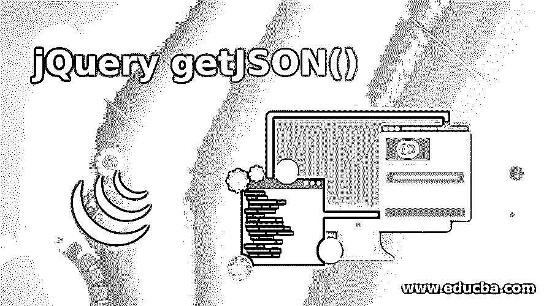
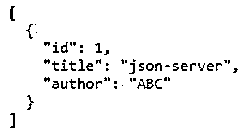
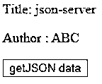

# jQuery getJSON()

> 原文：<https://www.educba.com/jquery-getjson/>




## jQuery getJSON()简介

JSON 代表 JavaScript 对象符号。JSON 作为交换数据的方式非常流行，通过使用它我们可以显示、样式化和修改数据。JQuery 中的 getJSON()方法用于加载或获取 JSON 编码的数据。在某些情况下，当我们请求服务器时，它会返回 JSON 字符串。得到的字符串将可用于 getJSON()方法的回调函数。getJSON()方法将使用 GET HTTP 请求。简单地说，getJSON()方法用于获取 JSON 格式的数据。

### 语法和参数

getJSON()方法用于获取 JSON 数据。它返回 XML HTTP 请求对象。JQuery 中的 getJSON()方法语法。

<small>网页开发、编程语言、软件测试&其他</small>

**语法:**

```
$(selector).getJSON(url[, data][, function])
```

**参数:**

它需要三个参数。参数的详细信息如下:

*   **URL:** 它是字符串类型，必须向 getJSON()方法提供或发送 URL。在这里，我们将指定它必须向其发送请求的 url。
*   **数据:**字符串类型或普通对象，可选参数。在这种情况下，请求将被发送到服务器。
*   **函数:**可选参数。如果请求成功，这个函数将被执行。它也由三个附加参数组成。它们是数据、状态和 xhr。
    *   **数据:**为普通对象类型。从服务器返回的数据会在这里。
    *   **状态:**为字符串类型。它包含文本状态。它可能是成功、错误、未修改、超时或解析错误。
    *   **Xhr:** 属于 jqXHR 类型。它包含 XML HTTP 请求。它有 jqXHR.done()表示成功。jqXHR.fail()它指示错误，它具有 jqXHR.always()。

### 如何使用 jQuery getJSON()？

*   在我们调用 getJSON()方法之前，我们需要将 URL 发送给我们需要创建 JSON 文件的方法。
*   我们需要首先安装 npm。
*   要安装 npm，我们需要在命令提示符下执行以下命令:NPM install–global JSON-server
*   执行上述命令后，我们必须创建并命名该文件，并将该文件保存为 *filename* .json。(文件名可以是您要求的任何名称。)
*   保存文件后，在命令提示符下执行以下命令:
*   Json-server–观察文件名. JSON
*   现在，如果我们在浏览器中键入这个 URL[http://localhost:3000/filename](http://localhost:3000/filename)。它将打开文件并显示我们在文件中写入的数据。
*   按照上面的步骤，我创建了一个文件，并将其命名为 db.json。
*   db.json 文件中的内容如下:

**代码:**

```
{
"posts": [
{
"id": 1,
"title": "json-server",
"author": "ABC"
}
],
"comments": [
{
"id": 1,
"body": "some comment",
"postId": 1
}
],
"profile": {
"name": "Raju"
}
}
```

*   在浏览器中键入 URL 作为[http://localhost:3000/profile](http://localhost:3000/profile)(这里我只执行 db.json 文件中的 profile，因此 URL 将如上所示)之后，输出将如下所示。


*   现在我们在程序中使用这个 URL。我们如何在 getJSON()方法中使用这个 URL，以及我们如何获取数据将在下面的例子中显示。

### jQuery getJSON()的示例

下面是下面给出的例子:

#### 示例#1

这是 getJSON()方法的一个简单例子。在这个例子中，我们可以观察 getJSON()方法是如何工作的。

**代码:**

```
<!DOCTYPE html>
<html>
<head>
<title>Example of the getJSON() method</title>
<script src="https://ajax.googleapis.com/ajax/libs/jquery/3.4.1/jquery.min.js"></script>
<script>
$(document).ready(function(){
$("button").click(function(){
$.getJSON("http://localhost:3000/profile", function(event){
$.each(event, function(i, value){
$("div").html(value);
});
});
});
});
</script>
</head>
<body>
<div>
Example for the getJSON() method
</div>
<button>getJSON data</button>
</body>
</html>
```

**输出:**

*   在上面的程序中，我们可以看到我们已经将 URL 传递给了 getJSON()，它将被重定向到我们已经创建的文件，并从该文件中获取数据。
*   在本例中，在单击按钮 getJSON data 之前，输出如下所示。


*   单击按钮 getJSON data 后，输出如下所示。通过单击按钮，我们可以看到 db.json- profile 中的内容被显示出来。


#### 实施例 2

这是 getJSON()方法的另一个例子。

**代码:**

```
<!DOCTYPE html>
<html>
<head>
<title>Example of the getJSON() method</title>
<script src="https://ajax.googleapis.com/ajax/libs/jquery/3.4.1/jquery.min.js"></script>
<script>
$(document).ready(function(){
$("button").click(function(){
$.getJSON("http://localhost:3000/profile", function(event){
$.each(event, function(i, value){
$("div").append(value + " ");
});
});
});
});
</script>
</head>
<body>
<div>
</div>
<button>getJSON data</button>
</body>
</html>
```

**输出:**

*   这个例子和上面的例子是一样的，这里我们使用了 append 而不是 html，因为通过点击按钮，数据是重复的。
*   在本例中，在单击按钮 getJSON data 之前，输出如下所示。


*   单击按钮 getJSON data 后，输出如下所示。


我们可以观察到，通过单击 getJSON data 按钮，该名称出现了重复。

#### 实施例 3

这是 getJSON()方法的一个例子。

**代码:**

```
<!DOCTYPE html>
<html>
<head>
<title>Example of the getJSON() method</title>
<script src="https://ajax.googleapis.com/ajax/libs/jquery/3.4.1/jquery.min.js"></script>
<script>
$(document).ready(function() {
$("button").click(function(event){
$.getJSON("http://localhost:3000/posts", function(posts) {
$("#getJsonDiv").html('<p> Title: ' + posts.Title + '</p>');
$("#getJsonDiv").append('<p>Author : ' + posts.author+ '</p>');
});
});
});
</script>
</head>
<body>
<div id="getJsonDiv">
Example for the getJSON () method
</div>
<button>getJSON data</button>
</body>
</html>
```

**输出:**

通过在浏览器中执行[http://localhost:3000/posts](http://localhost:3000/posts)，我们可以观察到输出如下所示。




*   我们可以在上面的代码中看到，我们已经将这个 URL 传递给了 getJSON()方法。所以它会把得到的数据显示在输出内容中。
*   点击按钮前获取 JSON 数据。输出将显示如下。


*   单击按钮 getJSON data 后，输出如下所示。




这些是一些示例程序，可以帮助您理解 getJSON()方法。

### 推荐文章

这是 jQuery getJSON()的指南。这里我们也讨论一下 jQuery getJSON()的介绍和使用方法？以及不同的示例及其代码实现。您也可以看看以下文章，了解更多信息–

1.  [jQuery innerHeight()](https://www.educba.com/jquery-innerheight/)
2.  [jQuery 验证](https://www.educba.com/jquery-validate/)
3.  [jQuery height()](https://www.educba.com/jquery-height/)
4.  [jQuery 是数值型的](https://www.educba.com/jquery-isnumeric/)


