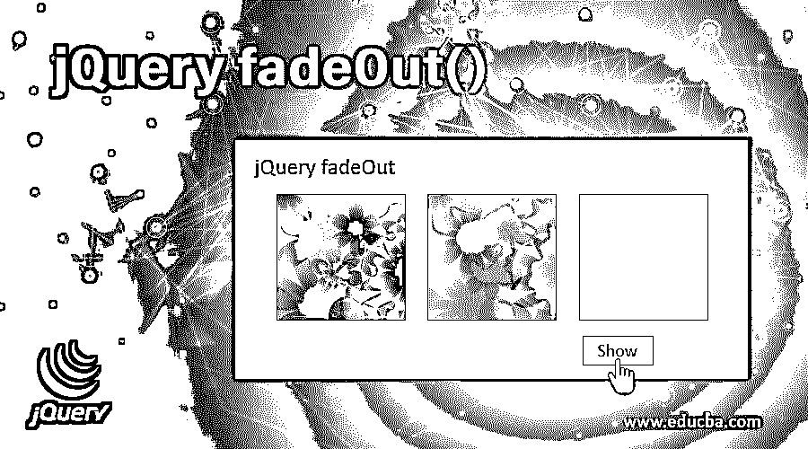
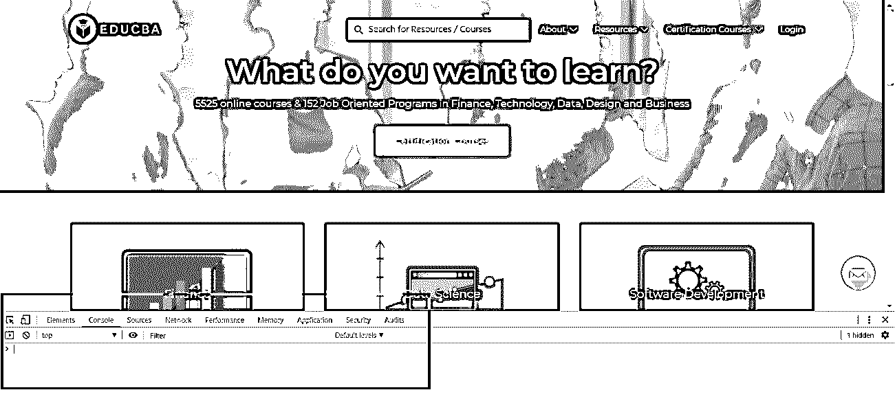
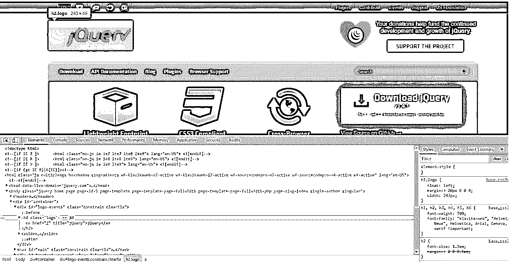
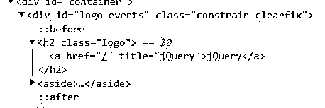
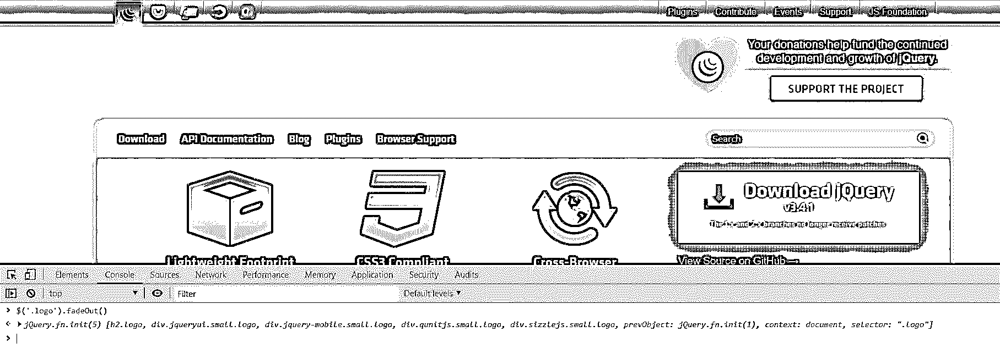
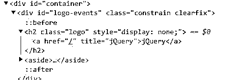

# jQuery fadeOut()

> 原文：<https://www.educba.com/jquery-fadeout/>




## jQuery fadeOut()简介

jQuery 的 fadeOut() [方法用于逐渐隐藏 DOM 中的一个元素，方法是将它渐变为透明。这是一个非常简单的方法。如果元素是可见的，并且对该元素调用了 fadeOut()方法，则该元素会慢慢变为透明，直到不可见。](https://www.educba.com/jquery-methods/)

### jQuery fadeOut()的语法

fadeOut()方法的语法根据传递给该方法的可选参数的数量有许多变体。

<small>网页开发、编程语言、软件测试&其他</small>

**NOTE:** jQuery methods are case sensitive. Be careful to capitalize the letter ‘O’ in the fadeOut() method.

#### 语法#1

基本和最基本的语法如下:

```
$(<element>).fadeOut();
```

此方法将在 400 毫秒内淡化元素。值 400 是持续时间参数的默认值。

#### 语法#2

高级语法需要如下一些参数:

```
$(<element>).fadeOut([duration], [complete]);
```

这里的持续时间是动画效果渐隐的时间，以毫秒为单位。如果未提供此参数，则应用默认值 400 毫秒。complete 是一个回调函数，在淡出动画完成后调用。这里需要注意的非常重要的一点是，回调函数对每个元素调用一次。

#### 语法#3

jQuery v1.4.3 引入了 fadeOut 方法的另一种变体。它需要另一个字符串类型的参数来定义动画期间的过渡类型。可能的值是“摆动”或“线性”，前者是默认值。

```
$(<element>).fadeOut([duration], [easing], [complete]);
```

那么，fadeOut 方法是如何达到目的的呢？简单的回答，它处理 CSS 的不透明度并显示元素的属性。在淡出活动的持续时间内，元素的不透明度会逐渐降低。一旦达到零，display 属性就被设置为 none。持续时间越长，动画褪色越慢。

### jQuery fadeOut()的示例

让我们看看 fadeOut()方法的一些例子。

**NOTE:** Throughout the examples in this article, we would be using the browsers’ developer console. Simply open the browser developer tools (Ctrl/Cmd + Shift + C) and go to the Console tab in the developer tools window.

该窗口在 Chrome 中将看起来像下面的屏幕:




这是大多数 jQuery 相关概念的游乐场。在整篇文章中，我们都会用到这个操场。现在，打开你的浏览器，进入任何基于 jQuery 的网站。还有什么比 jQuery 本身的网站([<u>【https://jquery.com/】</u>](https://jquery.com/))更好的选择呢。打开开发人员控制台。




接下来，我们确定想要淡化的元素。让我们淡出 jQuery 徽标。在“开发人员”窗口的“元素”选项卡中，您会看到元素是这样的:

```
<h2 class="logo"><a href="/" title="jQuery">jQuery</a></h2>
```




这个元素是通过一个类标识唯一定义的。我们将使用这个类作为选择器。

**NOTE:** When using a class as a selector, all the elements to which the class is applied are selected. To select a single element, use the id attribute.

接下来，转到控制台选项卡，键入以下命令:

```
$('.logo').fadeOut();
```

当您按 enter 键时，请注意 jQuery 徽标会慢慢从页面上消失。




Next, go back to the Elements tab and search for the logo element again. Notice the addition of CSS display property to the element now. It has now changed to this:

```
<h2 class="logo" style="display: none;"><a href="/" title="jQuery">jQuery</a></h2>
```




但是，等等，我们看不到不透明度属性在起作用。就这么办吧。返回控制台选项卡，键入以下命令:

```
$('.logo').fadeOut(10000);
```

我们给出了一个 10 秒钟的动画时长。当您按 enter 键时，请快速返回到“元素”选项卡。您会注意到，在 CSS opacity 属性起作用的情况下，jQuery 徽标在页面上消失了。

### jQuery fadeOut()的实现

让我们尝试从头开始实现整个 jQuery fadeOut()示例。你需要一个编辑器(就像记事本一样简单)和一个浏览器。

**步骤 1–打开记事本，将以下代码粘贴到其中。**

```
<!DOCTYPE html>
<html>
<head>
<!-- This is the CDN for jQuery. It references the jQuery library on the go. Your computer must be connected to the internet. -->
<script src="https://ajax.googleapis.com/ajax/libs/jquery/3.4.1/jquery.min.js"></script>
<script>
$(document).ready(function () {
// fade text out on click of button 1
$("#btn1").click(function () {
$("#para").fadeOut();
});
// fade text out slowly on click of button 2
$("#btn2").click(function () {
$("#para").fadeOut(5000);
});
// fade out image 1 very slowly in linear transition
// fade out image 2 very slowly in swing transition
// on click of button 3
$("#btn3").click(function () {
$("#pic1").fadeOut(8000, "linear", function () {
window.alert("Yayy!!! Pic 1 faded out");
});
$("#pic2").fadeOut(8000, "swing", function () {
window.alert("Yayy!!! Pic 2 faded out");
});
});
// fade text out on click of button 1
$("#btn4").click(function () {
$(".ele").fadeIn(0);
});
});
</script>
</head>
<body>
<p id="para" class="ele">EduCBA</p>


<br />
<label>linear</label>
<label>swing</label>
<br />
<br />
<button id="btn1">Fade Out text</button>
<button id="btn2">Fade Out text slowly</button>
<button id="btn3">Fade Out images (different transitions)</button>
<button id="btn4">Show All</button>
</body>
</html>
```

****第二步——将文件保存为 HTML 文件****

以扩展名. html 保存文件。这将把文件保存为 HTML 文件。

**步骤 3–打开浏览器并打开您刚刚保存的文件**

呈现的 HTML 页面如下所示:


### 结论

因此，我们已经在本文中介绍了 jQuery 的 fadeOut()函数。我们已经了解了淡出功能在幕后是如何工作的。此外，我们实现了自己的工作淡出模型。此外，一旦熟悉了这个概念，您将更多地使用 fadeOut 方法支持的各种其他可选参数。

建议多了解市场上的各种插件，以获得更高级的淡出体验。您可能会深入研究这些插件的代码，并理解它们是如何在 jQuery fadeOut API 上实现的。一旦理解了，你也可以开发你自己的插件！

### 推荐文章

这是 jQuery fadeOut()的指南。这里我们讨论 jQuery fadeOut()的介绍和例子，以及实现 fadeOut()方法的步骤。您也可以阅读以下文章，了解更多信息——

1.  [jQuery wrapInner()](https://www.educba.com/jquery-wrapinner/)
2.  [jQuery addClass()](https://www.educba.com/jquery-addclass/)
3.  [jQuery 选择器](https://www.educba.com/jquery-elements/)
4.  [jQuery slideUp()](https://www.educba.com/jquery-slideup/)


