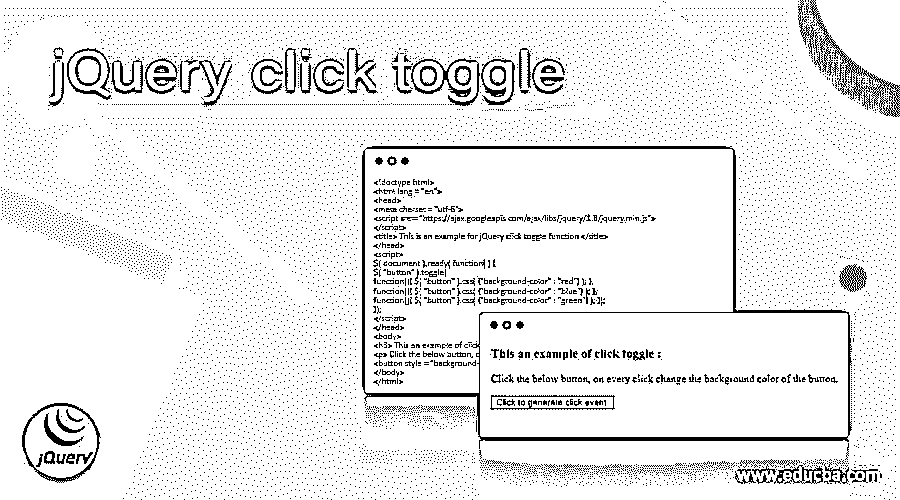
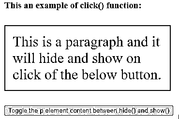
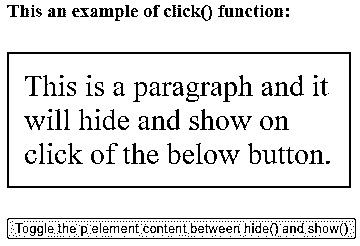
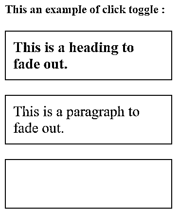
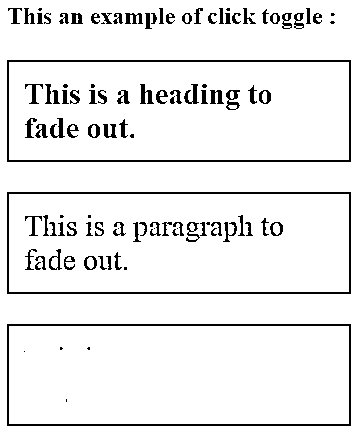
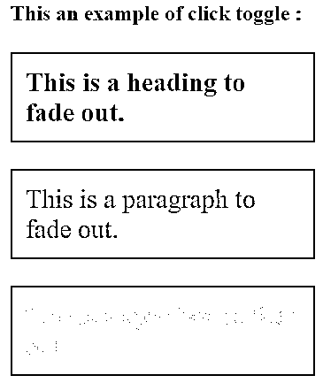
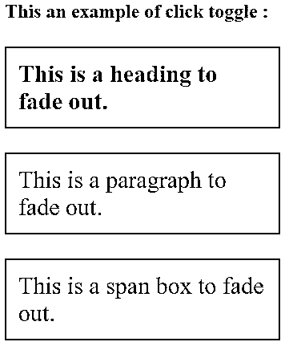

# jQuery 点击切换

> 原文：<https://www.educba.com/jquery-click-toggle/>




## jQuery 点击切换的定义

执行 jQuery click toggle 来切换每次单击时执行的两个或更多函数。我们可以在 toggle()函数的帮助下执行点击切换。jQuery toggle()函数是 jQuery 中的内置函数。每当单击选定的元素时，将触发列出的第一个函数，再次单击时，将触发列出的第二个函数，依此类推。这样我们就可以在每次点击选中的元素时执行不同的操作。

**jQuery toggle()函数的语法:**

<small>网页开发、编程语言、软件测试&其他</small>

```
$(selector).toggle(fun1, fun2, fun3, … funn);
```

**参数:**

fun1，fun2，fun3，…funn–这是一个可选参数。它指定了每当 click 事件发生时要执行的附加函数。
返回值-
该函数不返回任何值。

### jQuery 点击切换的工作方式

jQuery toggle()函数接受一个或多个函数作为参数，这些参数是 click 事件发生时要运行的函数的名称，它是可选的。假设 HTML 页面中有一个 div 元素，它包含一些内容。我们需要在单击时对 div 元素执行单击切换操作，因此我们可以将 toggle()函数用作“$(“div”)。toggle(function(){$(this))。CSS({ " color ":" red " })；}，function(){$(这个)。CSS({ " color ":" green " })；} );".现在，当我们单击页面中的任何 div 元素时，click 事件将生成并更改 div 元素内容的字体颜色，在下一次单击时，将字体颜色更改为绿色，依此类推。

### jQuery 点击切换示例

jQuery click toggle 示例在每次单击按钮时切换两个或多个函数调用。

#### 示例#1

**代码:**

```
<!doctype html>
<html lang = "en">
<head>
<meta charset = "utf-8">
<script src = "https://ajax.googleapis.com/ajax/libs/jquery/1.8/jquery.min.js">
</script>
<title> This is an example for jQuery click toggle function </title>
</head>
<script>
$( document ).ready( function( ) {
$( "button" ).toggle(
function(){ $( "button" ).css( {"background-color" : "red"} ); },
function(){ $( "button" ).css( {"background-color" : "blue"} ); },
function(){ $( "button" ).css( {"background-color" : "green"} ); });
});
</script>
</head>
<body>
<h3> This an example of click toggle : </h3>
<p> Click the below button, on every click change the background color of the button. </p>
<button style = "background-color : yellow;" > Click to generate click event. </button>
</body>
</html>
```

上述代码的输出是–


一旦我们点击按钮，输出是


一旦我们再次点击该按钮，输出是


当我们再次单击该按钮时，输出是–


在上面的代码中，创建了“button”元素，单击时它调用 toggle()函数，每次单击时，该函数都使用代码“$(“button”)来更改按钮的背景颜色。toggle(function(){ $(“按钮”)。CSS({ " background-color ":" red " })；}，function(){ $(“按钮”)。CSS({“background-color”:“blue”})；}); "，我们可以在上面的输出中看到。
jQuery 示例点击切换以切换显示或隐藏 p 元素的内容–

#### 实施例 2

**代码:**

```
<!doctype html>
<html lang = "en">
<head>
<meta charset = "utf-8">
<script src = "https://ajax.googleapis.com/ajax/libs/jquery/1.8/jquery.min.js">
</script>
<title> This is an example for jQuery click toggle function </title>
<style>
p {
display : block;
width : 310px;
padding : 15px;
font-size : 30px;
border : 2px solid green;
}
</style>
<script>
$(document).ready(function() {
$( "button" ).click( function(){
$( "p" ).toggle();
});
});
</script>
</head>
<body>
<h3> This an example of click() function: </h3>
<p> This is a paragraph and it will hide and show on click of the below button. </p>
<button> Toggle the p element content between hide() and show() </button>
</body>
</html>
```

上述代码的输出是–




一旦我们点击按钮，输出是


一旦我们再次点击该按钮，输出是




在上面的代码中，创建了“button”元素，并在单击时调用 toggle()函数。每次点击按钮，toggle()函数通过使用代码“$(“p”)隐藏和显示“p”元素内容。切换()；"，我们可以在上面的输出中看到。
jQuery 的例子点击切换来切换多个元素的功能

#### 实施例 3

**代码:**

```
<!doctype html>
<html lang = "en">
<head>
<meta charset = "utf-8">
<script src = "https://ajax.googleapis.com/ajax/libs/jquery/1.8/jquery.min.js">
</script>
<title> This is an example for jQuery click toggle function </title>
<style>
p {
display : block;
width : 310px;
padding : 15px;
font-size : 30px;
border : 2px solid green;
color : blue;
}
h3 {
display : block;
width : 310px;
padding : 15px;
font-size : 30px;
border : 2px solid green;
color : green;
}
span {
display : block;
width : 310px;
padding : 15px;
font-size : 30px;
border : 2px solid green;
color : yellow;
}
</style>
<script>
$(document).ready(function() {
$( "h3, p, span" ).toggle(
function(){$(this).css({ "color" : "red", "border" : "2px solid black" });},
function(){$(this).css({ "color" : "green", "border" : "2px dash red" });
});
});
</script>
</head>
<body>
<h2> This an example of click toggle : </h2>
<h3> This is a heading to fade out. </h3>
<p> This is a paragraph to fade out. </p>
 This is a span box to fade out. 
</body>
</html>
```

上述代码的输出是–




一旦我们点击标题，输出是




一旦我们点击该段落，输出是




一旦我们单击 span，输出是




在上面的代码中，使用了“h2”、“h3”、“p”和“span”元素。接下来，toggle()函数用于更改字体和边框颜色。因此，当“h3”或“p”或“span”元素内容被单击时，click 事件将生成，相应的元素内容元素字体样式将发生变化，并由函数列表按顺序应用。

### 结论

jQuery 的点击切换可以通过使用 toggle 函数来执行，toggle()函数是 jQuery 中的内置函数，用于在每次点击时切换两个或多个函数的执行。

### 推荐文章

这是一个 jQuery 点击切换指南。在这里，我们讨论的介绍，语法，代码实现的例子。您也可以看看以下文章，了解更多信息–

1.  [jQuery 数组](https://www.educba.com/jquery-array/)
2.  [jQuery 验证错误放置](https://www.educba.com/jquery-validate-errorplacement/)
3.  [jQuery 有](https://www.educba.com/jquery-has/)
4.  [jQuery 索引](https://www.educba.com/jquery-index/)


