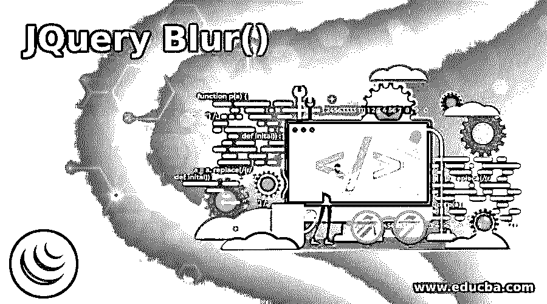
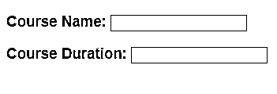
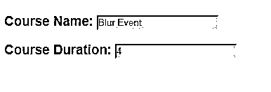

# JQuery 模糊()

> 原文：<https://www.educba.com/jquery-blur/>




## JQuery Blur()简介

JQuery Blur()事件是在 web 应用程序中执行操作时发生的事件。一些常见的事件是鼠标点击、提交表单、鼠标悬停在元素上等等。使用 jQuery，可以用一种非常简单而有效的方式来处理这样的事件。这里，我们将重点关注一种这样的事件类型，模糊事件及其被监听和处理的方式。

当一个元素丢失了它的。它基本上是一种用户与 web 应用程序的交互，用户试图将焦点从特定的。jQuery 中的 blur()方法是一个内置的方法，它基本上将一个事件处理函数附加到一个表单字段上，或者当一个模糊事件发生时调用这个函数，即表单字段失去焦点或触发模糊。blur()方法通常与 focus()方法一起使用，两者的作用正好相反。以前，模糊事件只适用于像<input>这样的表单元素，但是现在它可以应用于所有的元素类型。

<small>网页开发、编程语言、软件测试&其他</small>

### 句法

触发选定元素的事件

```
$(selector).blur();
```

将事件处理程序(函数)附加到模糊事件

```
$(selector).blur( handler );
```

这里，*处理程序*是可选参数，指定当模糊事件发生时要执行的功能。

```
$(selector).blur( [eventData], handler );
```

这里，eventData 是一个对象，它包含一些要传递给事件处理程序的数据，而处理程序是每当发生模糊事件时要执行的函数。选择器指的是所选的 HTML 元素，blur()方法将事件处理程序关联到该元素。blur()方法是 on()或 trigger()方法的简称，以 blur 事件作为其第一个参数。

### 在 jQuery 中实现 blur()方法的示例

让我们通过几个例子来更好地理解。

#### 示例#1

当没有函数作为参数传递给 blur()方法时:在给定的示例中，我们没有将任何事件侦听器或事件处理程序附加到 blur()方法。blur()方法只是在我们单击输入字段框之外的任何地方时，将焦点从所选的输入元素上移开。

**代码:**

```
<!DOCTYPE  html>
<html>
<head>
<script  src="https://code.jquery.com/jquery-1.12.4.min.js"></script>
<script>
$(document).ready(function()  {
$("#btn").click(function()  {
$(this).css("background-color", "blue");
$("input").blur();
});
});
</script>
</head>
<body>
<b>Your  comments:
<input  type="text"/></b>
<button  id="btn">
<b>Click  to  see  blur  event</b>
</button>
<h3  style="color:red;">
This  is  an  example  of  jQuery  blur  event  when  no  function  is  passed  as  an argument  to  blur  method.
</h3>
</body>
</html>
```

**输出:**

当页面第一次加载到浏览器中并且没有执行任何操作时，会出现下面的屏幕。这里，输入字段还没有接收到来自用户的任何输入。


我们在输入中输入一些输入，焦点仍然在输入字段中。


一旦单击按钮，输入字段就会失去焦点。


#### 实施例 2

当一个函数作为参数传递给 blur()方法时:在这里，blur()方法将一个事件处理函数关联到选定的 html。当 html 元素或表单字段失去焦点时，该函数中编写的代码将被执行。

**代码:**

```
<!DOCTYPE  html>
<html>
<head>
<script  src="https://code.jquery.com/jquery-1.12.4.min.js"></script>
<script>
$(document).ready(function()  {
$("input").blur(function()  {
$(this).css("background-color",  "#BBDBE5");
alert("The  blur  event  has  occurred  ");
});
});
</script>
</head>
<body>
<b>Your  comments:  <input  type="text"/></b>
<h3  style="color:red;">
This  is  an  example  of  jQuery  blur  event.  Click  anywhere  outside  the  field and  the  field  will  lose  its  focus.
</h3>
</body>
</html>
```

**输出:**

这是页面第一次加载到浏览器中时显示的屏幕，没有执行任何操作。


当我们在输入框中输入一些内容，然后点击框外的任何地方，下面的屏幕就会出现。

弹出一个警告窗口，提示*模糊事件已经发生。*

 *


*   我们看到，只要我们单击输入框外的任何地方，随着警告窗口的弹出，输入框的背景颜色就会改变。
*   这是因为场失去了焦点。
*   颜色变化的逻辑写在事件处理函数中。
*   这个事件处理函数通过 blur()方法与输入字段相关联。


#### 实施例 3

让我们来理解一下 focus 和 blur 事件的区别:focus()方法，就像 blur()方法一样，在 HTML 元素或者表单字段上附加一个事件处理函数。这个函数在表单字段获得焦点时执行。blur()和 focus()方法经常一起使用，但它们的工作方式正好相反。

**代码:**

```
<!DOCTYPE  html>
<html>
<head>
<script  src="https://code.jquery.com/jquery-1.12.4.min.js"></script>
<script>
$(document).ready(function()  {
$("input").focus(function()  {
$(this).css("background-color",  "#E5D2BB");
});
$("input").blur(function()  {
$(this).css("background-color",  "#BBDBE5");
});
});
</script>
</head>
<body>
<h3>Course  Name:  <input  type="text"  name="course  name"  /></h3>
<h3>Course  Duration:  <input  type="number"  name="course  duration"  /></h3>
</body>
</html>
```

**输出:**

*   当页面第一次加载到浏览器中并且没有执行任何操作时，会出现下面的屏幕。
*   这里，我们有两个输入字段，此时为空。




*   现在，我们在输入字段中输入值，然后焦点移到下一个输入字段。
*   一旦焦点移出该区域，第一个区域的背景颜色就会从纸牌色(#E5D2BB)变为浅蓝色(#BBDBE5)
*   现在，焦点在具有纸牌(#E5D2BB)背景色的第二个字段。


*   现在，当焦点从两个字段移开时，它们具有相同的背景颜色，即两个字段都失去了焦点。




### 结论

从本文中，我们或多或少地了解了什么是 jQuery 事件，jQuery 模糊事件是如何发生的，以及它的处理方式。总而言之，事件基本上是 web 应用程序检测到的用户交互。jQuery 事件侦听器或事件处理程序被分配给 HTML DOM 元素来注册这样的事件。可以使用 jQuery 事件方法以更高级的方式修改这些注册的行为。它们在创建动态网页时很有用。

### 推荐文章

这是 JQuery Blur()的指南。这里我们讨论 JQuery Blur()的介绍，以及相应的语法和例子。您也可以浏览我们的其他相关文章，了解更多信息——

1.  [jQuery focus()](https://www.educba.com/jquery-focus/)
2.  [jQuery innerHeight()](https://www.educba.com/jquery-innerheight/)
3.  [jQuery 变更()](https://www.educba.com/jquery-change/)
4.  [jQuery 包含](https://www.educba.com/jquery-contains/)


*