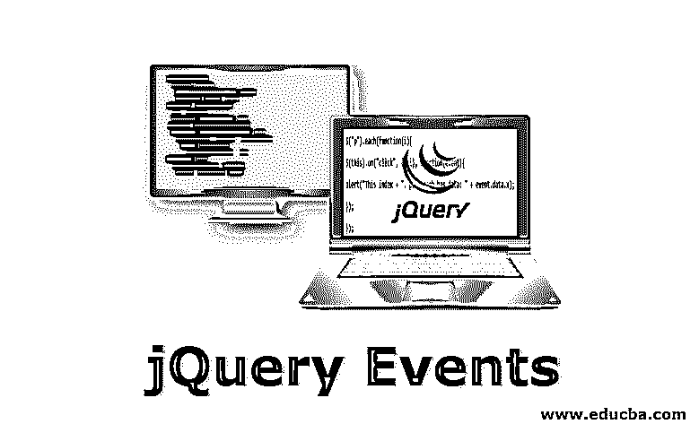

# jQuery 事件

> 原文：<https://www.educba.com/jquery-events/>




## jQuery 事件简介

jQuery 是为 javascript 代码创建和使用的众多库特性之一，目的是扩展 javascript 的功能边界。jQuery 事件可以定义为任何活动，甚至是在使用 javascript 和 jQuery 创建的网页上进行的点击。javascript jQuery 中常见的几个事件是 Click()事件、Dblclick()事件、change()事件、blur()事件、PageX、PageY、data、namespace、result、preventDefault()事件、Event.target()、type、timeStamp、which()事件、focus()事件、hovet()事件、keydown()事件、keypress()事件、keyup()事件、live()事件、load()事件、off()事件和 mousedown。

### jQuery 的事件和语法

以下是 jQuery 的事件，语法如下

<small>网页开发、编程语言、软件测试&其他</small>

#### 1.单击()

每当单击元素时，都会发生此事件。这个 click()方法用于触发 clicked 元素，也称为 click 事件，它用于在发生与单击相关的事件时附加到一个函数。

**语法**

```
$(selector).click()
```

当您希望将一个功能附加到这个点击事件时，

```
$(selector).click(function)
```

下一步总是伴随着动作和触发器而来，这形成了功能的实际工作和运行；因此，每当触发事件时，都应该向事件传递一个函数。

**例子**

```
$("p").click(function(){
// action which is triggered goes here!! });
```

#### 2.Dblclick()

此方法用于将事件处理函数附加到所提供的 HTML 元素。每当用户双击给定的 HTML 元素时，就会执行这个函数。

**语法**

```
$(selector).dblclick()
```

**例子**

```
$("p").dblclick(function(){
$(this).hide();
});
```

#### 3.更改()

每当特定元素的值发生更改时，就会发生此事件，即它仅适用于 input、textarea 和 selected 元素。 [change()方法用于](https://www.educba.com/jquery-change/)触发一个变更事件，或者每当与变更相关的事件必须发生时附加到函数的事件。

**语法**

```
$(selector).change()
```

**例子**

```
$("input").change(function(){
alert("This text related to this has been changed.");
});
```

#### 4.模糊()

只有当元素失去焦点时，才会发生这种与模糊相关的事件。blur()方法用于触发 blur 事件，或者用于附加一个函数，以便在发生 blur 事件时运行。该方法通常与 [focus()方法](https://www.educba.com/jquery-focus/)一起使用。

**语法**

```
$(selector).blur()
```

**例子**

```
$("input").blur(function(){
alert("The field has lost its focus.");
});
```

#### 5.数据

当绑定当前的执行处理程序时，此 event.data 属性用于包含与事件方法相关的可选传递数据。

**语法**

```
event.data
```

**例子**

```
$("p").each(function(i){
$(this).on("click", {x:i}, function(event){
alert("This index + ". paragraph has data: " + event.data.x);
});
});
```

#### 6.命名空间

每当触发事件时，此属性用于返回自定义命名空间。该属性用于由插件作者设置，根据所使用的名称空间，插件作者可用于处理非常不同的任务。以下划线开头的名称空间是为 JQuery 保留的名称空间。

**语法**

```
event.namespace
```

**例子**

```
$("p").on("custom.someNamespace", function(event){
alert(event.namespace);
});
```

#### 7\. PageX

这是页面类型属性，用于返回鼠标指针的位置，该位置与文档的左侧边缘相关。这种属性经常在事件期间使用。佩吉属性。

**语法**

```
event.PageX
```

**例子**

```
$(document).mousemove(function(event){
$("span text ").text("X: " + event.pageX);
});
```

#### 8.佩吉

这是页面类型属性，用于返回鼠标指针的位置，该位置与文档的上边相关。这种属性通常与事件一起使用。PageX 属性。

**语法**

```
event.PageY
```

**例子**

```
$(document).mousemove(function(event){
$("span text ").text("Y: " + event.pageY);
});
```

#### 9.结果

event.result 属性用于包含前一个或最后一个值，该值由特定事件专门触发的事件处理程序返回。

**语法**

```
event.result
```

**例子**

```
$("button").click(function(){
return "Hi there!";
});
```

#### 10.预防默认()

这个与事件相关的 event.preventDefault()方法用于阻止特定元素的默认操作发生。这种情况的例子包括:

阻止提交按钮提交表单

阻止链接访问特定的 URL。

event.preventDefault()等特定事件用于检查 preventDefault()方法或函数是否用于调用事件。

**语法**

```
event.preventDefault()
```

**例子**

```
$("a").click(function(event){
event.preventDefault();
});
```

#### 11.事件.目标()

该属性用于返回哪个 DOM 元素将被该事件触发。比较事件通常是没有用的。这是为了确定事件是否由于一个称为冒泡的事件而被处理。

**语法**

```
event.target
```

**例子**

```
$("p, button, h2").click(function(event){
$("div").html("Hi, triggered is " + event.target.NameNode + "  new element.");
});
```

#### 12.时间戳

此属性用于返回自 1970 年 1 月 1 日以来的毫秒数，该时间对应于事件首次实际触发的时间。

**语法**

```
event.TimeStamp
```

**例子**

```
$("button").click(function(event){
$("span").text(event.timeStamp);
});
```

#### 13.类型

这用于监控被触发的事件及其类型。

**语法**

```
event.type
```

**举例:**

```
$("p").on("click dblclick and mouse related events", function(event){
$("div").html("Event: " + event.type);
});
```

#### 14.哪个()

此属性用于返回为事件按下的键盘键或鼠标按钮。

**语法**

```
event.which
```

**例子**

```
$("input").keydown(function(event){
$("div").html("Key: " + event.which);
});
```

#### 15.焦点()

当使用元素获得焦点时，该属性和该事件的焦点发生，当通过鼠标单击或通过将选项卡导航到该元素上来选择该元素时，焦点发生。focus()方法用于触发焦点事件或附加一个在焦点相关事件发生时运行的函数。

**语法**

```
$(selector).focus()
```

**例子**

```
$("input").focus(function(){
$("span").css("display", "inline").fadeOut(200);
});
```

#### 16.悬停()

该 hover 方法用于指定当鼠标指针悬停在所有选定元素上时运行的两个函数。该方法触发 mouseleave 和 mouseenter 事件。如果只指定了一个函数，它将为 mouseleave 和 mouseenter 事件运行。

**语法**

```
$(selector).hover(inFunction,outFunction)
```

**例子**

```
$("p").hover(function(){
$(this).css("background-color", "blank");
}, function(){
$(this).css("background-color", "yellow");
});
```

#### 17.按键()

与 keydown 事件相关的事件顺序如下:

*   **Keydown:** 当按键按下时使用。
*   **按键:**当键盘上的键被按下时，就会出现这种情况
*   **Keyup:** 顾名思义，这是按下上侧的键时使用的。

**语法**

```
$(selector).keydown()
```

**例子**

```
$("input").keydown(function(){
$("input").css("background-color", "black");
});
```

#### 第 18 键印刷机()

与按键事件相关的事件顺序如下:

*   **Keydown:** 当按键按下时使用。
*   **按键:**当键盘上的键被按下时，就会出现这种情况
*   **Keyup:** 顾名思义，这是按下上侧的键时使用的。

**语法**

```
$(selector).keypress()
```

**例子**

```
$("input").keypress (function(){
$("input").css("background-color", "black");
});
```

#### 第 19 个按键()

与 keyup 事件相关的事件顺序如下:

*   **Keydown:** 当按键按下时使用。
*   **按键:**当键盘上的键被按下时，就会出现这种情况
*   **Keyup:** 顾名思义，这是按下上侧的键时使用的。

**语法**

```
$(selector).keyup()
```

**例子**

```
$("input").keyup(function(){
$("input").css("background-color", "black");
});
```

#### 20.直播()

[jquery 的这个 lives()方法或函数用于](https://www.educba.com/jquery-val/)附加一个或多个基于事件的处理程序，专门用于所选的元素列表，它还指定在事件发生时运行的函数。所有事件处理程序都是使用 live()方法附加的，这将对当前和未来的元素都有效，这是基于匹配选择器元素，就像脚本创建的新元素一样。die()方法可用于销毁 live()方法。

**语法**

```
$(selector).live(event,data,function)
```

**例子**

```
$("button").live("click", function(){
$("p").slideToggle();
});
```

#### 21.负载()

load 方法用于将事件处理程序附加到基于负载的事件。每当指定的。每当与 URL 关联的元素(如图像、框架、脚本、iframe 和窗口对象)出现时，此事件就会发生并起作用。load 事件可能会触发，也可能不会触发，这取决于浏览器，即使图像被缓存。还有一个 AJAX 方法，它是一个叫做 load()的 jquery 方法。

**语法**

```
$(selector).load(function)
```

**例子**

```
$("img").load(function(){
alert("stuff loaded.");
});
```

#### 22.老鼠洞

仅当在元素的选定列表上按下鼠标左键时，才会发生此事件。mousedown()方法或函数用于触发该事件，该事件附加了一个函数，每当 mousedown 事件发生时，它就会运行。该方法通常与 mouseup()方法一起使用。

**语法**

```
$(selector).mousedown()
```

**例子**

```
$("div").mousedown(function(){
$(this).after("Down button pressed with mouse.");
});
```

#### 23.关闭()

此方法用于移除与 on()方法一起附加的事件处理程序。可以说是对 unbind()方法、die()方法和 undelegate()方法的替代。该方法用于为 API 带来大量的一致性，并且总是推荐使用该方法，因为它用于简化 Jquery 代码库。

**语法**

```
$(selector).off(event,selector,function(eventObj),map)
```

**例子**

```
$("button").click(function(){
$("p").off("click");
});
```

#### 24 .鼠标输入()

每当鼠标指针位于指定的元素上并触发[mouseenter](https://www.educba.com/jquery-mouseenter/)事件时，该事件就会发生，或者用于附加一个函数，该函数可用于在基于 mouse enter 的事件发生时运行。

**语法**

```
$(selector).mouseenter()
```

**例子**

```
$("p").mouseenter(function(){
$("p").css("background-color", "black");
});
```

#### 25.鼠标离开()

每当鼠标指针位于指定的元素上并离开时，就会发生此事件，因为它触发鼠标离开事件，或者它用于解除一个函数的附加，该函数可用于在基于 mouseleave 的事件发生时运行。

**语法**

```
$(selector).mouseleave()
```

**例子**

```
$("p").mouseleave(function(){
$("p").css("background-color", "black");
});
```

就前端开发而言，Jquery 是使用最多的库之一。这提供了独特的特性和广泛的功能，有助于使开发者和所有人的生活变得容易和方便。我希望你喜欢我们的文章。请继续关注我们的博客，了解更多类似的内容。

### 推荐文章

这是 jQuery 事件指南。在这里，我们讨论最常见和最常用的各种 jQuery 事件的语法和示例。您也可以看看以下文章，了解更多信息–

1.  [jQuery 效果](https://www.educba.com/jquery-effects/)
2.  [jQuery 方法](https://www.educba.com/jquery-methods/)
3.  [jQuery 属性](https://www.educba.com/jquery-attributes/)
4.  [安装 Jquery](https://www.educba.com/install-jquery/)


