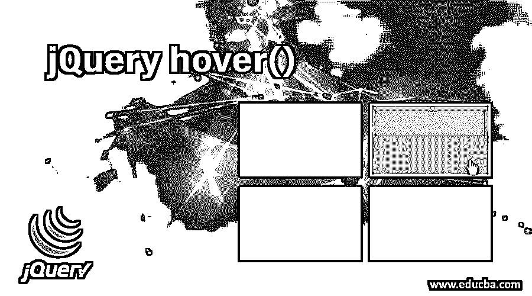
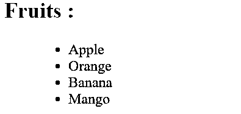
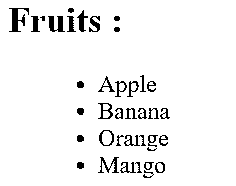
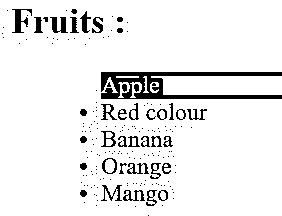

# jQuery hover()

> 原文：<https://www.educba.com/jquery-hover/>




## jQuery hover 介绍()

jQuery hover()方法用于处理鼠标悬停事件。这个方法是 jQuery 的一个[内置方法。](https://www.educba.com/jquery-methods/)当鼠标指针移动到选中的 HTML 元素上时，jQuery hover()方法执行两个函数。当鼠标指针在 HTML 元素上移动时，生成两个事件鼠标进入和鼠标离开事件，它处理鼠标进入和鼠标离开事件。鼠标进入和鼠标离开事件由两个不同的函数处理。

**jQuery hover()的语法:**

<small>网页开发、编程语言、软件测试&其他</small>

```
$(selector).hover(Functionin, Functionout)
```

```
$(selector).hover(Functioninout)
```

**参数:**

*   **Functionin:** Functionin 参数用于指定当鼠标指针进入[指定的 HTML 元素](https://www.educba.com/html-form-elements/)时执行哪个函数。
*   **Functionout:** Functionout 参数用于指定当鼠标指针离开指定的 HTML 元素时要执行哪个函数。
*   **function out:**function out 参数用于指定鼠标指针进入和鼠标指针离开指定 HTML 元素时要执行的函数。

### jQuery hover()的示例

以下是对 jQuery hover()的不同例子的详细解释。

#### 示例# 1–带有函数输入和函数输出参数

接下来，我们通过下面的例子编写 HTML 代码来更清楚地理解该方法:

**代码:**

```
<!DOCTYPE html>
<html>
<head>
<meta charset="utf-8">
<title> This is an example for jQuery hover() Method </title>
<script src="https://code.jquery.com/jquery-1.10.2.js" >  </script>
<script>
$(document).ready(function(){
$("h2").hover(function(){
$(this).css( "background-color", "red" );
}, function(){
$(this).css( "background-color", "pink" );
});
});
</script>
</head>
<body>
<h2> Move mouse pointer over the text! </h2>
</body>
</html>
```

**输出:**


一旦我们将鼠标指针移到文本上或输入鼠标指针，输出就是:


一旦鼠标指针离开文本，输出是:


在上面的示例代码中，当我们将鼠标指针悬停在所选元素(即文本)上时，文本背景颜色会变为红色和粉红色。

#### 示例# 2–使用 Functioninout 参数

接下来，我们编写 HTML 代码来理解通过使用 Functioinout 的单个函数来处理这两个事件的方法:

**代码:**

```
<!DOCTYPE html>
<html>
<head>
<meta charset="utf-8">
<title> This is an example for jQuery hover() Method </title>
<script src="https://code.jquery.com/jquery-1.10.2.js" > </script>
<script>
$(document).ready(function(){
$("h2").hover(function(){
$(this).css( "background-color", "red" );
});
});
</script>
</head>
<body>
<h2> Move mouse pointer over the text! </h2>
</body>
</html>
```

**输出:**


一旦我们将鼠标指针移到文本上或输入鼠标指针，输出就是:


一旦鼠标指针离开文本，输出是:


在上面的示例代码中，当我们将鼠标指针悬停在所选元素(即文本)上时，文本背景色变为红色。

#### 示例# 3–具有渐强和渐弱功能效果

接下来，我们编写 HTML 代码来理解在鼠标悬停所选元素时执行淡入淡出效果的方法:

**代码:**

```
<!DOCTYPE html>
<html lang="en">
<head>
<meta charset="utf-8">
<title> This is an example for jQuery hover() Method </title>
<style>
li {
cursor: default;
}
ul {
margin-left: 30px;
color: black;
background: yellow;
}
h2 {
color: red;
}
span {
color: red;
}
</style>
<script src="https://code.jquery.com/jquery-1.10.2.js" > </script>
</head>
<body>
<h2> Fruits : </h2>
<ul>
<li class="fade" > Apple </li>
<li class="fade" > Orange </li>
<li class="fade" > Banana </li>
<li class="fade" > Mango </li>
</ul>
<script>
$( "li" ).hover(
function() {
$( this ).append( $( " ... " ) );
}, function() {
$( this ).find( "span:last" ).remove();
}
);
$( "li.fade" ).hover(function() {
$( this ).fadeOut( 150 );
$( this ).fadeIn( 550 );
});
</script>
</body>
</html>
```

**输出:**




一旦鼠标指针停留在水果列表上，列表项就会产生淡入淡出效果。

#### 示例# 4–使用 hide()和 slideToggle()函数效果

接下来，我们编写 HTML 代码来理解在鼠标悬停所选元素时执行 hide()和 slideToggle()效果的方法:

**代码:**

```
<!doctype html>
<html lang="en">
<head>
<meta charset= "utf-8">
<title> This is an example for jQuery hover() Method </title>
<style>
ul {
margin-left: 20px;
color: blue;
}
li.active {
background: black;
color: white;
}
li {
cursor: default;
}
h2 {
color: red;
}
span {
color:red;
}
</style>
<script src="https://code.jquery.com/jquery-3.4.1.js"></script>
</head>
<body>
<h2> Fruits : </h2>
<ul>
<li> Apple </li>
<li>  Red colour  </li>
<li> Banana </li>
<li >  Yellow colour  </li>
<li> Orange </li>
<li>  Orange colour  </li>
<li> Mango </li>
<li>  Yellow colour  </li>
</ul>
<script>
$( "li" )
.filter( ":odd" )
.hide()
.end()
.filter( ":even" )
.hover(function() {
$( this )
.toggleClass( "active" )
.next()
.stop( true, true )
.slideToggle();
});
</script>
</body>
</html>
```

**输出:**




一旦鼠标指针悬停在文本上，输出是:




在上面的示例代码中，当我们将鼠标指针悬停(输入)在作为列表项的选定元素上时，会显示奇数文本。

### 结论

jQuery hover()方法用于处理鼠标悬停事件。这个方法是 jQuery 的内置[方法。当鼠标指针移动到选定的 HTML 元素上时，此方法使用来执行两个函数。鼠标进入和鼠标离开事件由两个不同的函数处理。](https://www.educba.com/jquery-prepend/)

### 推荐文章

这是 jQuery hover()的指南。这里我们讨论 jQuery 的简介、参数和各种代码实现的例子。您也可以阅读以下文章，了解更多信息——

1.  [jQuery keydown()](https://www.educba.com/jquery-keydown/)
2.  [jQuery Ajax](https://www.educba.com/jquery-ajax-methods/)
3.  [jQuery delegate( )](https://www.educba.com/jquery-delegate/)
4.  [jQuery show( )](https://www.educba.com/jquery-show/)


