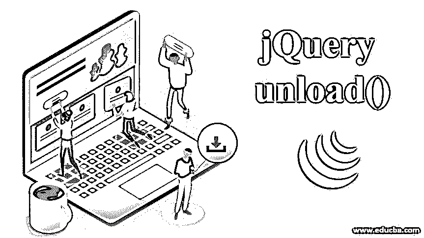
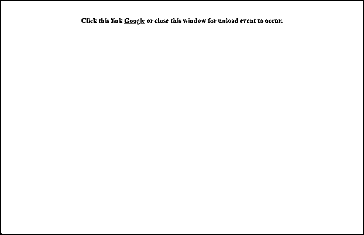
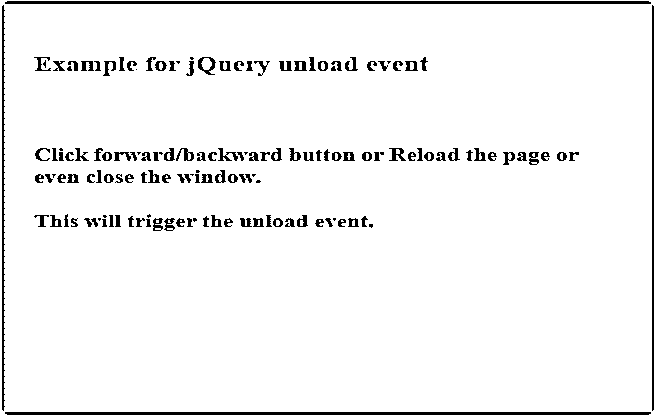
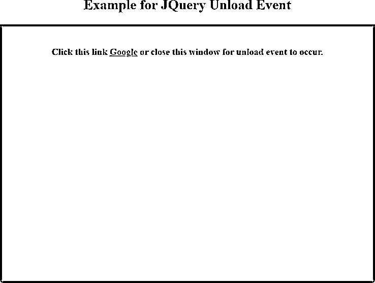
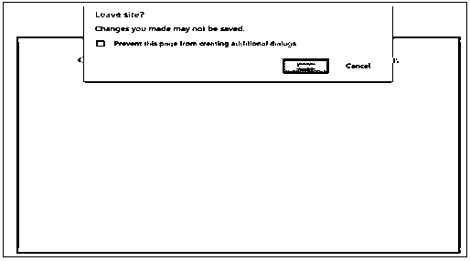
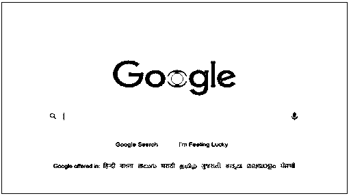

# jQuery 卸载()

> 原文：<https://www.educba.com/jquery-unload/>




## jQuery unload()简介

这篇 jQuery 文章讲述了众多 jQuery 事件中的[之一，unload event 和](https://www.educba.com/jquery-events/)其使用 jQuery unload()方法的实现。jQuery unload()是一个事件方法，它附加了一个在 jQuery unload 事件发生时执行的函数。jQuery unload()事件方法用于在卸载事件发生时将事件处理程序绑定到卸载事件。

当用户在页面上执行任何导航操作时，会发生 unload 事件，例如:

<small>网页开发、编程语言、软件测试&其他</small>

*   关闭浏览器窗口
*   重新加载网页
*   使用前进或后退按钮
*   点击链接“离开页面”
*   在地址栏中键入新的 URL

每当用户离开页面时，unload 事件被发送到 window 元素。卸载事件处理程序应该总是绑定到窗口。这个方法是方法 on( "unload "，handler)的简写。

**Note:** The unload() method was deprecated in jQuery 1.8 version and removed in jQuery 3.0 version.

**语法:**

下面是将函数附加到卸载事件的语法。

```
$(selector).unload(function)
```

其中 Function 是指发生卸载事件时要执行的函数。这是一个强制参数。

### jQuery unload()方法的实现

现在，让我们通过一些工作示例来研究在 jQuery 中实现 unload()方法的方式，从而获得对这个概念的详细理解。

#### 示例#1

此示例说明了当单击链接或关闭窗口时，如何触发 to unload 事件。

**代码:**

```
<!DOCTYPE  html>
<html>
<head>
<title>
Example  for  jQuery  unload()  Method
</title>
<script  src="https://code.jquery.com/jquery-1.12.4.min.js"></script>
<style> div {
width: 800px; height:  500px; padding:  20px; font-size:  medium; text-align:  center; margin:  auto;
font-weight: bold;
border:  3px  solid  cornflowerblue; margin-top:  50px;
margin-bottom:  10px;
}
</style>
<script>
$(document).ready(function()  {
$(window).unload(function()  { alert("Goodbye!");
});
});
</script>
</head>
<body>
<div>
<p>Click  this  link  <a  href=http://www.google.com>Google</a>  or  close  this  w indow  for  unload  event  to  occur.  </p>
</div>
</body>
</html>
```

**Note:** The unload event handling might vary browser to browser or version to version of a browser. For example, some browsers trigger the unload event upon clicking a link but not on reloading the page. Hence, the behavior of this method should be tested in all supporting browsers before use.

**解释下面的** **输出:**下面的截图是页面第一次加载到浏览器时捕获的。到目前为止，尚未执行任何活动。如上面的代码所示，我们已经使用了$(document)中的逻辑。就绪，文档对象模型就绪时触发的事件。$(窗口)。unload(function())表明 unload 事件处理程序总是绑定到窗口对象，而不是文档对象。一旦段落中提供的链接被点击，或者浏览器窗口被关闭，在你导航到另一个页面或者窗口被关闭之前，一个警告会弹出

**输出:**




#### 实施例 2

让我们看一个类似的例子，我们将看到点击前进/后退按钮，重新加载页面，甚至关闭窗口是如何触发卸载事件的。

**代码:**

```
<!DOCTYPE  html>
<html>
<head>
<title>Example  for  jQuery  unload()</title>
<script  src="https://code.jquery.com/jquery-1.12.4.min.js"></script>
<script>
$(document).ready(function()  {
$(window).unload(function()  { alert("you  are  leaving  from  page");
});
});
</script>
<style> div {
width: 400px; height:  300px; padding:  20px; font-size:  medium; margin:  auto;
font-weight: bold;
border:  3px  solid  cornflowerblue; background:  lightgray;
margin-top:  80px; margin-bottom:  10px;
}
</style>
</head>
<body>
<div>
<h3  style="color:  brown;">Example  for  jQuery  unload  event</h3>
<br /><br />
Click  forward/backward  button  or  Reload  the  page  or  even  close  the  window.
<br /><br />
This  will  trigger  the  unload  event.
</div>
</body>
</html>
```

**下图说明** **输出:**下图是页面在浏览器中首次加载时的截图。到目前为止没有执行任何活动。一旦单击向前/向后箭头，或者页面被重新加载，或者浏览器窗口被关闭，unload 事件就会被触发，从而执行附加的函数。这个附加到事件处理程序的函数将自身绑定到窗口元素，然后执行。该函数的执行会导致显示一个警告框，询问您是否仍想离开当前页面。

**输出:**




#### 实施例 3

此示例说明了在重新加载或单击链接时，如果 jQuery 中没有弹出警告，如何使用 on before unload 事件处理程序来代替 unload。

**代码:**

```
<!doctype  html>
<head>
<title>JQuery Unload Event</title>
<script  src="https://code.jquery.com/jquery-1.12.4.min.js"></script>
<style> div {
width:  600px; height:  400px; padding: 20px; font-size:  medium;
text-align:  center; margin:  auto;
font-weight:  bold;
border:  3px  solid  cornflowerblue; margin-top:  20px;
margin-bottom:  10px;
}
</style>
</head>
<h2  style="text-align:  center;">Example  for  JQuery  Unload  Event  </h2>
<script type="text/javascript">
$(document).ready(function(){
$(window).on('beforeunload  ',function()  { return  'Are  you  sure  ?';
});
});
</script>
<body>
<div>
<p>Click  this  link  <a  href=http://www.google.com>Google</a>  or  close  this  win dow  for  unload  event  to  occur.  </p>
</div>
</body>
</html>
```

**下面的解释** **输出:**下面的截图是在浏览器中第一次加载页面时捕获的。到目前为止没有执行任何活动。




*   单击上面段落中的链接后，jQuery unloads()方法允许您将函数绑定到窗口元素的事件处理程序。
*   这个函数在执行时会弹出一个警告，询问您是否仍想离开当前页面。
*   如果您确认是，您将被重定向到目标页面。
*   许多浏览器忽略事件处理程序中对 alert()、confirm()和 prompt()的调用。
*   返回的文本消息应该在确认对话框中使用，但不是所有的浏览器都支持这一点。




*   以类似的方式，在关闭窗口或重新加载页面时，会弹出一个警告框要求确认。
*   这背后的逻辑是，这些操作会导致卸载事件触发，进而执行带有事件处理程序的附加函数。




### 结论

本文通过一些工作示例演示了 jQuery unload()方法的实现。我们看到了卸载事件是如何被触发的，以及 jQuery 事件处理程序是如何处理它的。当用户执行任何页面导航操作(例如，单击任何链接、关闭窗口或重新加载页面)时，会发生 unload 事件。jQuery unload()方法总是与窗口元素一起使用。

### 推荐文章

这是 jQuery unload()的指南。在这里，我们将讨论在 jQuery unload()中实现的简介、语法和程序，以及正确的代码和输出。您也可以浏览我们的其他相关文章，了解更多信息——

1.  [JQuery fadeToggle](https://www.educba.com/jquery-fadetoggle/)
2.  [jQuery slideUp()](https://www.educba.com/jquery-slideup/)
3.  [jQuery focus()](https://www.educba.com/jquery-focus/)
4.  [jQuery fadeIn()](https://www.educba.com/jquery-fadein/)


