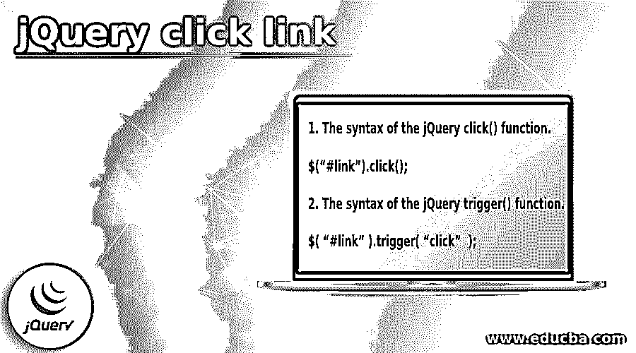
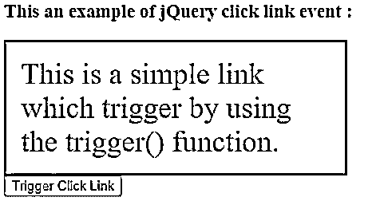
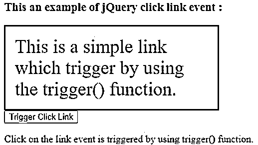
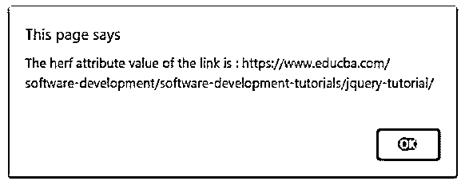

# jQuery 点击链接

> 原文：<https://www.educba.com/jquery-click-link/>




## jQuery 简介点击链接

jQuery click 链接用于在 link 元素发生 click 事件时处理 click 事件。jQuery click()函数和 trigger()函数可以用来在 jQuery 中以编程方式触发和处理单击链接事件。jQuery 的 click()函数和 trigger()函数都是 jQuery 的内置函数。每当通过单击元素发生 click 事件时，jQuery click()函数都会触发 click 事件，并执行 click()函数或附加函数。jQuery trigger()函数触发指定的并为选定的元素执行事件的默认操作。所以通过使用这些函数，我们可以在每次点击链接时执行一些操作。click()函数是“.on( "click "，处理程序)"和"。触发("点击" )"表达式。

**语法:**

<small>网页开发、编程语言、软件测试&其他</small>

1.jQuery click()函数的语法。

```
$("#link").click();
```

2.jQuery 触发器()函数的语法。

```
$( "#link" ).trigger( "click"  );
```

**参数:**

*   **点击:**这不是可选参数。它指定为所选元素触发的事件类型，因为这里是一个链接元素。

**返回值:**

它们不返回任何值。

### 工作

*   它用于触发和处理点击链接事件。
*   假设我们在包含一些超链接的 HTML 页面中有一个 link 元素(
*   我们需要使用 jquery 在 click 上对“a”元素执行 click 事件处理，因此我们可以将 click()函数用作“$(“a”)。click(function(){ alert(" link clicked)事件生成。");});".
*   现在，当我们单击页面中的任何“a”元素时，click link 事件就会生成，并显示警告消息“link clicked event generate”.

### jQuery 点击链接的例子

下面是提到的例子:

#### 示例#1

使用 jQuery click()函数处理 link 上的 click 事件。

**代码:**

```
<!doctype html>
<html lang="en">
<head>
<meta charset="utf-8">
<script src="https://code.jquery.com/jquery-3.5.0.js"></script>
<title> This is an example for jQuery click link event </title>
</head>
<body>
<h3> The Example for jQuery click link event : </h3>
<p><a href = "#page" onclick = "clickLink()"> Bookmark link to a page </a></p>
<button type = "button"> Trigger Click Link </button>
<script>
function clickLink(){
alert("Click on the link event is triggered.");
}
$(document).ready(function(){
$( "button" ).click(function(){
$( "a" ).click();
});
});
</script>
</body>
</html>
```

**输出:**


**一旦我们点击按钮，输出是:**


在上面的代码中，创建了“button”元素，并通过使用函数 click()as“$(“button”)将其绑定到“a”元素的 click 事件。单击(function(){ $( "a ")。单击()；});"该函数调用 clickLink()函数并显示警告消息。因此，如果我们单击链接或按钮，click link 事件会触发并显示警告消息，正如我们在上面的输出中看到的那样。

#### 实施例 2

使用 jQuery trigger()函数处理 link 上的 click 事件。

**代码:**

```
<!doctype html>
<html lang="en">
<head>
<meta charset="utf-8">
<script src="https://code.jquery.com/jquery-3.5.0.js"></script>
<title> This is an example for jQuery click link event </title>
<style>
a {
display : block;
width : 310px;
padding : 15px;
font-size : 30px;
border : 2px solid green;
}
</style>
<script>
function clickLink(){
$( "#p1" ).text("Click on the link event is triggered by using trigger() function.");
}
$(document).ready(function() {
$( "button" ).click(function(){
$( "a" ).trigger( "click" );
});
});
</script>
</head>
<body>
<h3> This an example of jQuery click link event : </h3>
<div>
<a onclick = "clickLink()" > This is a simple link which trigger by using the trigger() function. </a>
<button type = "button"> Trigger Click Link </button>
</div>
<p id = "p1"> </p>
</body>
</html>
```

**输出:**




**一旦我们点击按钮，输出是:**




在上面的代码中，创建了“button”元素，并通过使用函数 trigger()作为“$(“button”)将其绑定到“a”元素的 click 事件。单击(function(){$( "a ")。触发(“点击”)；});"该函数调用 clickLink()函数并显示警告消息。因此，如果我们单击链接或按钮，click link 事件将触发并显示警报消息，正如我们在上面的输出中看到的那样。

#### 实施例 3

使用 jQuery click()函数处理 link 上的 click 事件并显示其“href”属性值。

**代码:**

```
<!doctype html>
<html lang="en">
<head>
<meta charset="utf-8">
<script src="https://code.jquery.com/jquery-3.5.0.js"></script>
<title> This is an example for jQuery click link event </title>
<script>
function clickLink(){
$link = $('a');
alert("The herf attribute value of the link is : " +$link.attr('href'));
}
$(document).ready(function(){
$( "button" ).click(function(){
$( "a" ).click();
});
});
</script>
</head>
<body>
<h3> This an example of jQuery click link event : </h3>
<a onclick = "clickLink()" href = "https://www.educba.com/software-development/software-development-tutorials/jquery-tutorial/"> This jQuery tutorial link. </a>
<br>
<button type = "button"> Trigger Click Link </button>
<p id = "p1"> </p>
</body>
</html>
```

**输出:**


**一旦我们点击标题，输出是:**




在上面的代码中，创建了“button”元素，并通过使用函数 click()将其绑定到“a”元素的 click 事件，该函数调用函数 clickLink()函数，并在警报消息中将该链接元素的“href”属性值显示为“$ link . attr(' href ')；”.因此，如果我们单击链接或按钮，click link 事件将触发并在警报消息中显示“href”属性值，正如我们在上面的输出中看到的那样。

### 结论

jQuery click link 事件的触发和处理通过使用 click()和 trigger()函数，它用于在 link 元素发生 click 事件时处理 click 事件。

### 推荐文章

这是一个 jQuery 点击链接的指南。这里我们分别讨论 jQuery 点击链接事件的介绍、工作原理和实例。您也可以看看以下文章，了解更多信息–

1.  [jQuery 选择选项](https://www.educba.com/jquery-select-option/)
2.  [jQuery zindex](https://www.educba.com/jquery-zindex/)
3.  [jQuery 宽度](https://www.educba.com/jquery-width/)
4.  [jQuery id 选择器](https://www.educba.com/jquery-id-selector/)


