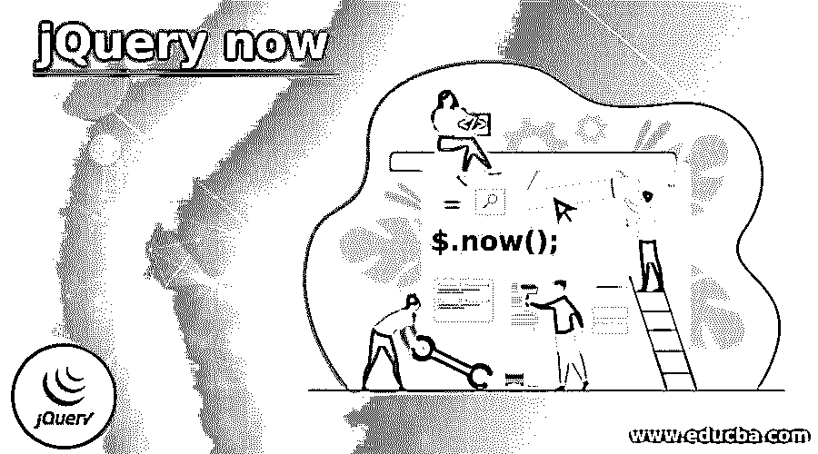
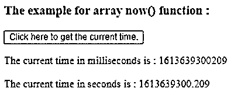
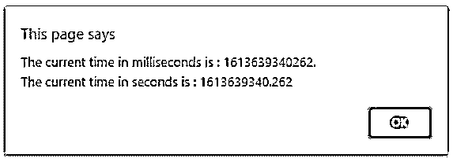
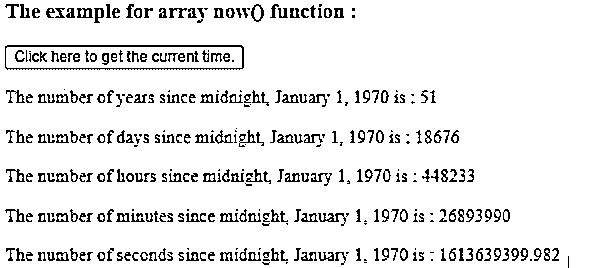

# jQuery now

> 原文：<https://www.educba.com/jquery-now/>




## jQuery 简介

jQuery now()函数用于获取当前时间。它是 jQuery 中的内置函数。它返回指定从 1970 年 1 月 1 日到当前时间的数字。它以毫秒为单位指定当前时间。简单来说，jQuery now()函数是“(新日期)”的简短表达式。getTime()；"表情。

**语法:**

<small>网页开发、编程语言、软件测试&其他</small>

```
$.now();
```

**参数:**

*   它不接受任何参数。

**返回值:**

该函数的返回值是以毫秒为单位的当前时间。

### 工作

*   jQuery now()函数不接受任何参数。
*   假设我们必须在页面上打印当前时间，那么我们可以使用 now()函数作为" $。现在()；"，它将以毫秒为单位返回一个数字形式的当前时间，从中我们可以计算年、月、日、小时和分钟的数量。

### jQuery now 示例

下面是提到的例子:

#### 示例#1

获取当前时间的 jQuery now()函数示例。

**代码:**

```
<!doctype html>
<html lang="en">
<head>
<meta charset="utf-8">
<script src="https://code.jquery.com/jquery-3.5.0.js"></script>
<title> This is an example for jQuery now() function </title>
</head>
<style>
p {
color : blue;
</style>
<body>
<h3> The example for array now() function : </h3>
<button onclick = "checkRes()" > Click here to get the current time. </button>
<br>
<p id = "p1"> </p>
<p id = "p2"> </p>
<br>
<script>
function checkRes()
{
var time = $.now();
$( "#p1" ).text("The current time in milliseconds is : " + time );
$( "#p2" ).text("The current time in seconds is : " + time/1000 );
}
</script>
</body>
</html>
```

**输出:**


**一旦我们点击按钮，输出是:**




在上面的代码中，一旦我们单击按钮，它将调用 checkRes()函数，在这里它使用 now()函数来显示从 1970 年 1 月 1 日开始的以毫秒为单位的当前时间，如“$。现在()；"，所以我们可以在上面的输出中看到当前时间。

#### 实施例 2

函数使用 Date 对象获取当前时间。

**代码:**

```
<!doctype html>
<html lang="en">
<head>
<meta charset="utf-8">
<script src="https://code.jquery.com/jquery-3.5.0.js"></script>
<title> This is an example for jQuery now() function </title>
</head>
<body>
<h3> The example for array now() function : </h3>
<button onclick = "checkRes()" > Click here to get the current time. </button>
<br>
<p id = "p1"> </p>
<p id = "p2"> </p>
<br>
<script>
function checkRes( )
{
var time = Date.now();;
alert( "The current time in milliseconds is : " + time + ". \nThe current time in seconds is : " + time/1000 );
}
</script>
</body>
</html>
```

**输出:**


**一旦我们点击第一个按钮，输出是:**




在上面的代码中，一旦我们单击按钮，它将调用 checkRes()函数，其中 checkRes()函数与 now()函数和 Date 对象一起使用，以毫秒为单位将当前时间显示为“Date.now()”，所以我们可以在上面的输出中看到当前时间。

#### 实施例 3

函数来获取年数、天数、小时数、分钟数和秒数。

**代码:**

```
<!doctype html>
<html lang="en">
<head>
<meta charset="utf-8">
<script src="https://code.jquery.com/jquery-3.5.0.js"></script>
<title> This is an example for jQuery now() function </title>
</head>
<style>
p {
color : green;
</style>
<body>
<h3> The example for array now() function : </h3>
<button onclick = "checkRes()" > Click here to get the current time. </button>
<br>
<p id = "p1"> </p>
<p id = "p2"> </p>
<p id = "p3"> </p>
<p id = "p4"> </p>
<p id = "p5"> </p>
<br>
<script>
function checkRes()
{
var min = 1000 * 60;
var hrs = min * 60;
var days = hrs * 24;
var yrs = days * 365;
var time = $.now();
var yr = Math.round(time / yrs);
var d = Math.round(time / days);
var h = Math.round(time / hrs);
var m = Math.round(time / min);
$( "#p1" ).text("The number of years since midnight, January 1, 1970 is : " + yr );
$( "#p2" ).text("The number of days since midnight, January 1, 1970 is : " + d );
$( "#p3" ).text("The number of hours since midnight, January 1, 1970 is : " + h );
$( "#p4" ).text("The number of minutes since midnight, January 1, 1970 is : " + m );
$( "#p5" ).text("The number of seconds since midnight, January 1, 1970 is : " + time/1000 );
}
</script>
</body>
</html>
```

**输出:**


**一旦我们点击按钮，输出是:**




在上面的代码中，一旦我们单击按钮，它将调用 checkRes()函数，其中 checkRes()函数使用 now()函数来获取从 1970 年 1 月 1 日开始的以毫秒为单位的当前时间，作为“$。现在()；"并计算从 1970 年 1 月 1 日到现在的年数、天数、小时数、分钟数和秒数，所以我们可以在上面的输出中看到。

### 结论

它是一个内置函数，用于返回自 1970 年 1 月 1 日以来以毫秒为单位的当前时间。

### 推荐文章

这是 jQuery now 的一个指南。这里我们分别结合实例讨论 jQuery now()函数的介绍、工作原理。您也可以看看以下文章，了解更多信息–

1.  [jQuery 选择选项](https://www.educba.com/jquery-select-option/)
2.  [jQuery zindex](https://www.educba.com/jquery-zindex/)
3.  [jQuery 宽度](https://www.educba.com/jquery-width/)
4.  [jQuery id 选择器](https://www.educba.com/jquery-id-selector/)


