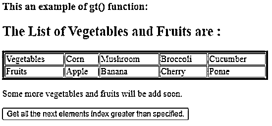
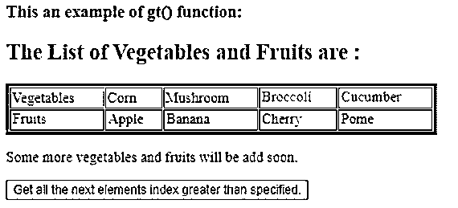
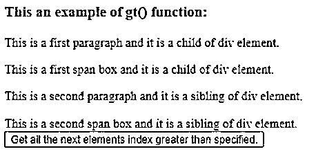
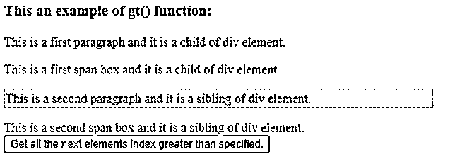
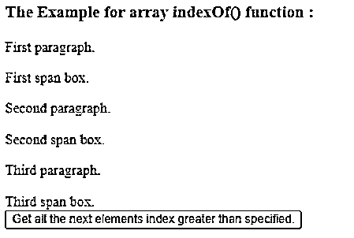
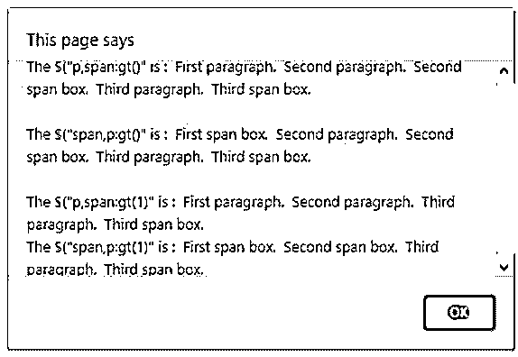

# jQuery gt()

> 原文：<https://www.educba.com/jquery-gt/>


## jQuery gt()简介

jQuery gt()选择器函数用于选择索引大于指定索引的所有元素。jQuery gt()函数是 jQuery 中的内置函数。带有大于选择器的索引选择器表达式筛选先前匹配的表达式元素集。索引从 0 开始。而 lt()函数选择索引值小于指定索引的所有元素。

**语法:**

<small>网页开发、编程语言、软件测试&其他</small>

```
$("$:gt( index )");
```

**参数:**

*   **index:** 这不是可选参数。它指定要选择的索引值，选择索引大于指定索引的元素。

**返回值:**

该函数的返回值是指定元素的索引值。

### 工作

*   jQuery gt()函数接受一个参数，这个参数是索引值，用来选择索引值大于这个值的所有元素。
*   假设我们在 HTML 页面中有四个 div 元素，我们需要获取所有索引大于 1 的 div 元素(选择索引第二和第三个元素)，所以我们可以使用 gt()函数作为“$(" div:gt(1)")；”，它选择第三和第四个包含内容的 div。

### jQuery gt()的例子

下面给出了 jQuery gt()的例子:

#### 示例#1

jQuery gt()函数的例子，获取所选元素的索引值大于指定值。

**代码:**

```
<!doctype html>
<html lang="en">
<head>
<meta charset="utf-8">
<script src="https://code.jquery.com/jquery-3.5.0.js"></script>
<title> This is an example for jQuery gt() function </title>
<script>
function disp()
{
$( "td:gt(2)").css({
"color" : "red",
"border": "2px solid black"
});
}
</script>
</head>
<body>
<h3> This an example of gt() function: </h3>
<h2> The List of Vegetables and Fruits are : </h2>
<table style = "width:80%" border = "4">
<tr>
<td> Vegetables </td>
<td> Corn </td>
<td> Mushroom </td>
<td> Broccoli </td>
<td> Cucumber  </td>
</tr>
<tr>
<td> Fruits </td>
<td> Apple </td>
<td> Banana </td>
<td> Cherry </td>
<td> Pome  </td>
</tr>
</table>
<p> Some more vegetables and fruits will be add soon. </p>
<button onclick = "disp()">Get all the next elements index greater than specified.</button>
</body>
</html>
```

**输出:**




**一旦我们点击按钮，输出是:**




在上面的代码中，有一个包含 tr 和 td 元素的 table 元素。接下来，使用 gt()函数获取索引值大于 2 的所有后续元素，作为“$(" TD:gt(2)")；”，它选择索引值为 3、4、5 和 all 的 td 元素，我们单击该按钮就可以看到这一点。

#### 实施例 2

jQuery gt()函数在不指定索引值的情况下获取所选元素的示例。

**代码:**

```
<!doctype html>
<html lang="en">
<head>
<meta charset="utf-8">
<script src="https://code.jquery.com/jquery-3.5.0.js"></script>
<title> This is an example for jQuery gt() function </title>
<script>
function disp()
{
$( "p:gt()").css({
"background-color": "yellow",
"border": "2px dashed green"
});
}
</script>
</head>
<body>
<h3> This an example of gt() function: </h3>
<div>
<p> This is a first paragraph and it is a child of div element. </p>
 This is a first span box and it is a child of div element. 
</div>
<p> This is a second paragraph and it is a sibling of div element. </p>
 This is a second span box and it is a sibling of div element. 
<br>
<button onclick = "disp()"> Get all the next elements index greater than specified. </button>
</body>
</html>
```

**输出:**




**一旦我们点击第一个按钮，输出是:**




在上面的代码中，使用了 p 和 span 元素。接下来，使用 gt()函数获取所有 p 个元素，而不传递索引值。如果没有指定，gt()函数将 0 作为缺省索引值，因此它选择索引值大于 0 的 p 个元素作为“$( "p:gt()")正如我们在输出中看到的。

#### 实施例 3

jQuery gt()函数的示例，用于获取索引值大于指定值的多个选定元素。

**代码:**

```
<!doctype html>
<html lang="en">
<head>
<meta charset="utf-8">
<script src="https://code.jquery.com/jquery-3.5.0.js"></script>
<title> This is an example for jQuery gt() function </title>
</head>
<body>
<h3> The Example for array indexOf() function : </h3>
<p> First paragraph. </p>
 First span box. 
<p> Second paragraph. </p>
 Second span box. 
<p> Third paragraph. </p>
 Third span box. 
<br>
<button onclick = "Res()"> Get all the next elements index greater than specified. </button>
<script>
function Res()
{
alert("The $(\"p,span:gt()\" is : " + $("p,span:gt()").text()+"\n\nThe $(\"span,p:gt()\" is : " + $("span,p:gt()").text()+"\n\nThe $(\"p,span:gt(1)\" is : " + $("p,span:gt(1)").text()+"\nThe $(\"span,p:gt(1)\" is : " + $("span,p:gt(1)").text());
}
</script>
</body>
</html>
```

**输出:**




**一旦我们点击按钮，输出是:**




在上面的代码中，使用了 p 和 span 元素。接下来，使用 gt()函数获取所有 p 和 span 元素，传递或不传递索引值。如果没有指定，gt()函数将 0 作为默认索引值。在上面的输出中，我们可以看到，在选择器元素列表中，gt()函数只对最后一个元素起作用，对于其他元素，所有索引值元素都被选择。

### 结论

jQuery gt()函数是一个内置函数，用于选择索引大于指定索引的所有元素。

### 推荐文章

这是 jQuery gt()的指南。这里我们分别讨论 jQuery gt()函数的介绍、工作原理和实例。您也可以看看以下文章，了解更多信息–

1.  [jQuery 宽度](https://www.educba.com/jquery-width/)
2.  [jQuery 当](https://www.educba.com/jquery-when/)
3.  [jQuery UI 可选](https://www.educba.com/jquery-ui-selectable/)
4.  [jQuery JSON 编码](https://www.educba.com/jquery-json-encode/)


