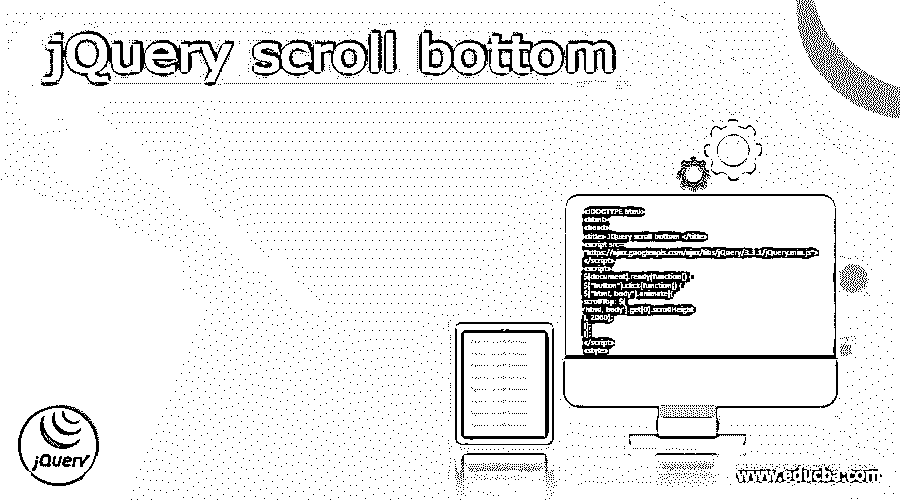
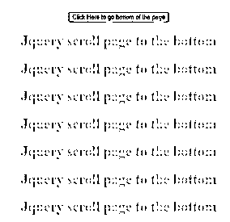
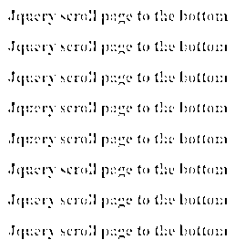
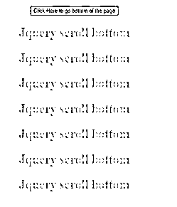
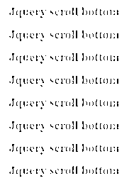

# jQuery 滚动底部

> 原文：<https://www.educba.com/jquery-scroll-bottom/>




## jQuery 滚动底部的定义

jQuery scroll bottom 方法通过将文档的高度传递给 scrollTop 方法来滚动。在 jQuery 中，我们可以自动使用 scrollTop 和 height 方法从上到下滚动页面。可滚动区域上方视图中隐藏的像素数量决定了垂直滚动位置。如果滚动条在最顶端或者元素不可滚动，则该值为 0。

### 什么是 jQuery 滚动底部？

*   浏览器滚动条的位置由 jQuery scrollTop 属性控制。
*   可滚动区域上方视图中隐藏的像素数量决定了垂直滚动位置。通过设置 scrollTop 属性定位每个匹配元素的垂直滚动。
*   ScrollToBottom 从上到下滚动页面，而 scrollToTop 从下到上滚动页面。
*   当单击 scrollToBottom HTML 锚链接时，将调用 jQuery click 事件处理程序，它使用 jQuery animate 函数从上到下滚动页面。
*   当单击 scrollToTop HTML 锚链接时，将调用 jQuery click 事件处理程序，该处理程序使用 jQuery animate 函数从下到上滚动页面。
*   scrollTop 方法设置或返回选定组件的垂直滚动条位置。
*   当滚动条在顶部时，位置为零。此方法返回第一个匹配元素的垂直滚动条位置。这个函数为所有匹配的组件设置滚动条的垂直位置。
*   当我们将页面滚动到底部时，会发生 jQuery scroll bottom 事件。这是使用函数名来处理的，例如 scrollTop、animate 和 scroll。

### jQuery 如何滚动到底？

*   使用$(window)和 height()返回浏览器视口高度。HTML 文档的高度通过$(document)返回。高度()。
*   scrollTop()返回滚动条的当前垂直位置。如果滚动条在顶部，则$的值将在底部(窗口)。
*   scrollTop()的结果为零。这是因为如果浏览器视窗的值加上滚动条的垂直位置等于文档高度，则用户已经滚动到页面的底部。

下面的语法代码展示了如何使用 jQuery 滚动页面。

<small>网页开发、编程语言、软件测试&其他</small>

**语法:**

```
$(window).load (function () {
scrollTop: $(document).height);
});
```

*   我们在上面的代码中使用了 height 函数，所以页面是从上到下滚动的。我们也可以在 jQuery 中使用 animate 方法。
*   scroll() jQuery 事件可以确定用户是否已经滚动到页面底部。
*   当用户滚动到元素的不同部分时，元素会收到一个滚动事件。它影响窗口对象、可滚动框架以及在 CSS 溢出属性中设置为“scroll”或“auto”的元素。
*   要从上到下滚动页面，我们首先需要使用 jQuery 将滚动添加到顶部。
*   在添加了 scroll to the 方法之后，我们需要将 scroll button 添加到 CSS 中。
*   将 scroll 按钮添加到 CSS 中之后，下一步是将 jQuery scroll 添加到 top 函数中。

### 使用 jQuery 的页面

*   在 jQuery 中，页面是主要的交互单元。它将内容组织到逻辑视图中，可以使用页面转换在视图内外显示动画。
*   当访问者在 HTML 文档中导航时，AJAX 导航系统会根据需要将额外的页面加载到 DOM 中。
*   或者，一个 HTML 文档可以有许多“页面”，框架将在它们之间转换，而不需要从服务器获取材料。
*   location reloads 方法通过重新加载当前网页来模拟浏览器上的刷新按钮。
*   true 参数强制从服务器加载页面，绕过浏览器缓存。
*   根据所提供的参数，history goes 方法从浏览器的历史记录中获取一个 URL。如果参数设置为“0”，则重新加载当前页面。
*   JQuery 是一个 JavaScript 库，它使得 HTML/CSS 文档之间的交互更加容易。
*   可以将位置路径名作为参数提供给 replace 方法。当前 URL 由 location pathname 返回，它被传递给 location。当使用 replace 方法时，当前页面被重新加载。

### JQuery 滚动底部示例

下面的例子显示了在没有动画的情况下将页面滚动到底部。

**代码:**

```
<!DOCTYPE html>
<html>
<head>
<title> JQuery scroll bottom </title>
<script src=
"https://ajax.googleapis.com/ajax/libs/jQuery/3.3.1/jQuery.min.js">
</script>
<script>
$(document).ready(function() {
$("button").click(function() {
$(document).scrollTop($(document).height());
});
});
</script>
<style>
h1 {
color: Pink;
}
</style>
</head>
<body>
<center>
<div>
<button> Click Here to go bottom of the page </button>
<h1> JQuery scroll page to the bottom </h1>
<h1> JQuery scroll page to the bottom </h1>
<h1> JQuery scroll page to the bottom </h1>
<h1> JQuery scroll page to the bottom </h1>
<h1> JQuery scroll page to the bottom </h1>
<h1> JQuery scroll page to the bottom </h1>
<h1> JQuery scroll page to the bottom </h1>
<h1> JQuery scroll page to the bottom </h1>
<h1> JQuery scroll page to the bottom </h1>
<h1> JQuery scroll page to the bottom </h1>
<h1> JQuery scroll page to the bottom </h1>
<h1> JQuery scroll page to the bottom </h1>
</div>
</center>
</body>
</html>
```







以下示例显示了使用动画将页面滚动到底部，如下所示。

**代码:**

```
<!DOCTYPE html>
<html>
<head>
<title> JQuery scroll bottom </title>
<script src=
"https://ajax.googleapis.com/ajax/libs/jQuery/3.3.1/jQuery.min.js">
</script>
<script>
$(document).ready(function() {
$("button").click(function() {
$("html, body").animate({
scrollTop: $(
'html, body').get(0).scrollHeight
}, 2000);
});
});
</script>
<style>
h1 {
color: Pink;
}
</style>
</head>
<body>
<center>
<div>
<button> Click Here to go bottom of the page </button>
<h1> JQuery scroll bottom </h1>
<h1> JQuery scroll bottom </h1>
<h1> JQuery scroll bottom </h1>
<h1> JQuery scroll bottom </h1>
<h1> JQuery scroll bottom </h1>
<h1> JQuery scroll bottom </h1>
<h1> JQuery scroll bottom </h1>
<h1> JQuery scroll bottom </h1>
<h1> JQuery scroll bottom </h1>
<h1> JQuery scroll bottom </h1>
<h1> JQuery scroll bottom </h1>
</div>
</center>
</body>
</html>
```







### 结论

scrollTop 属性用于将页面滚动到页面的顶部或底部。当滚动到页面顶部时，scrollTop 属性设置为零，当滚动到底部时，scrollTop 值设置为文档的高度。

### 推荐文章

这是一个 jQuery 滚动底部的指南。这里我们讨论定义，什么是 jQuery scroll bottom，以及代码实现和语法的例子。您也可以看看以下文章，了解更多信息–

1.  [JQuery JSON 解析](https://www.educba.com/jquery-json-parse/)
2.  [jQuery 数组推送](https://www.educba.com/jquery-array-push/)
3.  [Settimeout jQuery](https://www.educba.com/settimeout-jquery/)
4.  [jQuery 插入元素](https://www.educba.com/jquery-insert-element/)


