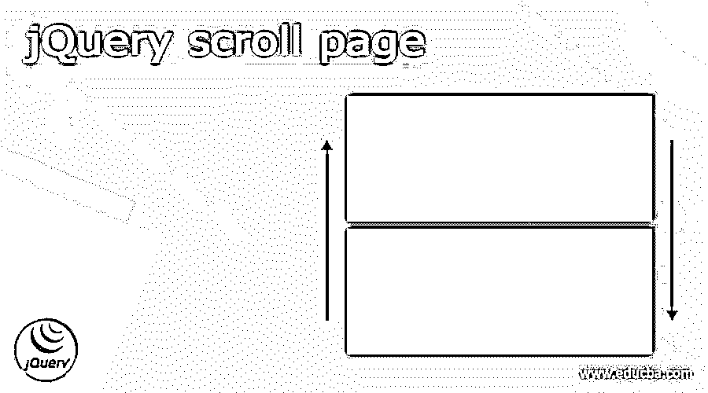
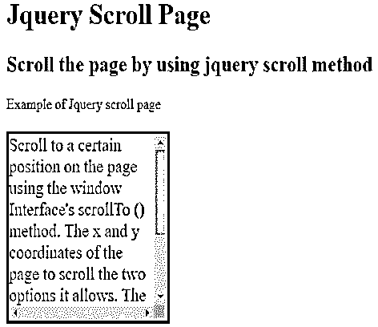
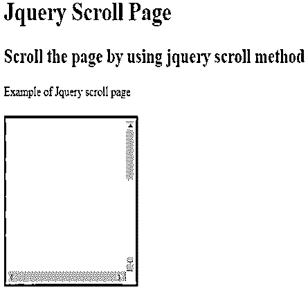
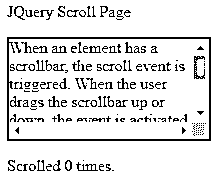
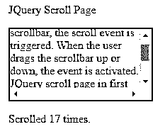
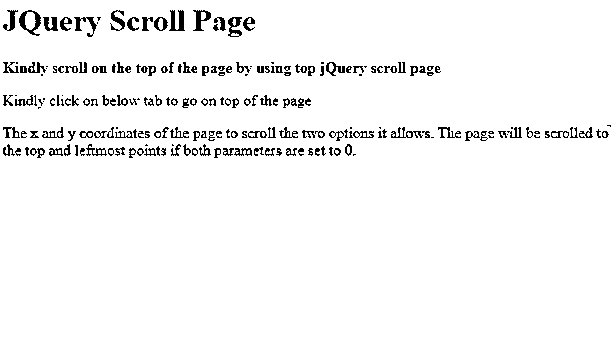

# jQuery 滚动页面

> 原文：<https://www.educba.com/jquery-scroll-page/>




## jQuery 滚动页面的定义

jQuery scroll page 是 jQuery 的第一个和第二个变体，这个方法是第三个触发器中 scroll 和 handler 的快捷方式。当用户滚动到元素中的不同位置时，将触发 scroll 事件。当元素的显式高度或宽度小于其内容的高度或宽度时，它会影响溢出 CSS 属性设置为 scroll 的可滚动框架和元素。

### 什么是 jQuery 滚动页面？

使用窗口界面的 Scroll to()方法滚动到页面上的某个位置。页面的 x 和 y 坐标来滚动它允许的两个选项。

<small>网页开发、编程语言、软件测试&其他</small>

如果两个参数都设置为 0，页面将滚动到顶部和最左侧。

当元素的滚动位置改变时，不管是什么原因，都会触发一个滚动事件。

当用户滚动指定的元素时，发生滚动事件。所有可滚动组件和窗口对象都响应 scroll 事件。

scroll()方法触发一个滚动事件，或者添加一个在事件发生时运行的函数。

下面是 jQuery 滚动方法的语法如下。

**语法:**

```
$(selector).scroll()
$(selector).scroll(function)
```

*   在第一种语法中，我们通过使用选定的元素来触发滚动事件。在第二个语法中，我们为滚动事件附加了一个函数。

下面是 jQuery 滚动页面的参数描述语法如下。

1)选择器——这是 jQuery scroll 方法中使用的一个非常重要的参数。我们使用这个参数来指定 jQuery scroll 方法中的元素。

2)Function–这是 jQuery scroll 方法中使用的可选参数。它将指定滚动事件触发时的功能。

3)滚动–使用滚动方法，我们从上到下滚动页面。这是 jQuery 中使用的一个非常重要的方法。

*   我们可以使用 jQuery 创建惊人的技术来提高用户参与度。创建 jQuery 滚动到元素功能就是这样一种方法。
*   我们可以利用这一点在我们的网站上建立内部链接，当访问者点击一个链接时，他将被导航到相关的内容。
*   这在网页很长的时候特别有用，因为这些内部链接直接把浏览者带到页面的特定主题。

### 如何使用 jQuery 滚动页面？

*   jQuery 的 scrollTop 属性用于控制浏览器滚动条的位置。
*   通过将 scrollTop 属性设置为 Top 或 Bottom，页面将滚动到页面的顶部或底部。
*   当页面必须滚动到顶部时，scrollTop 属性设置为零，当页面必须滚动到底部时，该属性设置为文档的高度。
*   当元素有滚动条时，scroll 事件被触发。当用户上下拖动滚动条时，事件被激活。
*   CSS overflow 属性可用于创建滚动条。所有可滚动组件或窗口对象都会触发 scroll 事件。

### jQuery 滚动到元素代码

*   下面的例子展示了 jQuery 滚动到元素的代码如下。在下面的例子中，我们使用段落来滚动页面。
*   我们使用滚动方法来滚动页面。在下面的例子中，我们使用宽度为 200 像素，高度为 200 像素。

**代码:**

```
<!DOCTYPE html>
<html>
<head>
<script src = "https://ajax.googleapis.com/ajax/libs/jQuery/3.5.1/jQuery.min.js"></script>
<style>
#para{
width: 200px;
height: 200px;
overflow: scroll;
border: 3px solid red;
font-size: 20px;
}
</style>
</head>
<body>
<h1> JQuery Scroll Page </h1>
<h2> Scroll the page by using jQuery scroll method </h2>
<p> Example of JQuery scroll page </p>
<p id = "para"> Scroll to a certain position on the page using the window Interface's scrollTo () method. The x and y coordinates of the page to scroll the two options it allows. The page will be scrolled to the top and leftmost points if both parameters are set to 0.
</p>
<script>
$(document).ready(function(){
$("#para").scroll(function(){
$("#para").css("color", "Yellow");
$("#para").css("background", "lightgreen");
});
});
</script>
</body>
</html>
```







下面的例子显示了不使用函数参数的 jQuery 滚动页面如下。

**代码:**

```
<!DOCTYPE html>
<html>
<head>
<script src="https://ajax.googleapis.com/ajax/libs/jquery/3.5.1/jquery.min.js"></script>
<script>
var x = 0;
$(document).ready(function(){
$("div").scroll(function(){
$("span").text( x+= 1);
});
});
</script>
</head>
<body>
<p>JQuery Scroll Page </p>
<div style="border:2px solid black;width:200px;height:100px;overflow:scroll;">When an element has a scrollbar, the scroll event is triggered. When the user drags the scrollbar up or down, the event is activated. JQuery scroll page in first and second variations, this method is a shortcut for.on ("scroll", handler), and in the third trigger ("scroll").
</div>
<p>Scrolled 0 times.</p>
</body>
</html>
```







### 顶部 jQuery 滚动页面

下面的例子显示了顶部的 jQuery 滚动页面如下。我们使用滚动到顶部的方法来搜索页面的顶部行。

**代码:**

```
<!DOCTYPE html>
<html>
<head>
<title>
Scroll on the top by using top jQuery scroll page
</title>
<style>
.scroll {
height: 800px;
background-color: lightgreen;
}
</style>
</head>
<body>
<h1 style="color: green">
JQuery Scroll Page
</h1>
<b>
Kindly scroll on the top of the page by using top jQuery scroll page
</b>
<p>
Kindly click on below tab to go on top of the page
</p>
<p class="scroll">
The x and y coordinates of the page to scroll the two options it allows. The page will be scrolled to the top and leftmost points if both parameters are set to 0.
</p>
<button onclick="scrollToTop ()">
Click on this button to go on top of the page
</button>
<script src=
"https://code.jQuery.com/jQuery-3.3.1.min.js">
</script>
<script>
function scrollToTop() {
$(window).scrollTop(0);
}
</script>
</body>
</html>
```




### 结论

当元素有滚动条时，scroll 事件被触发。当用户上下拖动滚动条时，事件被激活。使用窗口接口的 Scroll to 方法滚动到页面上的某个位置。页面的 x 和 y 坐标来滚动它允许的两个选项。

### 推荐文章

这是一个 jQuery 滚动页面指南。这里我们讨论一下定义，什么是 jQuery 滚动页，如何使用 jQuery 滚动页？代码实现示例。您也可以看看以下文章，了解更多信息–

1.  [jQuery 滚动](https://www.educba.com/jquery-scroll/)
2.  [jQuery 插入元素](https://www.educba.com/jquery-insert-element/)
3.  [jQuery Ajax 同步](https://www.educba.com/jquery-ajax-synchronous/)
4.  [jquery 获取被点击元素的 id](https://www.educba.com/jquery-get-id-of-clicked-element/)


