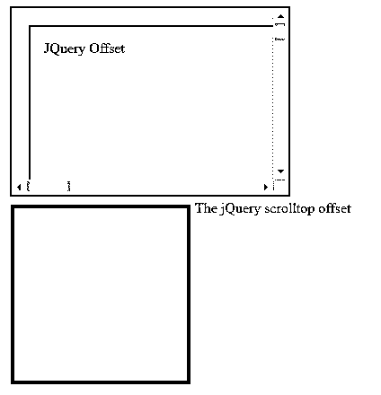

# jQuery 滚动顶部偏移量

> 原文：<https://www.educba.com/jquery-scrolltop-offset/>


## jQuery 滚动顶部偏移量介绍

jQuery scrolltop offset 方法从 scrolltop offset 返回第一个匹配的元素。可见和隐藏的元素都在使用这种技术。offset 方法返回元素相对于文档位置的当前位置，另一方面，返回相对于偏移量的当前位置。父偏移更有利于在现有元素之上放置新元素以进行全局操作。

### 什么是 jQuery scrolltop 偏移量？

*   可滚动区域上方视图中隐藏的像素数量决定了垂直滚动位置。如果滚动条在页面的顶部，或者元素不能滚动，则该数字为 0。
*   可滚动区域上方视图中隐藏的像素数量决定了垂直滚动位置。
*   每个匹配元素的垂直滚动将通过设置 scrollTop 属性来定位。
*   在某些情况下，与 API 相关的维度(如 offset)返回的数字是小数。代码并不假定该值是一个整数。
*   此外，当用户放大网站时，尺寸可能不准确，浏览器不提供 API 来检查这一点。
*   我们可以使用 setter 方法 offset 来重新定位一个元素。提供了元素边框相对于文档的位置。
*   offset 方法设置或返回文档中指定元素的偏移量坐标。
*   使用 offset 返回第一个匹配元素的偏移坐标。它返回一个基于像素的对象，具有两个属性，即 top 和 left。
*   该方法用于设置偏移量时，设置所有匹配项的偏移量坐标。
*   下面的语法显示 jQuery scrolltop 偏移量如下。

**语法**

<small>网页开发、编程语言、软件测试&其他</small>

```
Selector.Scrolltop()
```

*   在上面的语法中，选择器是可选的 jQuery next 方法参数。可以使用 CSS 1-3 选择器语法创建可选的选择器。当我们使用选择表达式时，元素被添加到对象中。如果我们不给出一个，元素的兼容性将在它被添加之前被测试。
*   scrolltop 是一个用于将页面滚动到顶部的函数。

### 如何使用 jQuery scrolltop offset？

*   scrollTop 属性用于设置或获取任何元素的垂直滚动条位置。当 scrollTop 属性设置为任意值时，页面将滚动到该点。
*   默认情况下，快速突然地滚动到该值。JQuery 可以用来使这种滚动更加生动。
*   animate 方法将自定义动画应用于一组 CSS 属性。它通过逐渐修改属性值来创建动画效果。
*   只有带有数值的属性才能被激活。我们可以使用另外两个参数来调整动画的速度。
*   若要滚动动画页面，请将此方法与 scrollTop 属性结合使用。用 jQuery 选择器选择页面的“html”和“body”标记。
*   这样做是为了确保与不允许我们只选择 body 元素的浏览器兼容。
*   使用 styles 参数中的 scrollTop 属性，将动画方法应用于此选定元素。动画的节奏和轻松程度可以根据我们的需要进行调整。
*   jQuery 中的 offset 函数返回一个具有 top 和 left 属性的对象。我们只关心顶部，因为我们想一直滚动到这个元素的顶部。
*   因此，根据我们刚刚了解到的滚动，我们可以将 scrollTop 的值设置为我们的新位置。我们可以在代码中使用 scrolltop 方法如下。

**例子**

```
$(function () {
$("#top"). On ('click', function () {    // On click event
var position = $("#img"). Offset (). top;   // Offset method
$("HTML, BODY"). Animate ({      // Animate method
scrollTop: position    // Scroll top method.
}, 500);
});
```

在上面的例子中，我们可以看到我们在一个代码中使用了 offset 和 scrolltop 函数。此外，我们还使用了单击事件，在单击按钮后，箭头会出现在页面顶部。

### JQuery scrolltop 偏移方法

*   在所有匹配的元素上，调用 scrollTop 方法将滚动顶部偏移量设置为给定值。这种方法可以应用于可见和隐藏的项目。
*   在 jQuery 中，offset 方法返回 HTML 元素相对于页面的初始位置。
*   jQuery UI 中的 offset 方法是相对于文档的。
*   在拖放功能中，经常使用偏移方法。顶部和左侧的 jQuery 方法都返回带有整数坐标字段的对象。
*   返回左上坐标的像素值。这两个功能仅适用于可见的组件，而不是隐藏的组件。当滚动条位于顶部时，其位置为 0。
*   scrollTop 方法在设置位置时为所有匹配的组件设置滚动条的垂直位置。
*   jQuery scrolltop offset 方法对于将页面滚动到页面顶部非常有用和重要。

**例子**

下面是 jQuery scrolltop 偏移量的例子如下。

**代码—**

```
<!DOCTYPE html>
<html>
<head>
<title>The JQuery Scrolltop offset</title>
<script type = "ScrollTop Offset"
src = "https://ajax.googleapis.com/ajax/libs/jQuery/2.1.3/jQuery.min.js">
</script>
<script type = "ScrollTop Offset" language = "javascript">
$(document).ready(function(){
$("div.demo").scrollTop( 300 );
$("div.demo").mousemove (function () {
var top = $("div.demo").scrollTop();
$("#result").html("top offset: " + top + ".");
});
});
</script>
<style>
div.demo {background:#CCCCCC none repeat scroll 0 0; border:2px
solid #666666; margin:4px; padding:4px; position: relative;
width:300px; height:200px; overflow: auto;}
div.result {margin:15px; width:200px; height:200px;
margin:5px; float:left; background-color: blue;}
p { margin:15px; padding:15px; border:2px solid #666;
width:1500px; height:1500px;}
</style>
</head>
<body>
<div class = "demo"><p>JQuery Offset</p></div>
The jQuery scrolltop offset
<div class = "result"></div>
</body>
</html>
```




### 结论

JQuery scrolltop offset 方法从滚动顶部偏移量返回第一个匹配元素的。scroll top 属性用于设置或获取任何元素的垂直滚动条位置。当 scrollTop 属性设置为任意值时，页面将滚动到该点。

### 推荐文章

这是一个 jQuery scrolltop 偏移量的指南。在这里，我们将讨论如何使用 jQuery scrolltop offset 以及示例和代码。您也可以阅读以下文章，了解更多信息——

1.  [jQuery Ajax 同步](https://www.educba.com/jquery-ajax-synchronous/)
2.  [jQuery 获取父节点](https://www.educba.com/jquery-get-parent/)
3.  [jQuery ajax 加载](https://www.educba.com/jquery-ajax-load/)
4.  [jQuery ajax 然后](https://www.educba.com/jquery-ajax-then/)


