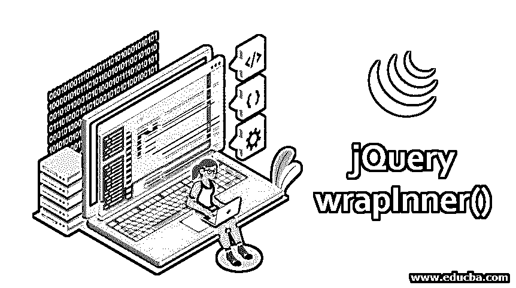
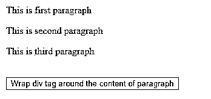
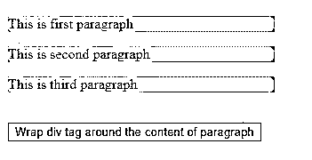
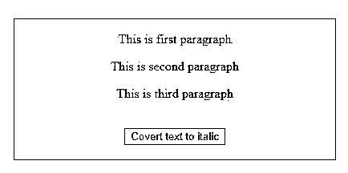
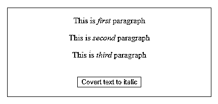
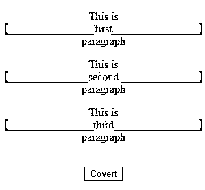

# jQuery wrapInner()

> 原文：<https://www.educba.com/jquery-wrapinner/>




## jQuery wrapInner()简介

jQuery 中的 wrapInner()是 JavaScript 库中可用的预定义函数，每当需要为页面中的每个其他匹配 HTML 元素创建一个 wrap 元素时，都会用到它。这个方法的语法是$(选择器)。wrapInner(wrappingElement，function (index))，其中 wrappingElement 是指示包装元素的必填字段，function(index)是用于为 wrapInner()方法创建包装元素的可选回调方法。

**语法:**

<small>网页开发、编程语言、软件测试&其他</small>

```
$( selector ).wrapInner( wrappingElement, function(index))
```

方法签名包括两个参数:

**1。包装元素**

*   指定用于包装选定元素内容的结构。
*   必需的。

可能的值:

*   HTML 代码片段
*   选择器表达式
*   DOM 元素
*   jQuery 对象

**2。功能(指标)**

*   指定一个生成包装元素的[回调函数](https://www.educba.com/callback-function-in-jquery/)。
*   可选。

索引:

*   接收集合中元素的索引位置作为参数。
*   函数(整数索引)= >字符串

### jQuery wrapInner()的示例

WrapInner()是 jQuery 中的一个内置方法，下面给出了一些例子:

#### 示例#1

该示例演示了如何使用 wrapInner()方法在段落元素*周围包装**标签。***

**代码:**

```
<!DOCTYPE html>
<html>
<head>
<meta charset="utf-8">
<title> wrapInner example 1</title>
<script src="https://ajax.googleapis.com/ajax/libs/jquery/3.4.1/jquery.min.js"></script>
<script>
$( document ).ready( function () {
$(" button ").click( function () {
$("p").wrapInner("<b></b>");
});
});
</script>
</head>
<body>
<p>This is a paragraph.</p>
<button>Wrap b tag around the content of paragraph</button>
</body>
</html>
```

**输出:**


在这个例子中，有一个

元素和一个按钮。单击按钮时，调用 wrapInner()函数，该函数将**环绕在段落文本周围。**


点击按钮后，文本变得加粗，因为

内容被**标签包裹，这将在 DOM 中呈现为**

**这是一个段落。**

#### 实施例 2

让我们看看 wrapInner()的例子，这次我们将包装多个匹配的元素。

**代码:**

```
<!doctype html>
<html lang="en">
<head>
<meta charset="utf-8">
<title> wrapInner example 2</title>
<style>
div {
background: #bbf;
width: 300px;
}
</style>
<script src="https://code.jquery.com/jquery-3.4.1.js"></script>
</head>
<body>
<p> This is first paragraph </p>
<p> This is second paragraph </p>
<p> This is third paragraph </p>
<br />
<button>Wrap div tag around the content of paragraph</button>
<script>
$( document ).ready( function () {
$(" button ").click( function () {
$("p").wrapInner("<div></div>");
});
});
</script>
</body>
</html>
```

**输出:**

在上面的代码中，我们有三个段落和一个按钮。单击该按钮时，所有的 *< p >* 元素都被调用 wrapInner()方法，以将一个 *< div >* 标记环绕在它们周围。




我们观察到所有段落的背景颜色都发生了变化，因为每个段落都被具有背景颜色的

标记所包裹。




#### 示例 **#3**

在本例中，我们将传递 wrapInner()函数的一个可能的参数值，该函数是一个回调函数。

**代码:**

```
<!doctype html>
<html lang="en">
<head>
<meta charset="utf-8">
<title> wrapInner example 3</title>
<style>
div {
border: 1px solid #bbf;
width: 400px;
text-align: center;
margin-left: 70px;
margin-top: 50px;
}
</style>
<script src="https://code.jquery.com/jquery-3.4.1.js"></script>
</head>
<body>
<div>
<p> This is  first  paragraph </p>
<p> This is  second  paragraph </p>
<p> This is  third  paragraph </p>
<br />
<button> Covert text to italic </button>
<br/>
<br/>
</div>
<script>
$( document ).ready( function () {
$(" button ").click( function () {
$("span").wrapInner( function() {
return '<i></i>'
} );
});
});
</script>
</body>
</html>
```

**输出:**

上面的代码呈现了三个段落和一个按钮。在按钮 click 事件中，wrapInner()方法以参数值作为回调函数执行。回调函数返回一个标签来包装匹配的 span 元素。




当我们点击按钮时，我们可以看到 span 标签中的文本是斜体的。斜体标签*包裹了 span 元素，因此，只有 span 元素的文本样式被更改为斜体。*




#### 实施例 4

在这个例子中，我们将看到如何使用 jQuery selecto *r* 或 jQuery object with wrapInner()。

**代码:**

```
<!doctype html>
<html lang="en">
<head>
<meta charset="utf-8">
<title> wrapInner example 4</title>
<style>
body {
text-align: center;}
div {
text-align: center;
background: #bba;
}
body {
text-align: center;
}
</style>
<script src="https://code.jquery.com/jquery-3.4.1.js"></script>
</head>
<body>
<div class="wrapper"></div>
<p> This is  first  paragraph </p>
<p> This is  second  paragraph </p>
<p> This is  third  paragraph </p>
<br />
<button> Covert</button>
<br/>
<br/>
<script>
console.log($("wrapper"));
$( document ).ready( function () {
$(" button ").click( function () {
$("span").wrapInner( $(".wrapper") );
});
});
</script>
</body>
</html>
```

**输出:**


我们可以再次看到，有三个段落和一个按钮。单击按钮时，wrapInner()被触发，jQuery 选择器作为参数值。选择器通过匹配类名返回一个已经存在于原始源代码中的

。

因此，点击按钮后，

会包裹 span 标签，它们的背景颜色会变成灰色。这就是为什么我们也可以使用 jQuery 选择器或 object 作为 wrapInner()的参数来进行各种类型的 DOM 操作。




### 结论

我们已经学习并练习了一组示例来使用 jQuery 的内置包装方法 wrapInner()。我们可以用它来遍历一组元素，并用 DOM 结构的指定 HTML 结构来包装每个元素。该方法可用于为网站和应用程序设计创造性的用户界面。

### 推荐文章

这是 jQuery wrapInner()的指南。这里我们讨论介绍、语法和例子。您也可以看看以下文章，了解更多信息–

1.  [jQuery delegate( )](https://www.educba.com/jquery-delegate/)
2.  [jQuery 方法](https://www.educba.com/jquery-methods/)
3.  [JQuery 中选择器的类型](https://www.educba.com/types-of-selector-in-jquery/)
4.  [jQuery scrollTop()](https://www.educba.com/jquery-scrolltop/)


