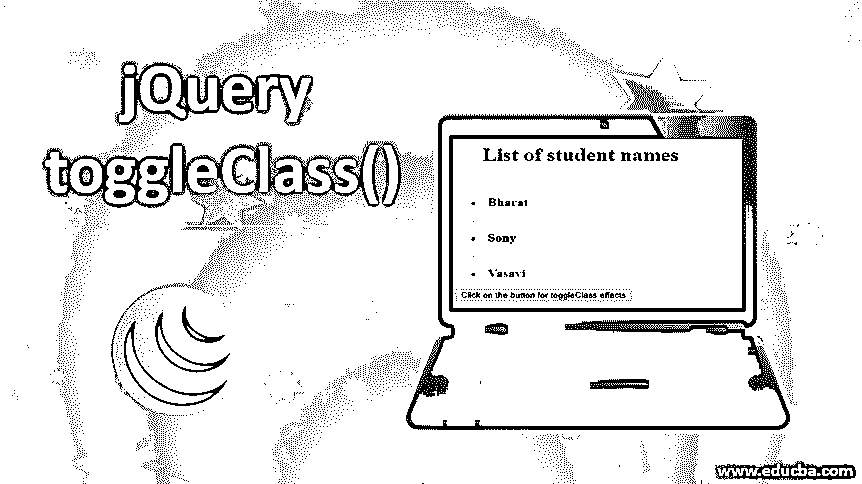
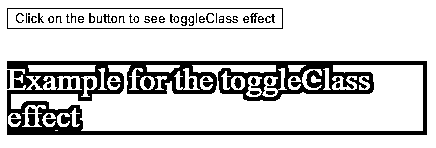
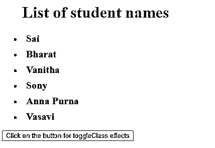
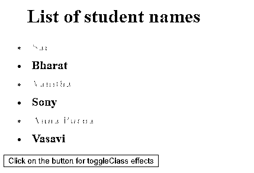
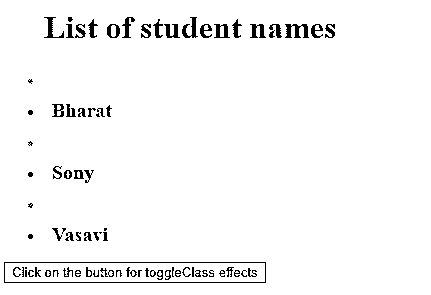
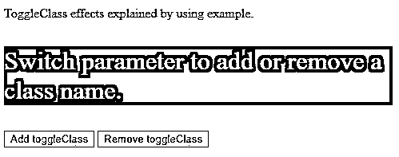
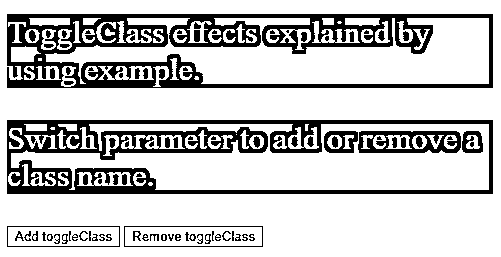
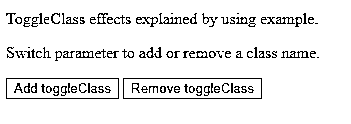

# jQuery toggleClass()

> 原文：<https://www.educba.com/jquery-toggleclass/>




## jQuery toggleClass 简介

jQuery 简化了 JavaScript 编程语言，易于学习，我们可以通过编写插件来扩展它。它支持许多特性，如动画、事件处理、DOM 操作、轻量级、AJAX 支持和跨浏览器支持。通过使用 toggleClass()方法，我们可以在具有从匹配元素集中选择的元素的类之间切换。当我们想随时改变用户界面的状态以使其更具吸引力和交互性时，可以通过使用 toggleClass()方法快速轻松地在效果或样式之间进行切换。

**语法:**

<small>网页开发、编程语言、软件测试&其他</small>

简单地说，我们可以说 toggleClass()方法用于在元素中添加或删除一个类。jQuery 中的 toggleClass()方法语法。它是 jQuery 中的一个内置方法。

```
$(selector).toggleClass(className [ , function] [, switch][,options])
```

### jQuery toggleClass()的参数

它包含一些参数。参数的一些细节如下:

*   **类名:**类名应该是字符串类型。它可以采用一个或多个类名，用逗号分隔。
*   **函数:**可选参数，返回类名。它接受元素的索引位置和类名。
*   **开关:**开关应为布尔型，是可选参数。它帮助我们决定是否应该添加或删除一个类。
*   **时长:**时长可以是字符串，也可以是数字。它可以是以毫秒为单位的时间，也可以是预设的时间。持续时间的默认值是 400 毫秒。它可以将 slow、fast 或 normal 作为字符串参数。这有助于我们根据需求控制幻灯片动画。
*   **缓动:**缓动应为字符串类型。它用于过渡。默认值为 swing。
*   **队列:**队列取布尔值。如果布尔值为真，则表明是否放置动画。如果布尔值为假，动画将立即开始。
*   **Complete:** 一旦一个元素的动画完成，这个函数就会被调用。
*   **子代:**子代取布尔值。这有助于确定要制作哪个后代的动画。

### jQuery toggleClass()的示例

这是 toggleClass()方法的一个简单示例。在这个例子中，我们可以观察 toggleClass()方法对段落的影响。

#### 示例#1

```
<!DOCTYPE html>
<html>
<head>
<script src="https://ajax.googleapis.com/ajax/libs/jquery/1.11.3/jquery.min.js"></script>
<script>
$(document).ready(function(){
$("#btn").click(function(){
$("p").toggleClass("highlight");
});
});
</script>
<style>
.highlight {
background:blue;
font-size: 200%;
color: white;
}
</style>
</head>
<body>
<button id = "btn"> Click on the button to see toggleClass effect</button>
<p>Example for the toggleClass effect</p>
</body>
</html>
```

**输出:**

*   在输出中，我们可以在点击按钮之前观察到“点击按钮查看 toggleClass 效果”。
*   如下图所示，该段落采用普通字体，没有背景和颜色。


*   单击按钮后，我们可以看到字体大小、背景和文本颜色由于 toggleClass()方法而发生了变化。
*   在本课程中，我们已经通过了。突出显示 toggleClass()方法的类。在。高亮类，我们给了背景、字体大小和颜色，它被传递给 toggleClass()，后者应用于段落，如下图所示。
*   再次点击按钮，它回到正常大小。我们可以通过点击按钮在两者之间切换。




这是 toggleClass()方法使用函数的另一个示例。

#### 实施例 2

```
<!DOCTYPE html>
<html>
<head>
<script src="https://ajax.googleapis.com/ajax/libs/jquery/3.4.1/jquery.min.js"></script>
<script>
$(document).ready(function(){
$("button").click(function(){
$("li").toggleClass(function(n){
return "listitem_" + n;
});
});
});
</script>
<style>
p {
margin: 8px;
font-size: 20px;
font-weight: bolder;
cursor: pointer;
}
.main {
background: yellow;
}
.listitem_1, .listitem_3,.listitem_5 {
color: blue;
}
.listitem_0, .listitem_2 ,.listitem_4{
color: pink;
}
</style>
</head>
<body>
<ul>
<h1>List of student names</h1>
<li><p class="main">Sai</p></li>
<li><p class="main">Bharat</p></li>
<li><p class="main">Vanitha</p></li>
<li><p class="main">Sony</p></li>
<li><p class="main">Anna Purna</p></li>
<li><p class="main">Vasavi</p></li>
</ul>
<script>
$( "p" ).click(function() {
$( this ).toggleClass( "main" );
});
</script>
<button>Click on the button for toggleClass effects</button>
</body>
</html>
```

**输出:**

*   在点击按钮“点击按钮获得 toggleClass 效果”之前，我们可以看到一个学生姓名列表显示为黑色文本和黄色背景。




*   单击该按钮后，我们可以看到奇数和偶数学生姓名的列表用不同的颜色显示。如我们在代码中提到的，偶数列表被更改为粉红色，即，具有 0，2，4 的 list_item 应该应用粉红色，而具有 1，3，5 的奇数列表 list_item 应该应用蓝色。更改被应用到输出中。




*   单击特定的名称，我们可以看到颜色变成了白色，如下图所示。




*   再次点击按钮“点击按钮以获得 toggleClass 效果”,我们可以看到学生姓名列表恢复为正常图像，与本程序的 1 <sup>st</sup> 图像相同。

这是一个使用开关参数的 toggleClass()方法的示例。

#### 实施例 3

```
<!DOCTYPE html>
<html>
<head>
<script src="https://ajax.googleapis.com/ajax/libs/jquery/3.4.1/jquery.min.js"></script>
<script>
$(document).ready(function(){
$("#add").click(function(){
$("p").toggleClass("highlight",true);
});
$("#remove").click(function(){
$("p").toggleClass("highlight",false);
});
});
</script>
<style>
.highlight {
background-color: blue;
font-size: 200%;
color: white;
}
</style>
</head>
<body>
<p>ToggleClass effects explained by using example.</p>
<p class="highlight">Switch parameter to add or remove a class name.</p>
<button id="add">Add toggleClass</button>
<button id="remove">Remove toggleClass </button>
</body>
</html>
```

**输出:**

*   在本例中，在单击按钮之前，输出如下所示。




*   点击“添加 toggleClass”按钮后，我们可以看到背景色、字体大小和颜色的效果被应用到了第一段。




*   通过点击“删除 toggleClass”按钮，我们可以看到背景色、字体大小和颜色的效果都被删除了。




这些是 toggleClass()方法使用一些参数的一些例子。

### 推荐文章

这是 jQuery toggleClass()的指南。这里我们讨论 jQuery toggleClass()的介绍、参数和不同的例子，以及代码实现。您也可以阅读以下文章，了解更多信息——

1.  [jQuery keydown()](https://www.educba.com/jquery-keydown/)
2.  [jQuery val()](https://www.educba.com/jquery-val/)的例子
3.  [jQuery prop( )](https://www.educba.com/jquery-prop/)
4.  [jQuery delay()](https://www.educba.com/jquery-delay/)


