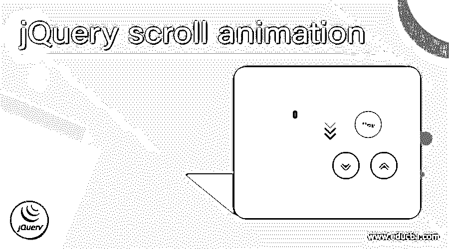
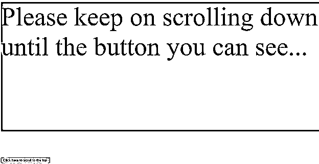
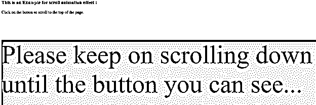
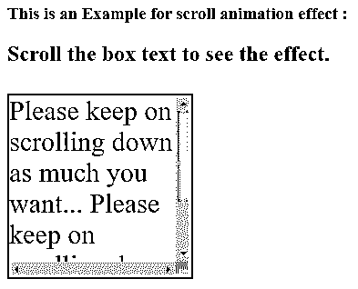
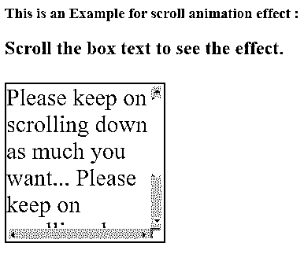
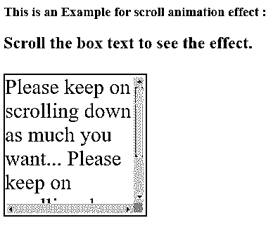
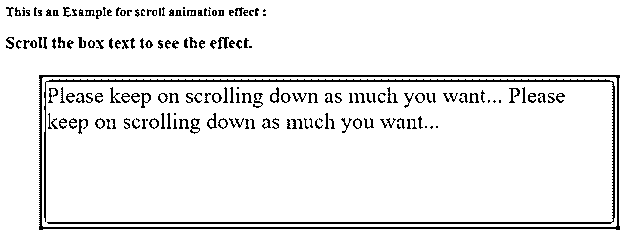

# jQuery 滚动动画

> 原文：<https://www.educba.com/jquery-scroll-animation/>




## jQuery 滚动动画介绍

jQuery 滚动动画用于在滚动上创建自定义动画。jQuery animation()函数、scroll()函数和 scrollTop 或 scrollLeft CSS 属性可用于执行滚动动画。jQuery scroll()函数触发并处理 scroll 事件。jQuery the scrollTop、scrollLeft 属性和 animation()函数是 jQuery 中的内置属性和函数。scrollTop 和 scrollLeft 属性用于设置或获取选定元素的滚动条位置。当用户移动元素的滚动条时，会生成 scroll 事件。对于滚动条，我们也可以使用 CSS 属性。animate()函数用于在选定的 CSS 属性集上应用动画。

**jQuery 滚动动画的语法—**

<small>网页开发、编程语言、软件测试&其他</small>

带有 scrollTop 或 scrollLeft CSS 属性的 jQuery animate()函数的语法

```
$("selector").animate({ scrollTop : scrollPosition, scrollLeft : scrollPosition });
```

带有 animate()处理函数的 jQuery scroll()函数的语法

```
$("selector").scroll(function(){ $("selector").animate({ properties }, speed, callback );});
```

**参数—**

*   **scroll top–**它指定 animate 属性来设置或获取所选元素的垂直滚动条位置。
*   **scroll position–**它指定设置或获取所选元素的垂直(或水平 scrollLeft)滚动条位置的值。
*   **scroll left–**它指定 animate 属性来设置或获取所选元素的水平滚动条位置。
*   **属性—**指定动画的 CSS 属性。
*   **速度—**指定动画持续时间，单位为毫秒或“慢”、“快”。
*   **回调-**指定动画完成后要执行的功能。

**返回值-**

动画功能没有任何价值。

### jQuery 滚动动画的工作原理

JQuery 滚动动画在 animate()函数 scroll()函数和 scrollTop 或 scrollLeft 属性的帮助下执行。假设我们有一个 div 可滚动框，我们需要在它滚动时应用动画效果。所以我们可以用 scoll()函数和动画函数作为“$(“div”)。scroll(function(){ $("div ")。animate( { width : "60% "，fontSize : "2em "，border width:" 11px " })；});"，当我们滚动 div 元素框时，它将显示所有的动画属性。

### jQuery 滚动动画示例

下面举几个例子

#### 示例#1

jQuery 滚动动画到 animate()函数和 scrollTop 属性的示例

**代码:**

```
<!doctype html>
<html lang = "en">
<head>
<meta charset = "utf-8">
<script src = "https://code.jquery.com/jquery-3.5.0.js"></script>
<title  > This is an example for jQuery scroll animation working </title>
<style>
.scroll {
background-color : gray;
height : 500px;
font-size : 100px;
}
</style>
</head>
<body>
<h3> This is an Example for scroll animation effect : </h3>
<p> Click on the button to scroll to the top of the page. </p>
<p class = "scroll"> Please keep on scrolling down until the button you can see... </p>
<button onclick = "scrollAnimated()"> Click here to scroll to the top. </button>
<script type = "text/javascript">
function scrollAnimated() {
$("html, body").animate({ scrollTop: "20" });
}
</script>
</body>
</html>
```

上述代码的输出是–




一旦我们点击按钮，输出是




在上面的代码中，由于 P 元素非常大，页面是可滚动的。因此，当我们向下滚动页面时，我们可以看到按钮，如果我们单击按钮，它会调用函数，使用代码“$(“html，body”)在页面顶部滚动。动画({ scroll top:" 20 " })；"，它的结果我们可以在输出中看到。

#### 实施例 2

使用 scroll()函数和 css()函数的 jQuery 滚动动画示例

**代码:**

```
<!doctype html>
<html lang = "en">
<head>
<meta charset = "utf-8">
<script src = "https://code.jquery.com/jquery-3.5.0.js"></script>
<title  > This is an example for jQuery scroll animation working </title>
<style>
#p1 {
width : 200px;
height : 200px;
border : 2px solid red;
overflow : scroll;
font-size : 30px;
}
</style>
</head>
<body>
<h3> This is an Example for scroll animation effect : </h3>
<h2> Scroll the box text to see the effect. </h2>
<p id = "p1"> Please keep on scrolling down as much you want... Please keep on scrolling down as much you want...  </p>
<script>
$(document).ready( function(){
$( "#p1" ).scroll( function(){
$( "#p1" ).css( "color", "red" );
$( "#p1" ).css( "background", "yellow" );
});
});
</script>
</body>
</html>
```

上述代码的输出是




一旦我们点击这个框，输出是




在上面的代码中，创建了可滚动框的 p 文本。接下来，scroll()和 css()函数用于将 p 元素框的滚动动画化为“$(“# P1”)。scroll( function(){$( "#p1 ")。css("背景"，"黄色")；});"因此，如果我们滚动 p 内容框，那么它的背景色会变成黄色，正如我们在上面的输出中看到的那样。

#### 实施例 3

带有 scroll()函数和 animate()函数的 jQuery 滚动动画示例

**代码:**

```
<!doctype html>
<html lang = "en">
<head>
<meta charset = "utf-8">
<script src = "https://code.jquery.com/jquery-3.5.0.js"></script>
<title  > This is an example for jQuery scroll animation working </title>
<style>
#p1{
width : 200px;
height : 200px;
border : 2px solid red;
overflow : scroll;
font-size : 30px;
}
</style>
</head>
<body>
<h3> This is an Example for scroll animation effect : </h3>
<h2> Scroll the box text to see the effect. </h2>
<p id = "p1"> Please keep on scrolling down as much you want... Please keep on scrolling down as much you want...  </p>
<script>
$(document).ready( function(){
$( "#p1" ).scroll( function(){
$( "#p1" ).animate( { width : "60%",
opacity : 0.5,
marginLeft : "0.5in",
fontSize : "2em",
borderWidth : "11px"
}, 1500 );
});
});
</script>
</body>
</html>
```

上述代码的输出是–




一旦我们滚动该框，输出是




在上面的代码中，创建了 p 可滚动内容框。接下来，使用 scroll()和 animation()函数将 p 元素框的滚动动画化为$("#p1 ")。scroll(function(){$("#p1 ")。animate( { width : "60% "，borderWidth : "11px" }，1500)；});”，其中 1500 是以毫秒为单位的动画速度。因此，如果我们滚动 p 内容框，那么它的大小和边框会发生变化，就像我们在上面的输出中看到的那样。

### 结论

jQuery scroll animate 可以借助 scroll()函数、animate 函数、css()函数以及 scrollTop 或 ScrollLeft 属性来执行。scroll animate 用于在元素的滚动上创建自定义动画。

### 推荐文章

这是一个 jQuery 滚动动画的指南。在这里，我们将讨论 JQuery 滚动动画的工作方式，以及示例和输出。您也可以看看以下文章，了解更多信息–

1.  [jquery intrawidth()](https://www.educba.com/jquery-innerwidth/)
2.  [jQuery 内容](https://www.educba.com/jquery-contents/)
3.  [jQuery map()](https://www.educba.com/jquery-map/)
4.  [jQuery preventDefault](https://www.educba.com/jquery-preventdefault/)


