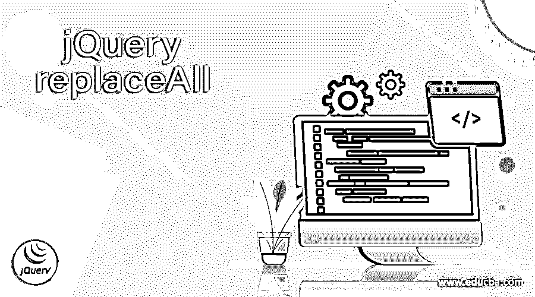
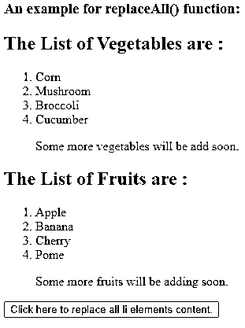
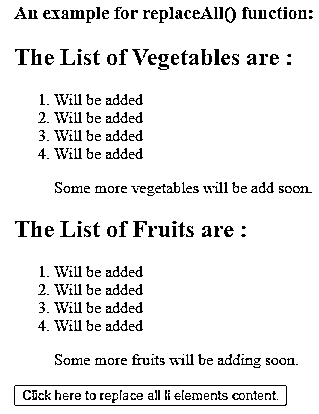
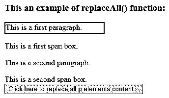
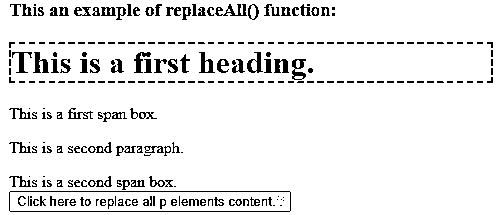
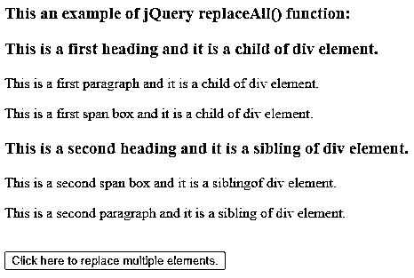
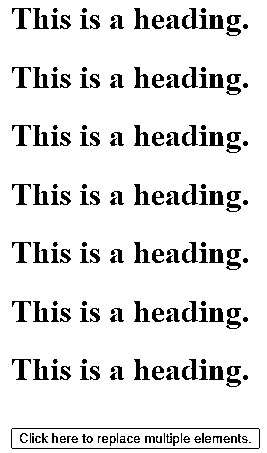

# jquery replace all-jquery 取代全部

> 原文：<https://www.educba.com/jquery-replaceall/>




## jQuery replaceAll 的定义

jQuery replaceAll()函数用于用新的 HTML 元素替换每个选中的元素。jQuery replaceAll()函数是 jQuery 中的内置函数。这些函数用指定的其他 HTML 元素及其内容替换选定的元素及其内容，并返回具有新内容的选定元素的匹配集。

**语法:**

<small>网页开发、编程语言、软件测试&其他</small>

```
$(content).replaceAll(selector);
```

**参数:**

*   内容–这不是可选参数。它通过替换选定的元素来指定要插入的新 HTML 元素及其内容。它必须通过 HTML 标签。
*   选择器–这也不是可选参数。它指定旧的 HTML 元素及其内容将被新的 HTML 元素替换。选择器可以是标记名、id 或类。
*   返回值–该函数的返回值是具有新内容的选定元素。

### jQuery replaceAll()函数的工作原理

函数的作用是:用新的内容替换选中的元素。假设我们在 HTML 页面中有一个包含一些内容的 div 元素。现在我们需要用 h1 元素和一些内容来替换它，所以我们可以将 replaceAll()函数用作$("

# Hello

")。replace all(" div ")；"，它用 h1 元素替换旧的 div 元素，并返回 h1 元素及其内容。

jQuery replaceAll()函数示例–

jQuery replaceAll()函数替换所有 li 元素内容的示例

#### 示例#1

**代码:**

```
<!doctype html>
<html lang="en">
<head>
<meta charset="utf-8">
<script src="https://code.jquery.com/jquery-3.5.0.js"></script>
<title> This is an example for jQuery replaceAll() function </title>
<script>
function disp()
{
$( "<li> Will be added </li>" ).replaceAll( "li" );
}
</script>
</head>
<body>
<h3> An example for replaceAll() function: </h3>
<div>
<h2> The List of Vegetables are : </h2>
<ol>
<li> Corn </li>
<li> Mushroom </li>
<li> Broccoli </li>
<li> Cucumber </li>
<p> Some more vegetables will be add soon. </p>
</ol>
</div>
<div>
<h2> The List of Fruits are : </h2>
<ol>
<li> Apple </li>
<li> Banana </li>
<li> Cherry </li>
<li> Pome </li>
<p> Some more fruits will be adding soon. </p>
</ol>
</div>
<button onclick = "disp()"> Click here to replace all li elements content. </button>
</body>
</html>
```

上述代码的输出是–




一旦我们点击按钮，输出是




在上面的代码中，有一些 div 元素将“h2”、“ol”和“li”作为子元素。接下来，replaceAll()函数用于将所有 li 元素内容替换为“$(

*   Will be added.”)。replace all(" Li ")；"，用新的 li 元素内容替换旧的 li 元素内容，我们单击该按钮就可以看到。

使用 id 替换 p 元素的 jQuery replaceAll()函数示例

#### 实施例 2

**代码:**

```
<!doctype html>
<html lang = "en">
<head>
<meta charset = "utf-8">
<script src = "https://code.jquery.com/jquery-3.5.0.js"></script>
<title> This is an example for jQuery replaceAll() function </title>
<style>
#p1{
border : 2px solid red;
width : 200px;
height : 20px;
}
</style>
<script>
function disp()
{
$("<h1> This is a first heading. </h1>").replaceAll("#p1").css({
"background-color": "yellow",
"border": "2px dashed green"
});
}
</script>
</head>
<body>
<h3> This an example of replaceAll() function: </h3>
<div>
<p id = "p1" > This is a first paragraph. </p>
 This is a first span box. 
</div>
<p> This is a second paragraph. </p>
 This is a second span box. 
<br>
<button onclick = "disp()"> Click here to replace all p elements content. . </button>
</body>
</html>
```

上述代码的输出是–




一旦我们点击按钮，输出是




在上面的代码中，有“div”元素，它包含“p”、“span”和“button”元素。接下来，replaceAll()函数用于将 id“P1”的所有元素替换为标题内容，并应用一些格式样式，如“$(“

# ”这是第一个标题。

”)。replaceAll("#p1 ")。CSS({ " background-color ":" yellow "，" border": "2px 虚线绿色" })；".

用内容替换多个元素的 jQuery replaceAll()函数示例

#### 实施例 3

**代码:**

```
<!doctype html>
<html lang="en">
<head>
<meta charset="utf-8">
<script src="https://code.jquery.com/jquery-3.5.0.js"></script>
<title> This is an example for jQuery replaceAll() function </title>
<script>
function replace()
{
$("<h1> This is a heading. </h1>").replaceAll("p, h3, span");
}
</script>
</head>
<body>
<h3> This an example of jQuery replaceAll() function: </h3>
<div>
<h3> This is a first heading and it is a child of div element. </h3>
<p> This is a first paragraph and it is a child of div element. </p>
 This is a first span box and it is a child of div element. 
</div>
<h3> This is a second heading and it is a sibling of div element. </h3>
 This is a second span box and it is a siblingof div element. 
<p> This is a second paragraph and it is a sibling of div element. </p>
<br>
<button onclick = "replace()"> Click here to replace multiple elements. </button>
</body>
</html>
```

上述代码的输出是–




一旦我们点击按钮，输出是




在上面的代码中，有“p”、“h3”和“span”元素。接下来，使用 replaceAll()函数将多个元素(“p”、“h3”和“span”)替换为“h1”元素，其内容为“$(”

# 这是一个标题。

”)。replaceAll("p，h3，span ")；"，所以它用“h1”元素替换了所有的元素，正如我们在上面的输出中所看到的。

### 结论

jQuery replaceAll()函数是一个内置函数，用来用新的 HTML 元素替换每个选中的元素。

### 推荐文章

这是 jQuery replaceAll 的指南。这里我们讨论 jQuery replaceAll()的定义、语法、工作原理以及代码实现的例子。您也可以看看以下文章，了解更多信息–

1.  [jQuery 选择值](https://www.educba.com/jquery-select-value/)
2.  [jQuery removeClass()](https://www.educba.com/jquery-removeclass/)
3.  [jQuery 延期](https://www.educba.com/jquery-deferred/)
4.  [jquery internhtml](https://www.educba.com/jquery-innerhtml/)


