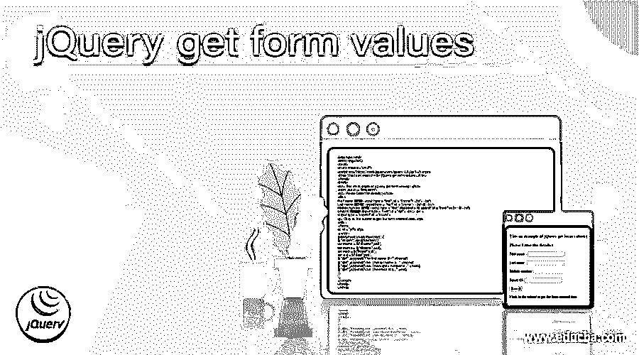
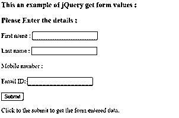
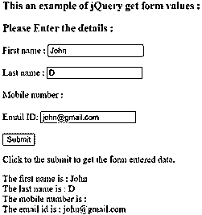
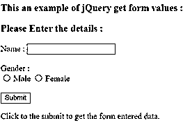
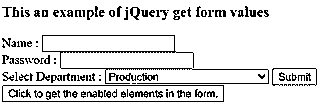

# jQuery 获取表单值

> 原文：<https://www.educba.com/jquery-get-form-values/>




## jQuery 获取表单值简介

执行 jQuery 获取表单值是为了获取表单内部的数据。jQuery 获取表单值可以借助 val()函数和 serialize()函数来执行。jQuery val()函数和 serialize()函数是 jQuery 中的内置函数。val()函数可用于获取匹配元素集中第一个元素的 value 属性。serializeArray()函数用于从数据中获取；它通过序列化表单数据返回对象数组。

**jQuery val()函数的语法—**

<small>网页开发、编程语言、软件测试&其他</small>

```
$( "selector" ).val();
```

**jQuery serialize array()函数的语法-**

```
$( "selector" ).serializeArray();
```

**参数—**

jQuery val()和 serializeArray()函数不接受任何参数。

**返回值-**

这个 val()函数的返回值是第一个匹配元素的 value 属性。

这个 serializeArray()函数的返回值是表单数据的所有值。

### jQuery 获取表单值的操作

jQuery 获取表单值可以借助 val()函数或 serializeArray()函数来执行；这两个函数都不接受任何参数。假设 HTML 页面中有一个表单元素，包含一些表单输入元素，如输入文本元素和复选框元素。现在我们需要获取表单的输入文本数据，所以我们可以使用 val()函数作为 var name =$("#fname ")。val()；"，其中" #fname "是输入元素的 id。因此 val()函数返回在输入文本中输入的值。

### jQuery 获取表单值的示例

下面提到了不同的例子:

#### 示例#1

使用 val()函数获取表单数据的 jQuery get form values 示例

**代码:**

```
<!doctype html>
<html lang="en">
<head>
<meta charset="utf-8">
<script src="https://code.jquery.com/jquery-3.5.0.js"></script>
<title> This is an example for jQuery get form values </title>
</head>
<body>
<h3> This an example of jQuery get form values : </h3>
<form action = "#myform">
<h3> Please Enter the details : </h3>
<div>
First name :     <input type = "text", id = "fname"> <br/> <br/>
Last name :      <input type = "text" id = "lname"> <br/>  <br/>
Mobile number :     <input type = "text" disabled = "disabled" id = "mob" > <br/>  <br/>
Email ID:      <input type = "text" id = "eid"> <br/> <br/>
<input type = "submit" id = "subm">
<p> Click to the submit to get the form entered data. </p>
</div>
</form>
<p id = "p1"> </p>
<script>
$(document).ready(function() {
$( "#subm").click(function(){
var fname = $("#fname").val();
var lname = $("#lname").val();
var mob = $("#mob").val();
var eid = $("#eid").val();
$( "#p1" ).append("The first name is : " +fname);
$( "#p1" ).append("<br> The last name is : " +lname);
$( "#p1" ).append("<br> The mobile number is : " +mob);
$( "#p1" ).append("<br> The email id is : " +eid);
});
});
</script>
</body>
</html>
```

上述代码的输出是–




当我们输入数据并点击按钮时，输出是




在上面的代码中，有一个包含一些输入元素和提交按钮的表单。接下来，在输入数据后，当我们单击 submit 按钮时，它通过使用 val()函数将所有输入的数据显示为" var lname = $("#lname ")。val()；"，并使用 append()函数显示，我们可以看到，一旦我们单击按钮。

#### 实施例 2

使用 serializeArray()函数获取表单数据的 jQuery get form values 示例

**代码:**

```
<!doctype html>
<html lang="en">
<head>
<meta charset="utf-8">
<script src="https://code.jquery.com/jquery-3.5.0.js"></script>
<title> This is an example for jQuery get form values </title>
</head>
<body>
<h3> This an example of jQuery get form values : </h3>
<form action = "#">
<h3> Please Enter the details : </h3>
<div>
Name :     <input type = "text", name = "name" id = "fname"> <br/> <br/>
Gender : <br />
<input type = "radio"  name = "gr" value = "male"/> Male
<input type = "radio"  name = "gr" value = "female"/> Female
<br /><br />
<input type = "submit" id = "subm">
<p> Click to the submit to get the form entered data. </p>
</div>
</form>
<p id = "p1"> </p>
<script>
$(document).ready(function() {
$( "#subm").click(function(){
var x = $("form").serializeArray();
$.each(x, function(i, field) {
alert(field.name + " : " + field.value + " ");
});
});
});
</script>
</body>
</html>
```

上述代码的输出是–




当我们输入数据并点击按钮时，输出是


单击确定，输出为–


在上面的代码中，有一个包含一些输入元素和提交按钮的表单。接下来，在输入数据后，当我们单击 submit 按钮时，它通过使用 seralizeArray()函数将所有输入的数据显示为“var x = $(“form”)。serialize array()；"，其中 x 存储 serializeArray()的返回对象，该对象包含表单元素的所有名称-值对，然后使用 each 循环显示所有名称-值对，就像我们在输出中所做的那样。

#### 实施例 3

使用 serialize()函数获取表单数据的 jQuery get form values 示例

**代码:**

```
<!doctype html>
<html lang="en">
<head>
<meta charset="utf-8">
<script src="https://code.jquery.com/jquery-3.5.0.js"></script>
<title> This is an example for jQuery get form values </title>
<script>
function disp()
{
var x = $( "form" ).serialize();
alert( x );
}
</script>
</head>
<body>
<h3> This an example of jQuery get form values </h3>
<form action = "#myform">
<div>
Name :     <input type = "text" name="name"> <br/>
Password :     <input type = "text" name="pass" > <br/>
Select Department : <select name="dept">
<option > Production </option>
<option> Marketing </option>
<option> Research and Development </option >
<option> Human Resource Management  </option>
</select>
<input type = "submit" id = "sub">
</div>
<button onclick = "disp()"> Click to get the enabled elements in the form.  </button>
</body>
</html>
```

上述代码的输出是–




当我们输入数据并点击按钮时，输出是


在上面的代码中，有一个包含一些输入元素和提交按钮的表单。接下来，在输入数据后，当我们单击 submit 按钮时，它通过使用 seralize()函数将所有输入的数据显示为“var x = $(“form”)。serialize()；"，其中 x 存储 serialize()的返回对象，然后使用 alert()函数显示返回对象，就像我们在输出中所做的那样。

### 结论

jQuery 获取表单值可以借助 va()、seralizeArray()和 seralize()函数，它的执行是为了获取表单内部的数据。

### 推荐文章

这是一个 jQuery 获取表单值的指南。在这里，我们讨论 jQuery get 表单值的工作方式，以及示例和输出。您也可以看看以下文章，了解更多信息–

1.  [jQuery replaceAll](https://www.educba.com/jquery-replaceall/)
2.  [jquerynext 直到](https://www.educba.com/jquery-nextuntil/)
3.  [jQuery prev](https://www.educba.com/jquery-prev/)
4.  [jQuery 数组](https://www.educba.com/jquery-array/)


