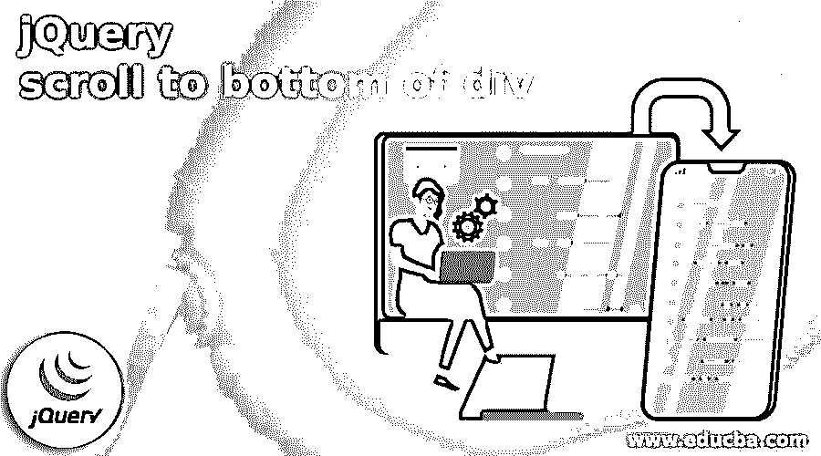
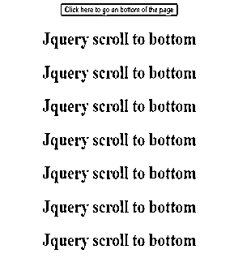
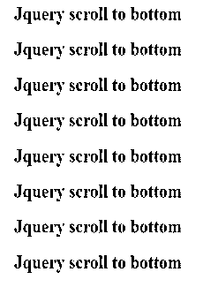

# jQuery 滚动到 div 底部

> 原文：<https://www.educba.com/jquery-scroll-to-bottom-of-div/>




## jQuery 简介滚动到 div 的底部

jQuery scroll to the bottom of div 将 div 的 JavaScript 的 scrollTop 属性设置为 scroll height 属性的值，以滚动到底部。jQuery 中的 ScrollTop 和 height()方法可用于自动从上到下滚动页面。在此方法中，文档的高度被传递给 scrollTop 方法。JQuery scroll to the bottom 用于将页面滚动到底部。

### jQuery 滚动到 div 概述的底部

*   有时我们需要使用 jQuery 将底部滚动设置为默认。例如，我们可以使用 scroll height 方法通过 scroll 检索滚动类 div 的完整高度，还可以使用带有 scrollTop 属性和 set bottom 的动画。
*   在 jQuery 中，我们可以自动使用 scrollTop()和 height()方法从上到下滚动页面。
*   在此方法中，文档的高度被传递给 scrollTop 方法。如果我们不关心动画，就不需要检索元素的高度。
*   如果我们给 scrollTop 一个大于最大值的值，它将在我们尝试过的所有浏览器中滚动到底部。
*   滚动是通过用 scrollTop 调整滚动条的垂直位置来完成的。
*   我们将 scrollTop 设置为 HTML 内容的高度；滚动到这一页的底部。类似地，我们在 Scroll to Top 链接上将 scrollTop 设置为 0px，这将导致滚动到页面的顶部。
*   Return false 还可以防止滚动跳到顶部，然后返回来激活滚动。
*   当我们从页面顶部向下导航时，会出现一个 div。当鼠标向下移动时，显示一个隐藏的 div，当鼠标向上移动时，隐藏的 div 被隐藏。
*   使用 jQuery scroll()函数确定滚动位置，并在鼠标上下移动时显示/隐藏 DIV。
*   在滚动 100、500 或页面底部后，显示某个 div。使用位置来显示/隐藏某个 div。
*   我们可以计算元素的偏移量，然后将其与滚动值进行比较，例如 var hT = $(' # scroll-to ')scroll(function()offset()。
*   这段代码运行后，当用户单击 Trigger 时，消息将被追加到处理程序中。
*   当元素的滚动位置发生变化时，不管是什么原因，都会触发 scroll 事件。

### 如何使用 jQuery 滚动到 div 的底部？

为了滚动到底部的 div，我们需要在我们的程序中使用如下代码。

<small>网页开发、编程语言、软件测试&其他</small>

```
$ (function () {
$ ('#btnClick') .click(function () {
$ ('html, body') .animate ({
scrollTop: $ ("#SecondDiv") .offset().top + $("#SecondDiv")[0].scrollHeight
}, 2000);
return false;
})
});
```

*   在上面的例子中，我们可以看到我们使用了 animate 方法将 jQuery 页面滚动到 div 的底部。
*   我们首先到达 Div 的顶峰。然后我们在用 scrollHeight 我们滑到 Div 的底部。
*   我们可以使用 scrollTop 选项输入我们的元素和一个值 0 作为$('#id ')。我们甚至可以将滚回顶端的动作做成动画。
*   可滚动区域上方视图中隐藏的像素数量决定了垂直滚动位置。示例:获取段落的滚动条。1.2.3.滚动到 Div。

### 顶部 jQuery 滚动到 div 的底部

*   ScrollTop()和 height() div 可用于自动从上到下滚动页面。但是，首先，我们需要使用元素的 ID 将滚动功能与页面上现有元素的单击连接起来。
*   对于单页网站，滚动到 Div 功能很方便。它使用户能够导航到特定的页面部分，而无需手动滚动页面。
*   我们可以确定元素的偏移量，然后将其与滚动值进行比较，例如$ (window)。
*   代码运行后，当用户点击触发器时，处理程序将追加消息。不管什么原因，都会调度一个滚动事件，元素的滚动位置随时都会发生变化。
*   如果我们想要一个可爱的慢速动画滚动，任何 href = #bottom 的锚点都会滚动到底部。
*   当我们的页面完成加载后，我们希望 jQuery 能够平滑地滚动到页面的底部。

### jQuery 滚动到 div 代码底部的示例

下面是 jQuery 滚动到 div 底部的例子。在下面的例子中，我们使用了滚动动画。

**代码—**

```
<!DOCTYPE html>
<html>
<head>
<title>Scroll Automatically</title>
<script src=
"https://ajax.googleapis.com/ajax/libs/jQuery/3.3.1/jQuery.min.js">
</script>
<script>
$(document).ready(function() {
$("button").click(function() {
$("html, body").animate({
scrollTop: $(
'html, body').get(0).scrollHeight
}, 1000);
});
});
</script>
<style>
h1 {
color: Red;
}
</style>
</head>
<body>
<center>
<div>
<button>Click here to go on bottom of the page</button>
<h1> JQuery scroll to bottom </h1>
<h1> JQuery scroll to bottom </h1>
<h1> JQuery scroll to bottom </h1>
<h1> JQuery scroll to bottom </h1>
<h1> JQuery scroll to bottom </h1>
<h1> JQuery scroll to bottom </h1>
<h1> JQuery scroll to bottom </h1>
<h1> JQuery scroll to bottom </h1>
<h1> JQuery scroll to bottom </h1>
<h1> JQuery scroll to bottom </h1>
<h1> JQuery scroll to bottom </h1>
<h1> JQuery scroll to bottom </h1>
</div>
</center>
</body>
</html>
```







*   在上面的例子中，我们使用了一个到 div 底部的滚动条来将页面滚动到底部。此外，我们使用了“点击此处转到页面底部”按钮；点击这个按钮后，我们的页面会在页面的最后出现。
*   JQuery scroll to the bottom of div 从上到下滚动页面非常重要。

### 结论

在 jQuery 中，我们可以自动使用 scrollTop()和 height()方法从上到下滚动页面。例如，JQuery scroll to the bottom of div 将 div 的 JavaScript 的 scrollTop 属性设置为 scroll height 属性的值，以滚动到 div 的底部。

### 推荐文章

这是一个 jQuery 滚动到 div 底部的指南。在这里我们讨论如何使用 jQuery 滚动到 div 的底部和例子。您也可以阅读以下文章，了解更多信息——

1.  [jQuery 滚动](https://www.educba.com/jquery-scroll/)
2.  [jQuery 获取父节点](https://www.educba.com/jquery-get-parent/)
3.  [jQuery param()](https://www.educba.com/jquery-param/)
4.  [jQuery 包含](https://www.educba.com/jquery-contains/)


