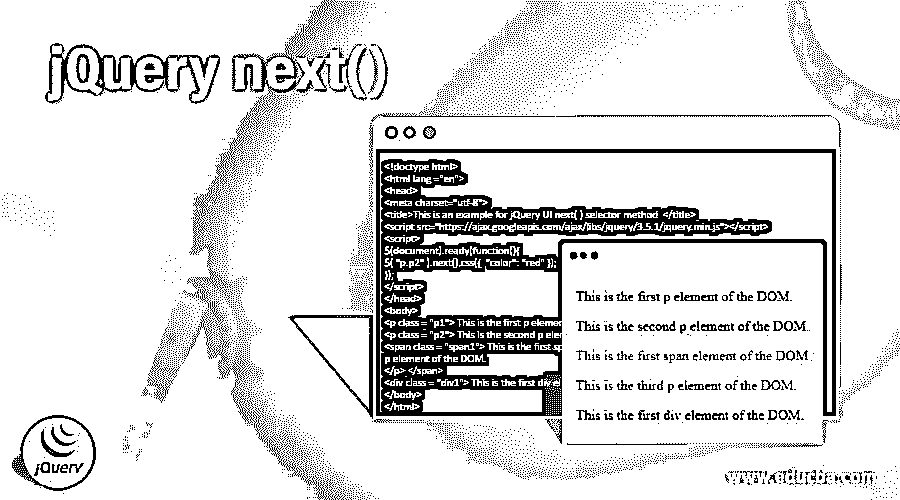
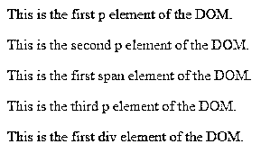
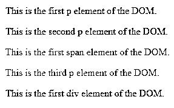
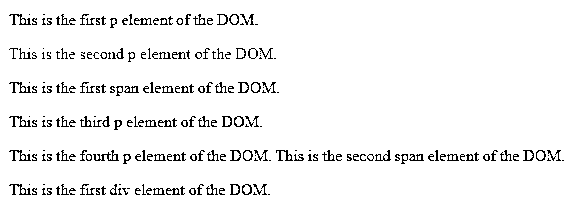

# jQuery next()

> 原文：<https://www.educba.com/jquery-next/>




## jQuery 简介 next()

jQuery UI next()方法用于返回匹配元素集中所选元素的下一个兄弟元素。jQuery UI next()选择器方法是 jQuery UI 库中的内置方法。jQuery next()选择器方法给出了表示一组 DOM 元素的对象，并创建了一个新对象，该对象包含 DOM 树中紧跟这些元素的兄弟元素的结果。兄弟元素是那些在 DOM 树中拥有相同父元素的元素。UI next()选择器方法的工作原理是，根据 DOM 树中的每个元素检查指定的选择器，结果将返回与选择器匹配的直接元素，然后我们可以对它们应用通用行为。nextAll()方法是另一种方法，它返回匹配元素集中所选元素的所有下一个兄弟元素。

**jQuery next()**的语法

<small>网页开发、编程语言、软件测试&其他</small>

语法–

下面是使用 next()选择器的简单语法

```
selector.next()
```

它用于从匹配元素集中获取所选元素的所有下一个同级元素。

**参数—**

它不接受任何参数。

此方法的返回值是指定选择器元素的同级元素。

### jQuery UI next()选择器方法的示例

接下来，我们编写 html 代码，通过下面的示例更清楚地理解 jQuery :Next()选择器方法，其中 next()选择器方法将用于根据名称选择指定元素的同级，如下所示

#### 示例#1

**代码:**

```
<!doctype html>
<html lang ="en">
<head>
<meta charset="utf-8">
<title>This is an example for jQuery UI next( ) selector method </title>
<script src="https://ajax.googleapis.com/ajax/libs/jquery/3.5.1/jquery.min.js"></script>
<script>
$(document).ready(function(){
$("p").next().css({
"color": "red",
});
});
</script>
</head>
<body>
<p class = "p1"> This is the first p element of the DOM.</p>
<p class = "p2"> This is the second p element of the DOM.</p>
 This is the first span element of the DOM.<p class = "p1"> This is the third p element of the DOM.
</p> 
<div class = "div1"> This is the first div element of the DOM.</div>
</body>
</html>
```

**输出:**




在上面的程序中，一个元素(p)的兄弟元素是通过代码$(“p”)行中的元素名来选择的。下一个()。CSS({ " color ":" red " })；并将红色文本颜色作为样式应用于它们。

接下来，我们重写上面的 html 代码，通过下面的示例更清楚地理解 jQuery Next()选择器方法，其中 next()方法将用于根据元素的类选择元素的同级元素，如下所示

#### 实施例 2

**代码:**

```
<!doctype html>
<html lang ="en">
<head>
<meta charset="utf-8">
<title>This is an example for jQuery UI next( ) selector method  </title>
<script src="https://ajax.googleapis.com/ajax/libs/jquery/3.5.1/jquery.min.js"></script>
<script>
$(document).ready(function(){
$( "p.p2" ).next().css({  "color": "red" });
});
</script>
</head>
<body>
<p class = "p1"> This is the first p element of the DOM.</p>
<p class = "p2"> This is the second p element of the DOM.</p>
 This is the first span element of the DOM.<p class = "p1"> This is the third p element of the DOM.
</p> 
<div class = "div1"> This is the first div element of the DOM.</div>
</body>
</html>
```

**输出:**




在上面的程序中，元素(p)的兄弟是由它们的类通过“$(“p . p2”)行选择的。下一个()。CSS({ " color ":" red " })；"并将红色文本颜色作为样式应用于它们。

接下来，我们重写上面的 html 代码，通过下面的示例更清楚地理解 jQuery Next()选择器方法，其中 next()选择器将用于根据元素的 id 选择元素的同级元素，如下所示

#### 实施例 3

**代码:**

```
<!doctype html>
<html lang ="en">
<head>
<meta charset="utf-8">
<title>This is an example for jQuery UI next( ) selector method  </title>
<script src="https://ajax.googleapis.com/ajax/libs/jquery/3.5.1/jquery.min.js"></script>
<script>
$(document).ready(function(){
$("#pid1").next().css({ "color": "red"  });
});
</script>
</head>
<body>
<p class = "p1" id = "pid1"> This is the first p element of the DOM.</p>
<p class = "p2" id = "pid2"> This is the second p element of the DOM.</p>
 This is the first span element of the DOM. <p class = "p1" id = "pid1">This is the third p element of the DOM. </p>  
<p class = "p2" id = "pid2">This is the fourth p element of the DOM. This is the second span element of the DOM.   </p>
<div class = "div1" id = "divid1"> This is the first div element of the DOM. </div>
</body>
</html>
```

**输出:**




在上面的程序中，元素(p)的兄弟是通过代码行“$(“# PID 1”)的 id 来选择的。下一个()。CSS({ " color ":" red " })；"并将红色文本颜色作为样式应用于它们。

### 结论

jQuery UI next()方法是 jQuery UI 库中的内置方法，用于获取匹配元素集中所选元素的下一个直接同级元素，结果对象表示 DOM 树中直接跟随同级元素的一组 DOM 元素。

### 推荐文章

这是 jQuery next()的指南。这里我们讨论 jQuery next()的介绍以及编程示例，以便更好地理解。您也可以看看以下文章，了解更多信息–

1.  [JavaScript 历史对象](https://www.educba.com/javascript-history-object/)
2.  [jQuery UI 按钮](https://www.educba.com/jquery-ui-button/)
3.  [JavaScript onclick 警报](https://www.educba.com/javascript-onclick-alert/)
4.  [jQuery 重定向](https://www.educba.com/jquery-redirect/)


