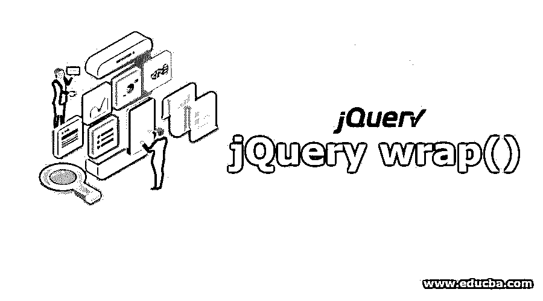
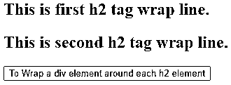
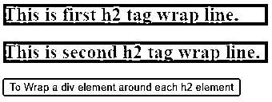
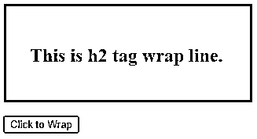
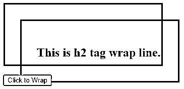
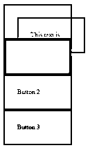
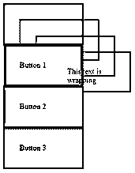

# jQuery wrap()

> 原文：<https://www.educba.com/jquery-wrap/>




## jQuery wrap()概述

jQuery wrap()是一个预定义的函数，当需要将一个 HTML 结构包装在来自 web 页面的一个或多个匹配元素周围时，就会应用这个函数。用于定义该函数的语法是' $(选择器)。wrap(wrapElement，function( index))'，其中 wrapElement 是用于表示对其应用 wrap()函数的特定元素的强制参数，function (index)是用于表示可以从中提取元素属性的函数的可选参数。

**语法:**

<small>网页开发、编程语言、软件测试&其他</small>

```
$(selector).wrap(wrapElement, function(index))
```

**参数**

*   **wrapElement:** wrapElement 不是可选参数，用于指定[哪个 HTML 元素](https://www.educba.com/html-form-elements/)要环绕匹配元素集合中的每个元素。wrapElement 参数可能的值可以是 JQuery 对象、HTML 元素、DOM 元素。
*   **function(index):**function(index)是可选参数，用于指定要执行的函数的名称，返回被包装的元素。其中，index 参数用于指定元素在一组匹配元素中的索引位置。

### jQuery wrap()的示例

下面是 jQuery wrap()的各种例子:

#### 示例# 1–包装HTML 元素

接下来，我们编写 html 代码，通过下面的例子更清楚地理解 jQuery wrap()方法

**代码:**

```
<!DOCTYPE html>
<html lang= "en">
<html>
<head>
<script src="https://ajax.googleapis.com/ajax/libs/jquery/1.11.3/jquery.min.js" >
</script>
<title> This is an example for jQuery wrap( ) method </title>
<!-- code to show the jQuery wrap( ) working method -->
<script>
$(document).ready( function(){
$("button").click( function(){
$("h2").wrap("<div> </div>");
});
});
</script>
<style>
div{ background-color : red;}
</style>
</head>
<body>
<h2> This is first h2 tag wrap line. </h2>
<h2> This is second h2 tag wrap line. </h2>
<button> To Wrap a div element around each h2 element </button>
</body>
</html>
```

**输出:**




一旦他们点击按钮，输出是




所以在上面的例子中,

Html 元素是围绕着

## Html 元素的。

#### **示例#**2–带有 div 标签属性

jQuery wrap()方法将 div 标记的属性(如填充、高度、宽度和边框)设置为一些值。

**代码:**

```
<!DOCTYPE html>
<html lang= "en">
<html>
<head>
<title> This is an example for jQuery wrap( ) method </title>
<script src="https://ajax.googleapis.com/ajax/libs/jquery/3.3.1/jquery.min.js" >
</script>
<!-- code to show the jQuery wrap( ) working method -->
<script>
$(document).ready(function() {
$("button").click(function() {
$("h2").wrap("<div> </div>");
});
});
</script>
<style>
div {
padding: 30px;
height: 60px;
width: 250px;
border: 3px solid red;
}
</style>
</head>
<body>
<h2> This is h2 tag wrap line. </h2> <br>
<button> Click to Wrap </button>
</body>
</html>
```

**输出:**


一旦他们点击按钮，输出是




如果再次单击该按钮，输出是–




因此，如果我们单击按钮，h2 标签的换行将继续应用。

#### **示例**# 3–以内容为参数

其中 jQuery wrap()方法接受 cont 作为参数，其中 cont 是'

'，这意味着对于所有这些标签，哪些 html 元素具有相同的类“div ”,包装就完成了。

**代码:**

```
<!DOCTYPE html>
<html lang= "en">
<html>
<head>
<title> This is an example for jQuery wrap( ) method </title>
<script src="https://ajax.googleapis.com/ajax/libs/jquery/3.3.1/jquery.min.js" >
</script>
<!-- code to show the jQuery wrap( ) working method -->
<script>
$(document).ready( function() {
$("div").click( function () {
var cont = '<div class= "div" > </div>';
$("#divid").wrap( cont );
});
});
</script>
<style>
div {
padding: 30px;
height: 20px;
width: 100px;
border: 3px solid red;
}
</style>
</head>
<body>
<div class= "div" id= "divid"> This is text is wrapping </div>
<div class= "div" style= "background-color : red;" > Button 1 </div>
<div class= "div" style= "background-color : yellow;" > Button 2 </div>
<div class= "div" style= "background-color : orange;" > Button 3 </div>
</body>
</html>
```

**输出:**


一旦我们单击任何按钮(按钮 1、按钮 2 和按钮 3)，输出为




同样，如果单击按钮 1、按钮 2 和按钮 3 中的任何一个按钮，输出为–




因此，如果我们单击任何一个按钮，对 div 标签的包装就会继续应用。

#### 示例 4——jQuery wrap()方法包装所有内部内容

**代码:**

```
<!DOCTYPE html>
<html lang="en">
<head>
<title>Wrapping HTML Around the Elements in jQuery</title>
<script src="https://code.jquery.com/jquery-1.12.4.min.js" > </script>
<script>
$(document).ready( function(){
$(".cont").wrap( '<div class= "wrap"> </div>');
$("button").click(function(){
$("p").contents().wrap("<em> <b></b></em>");
});
});
</script>
<style>
.cont{
padding : 10px;
background : yellow;
font-size: 20px;
}
.wrap{
padding : 30px;
background : red;
margin: 15px 0;
}
</style>
</head>
<body>
<button type= "button"> click here for wrapping </button>
<div class="cont">
<p> This is text is wrapping. </p>
</div>
</body>
</html>
```

**输出:**


一旦我们点击任何按钮，输出是


### 结论

jQuery wrap()方法使用一个 HTML 结构来包装匹配元素集合中的每个元素。这个方法是 jQuery 的内置方法。该方法接受通过$()工厂函数传递的任何对象或字符串。

jQuery wrap()的语法是$(选择器)。wrap( wrapElement，function( index))。这些参数是

*   **wrap element-**wrap element 不是可选参数，用于指定哪个 html 元素要环绕匹配元素集合中的每个元素，可能的值可以是 JQuery 对象、html 元素、DOM 元素。
*   **function(index)–**function(index)是可选参数，用于指定要执行的函数的名称，并返回被包装的元素。其中，index 参数用于指定元素在一组匹配元素中的索引位置。

### 推荐文章

这是 jQuery wrap()的指南。这里我们讨论 jQuery()的简介、语法、参数和示例。您也可以看看以下文章，了解更多信息–

1.  [jQuery 方法](https://www.educba.com/jquery-methods/)
2.  [jQuery querySelector](https://www.educba.com/jquery-queryselector/)
3.  [JQuery 中选择器的类型](https://www.educba.com/types-of-selector-in-jquery/)
4.  [jQuery val()](https://www.educba.com/jquery-val/)


