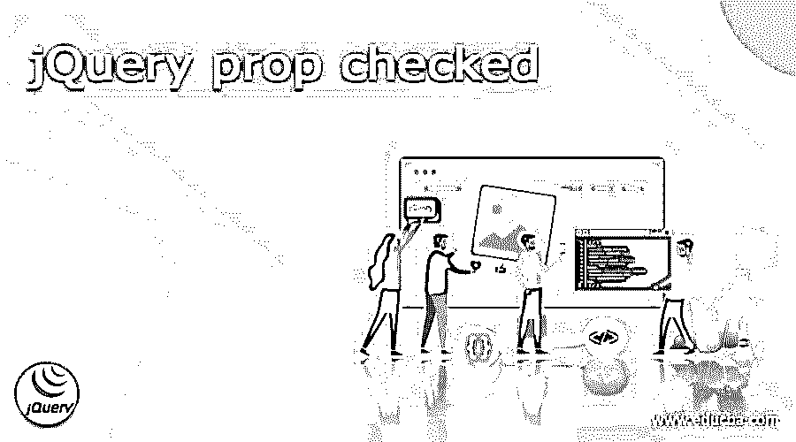

# jQuery 属性已检查

> 原文：<https://www.educba.com/jquery-prop-checked/>




## 已检查 jQuery 属性的定义

jQuery prop checked 被定义为一个属性，它允许跟踪复选框的当前状态，作为文档对象模型(缩写为 DOM)操作的一部分。jQuery 允许不同的方法，通过这些方法可以在 DOM 中进行操作。这些操作可以是编辑属性中的元素，或者为元素的属性设置值，或者更简单地充当 DOM 的 getters。jQuery 不仅属于 getters 组，而且属于 set 组的另一个范畴。它们甚至能够通过插入、复制、删除等来修改整个元素或元素组。在本文中，我们将研究 jQuery 中属性检查功能的不同方面。

**语法:**

<small>网页开发、编程语言、软件测试&其他</small>

正如我们现在已经知道的，jQuery 中的操作可以获得匹配元素列表中第一个元素的属性值，或者该匹配元素的一个或多个属性的集合。在这一节中，我们将研究适用于 jQuery 中的 prop checked 的相应语法。

**prop 方法的一般语法:**

```
$(< name of the selector >).prop(val1, val2)
```

**检查 HTML 标记中复选框的状态:**

```
$(< name of the element >).prop("checked")
```

**声明或指定弹出容器的值:**

```
$(< name of the element >).prop("checked", < Boolean value True or False >);
```

### jQuery 中的 prop checked 是如何工作的？

到目前为止，我们对使用 jQuery 获取复选框的状态有了一个比较好的理解。一种这样方法是使用适当的方法。这是一个内置的查询方法，不仅可以获取所选元素的值，还允许开发人员使用该方法设置复选框的属性值。

在使用 prop 方法获取属性值的情况下，我们从第一个匹配的元素获取值。在语法中，如果我们深入研究一下，$(选择器)。prop(val1，val2)选择器是复选框所引用的元素的属性。使用 val1 值，我们将指定属性，以及对应的 val1 属性何时从可用元素列表中匹配。我们从中获取第一个，并呈现其当前状态。

类似地，当使用 prop 方法设置属性值时，我们通过语法中的 val1 声明元素的值，并相应地替换属性的 val2，表示该属性必须设置的值。使用与前面相同的逻辑，我们将首先尝试通过将相应的元素与 val1 中指定的值进行匹配来匹配它，然后相应地更改 val2 中指定的值。如果知道 val1 需要更改的值列表也可以通过 val2 传递，会很有意思。将读取代码中 val2 等效项中列出的一个或多个属性，并相应地设置这些值。

一个惊人的相似之处。用…作为财产。attr 属性有时会让开发人员在为特定用例选择使用哪个属性时感到困惑。记住遵守文章的限制有一点不同，那就是。prop()属性使开发人员能够显式检索属性值，而另一方面，。attr()方法只允许对属性进行检索。

在下面的例子中，我们将分别介绍如何使用。prop()用于检索元素的属性以及设置其中一个元素的值。在最后一个例子中，我们将研究属性的微小变化如何导致视觉效果的巨大差异。

### 例子

以下是不同的例子:

#### 示例#1

JavaScript 和滑动动画中的弹出菜单:

**语法**

```
<!DOCTYPE html>
<html lang="en">
<head>
<meta charset="utf-8">
<title>Demo to *GET* the status of the checkbox</title>
<style>
img {
padding: 27px;
}
div {
color: green;
font-size: 11px;
padding: 9px;
}
</style>
<script src="https://code.jquery.com/jquery-3.5.1.min.js"></script>
<script>
$(document).ready(function(){
$('input[type="checkbox"]').click(function(){
if($(this).prop("checked") == true){
$("#result").html("You have checked the check box!");
}
else if($(this).prop("checked") == false){
$("#result").html("You have unchecked the check box!");
}
});
});
</script>
</head>
<body>
<p><input type="checkbox"> Toggle between check and uncheck option to see the change</p>
<div id="result" style="background: cyan;"></div>
</body>
</html>
```

**输出**

复选框“已选中”


复选框“未选中”


#### 实施例 2

在 jQuery 中使用 prop 方法禁用复选框:

**语法**

```
<!DOCTYPE html>
<html lang="en">
<head>
<meta charset="utf-8">
<title>Demo to *SET* the status of the checkbox by disabling the check boxes</title>
<style>
img {
padding: 27px;
}
div {
color: green;
font-size: 9px;
}
</style>
<script src="https://code.jquery.com/jquery-3.5.0.js"></script>
</head>
<body>
<input type="checkbox" checked="checked">
<input type="checkbox">
<input type="checkbox" checked="checked">
<input type="checkbox">
<script>
$( "input[type='checkbox']" ).prop({
disabled: true
});
</script>
</body>
</html>
```

**输出:**


#### 实施例 3

在 jQuery 中使用 prop 方法重新启用前面的示例中提到的复选框:

**语法**

```
<!DOCTYPE html>
<html lang="en">
<head>
<meta charset="utf-8">
<title>Demo to *SET* the status of the checkbox by disabling the check boxes</title>
<style>
img {
padding: 27px;
}
div {
color: green;
font-size: 9px;
}
</style>
<script src="https://code.jquery.com/jquery-3.5.0.js"></script>
</head>
<body>
<input type="checkbox" checked="checked">
<input type="checkbox">
<input type="checkbox" checked="checked">
<input type="checkbox">
<script>
$( "input[type='checkbox']" ).prop({
disabled: false
});
</script>
</body>
</html>
```

**输出:**


### 结论

在这篇文章的帮助下，我们已经了解了。prop()方法，并通过 jQuery 中的示例深入研究每种可能性。这样，我们将鼓励读者在 jQuery 中检查 prop 的本质，并尝试通过使用用户可以切换的点击按钮来合并示例 2 和示例 3，从而构建一个应用程序！

### 推荐文章

这是一个 jQuery prop 检查指南。这里我们讨论 jQuery 中的定义、语法、参数以及 prop checked 是如何工作的？分别是。您也可以看看以下文章，了解更多信息–

1.  [jQuery 帖子](https://www.educba.com/jquery-post/)
2.  [jQuery keycode](https://www.educba.com/jquery-keycode/)
3.  [jQuery 替换类](https://www.educba.com/jquery-replace-class/)
4.  [jQuery ajax 请求](https://www.educba.com/jquery-ajax-request/)


