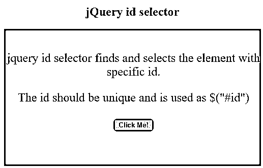
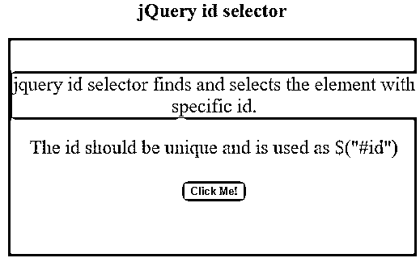
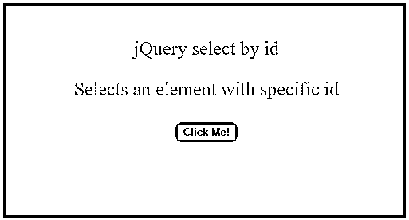
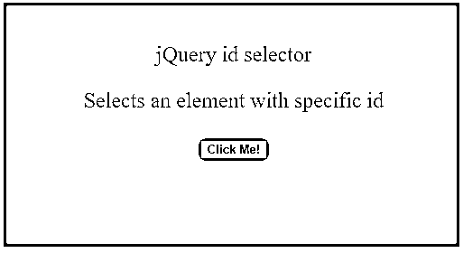
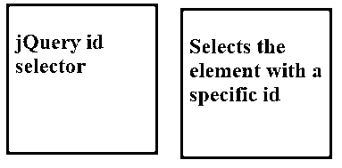
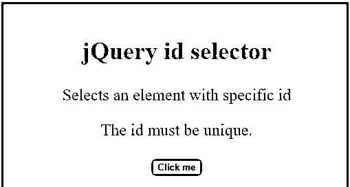
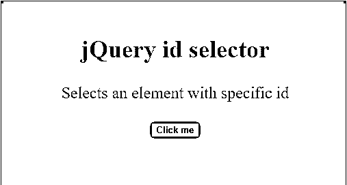

# jQuery id 选择器

> 原文：<https://www.educba.com/jquery-id-selector/>


## jQuery id 选择器简介

jQuery id 选择器允许您为一个特定的 HTML 元素指定一个 id，然后用它的“id”属性值来查找这个特定的元素。id 属性在文档中应该是惟一的，也就是说，每个 id 在文档中只能使用一次，以找到一个惟一的元素。任何值都可以用于 id 属性，后跟 id 的井号(#)字符用于查找具有该特定 id 的元素。jQuery id 选择器的重要意义在于，每个 HTML 元素都有一个单独的控件，每个元素都有自己唯一的 id，而预期的操作将只影响 id 所引用的那个特定元素。

**语法:**

<small>网页开发、编程语言、软件测试&其他</small>

```
$("#id")
```

其中 id 是指要选择的特定 HTML 元素的唯一 id。这是一个必需参数。例如，$("#div_id ")这将选择 id 为" div_id "的元素。

### jQuery 中的 id 选择器是如何工作的？

*   使用 jQuery id 选择器的基本目的是根据 id 属性的值来查找、选择和操作 HTML 元素。每个 HTML 元素都应该有一个唯一的 id，这样就很容易对所有的元素进行单独的控制。
*   每个 id 在一个文档中只能使用一次。
*   要使用 id 属性查找元素，需要在散列(#)字符后指定该元素的 id，例如$("#id ")。
*   让我们这样理解，如果我们想从一个网页的许多段落中只选择一个特定的段落，我们可以给这个特定的段落分配一个唯一的 id，然后根据分配的 id 进行选择。
*   使用$()并传递一个 id 选择器作为其参数，返回一个 jQuery 对象，该对象包含零个或一个 HTML 元素的集合，因为多个 HTML 元素不能具有相同的 id。$()是 jQuery()函数的简写。

### 例子

让我们通过几个例子来理解 id 选择器的实现。

#### 示例#1

这个例子以一种非常简单的方式演示了 id 选择器的用法。

**代码:**

```
<!DOCTYPE html>
<html>
<head>
<script src="https://code.jquery.com/jquery-1.12.4.js"></script>
<script>
$(document).ready(function () {
$("button").click(function () {
$("#pid").css("background-color", "yellow");
});
});
</script>
<style>
#divstyle {
width: 500px;
height: 250px;
padding-top: 20px;
padding-left: 5px;
font-size: 24px;
text-align: center;
color: maroon;
background-color: cadetblue;
}
</style>
</head>
<body>
<center>
<h2>jQuery id selector</h2>
<div id="divstyle">
<p id="pid">
jquery id selector finds and selects the element with specific id.
</p>
<p>The id should be unique and is used as $("#id")</p>
<button><strong>Click Me!</strong</button>
</div>
</center>
</body>
</html>
```

**输出:**

*   一旦上面的代码被执行，下面的屏幕显示。




*   单击按钮时，id =“PID”的元素(这里是一个段落)的背景颜色会发生如下所示的变化。
*   jQuery id 选择器在 id“PID”的帮助下选择指定的元素，然后使用。css 方法将背景色变为黄色。




#### 实施例 2

下面是另一个说明 jQuery id 选择器用法的例子。

**代码:**

```
<!DOCTYPE html>
<html>
<head>
<script src="https://code.jquery.com/jquery-1.12.4.js"></script>
<script>
$(document).ready(function () {
$("button").click(function () {
$("#pid").replaceWith("<p>jQuery id selector</p>");
});
});
</script>
<style>
#divstyle {
width: 500px;
height: 250px;
padding-top: 20px;
padding-left: 5px;
font-size: 24px;
text-align: center;
color: maroon;
background-color: cadetblue;
}
</style>
</head>
<body>
<div id="divstyle">
<p id="pid">jQuery select by id</p>
<p>Selects an element with specific id</p>
<button><strong>Click Me!</strong</button>
</div>
</body>
</html>
```

**输出:**

*   一旦上面的代码被执行，下面的屏幕显示。




*   单击该按钮时，id = "pid "的元素(这里是一个段落)的内容将被替换为新内容，如下所示。
*   点击按钮将选择 id =“PID”的所有元素，然后用新的元素替换其内容。




#### 实施例 3

让我们再看一个 jQuery id 选择器用法的例子。

**代码:**

```
<!DOCTYPE html>
<html>
<head>
<script src="https://code.jquery.com/jquery-1.12.4.js"></script>
<script>
$(document).ready(function () {
$("#div2").css("border", "5px solid yellow");
});
</script>
<style>
div {
width: 150px;
height: 150px;
float: left;
padding: 10px;
margin: 10px;
background-color: cadetblue;
}
</style>
</head>
<body>
<div id="div1">
<h2>jQuery id selector</h2>
</div>
<div id="div2"><h2>Selects the element with a specific id</h2></div>
</body>
</html>
```

**输出:**

*   一旦上面的代码被执行，下面的屏幕显示。




*   页面加载后，id = "div2 "的第二个 div 被选中，黄色边框被添加到其中。

#### 实施例 4

下面再举一个例子来说明 jQuery id 选择器的重要性。

**代码:**

```
<!DOCTYPE html>
<html>
<head>
<script src="https://ajax.googleapis.com/ajax/libs/jquery/3.5.1/jquery.min.js"></script>
<script>
$(document).ready(function () {
$("button").click(function () {
$("#pid").hide();
});
});
</script>
<style>
#divstyle {
width: 500px;
height: 250px;
padding-top: 20px;
padding-left: 5px;
font-size: 24px;
text-align: center;
color: maroon;
background-color: cadetblue;
}
</style>
</head>
<body>
<div id="divstyle">
<h2>jQuery id selector</h2>
<p>Selects an element with specific id</p>
<p id="pid">The id must be unique.</p>
<button><strong>Click me</strong></button>
</div>
</body>
</html> 
```

**输出:**

*   一旦上面的代码被执行，下面的屏幕显示。




*   单击按钮时，id = "pid "的元素从页面中隐藏，如下所示。
*   id 选择器被用在这里的一个

    元素上，它将选择那个特定的元素，然后 hide()函数将从页面中隐藏那个元素。




**注意:**由于每个 id 在一个文档中只能使用一次，如果同一个 id 被分配给多个元素，那么只有第一个匹配的元素会被选中。

### 结论

在本文中，我们讨论了使用 jQuery 的 id 选择器实现，使用 jQuery 我们可以访问特定的元素来执行任务。每个 HTML 元素都被分配了一个惟一的 id，这使得查找和选择执行各种 HTML 操作变得很容易。这有助于单独控制文档中的每个元素。

### 推荐文章

这是一个 jQuery id 选择器的指南。在这里，我们还将讨论 jquery 中的简介和 id 选择器是如何工作的？以及不同的示例及其代码实现。您也可以看看以下文章，了解更多信息–

1.  [JQuery attr()](https://www.educba.com/jquery-attr/)
2.  jquery ui
3.  [jQuery 可见](https://www.educba.com/jquery-is-visible/)
4.  [jQuery 滑块](https://www.educba.com/jquery-slider/)


