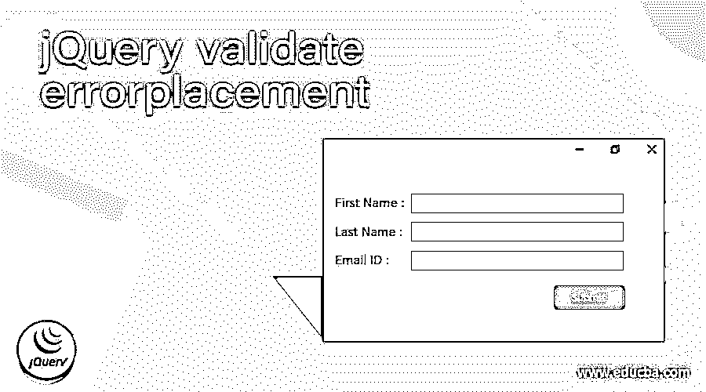

# jQuery 验证错误放置

> 原文：<https://www.educba.com/jquery-validate-errorplacement/>




## jQuery 验证错误放置的定义

jQuery validate errorplacement()函数用于自定义错误消息的位置。这个函数是 jQuery 中的内置函数。这些函数改变了验证插件的默认行为，在输入字段后插入错误标签。验证插件用于验证 HTML 表单的 HTML 输入标签。

**语法—**

<small>网页开发、编程语言、软件测试&其他</small>

```
$( 'form' ).validate( {
rules: { //some rules for the input feilds },
errorPlacement : function( error, element ) {
if ( element.hasClass( 'customError' )) {
// custom error placement
}
else {
element.after( error ); // default error placement
}
}
});
```

**参数:**

*   **错误–**这不是可选参数。它指定将插入或附加到显示中的错误消息。
*   **错误–**这不是可选参数。它指定了我们要为其显示错误消息标签的 HTML 元素。

### jQuery 验证 errorplacement()函数的工作原理

jQuery validate errorplacement()函数接受两个参数，即错误标签消息和要显示错误消息的元素。假设我们在 HTML 页面中有一个表单元素，它包含 name、empid、projectcode 输入字段，这些字段是填充所有输入所必需的，如果没有提供任何一个输入，就会显示错误消息。假设我们想在那个输入占位符或字段本身显示错误消息，那么我们可以把语句作为 element.attr("placeholder "，"这个字段是必需的")；在 validate errorplacement 函数内部。现在，当我们在没有任何输入字段的页面上单击提交按钮时，错误消息会显示在输入字段中。

### 例子

jQuery validate errorplacement()函数的示例显示了如何将验证错误消息放置到特定位置。

#### 示例#1

**代码:**

```
<!doctype html>
<html lang = "en">
<head>
<meta charset = "utf-8">
<title> This is an example for jQuery validate errorplacement function </title>
<!-- Using the jquery CDN -->
<script src = "https://www.webcodegeeks.com/wp-content/litespeed/localres/ajax.googleapis.com/ajax/libs/jquery/3.2.1/jquery.min.js"> </script>
<!-- Using the jquery validate plugin CDN -->
<script src = "https://www.webcodegeeks.com/wp-content/litespeed/localres/cdn.jsdelivr.net/jquery.validation/1.16.0/jquery.validate.min.js"> </script>
</head>
<body>
<h3> This an example of validate errorplacement function: </h3>
<form name = "myForm">
<fieldset id = "gender" name = "gender">
<legend> Select Your Gender </legend>
<div id = "radio">
<label title = "Select the Gender of the candicate "> </label>
<label for = "male "> Male </label>
<input type = "radio" id = "male" name = "gender1" value = "male" />
<label for = "female"> Female </label>
<input type = "radio" id = "famale" name = "gender1" value = "female" />
</div> <!-- end radio class-->
</fieldset>
<input type = "submit">
</form>
<script>
var v = $( "form" ).validate({
rules: {
gender1: 'required'
},
errorPlacement:
function( error, element ){
if(element.is( ":radio" )){
// error append here
error.appendTo('#radio');
}
else {
error.insertAfter(element);
}
}
});
</script>
</body>
</html>
```

上述代码的输出是–


一旦我们单击按钮而没有选择任何单选按钮，输出是–


在上面的代码中,“form”元素包含两个“radio”元素，用于表示性别，如果没有选择任何按钮，则会显示错误消息。接下来，使用 validate errorplacement()函数将错误追加到单选元素中，作为“error . appendto(# radio ')；”.因此，如果我们单击提交按钮而没有选择任何性别，那么错误消息将显示在“单选”元素之后。

jQuery validate errorplacement()函数的示例，使用突出显示函数显示错误消息的位置

#### 实施例 2

**代码:**

```
<!doctype html>
<html lang = "en">
<head>
<meta charset = "utf-8">
<title> This is an example for jQuery validate errorplacement function </title>
<!-- Using the jquery CDN -->
<script src = "https://www.webcodegeeks.com/wp-content/litespeed/localres/ajax.googleapis.com/ajax/libs/jquery/3.2.1/jquery.min.js"> </script>
<!-- Using the jquery validate plugin CDN -->
<script src = "https://www.webcodegeeks.com/wp-content/litespeed/localres/cdn.jsdelivr.net/jquery.validation/1.16.0/jquery.validate.min.js"> </script>
<style>
.errorClass{ background : red;}
</style>
</head>
<body>
<h3> This an example of validate errorplacement function: </h3>
<form id = "form_id" action = "" method = "POST" name = "form_id">
First Name : <input type = "text" id = "first_name" class = "required" name = "first_name" placeholder = "" />
<br>
Last Name : <input type = "text" id = "last_name" class = "required" name = "last_name" placeholder = "" />
<br>
Email ID : <input type = "text" id = "email_id" class = "required" name = "email_id" placeholder = "" />
<br>
<input id="" class="" type="submit"> </input>
</form>
<script>
$( "#form_id" ).validate({
errorPlacement: function( error, element ) {
// attrib nameof the field
var n = element.attr("name");
if (n == "first_name")
element.attr("placeholder", "Please enter your first name");
else if (n == "last_name")
element.attr("placeholder", "Please enter your last name");
else if (n == "email_id")
element.attr("placeholder", "Please enter your email id");
},
rules: {
first_name : {
minlength: 6,
required: true
},
last_name : {
minlength: 6,
required: true
},
email_address : {
minlength : 10,
required: true,
email: true
}
},
highlight: function(element) {
// add a class "errorClass" to the element
$(element).addClass('errorClass');
},
unhighlight: function(element) {
// class "errorClass" remove from the element
$(element).removeClass('errorClass');
},
submitHandler: function(form) {
// now submit the form.
}
});
</script>
</body>
</html>
```

上述代码的输出是


一旦我们单击“提交”按钮，而没有在输入框中输入任何值，输出将是–


在上面的代码中,“form”元素包含三个“input”元素，分别用于名、姓和电子邮件 id，如果任何字段留空，错误消息将在特定元素的占位符处用突出显示的颜色显示。接下来，使用 validate errorplacement()函数将错误放在特定输入元素的占位符处，例如 first name is " element . attr(" placeholder "，" Please enter your first name ")；.因此，如果我们单击提交按钮而不输入任何输入字段，错误消息将显示占位符位置。

### 结论

jQuery validate errorplacement()函数是一个内置函数，用于自定义验证错误消息的位置。

### 推荐文章

这是 jQuery 验证错误放置的指南。这里我们讨论 jQuery validate errorplacement()的定义、工作方式以及示例，以便更好地理解。您也可以看看以下文章，了解更多信息–

1.  [jQuery eq()](https://www.educba.com/jquery-eq/)
2.  [jQuery 日历](https://www.educba.com/jquery-calendar/)
3.  [jQuery 数组排序](https://www.educba.com/jquery-array-sort/)
4.  [jQuery 内容](https://www.educba.com/jquery-contents/)


