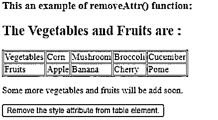
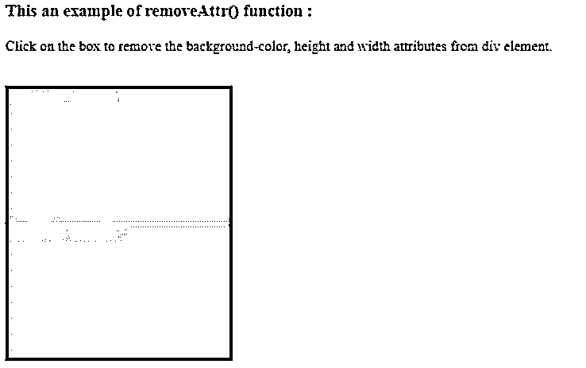
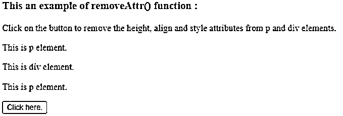

# jQuery 删除属性

> 原文：<https://www.educba.com/jquery-remove-attribute/>


## jQuery 移除属性简介

jQuery removeAttr()函数用于从所选元素中移除一个或多个属性。jQuery removeAttr()函数是 jQuery 中的内置函数。jQuery removeAttr()函数删除每个匹配元素的指定属性。它使用 JavaScript 的 removeAttribute()函数，它的优点是可以直接调用 jQuery 对象。prop()函数的工作方式也与 removeAttr()函数相同，但是在 Internet Explorer 8、9 和 11 中，使用 removeAttr()函数删除 inline onclick 属性不会得到想要的结果，因此我们可以使用 prop()函数来获得想要的结果。

**jQuery remove attr()函数的语法:**

<small>网页开发、编程语言、软件测试&其他</small>

```
$(selector). removeAttr(attribute);
```

**参数:**

*   **属性:**这不是可选参数。它指定要从选定元素中移除的一个或多个属性。多个属性由空格分隔。

**返回值:**

该函数返回删除了属性的选定元素。

### jQuery removeAttr()函数的工作原理

*   jQuery removeAttr()函数接受一个参数，该参数指定要从所选元素中移除的属性。
*   假设我们在 HTML 页面中有一个“a”元素，它有一个“href”属性(指定链接到的页面的 URL)。
*   现在我们需要停用链接或删除“href”属性，这样我们可以将 removeAttr()函数用作“$("a ")。remove attr(" href ")；"，它从所有“a”元素中移除“href”属性。

### jQuery 移除属性的示例

以下是 jQuery Remove 属性的示例:

#### 示例#1

jQuery removeAttr()函数从单个元素中删除单个属性的示例。

**代码:**

```
<!doctype html>
<html lang="en">
<head>
<meta charset="utf-8">
<script src = "https://code.jquery.com/jquery-3.5.0.js"></script>
<title> This is an example for jQuery removeAttr() function </title>
<script>
function disp()
{
$("table").removeAttr("style").css({
"border": "2px solid red"
});
}
</script>
</head>
<body>
<h3> This an example of removeAttr() function: </h3>
<h2> The Vegetables and Fruits are : </h2>
<table style = "width : 80%" border = "4">
<tr>
<td> Vegetables </td>
<td> Corn </td>
<td> Mushroom </td>
<td> Broccoli </td>
<td> Cucumber  </td>
</tr>
<tr>
<td> Fruits </td>
<td> Apple </td>
<td> Banana </td>
<td> Cherry </td>
<td> Pome  </td>
</tr>
</table>
<p> Some more vegetables and fruits will be add soon. </p>
<button onclick = "disp()"> Remove the style attribute from table element. </button>
</body>
</html>
```

**输出:**


**一旦我们点击按钮，输出是:**




在上面的代码中，有一个包含 style 属性的 table 元素。接下来，使用 removeAttr()函数从所有表格中删除 style 属性作为“$("table ")。remove attr(" style ")；"，所以，它选择表格元素，并删除样式(宽度:80%)和应用红色边框，因为我们可以看到，一旦我们点击按钮。

#### 实施例 2

jQuery removeAttr()函数的示例，用于从单个类型元素中删除多个属性作为类。

**代码:**

```
<!doctype html>
<html lang="en">
<head>
<meta charset = "utf-8">
<script src = "https://code.jquery.com/jquery-3.5.0.js"> </script>
<title> This is an example for jQuery background image property </title>
<style>
.div1 {
border : 2px solid black;
background-color : blue;
height : 150px;
width : 250px;
}
</style>
</head>
<script>
$( document ).ready( function() {
$( "div" ).click( function() {
$("div").removeAttr("class");
});
});
</script>
<body>
<h3 > This an example of removeAttr() function : </h3>
<p> Click on the box to remove the background-color, height and width attributes from div element. </p>
<br>
<div class = "div1" > This is div element. </div>
<div class = "div1" > This is div element. </div>
</body>
</html>
```

**输出:**




**一旦我们点击第一个按钮，输出是:**


在上面的代码中，有一些具有 class 属性的 div 元素。接下来，使用 removeAttr()函数从所有 div 元素中删除 class 属性作为“$(“div”)。remove attr(" class ")；"因此，它选择了所有的 div 元素并删除了 class 属性，正如我们单击按钮时所看到的。

#### 实施例 3

jQuery removeAttr()函数的示例，用于从不同类型的元素中分别删除多个属性。

**代码:**

```
<!doctype html>
<html lang="en">
<head>
<meta charset = "utf-8">
<script src = "https://code.jquery.com/jquery-3.5.0.js"> </script>
<title> This is an example for jQuery removeAttr() function </title>
</head>
<script>
$( document ).ready( function() {
$( "button" ).click( function() {
$("p,div").removeAttr("height align style");
});
});
</script>
<body>
<h3> This an example of removeAttr() function : </h3>
<p> Click on the button to remove the height, align and style attributes from p and div elements. </p>
<p height = "20px" align = "center" style = "color:red; background-color:yellow"> This is p element. </p>
<div height = "20px" align = "center" style = "color:red; background-color:yellow"> This is div element. </div>
<p height = "20px" align = "center" style = "color:red; background-color:yellow"> This is p element. </p>
<button> Click here. </button>
</body>
</html>
```

**输出:**


**一旦我们点击按钮，输出是:**




在上面的代码中，有包含高度、对齐和样式属性的 p 和 div 元素。接下来，使用 removeAttr()函数从所有 p 和 div 元素中删除多个属性(高度、对齐和样式)，作为“$(“p，div”)。removeAttr("高度对齐样式")；"所以，它选择了所有的 p 和 div 元素，并删除了所有三个属性，正如我们在输出中看到的。

### 结论

jQuery removeAttr()函数是 jQuery 中的内置函数，用于从所选元素中移除一个或多个属性。

### 推荐文章

这是一个 jQuery 移除属性的指南。这里我们讨论 jQuery removeAttr()函数的介绍、工作原理和例子。您也可以看看以下文章，了解更多信息–

1.  [jQuery 选择选项](https://www.educba.com/jquery-select-option/)
2.  [jQuery zindex](https://www.educba.com/jquery-zindex/)
3.  [jQuery 宽度](https://www.educba.com/jquery-width/)
4.  [jQuery id 选择器](https://www.educba.com/jquery-id-selector/)


