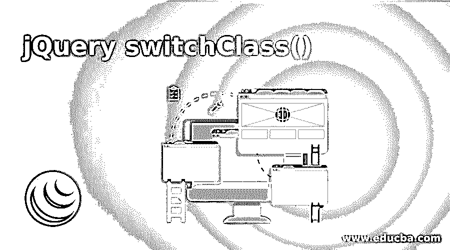
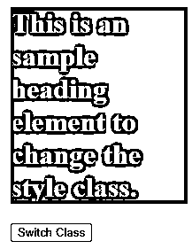
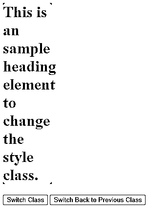
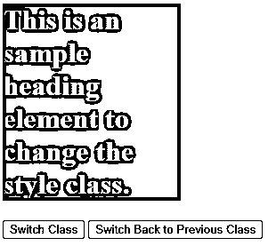
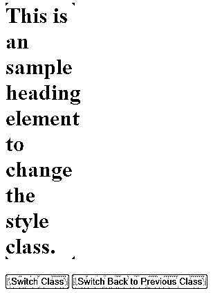

# jQuery switchClass()

> 原文：<https://www.educba.com/jquery-switchclass/>




## jQuery switchClass()简介

jQuery switchClass()方法用于在动画显示所有样式变化的同时，向匹配的元素添加和移除特定的类。jQuery switchClass()方法是 jQuery UI 库中的内置方法。简而言之，jQuery switchClass()方法可以在一个 CSS 类和另一个 CSS 类之间切换，同时动画显示所有的样式变化。

### 语法和参数

jQuery ui 1.0 版的 Class()方法的语法是:

<small>网页开发、编程语言、软件测试&其他</small>

```
switchClass(removeClassName, addClassName [, duration ] [, easing ] [, complete ]);
```

**参数:**

*   **removeClassName:** 该参数指定了一个或多个要删除的 CSS 类的名称，并作为字符串传递。
*   **addClassName:** 该参数指定了一个或多个 CSS 类的名称，这些 CSS 类将被添加到每个匹配的元素属性中，并作为字符串传递。
*   **duration:** 该参数以毫秒为单位指定持续时间，并以数字或字符串的形式传递。它的默认值是 400。
*   **缓动:**该参数指定了要调用 animate()方法的缓动函数的名称。
*   **complete:** 该参数指定了一个回调函数的名称，当每个元素效果完成时，该函数将被调用。

jQueryUI 版的 jQuery swithClass()方法的语法也支持 children 选项，并且还支持动画后代元素，如下所示

```
switchClass(removeClassName, addClassName [, options ]);
```

**参数:**

*   **removeClassName:** 该参数指定了一个或多个要删除的 CSS 类的名称，并作为字符串传递。
*   **addClassName:** 该参数指定了一个或多个 CSS 类的名称，这些 CSS 类将被添加到每个匹配的元素属性中，并作为字符串传递。
*   **选项:**该参数指定了动画设置。其中包括:

*   以上所有属性都是可选的。

### jQuery UI switchClass()方法的示例

接下来，我们编写 html 代码，通过下面的示例更清楚地理解 jQuery UI switchClass()方法，其中 switchClass()方法将用于更改所选元素的指定元素的样式类，如下所示。

#### 示例#1

**代码:**

```
<!doctype html>
<html lang="en">
<head>
<meta charset = "utf-8">
<title> This is an example for jQuery switchClass() method </title>
<link href = "https://code.jquery.com/ui/1.10.4/themes/ui-lightness/jquery-ui.css"
rel = "stylesheet">
<script src = "https://code.jquery.com/jquery-1.10.2.js"></script>
<script src = "https://code.jquery.com/ui/1.10.4/jquery-ui.js"></script>
<style>
.s1  {
width : 100px;
background-color : #ccc;
color : blue;
}
.s2 {
width : 200px;
background-color : #00f;
color : red;
}
</style>
<script>
$(document).ready(function() {
$('#Switch').click( function() {
$( "h1" ).switchClass( "s1", "s2", "easeInOutQuad" );
});
});
</script>
</head>
<body>
<h1 class = "s1"> This is an sample heading element to change the style class. </h1>
<input type="button" id="Switch" value="Switch Class" />
</body>
</html>
```

**输出:**


一旦我们点击“切换类别”按钮，输出是




#### 实施例 2

下一个示例中，我们重写了上面的代码，在 jQuery UI switchClass()方法中使用来更改和改回样式类，如下面的代码所示

**代码:**

```
<!doctype html>
<html lang="en">
<head>
<meta charset="utf-8">
<title>This is an example for jQuery switchClass() method</title>
<link href = "https://code.jquery.com/ui/1.10.4/themes/ui-lightness/jquery-ui.css"
rel = "stylesheet">
<script src = "https://code.jquery.com/jquery-1.10.2.js"></script>
<script src = "https://code.jquery.com/ui/1.10.4/jquery-ui.js"></script>
<style>
.s1  {
width: 100px;
background-color: #ccc;
color : blue;
}
.s2 {
width: 200px;
background-color: #00f;
color : red;
}
</style>
<script>
$(document).ready(function() {
$('#Switch').click( function() {
$( "h1" ).switchClass( "s1", "s2", "fast" );
});
$('#Switchback').click( function() {
$( "h1" ).switchClass( "s2", "s1", "fast" );
});
});
</script>
</head>
<body>
<h1 class = "s1">This is an sample heading element to change the style class. </h1>
<input type="button" id="Switch" value="Switch Class" />
<input type="button" id="Switchback" value="Switch Back to Previous Class" />
</body>
</html>
An output of the above code is –
```

**输出:**




一旦我们点击“切换类别”按钮，输出是




当我们点击“切换回上一节课”按钮时，输出是




#### 实施例 3

下一个例子我们重写了上面的代码，其中在 jQuery UI switchClass()方法中使用 duration 参数来更改样式类，如下面的代码所示。

**代码:**

```
<!doctype html>
<html lang="en">
<head>
<meta charset="utf-8">
<title>This is an example for jQuery switchClass() method</title>
<link href = "https://code.jquery.com/ui/1.10.4/themes/ui-lightness/jquery-ui.css"
rel = "stylesheet">
<script src="https://code.jquery.com/jquery-1.10.2.js"></script>
<script src="https://code.jquery.com/ui/1.10.4/jquery-ui.js"></script>
<style>
.s1  {
background-color: #ccc;
color : blue;
}
.s2 {
background-color: #00f;
color : red;
}
</style>
<script>
$(document).ready(function() {
$('#Switch').click( function() {
$( "h1" ).switchClass( "s1", "s2", 3000, "easeInOutQuad");
});
});
</script>
</head>
<body>
<h1 class = "s1">This is an sample heading element to change the style class.</h1>
<input type="button" id="Switch" value="Switch Class" />
</body>
</html>
```

**输出:**


一旦我们单击“切换类别”按钮，输出将持续 3000 毫秒，如下所示


### 推荐文章

这是 jQuery switchClass()的指南。在这里，我们还将讨论 jQuery switchClass()的语法和参数，以及不同的示例和代码实现。您也可以看看以下文章，了解更多信息–

1.  [jQuery Tooltip](https://www.educba.com/jquery-tooltip/)
2.  [jQuery mouseleave()](https://www.educba.com/jquery-mouseleave/)
3.  [jQuery 过滤器](https://www.educba.com/jquery-filter/)
4.  [jQuery 包含](https://www.educba.com/jquery-contains/)


