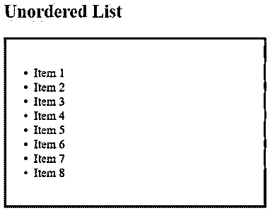
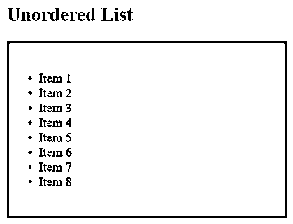
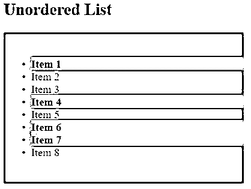
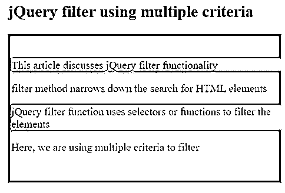

# jQuery 过滤器

> 原文：<https://www.educba.com/jquery-filter/>


## jQuery 过滤器简介

jQuery filter()方法主要用于缩小在 DOM 树中搜索 HTML 元素的范围。该方法从一组基于特定标准匹配的匹配元素中提取并返回元素。jQuery filter()方法将选择器或函数作为其参数，并根据特定条件过滤匹配的元素集。的。not()方法与 filter()相反。的。not()方法匹配并返回与指定条件不匹配的选择。作为参数传递给方法的选择器或函数将针对匹配元素集中的每个元素进行测试，所有匹配的元素都将作为结果返回。这些 DOM 遍历方法允许开发人员随机或顺序地选择文档中的 HTML 元素。

**语法:**

<small>网页开发、编程语言、软件测试&其他</small>

```
$(selector).filter(criteria, function(index))
```

其中，criteria 是一个可选参数，它指定一个选择器表达式或一个 jQuery 对象，或者要从所选元素列表中返回的一个或多个元素。

**Note**: Multiple criteria can be specified using comma.

*   function(index)也是一个可选参数，它指定为选定元素列表中的每个元素运行的函数。
*   如果元素返回 true，则保留该元素，否则移除该元素。
*   index 指定元素在列表中的索引位置。

### jQuery 过滤器示例

下面给出的例子都提到了

#### 示例#1

下面的示例说明了如何使用 jQuery filter()方法，通过向该方法传递一个选择器，根据指定的标准过滤出一组匹配的元素。

**代码:**

```
<!DOCTYPE html>
<head>
<meta charset="utf-8" />
<title>Example for jQuery filter using selectors</title>
<script src="https://code.jquery.com/jquery-1.12.4.min.js"></script>
<script>
$(document).ready(function () {
$("ul li").filter(":even").addClass("highlight");
});
</script>
<style>
#divstyle {
background-color: cadetblue;
width: 350px;
height: 200px;
padding-top: 20px;
}
.highlight {
background: lightslategray;
}
</style>
</head>
<body>
<h2>Unordered List</h2>
<div id="divstyle">
<ul>
<li>Item 1</li>
<li>Item 2</li>
<li>Item 3</li>
<li>Item 4</li>
<li>Item 5</li>
<li>Item 6</li>
<li>Item 7</li>
<li>Item 8</li>
</ul>
</div>
</body>
</html>
```

**输出:**

*   在这个例子中，测试了列表中的每个
*   元素，只有那些索引为偶数的
*   元素被突出显示。




#### 实施例 2

下面的例子是另一个类似的例子，它说明了如何使用 jQuery filter()方法通过一个函数根据指定的标准过滤匹配的元素集。

**代码:**

```
<!DOCTYPE html>
<head>
<meta charset="utf-8" />
<title>Example for jQuery filter using function</title>
<script src="https://code.jquery.com/jquery-1.12.4.min.js"></script>
<script>
$(document).ready(function(){
$("ul li").filter(function(index){
return index % 2 !== 0;
}).addClass("highlight");
});
</script>
<style>
#divstyle {
background-color: cadetblue;
width: 350px;
height: 200px;
padding-top: 20px;
}
.highlight {
background: lightslategray;
}
</style>
</head>
<body>
<h2>Unordered List</h2>
<div id="divstyle">
<ul>
<li>Item 1</li>
<li>Item 2</li>
<li>Item 3</li>
<li>Item 4</li>
<li>Item 5</li>
<li>Item 6</li>
<li>Item 7</li>
<li>Item 8</li>
</ul>
</div>
</body>
</html>
```

**输出**

*   在这个例子中，测试了列表中的每个
*   元素，只有那些索引为奇数的
*   元素被突出显示。




#### 实施例 3

下面的例子是另一个类似的例子，说明了如何通过向 jQuery filter()方法传递一个函数来根据指定的标准过滤元素。

**代码:**

```
<!DOCTYPE html>
<head>
<meta charset="utf-8" />
<title>Example for jQuery filter using function</title>
<script src="https://code.jquery.com/jquery-1.12.4.min.js"></script>
<script>
$(document).ready(function(){
$( "ul li" ).filter(function( index ) {
return $( "strong", this ).length === 1;
}).css( "background-color", "yellow" );
});
</script>
<style>
#divstyle {
background-color: cadetblue;
width: 350px;
height: 200px;
padding-top: 20px;
}
.highlight {
background: lightslategray;
}
</style>
</head>
<body>
<h2>Unordered List</h2>
<div id="divstyle">
<ul>
<li><strong>Item 1</strong></li>
<li>Item 2</li>
<li>Item 3</li>
<li><strong>Item 4</strong></li>
<li>Item 5</li>
<li><strong>Item 6</strong></li>
<li><strong>Item 7</strong></li>
<li>Item 8</li>
</ul>
</div>
</body>
</html>
```

**输出:**

*   在此示例中，方法使用函数来筛选元素。
*   所选列表中的每个
*   元素都根据指定的标准进行测试，只有当函数返回“真”时，才会被包含在过滤后的集合中。
*   这里，测试每个
*   元素是否包含**标签，并且只有那些元素包含在包含**标签的过滤集合中(以黄色突出显示)。****
*   这是指当前的 DOM 元素。




#### 实施例 4

在下面的示例中，jQuery filter()方法使用多个标准从选定的 HTML 元素集中筛选元素。

**代码:**

```
<!DOCTYPE html>
<head>
<meta charset="utf-8" />
<title>Example for jQuery filter using multiple criteria</title>
<script src="https://code.jquery.com/jquery-1.12.4.min.js"></script>
<script>
$(document).ready(function(){
$("p").filter(".pclass,#pid").css("background-color", "yellow");
});
</script>
<style>
#divstyle {
background-color: cadetblue;
width: 400px;
height: 200px;
padding-top: 20px;
padding-left: 5px;
}
.highlight {
background: lightslategray;
}
</style>
</head>
<body>
<h2>jQuery filter using multiple criteria</h2>
<div id="divstyle">
<p id = "pid">This article discusses jQuery filter functionality</p>
<p>filter method narrows down the search for HTML elements</p>
<p class = "pclass">jQuery filter function uses selectors or functions to filter the elements</p>
<p class ="pclass_1">Here, we are using multiple criteria to filter</p>
</div>
</body>
</html>
```

**输出:**

*   在这个示例中，filter 方法使用多个标准来过滤匹配的元素。
*   该方法返回所有具有类“pclass”和 id“PID”的

    元素，这些元素用黄色高亮显示，如下所示。




### 结论

在本文中，我们看到了 jQuery filter 功能，它基本上过滤掉了所有匹配指定标准的元素，并返回经过过滤的元素集。jQuery filter()方法用于使用选择器或作为参数传递给它的函数来执行过滤。jQuery 过滤器功能通过缩小 HTML 元素的搜索范围，有助于简化用户的工作。

### 推荐文章

这是一个 jQuery 过滤器指南。为了更好地理解，我们在这里讨论 jQuery filter 的介绍以及一些例子。您也可以看看以下文章，了解更多信息–

1.  [jQuery 兄弟姐妹](https://www.educba.com/jquery-siblings/)
2.  [jQuery hide()](https://www.educba.com/jquery-hide/)
3.  [jQuery 数据表](https://www.educba.com/jquery-data-table/)
4.  [jQuery remove()](https://www.educba.com/jquery-remove/)


