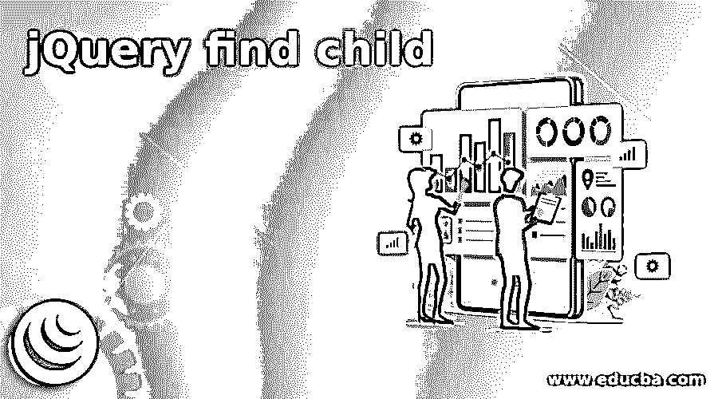
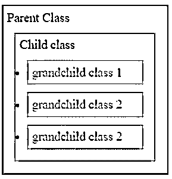
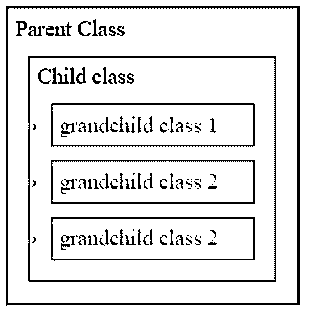
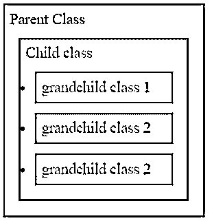

# jQuery 查找子级

> 原文：<https://www.educba.com/jquery-find-child/>




## jQuery find child 简介

jquery find 方法遍历文档对象模型(DOM)树中的整个父到子元素。它是一个后代元素，用于搜索和设计任何父元素的特定子元素。它用于过滤父元素的子元素。它用于通过 jQuery 的选择器设计特定的子元素、对象。它使用 jQuery 中的 selector 元素遍历子对象和孙对象。

**语法:**

<small>网页开发、编程语言、软件测试&其他</small>

基本的 jQuery find()方法语法如下:

```
$(Selector).find(selector/element)
```

基本的 jQuery find child 语法如下:

```
$("parent element").find("child element")
```

网页上基本的 jQuery find 子语法。

```
<head>
<script >
$(document).ready(function() {
$(". parentclass1 ").find(".childclass1"). css({"background-color":  "orange"});
});
</script>
</head>
<body>
<div class ="parentclass1">
<p class="childclass1"> Hello, this is child class number1.
 this is great child class. 
</p>
<b class="childclass2"> hi, this is child class number2\. </b>
</div>
</body>
```

**描述:**

*   选择器使用了放置在 div 标记内的父类(parentclass1)。
*   find 方法使用了第一个子类(childclass1 ),它位于

    标签中。

*   CSS 样式只应用于第一个带有背景色的子类。
*   当 jQuery find child 在 find 中使用第二个子类或 span 标记时，CSS 样式只应用于这个类或标记。

### jQuery 如何查找子工作？

下面给出了 jQuery find child 的工作原理:

**第一步:**在网页中添加 jQuery 有两种方式。

*   jQuery 文件从 jQuery.com 的相应网站下载。
*   该文件放在 html 文件的 head 部分中。

```
<script src = "path/jquery-3.5.1.min.js">
</script>
```

*   jQuery CDN 文件包含在 html 文件的头部分。

```
<script src = "https://ajax.googleapis.com/ajax/libs/jquery/3.5.1/jquery.min.js">
</script>
```

**第二步:**将父元素、子元素和各自的元素放入 body 部分。

*   在网页的 body 部分创建的主类、子元素和孙元素。
*   主类是放置在标签中的父元素。
*   ul 是子元素，li 是父元素的孙元素。

```
<div class="main" >
Parent Class
<ul> Child class
<li> grandchild class 1</li>
<li> grandchild class 2</li>
<li> grandchild class 3</li>
</ul>
</div>
```

**第三步:**jQuery 查找网页中使用的子语法。

*   与父元素和子元素一起放在脚本标记中的 find 方法。

```
<script>
$(document).ready(function(){
$("div").find(" ul").css({"color": "red"});
});
</script>
```

*   以下示例是所有步骤的组合。
*   div 标记选择选择器作为脚本标记中的父元素。
*   ul 标记在 find 方法中用作 find 子元素。

```
<!DOCTYPE html>
<html>
<head>
<script src = "https://ajax.googleapis.com/ajax/libs/jquery/3.5.1/jquery.min.js">
</script>
</head>
<body>
<div class="main">
Parent Class
<ul> Child class
<li> grandchild class 1</li>
<li> grandchild class 2</li>
<li> grandchild class 3</li>
</ul>
</div>
<script>
$(document).ready(function(){
$("div").find("ul").css({"color": "red"});
});
</script>
</body>
</html>
```

### 例子

下面是提到的例子:

#### 示例#1

基本的父元素和子元素示例。

**代码:**

```
<!DOCTYPE html>
<html>
<head>
<style>
.main * {
border: 1px solid grey;
color: black;
padding: 5px;
margin: 10px;
}
.main  {
border: 2px solid grey;
color: black;
padding: 5px;
margin: 10px;
}
</style>
<script src = "https://ajax.googleapis.com/ajax/libs/jquery/3.5.1/jquery.min.js">
</script>
</head>
<body>
<div class = "main" style = "width:200px;">
Parent Class
<ul> Child class
<li> grandchild class 1</li>
<li> grandchild class 2</li>
<li> grandchild class 2</li>
</ul>
</div>
<script>
$(document).ready(function(){
$("div").find("ul").css({"color": "red"});
});
</script>
</body>
</html>
```

**输出:**


**描述:**

*   div 作为父元素放在选择器中。
*   ul 作为子元素放在 find 方法中。
*   元素放在脚本标记中。

#### 实施例 2

基本的父元素和孙元素示例。

**代码:**

```
<!DOCTYPE html>
<html>
<head>
<style>
.main * {
border: 1px solid grey;
color: black;
padding: 5px;
margin: 10px;
}
.main  {
border: 2px solid grey;
color: black;
padding: 5px;
margin: 10px;
}
</style>
<script src = "https://ajax.googleapis.com/ajax/libs/jquery/3.5.1/jquery.min.js">
</script>
</head>
<body>
<div class = "main" style =   "width: 200px;">
Parent Class
<ul> Child class
<li> grandchild class 1</li>
<li> grandchild class 2</li>
<li> grandchild class 2</li>
</ul>
</div>
<script>
$(document).ready(function(){
$("div").find("li").css({"color": "red"});
});
</script>
</body>
</html>
```

**输出:**




**描述:**

*   div 作为父元素放在选择器 lemon 中。
*   li 作为孙元素放在 find 方法中。
*   在选择器中使用父元素后，孙元素变为红色。

#### 实施例 3

基本的子元素和孙元素示例。

**代码:**

```
<!DOCTYPE html>
<html>
<head>
<style>
.main * {
border: 1px solid grey;
color: black;
padding: 5px;
margin: 10px;
}
.main  {
border: 2px solid grey;
color: black;
padding: 5px;
margin: 10px;
}
</style>
<script src = "https://ajax.googleapis.com/ajax/libs/jquery/3.5.1/jquery.min.js">
</script>
</head>
<body>
<div class = "main" style = "width: 200px;">
Parent Class
<ul> Child class
<li> grandchild class 1</li>
<li> grandchild class 2</li>
<li> grandchild class 2</li>
</ul>
</div>
<script>
$(document).ready(function(){
$("ul").find("li").css({"color": "orange"});
});
</script>
</body>
</html>
```

**输出:**




**描述:**

*   ul 作为父元素放在选择器中。
*   将 li 作为 find 子元素放在 find 方法中。
*   使用它，li 含量从黑色变成橙色。

#### 实施例 4

父元素及其所有子元素、孙元素示例。

**代码:**

```
<!DOCTYPE html>
<html>
<head>
<style>
.main * {
border: 1px solid grey;
color: black;
padding: 5px;
margin: 10px;
}
.main  {
border: 2px solid grey;
color: black;
padding: 5px;
margin: 10px;
}
</style>
<script src = "https://ajax.googleapis.com/ajax/libs/jquery/3.5.1/jquery.min.js">
</script>
</head>
<body>
<div class = "main" style = "width: 200px;">
Parent Class
<ul> Child class
<li> grandchild class 1</li>
<li> grandchild class 2</li>
<li> grandchild class 2</li>
</ul>
</div>
<script>
$(document).ready(function(){
$("div").find("*").css({"color": "red", "border":"2px solid green"});
});
</script>
</body>
</html>
```

**输出:**




**描述:**

*   div 作为父元素放在选择器中。
*   符号*放在 find 方法中，用于过滤所有元素。
*   所有子元素、孙元素的颜色从黑色变为红色，边框变为绿色。

### 结论

jQuery find child 是过滤根元素的所有叶元素的方法。它用于方便地搜索后代元素。它使开发人员轻松编码，消除冗长的过程。它帮助用户获得所选元素所需的后代元素。

### 推荐文章

这是一个 jQuery 查找孩子的指南。为了更好地理解，我们在这里用编程例子来讨论 jQuery 如何查找子工作。您也可以看看以下文章，了解更多信息–

1.  [jQuery 可见](https://www.educba.com/jquery-is-visible/)
2.  [jQuery 重定向](https://www.educba.com/jquery-redirect/)
3.  [jQuery UI 按钮](https://www.educba.com/jquery-ui-button/)
4.  [jQuery 父节点](https://www.educba.com/jquery-parent/)


