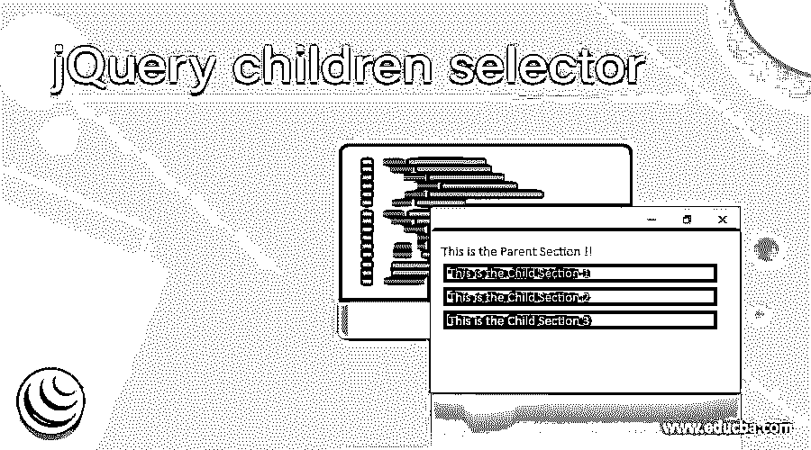

# jQuery 子选择器

> 原文：<https://www.educba.com/jquery-children-selector/>




## jQuery 子选择器的定义

jQuery 是一个紧凑而快速的 JavaScript 库。它有很多新的增强功能。它简化了 HTML 文档的遍历和操作、动画、事件处理和 Ajax。jQuery 有一个易于使用的跨浏览器的 API。jQuery children selector 是另一个常用的特性，用于从特定的父元素中选择子元素，这可以通过使用方法来完成。孩子()。这个选择器允许您遍历子元素并构造一个新的 jQuery 对象。

**语法:**

<small>网页开发、编程语言、软件测试&其他</small>

在 jQuery 中使用单选按钮的语法和下面的语法一样简单，一旦文档准备好就需要应用它。

```
$(selector).children( [ childSelector ] )
```

**参数:**

*   **选择器—**开发人员需要执行选择的父元素。这可以是 HTML 元素类或 id 名称
*   **。children()–**这是 jQuery 方法，允许开发人员在 HTML Dom 树中搜索这些元素的子元素，最后从匹配的子元素中构造一个新的 jQuery 对象
*   **childSelector–**这个 child selector 是一个可选参数，如果应用，它将过滤掉所提到的子元素，如果没有提到，它将过滤掉所提到的父元素中的所有子元素。

### jQuery 中的子选择器是如何工作的？

每当我们想要遍历 HTML DOM 中给定父元素的所有子元素，并对这些选定的 DOM 元素应用特定的样式或执行某些操作时，使用 jQuery Children selector 非常有用。

的。jQuery 中的 children()方法返回所选父元素的所有直接子元素。这是通过单级遍历 DOM 树来完成的。这是需要注意的非常重要的一点。jQuery 的 children()方法只向下遍历一个级别，不选择它的多个内部子元素或孙元素或它们的后代。

如果开发人员想要向下遍历多个级别/子代或后代，那么您可以使用。从 jQuery 库中查找()方法。

如果开发人员想要获得文本节点以及所有子节点，那么您可以使用 jQuery。jQuery 库中的 contents()方法。

如果开发人员想要遍历 DOM 树中的子元素并获取文档根元素，那么您可以使用。父母()和。jQuery 库中的 parent()方法。

### 在 jQuery 中使用子选择器的方法

由于 jQuery 是一个快速的 javascript 库，它提供了两种不同的技术，通过这两种技术，单选按钮可以在仅使用 jQuery 的应用程序中使用。让我们通过一个例子来详细了解每种技术

#### 技巧 1-在内部提到子选择器。jQuery 的子方法

在这项技术中，我们将使用。jQuery 的子函数，我们将在其中传递所需的子元素类或 id 名称。需要注意的是，这个元素应该是$(selector)字段中提到的父元素的子元素。

```
$(selector)
```

首先，我们将从 HTML DOM 树中选择父元素，其子元素的用户将希望执行/应用更改。这些可以是任何样式的 CSS 变化。

```
$(selector).children(
```

接下来，在这个元素中，我们将添加。children 方法，该方法将向下遍历一个级别，并将所有直接的子元素提取到所提到的父元素。

```
$(selector).children(childSelector)
```

接下来，在子函数中，我们将提到类或子元素的 id 名称，我们特别需要应用一些 CSS 样式。这是一个可选字段。

```
$(selector).children(childSelector).css( { // CSS changes for the mentioned child element} )
```

一旦选择了子元素，最后我们调用。css()方法，这将把所有提到的子元素样式化为新定义的样式。

##### 示例#1

**代码:**

```
<!DOCTYPE html>
<html>
<head>
<title>jQuery Child Selector</title>
<script src="//ajax.googleapis.com/ajax/libs/jquery/2.1.1/jquery.min.js"></script>
<script>
$(document).ready(function() {
$(".parent-element").children().css({
"background": "yellow"
});
});
</script>
<style>
.parent-element {
display: block;
border: 2px solid lightgrey;
padding: 15px;
margin: 15px;
}
</style>
</head>
<body>
<div class="parent-element">This is the Parent Section !!
<div class="child-section-1">
This is the Child Section 1
</div>
<br>
<div class="child-section-2">
This is the Child Section 2
</div>
<br>
<div class="child-section-3">
This is the Child Section 3
</div>
</div>
</body>
</html>
```

**输出:**


#### 技巧 2——不提及任何内部元素。jQuery 的子方法

在这项技术中，我们将使用。jQuery 中的子函数，我们不会传递任何带有类名或 id 名的子选择器。该方法将返回从$(selector)字段内的父元素中提取的所有子元素。

```
$(selector)
```

首先，我们将从 HTML DOM 树中选择父元素，其子元素的用户将希望执行/应用更改。这些可以是任何样式的 CSS 变化。

```
$(selector).children(
```

接下来在这个元素上，我们将添加。children 方法，该方法将向下遍历一个级别，并将所有直接子元素提取到所提到的父元素。

```
$(selector).children()
```

接下来，children 函数将返回上述父元素中存在的所有子元素，并允许我们应用一些 CSS 样式。这是一个可选字段。

```
$(selector).children().css( { // CSS changes for the mentioned child element} )
```

一旦选择了所有的子元素，最后我们调用。css()方法，这会将所有子元素的样式设置为新定义的样式。

##### 实施例 2

**代码:**

```
<!DOCTYPE html>
<html>
<head>
<title>jQuery Child Selector</title>
<script src="//ajax.googleapis.com/ajax/libs/jquery/2.1.1/jquery.min.js"></script>
<script>
$(document).ready(function() {
$(".parent-element").children(".child-section-1").css({
"background": "red"
});
$(".parent-element").children(".child-section-2").css({
"background": "blue"
});
$(".parent-element").children(".child-section-3").css({
"background": "green"
});
});
</script>
<style>
.parent-element {
display: block;
border: 2px solid lightgrey;
padding: 15px;
margin: 15px;
}
</style>
</head>
<body>
<div class="parent-element">This is the Parent Section !!
<div class="child-section-1">
This is the Child Section 1
</div>
<br>
<div class="child-section-2">
This is the Child Section 2
</div>
<br>
<div class="child-section-3">
This is the Child Section 3
</div>
</div>
</body>
</html>
```

**输出:**


### 结论

通过使用 jQuery children 选择器，使用 jQuery 在一个或所有子元素上实现任何样式是一种非常容易和简单的方法，上面提到了两种不同类型的方法。不同的技术有不同的重要性，所以要确保在应用程序中使用正确的方法。

### 推荐文章

这是一个 jQuery 子选择器的指南。这里我们讨论 jQuery 中的定义、语法、参数、子选择器是如何工作的？和实现的代码。您也可以看看以下文章，了解更多信息–

1.  [jQuery UI 可选](https://www.educba.com/jquery-ui-selectable/)
2.  [jQuery 承诺](https://www.educba.com/jquery-promise/)
3.  [jQuery off](https://www.educba.com/jquery-off/)
4.  [jQuery 引用](https://www.educba.com/jquery-reference/)


