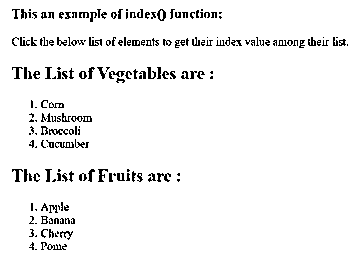
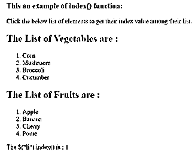
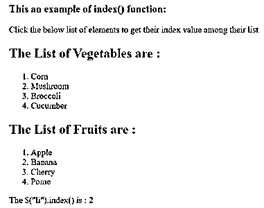
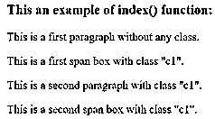
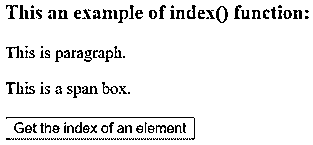

# jQuery 索引

> 原文：<https://www.educba.com/jquery-index/>


## jQuery 索引的定义

jQuery index()函数用于返回特定元素相对于选择器的索引。jQuery index()函数是 jQuery 中的内置函数。jQuery index()函数在匹配的元素中搜索指定的元素，如果找到了该元素，则返回该元素的索引，如果在匹配的元素中没有找到该元素，则返回-1。如果没有参数传递给 index()函数，那么它将返回 jQuery 对象中第一个元素的位置。

**语法:**

<small>网页开发、编程语言、软件测试&其他</small>

```
$(selector). index(element);
```

**参数:**

*   element–这是一个可选参数。它指定要搜索的元素，并返回相对于选择器的索引值。
*   返回值–该函数的返回值是指定元素的索引值。

### jQuery index()函数的工作原理

JQuery index()函数接受一个参数，该参数是要在匹配元素中搜索的元素。假设我们在页面上使用了一个元素，接下来我们需要找到特定元素的索引，比如“div”。所以我们可以使用 index()函数作为“$(“div”)。索引()；"，它将返回一个数字，指示页面中“div”元素的索引。

### 例子

获取特定元素索引值的 jQuery index()函数示例

#### 示例#1

**代码:**

```
<!doctype html>
<html lang="en">
<head>
<meta charset="utf-8">
<script src="https://code.jquery.com/jquery-3.5.0.js"></script>
<title> This is an example for jQuery index( ) function </title>
<script>
$(document).ready(function() {
$("li").click(function() {
$("li").css( {"color": "black"} );
$(this).css( {"color" : "red"} );
$( "#p1" ).text("The $(\"li\").index() is : " + $(this).index());
});
});
</script>
</head>
<body>
<h3> This an example of index() function: </h3>
<div> Click the below list of elements to get their index value among their list. </div>
<h2> The List of Vegetables are : </h2>
<ol>
<li> Corn </li>
<li> Mushroom </li>
<li> Broccoli </li>
<li> Cucumber </li>
</ol>
<h2> The List of Fruits are : </h2>
<ol>
<li> Apple </li>
<li> Banana </li>
<li> Cherry </li>
<li> Pome </li>
</ol>
<p id = "p1"> </p>
</body>
</html>
```

上述代码的输出是–




单击元素列表后，相应的输出是







在上面的代码中，为蔬菜和水果创建了两个订单列表。接下来，使用 index()函数以“$( this)”的形式获取选中或点击的列表元素的索引。索引()；".注意，两个列表是不同的，所以元素给出了相对于它的列表的索引值，正如我们在上面的输出中看到的。

jQuery 数组 indexOf()函数示例，通过传递参数值从选择器中获取元素的索引，以便进行搜索

#### 实施例 2

**代码:**

```
<!doctype html>
<html lang="en">
<head>
<meta charset = "utf-8">
<script src = "https://code.jquery.com/jquery-3.5.0.js"></script>
<title> This is an example for jQuery index( ) function </title>
<script>
$(document).ready(function() {
$("p").click(function() {
$("p").css( {"color" : "black", "border" : "0px solid black"} );
$(this).css( {"color" : "red", "border" : "2px solid black"} );
alert("The $(\"p\").index( \"p\" ) is : " + $(this).index("p")+ "\nThe $(\".c1\").index( \"p\" ) is : " + $(".c1").index("p"));
});
$("span").click(function() {
$("span").css( {"color" : "black", "border" : "0px solid black"} );
$(this).css( {"color" : "red", "border" : "2px solid black"} );
alert("The $(\"span\").index( \"span\" ) is : " + $(this).index("span")+ "\nThe $(\".c1\").index( \"span\" ) is : " + $(".c1").index("span"));
});
});
</script>
</head>
<body>
<h3> This an example of index() function: </h3>
<p> This is a first paragraph without any class. </p>
 This is a first span box with class "c1". 
<p class = "c1" > This is a second paragraph with class "c1". </p>
 This is a second span box with class "c1". 
<br>
</body>
</html>
```

上述代码的输出是–




一旦我们点击第一个 p 元素，输出是


一旦我们单击第一个 span 元素，输出就是


一旦我们点击第二个 p 元素，输出是


一旦我们单击第二个 span 元素，输出是


在上面的代码中，使用了“H3”“p”和“span”元素，“p”和“span”也与类一起使用。接下来，使用 index()函数获取所选或所点击的元素的索引，无论有无类。代码“$(. C1”)。指数("跨度")；"选择类别为“c1”的元素，并在“选定”列表中选择“span”元素索引。我们可以在上面的输出中看到不同组合的结果。

获取多个元素索引的 jQuery 数组 indexOf()函数示例

#### 实施例 3

**代码:**

```
<!doctype html>
<html lang="en">
<head>
<meta charset = "utf-8">
<script src = "https://code.jquery.com/jquery-3.5.0.js"></script>
<title> This is an example for jQuery index( ) function </title>
<script>
$(document).ready(function() {
$("button").click(function() {
alert("$(\"p\").index() : " +$("p").index() + "\n$(\"p, h3\").index() : " +$("p, h3").index() + "\n$(\"h3, p\").index() : " +$("h3, p").index());
});
});
</script>
</head>
<body>
<h3> This an example of index() function: </h3>
<p> This is paragraph. </p>
 This is a span box. 
<br>
<br>
<button> Get the index of an element </button>
</body>
</html>
```

上述代码的输出是–




在上面的代码中，使用了“H3”“p”和“span”元素。接下来，使用 index()函数获取“p”的索引，返回 1，然后在一次调用中获取“p”和“h3”的索引，返回最低索引“h3 ”,并尝试第三次。或者，也返回最低索引“h3”。所以在多个选择器中，它给出了最低的索引，正如我们在上面的输出中看到的。

### 结论

jQuery index()函数是一个内置函数，用于返回特定元素相对于选择器的索引。

### 推荐文章

这是一个 jQuery 索引指南。这里我们分别讨论 JQuery index()函数的描述、语法、参数、工作方式以及代码实现的例子。您也可以看看以下文章，了解更多信息–

1.  [jQuery removeClass()](https://www.educba.com/jquery-removeclass/)
2.  [jQuery 延期](https://www.educba.com/jquery-deferred/)
3.  [jQuery 窗口](https://www.educba.com/jquery-window/)
4.  [jQuery 移动元素](https://www.educba.com/jquery-move-element/)


