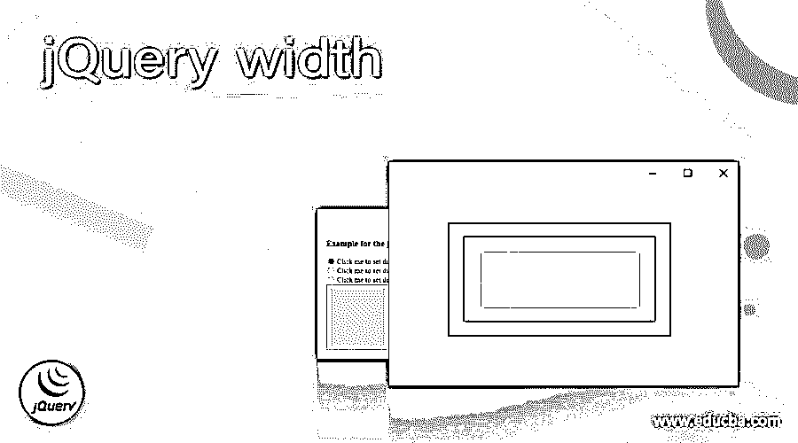
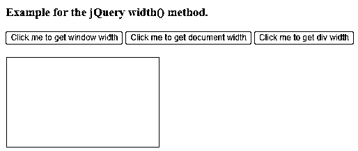
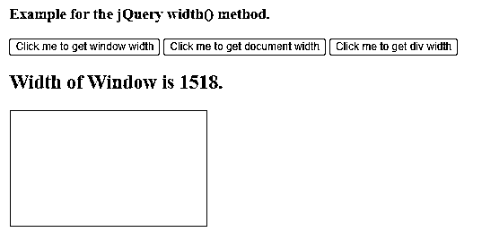
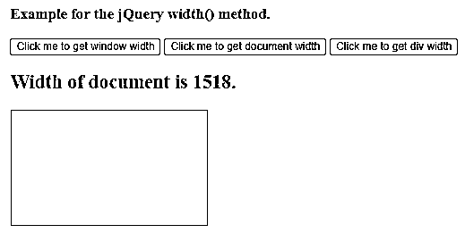
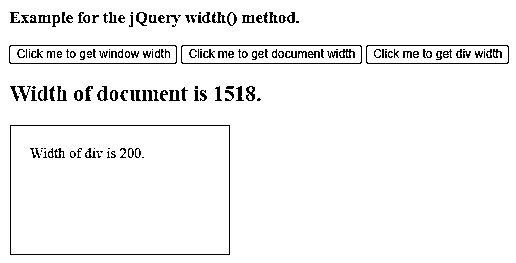
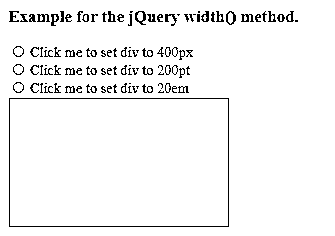
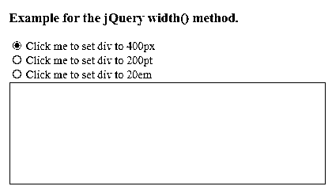
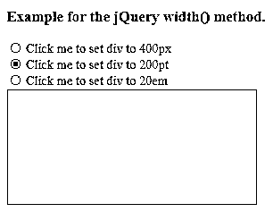
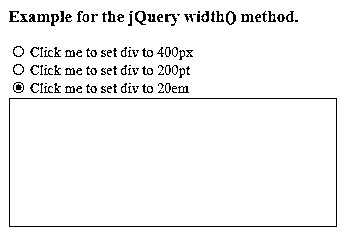

# jQuery 宽度

> 原文：<https://www.educba.com/jquery-width/>




## **jQuery 宽度**的描述

jQuery width()方法用于设置或返回选定 jQuery 元素的宽度。该方法是 jQuery 中的内置方法。在我们的应用程序中，出于设计目的，有时我们需要设置或获取元素的宽度，因此 jQuery 提供了 width()来执行它。如果 width()方法用于获取一个元素的宽度，那么它返回第一个匹配元素的宽度。如果 width()方法用于设置元素的宽度，那么它将设置每个匹配元素的宽度。请注意，它不包括宽度中的填充、边框或边距。

**语法**

<small>网页开发、编程语言、软件测试&其他</small>

返回元素宽度的语法–

```
$(selector).width();
```

*   返回值–该方法的返回值是所选元素的宽度。

设置元素宽度的语法–

```
$(selector).width(value);
```

**参数:**

*   value–这不是一个可选参数，它指定要为所选元素设置的宽度。宽度以 em、px、pt 和 all 为单位，但默认单位是 px。
*   返回值–该方法的返回值是所选元素的宽度。

JQuery width()方法的语法通过使用函数–来设置元素的宽度

```
$(selector).width(function(index, currentwidth);
```

**参数:**

*   **function—**这是一个可选参数，指定返回匹配元素宽度的函数。
*   **index–**该参数指定一个元素在匹配元素集中的索引位置。
*   **current width–**该参数指定所选元素的当前宽度。
*   **返回值-**该方法的返回值是所选元素的宽度。

### JQuery width()方法的工作原理

jQuery width()方法用于设置和获取元素的宽度。因此，当我们在选择器(可以是元素名称、id 或类)上调用 width()方法而没有任何参数或没有传递任何值时，它会返回该特定元素的宽度。如果我们在选择器上调用 width()方法并传递某个值，那么它会根据该值设置特定元素的宽度。

### jQuery width()方法的示例

获取宽度的 jQuery width()方法示例

接下来，我们编写 HTML 代码，通过下面的示例更清楚地理解 jQuery width()方法，其中 width()方法用于获取窗口、文档和 div 元素的宽度，如下所示

#### 示例#1

**代码:**

```
<!doctype html>
<html lang = "en">
<head>
<meta charset="utf-8">
<title> This is an example for jQuery width() method </title>
<script src = "https://ajax.googleapis.com/ajax/libs/jquery/3.3.1/jquery.min.js">
</script>
<style>
#div {
height : 100px;
width : 200px;
padding : 20px;
margin : 1px;
border : 2px solid red;
background-color : lightyellow;
}
</style>
<script type = "text/javascript">
$(document).ready(function () {
$("#id1").click(function() {
var str = "";
str += "Width of Window is " + $(window).width()+ ".";
$("h2").html(str);
});
$("#id2").click(function() {
var str = "";
str += "Width of document is " + $(document).width()+ ".";
$("h2").html(str);
});
$("#id3").click(function() {
var str = "";
str += "Width of div is " + $("#div").width()+ ".";
$("#div").html(str);
});
});
</script>
</head>
<body>
<h3> Example for the jQuery width() method. </h3>
<button id = "id1" > Click me to get window width </button>
<button id = "id2" > Click me to get document width </button>
<button id = "id3" > Click me to get div width </button>
<h2> </h2>
<div id = "div"> </div>
</body>
</html>
```

**输出:**




一旦我们点击“点击我以获得窗口宽度”按钮，输出是




一旦我们点击“点击我以获得文档宽度”按钮，输出是




一旦我们单击“单击我以获得 div 宽度”按钮，输出是




与上面的程序一样，创建了三个按钮，每个按钮调用特定的函数并返回特定的元素宽度。因此，第一个按钮打印窗口宽度，第二个按钮打印文档宽度，第三个按钮打印 div 宽度。

设置宽度的 jQuery width()方法示例

接下来，我们编写 HTML 代码来理解 jQuery width()方法，其中 width()方法用于通过不同的单位设置 div 元素的宽度，如下所示

#### 实施例 2

**代码:**

```
<!doctype html>
<html lang = "en">
<head>
<meta charset="utf-8">
<title> This is an example for jQuery width() method </title>
<script src = "https://ajax.googleapis.com/ajax/libs/jquery/3.3.1/jquery.min.js">
</script>
<style>
#div {
height : 100px;
width : 200px;
padding : 20px;
margin : 1px;
border : 2px solid red;
background-color : lightyellow;
}
</style>
<script type = "text/javascript">
$(document).ready(function () {
$("#px").click(function() {
$("#div").width( "400px" );
});
$("#pt").click(function() {
$("#div").width( "200pt" );
});
$("#em").click(function() {
$("#div").width( "20em" );
});
});
</script>
</head>
<body>
<h3> Example for the jQuery width() method. </h3>
<label><input type="radio" name="gender" id="px"> Click me to set div to 400px</label>
<br>
<label><input type="radio" name="gender" id="pt"> Click me to set div to 200pt</label>
<br>
<label><input type="radio" name="gender" id="em"> Click me to set div to 20em</label>
<br>
<div id = "div"> </div>
</body>
</html>
```

**输出:**




一旦我们选择了“单击我将 div 设置为 400px”单选按钮，输出是




一旦我们选择了“单击我将 div 设置为 200 磅”单选按钮，输出是




一旦我们选择了“单击我将 div 设置为 20em”单选按钮，输出将是–




与上面的程序一样，创建了三个单选按钮，每个按钮调用特定的函数，并用不同的单位设置不同的宽度。因此，第一个单选按钮将 div 宽度设置为 400 磅，第二个单选按钮将 div 宽度设置为 200 磅，第三个单选按钮将 div 宽度设置为 20em。

### 结论

jQuery width()方法是 jQuery 中的内置方法，用于设置和返回元素的宽度，不包括填充、边框或边距。

### 推荐文章

这是 jQuery 宽度的指南。在这里，我们还将讨论 jQuery width()方法的描述和工作方式，以及不同的示例和代码实现。您也可以看看以下文章，了解更多信息–

1.  [jQuery UI 可选](https://www.educba.com/jquery-ui-selectable/)
2.  [jQuery 承诺](https://www.educba.com/jquery-promise/)
3.  [jQuery zindex](https://www.educba.com/jquery-zindex/)
4.  [jQuery off](https://www.educba.com/jquery-off/)


