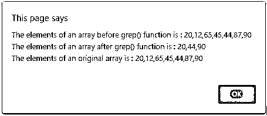

# jQuery grep

> 原文：<https://www.educba.com/jquery-grep/>


## 对 **jQuery grep** 的描述

jQuery grep()函数用于查找满足过滤函数的数组元素。jQuery grep()函数是 jQuery 中的内置函数。jQuery grep()函数从数组中删除没有通过过滤函数或条件测试的项，只保留通过了过滤函数的项。filter 函数返回一个数组元素和该元素的索引，该元素在数组中作为参数传递。

**语法:**

<small>网页开发、编程语言、软件测试&其他</small>

```
jQuery.grep(array, function(element, index) [, invert ]);
```

**参数:**

*   **array–**这不是可选参数。它指定要过滤其元素的数组。
*   **function(element，index)–**这不是可选参数。它指定在数组元素上作为过滤函数执行的函数，它处理数组的每个元素。该函数采用两个参数作为元素和索引。元素存储数组的元素，索引存储相应元素的索引。函数的返回值为 true(如果通过)或 false(如果失败)。
*   **invert–**这是一个可选参数，指定是返回传递的元素还是失败的元素。它接受布尔值真或假。false 值指定 grep()函数为筛选函数返回的 true 返回一个数组元素，true 值指定 grep()函数为筛选函数返回的 false 返回一个数组元素。

### jQuery grep()函数的工作原理

JQuery grep()函数接受三个参数作为第一个参数数组、第二个参数过滤函数和第三个可选参数 invert。假设我们有一个学生分数列表为“marks = [ 50，78，40，89 ]”，现在我们需要过滤掉及格分数(分数> = 50)。所以我们可以用 grep()函数作为“$。grep(array，function(element，index){ return(element > = 50)；});"，它返回 50，78，89 个元素作为输出。

### jQuery grep()函数的示例

jQuery grep()函数从给定数组中过滤出元音字母的例子

#### 示例#1

**代码:**

```
<!doctype html>
<html lang="en">
<head>
<meta charset="utf-8">
<script src="https://code.jquery.com/jquery-3.5.0.js"></script>
<title> This is an example for jQuery grep() function </title>
<script>
function fun()
{
var array = [ 'a', 'c', 't', 'e', 'p', 'o' ];
$("#d1").html("The elements of an array before grep() function is : " + array);
res = $.grep(array, function(element, index) {
return ( element == 'a' || element == 'e' || element == 'i' || element == 'o' || element == 'u' );
}, false);
$( "#d2").html("The elements of an array after grep() function is : " + res);
$( "#d3").html("The elements of an original array is : " + array);
}
</script>
</head>
<body>
<h3> The Example for grep() function : </h3>
<button onclick = "fun()" id = "test" > Apply grep() function </button>
<br>
<div id = "d1"> </div>
<div id = "d2"> </div>
<div id = "d3"> </div>
</body>
</html>
```

上述代码的输出是–


一旦我们点击按钮，输出是


在上面的代码中，创建了包含字符的数组。接下来，grep()函数用于过滤数组中的字符，只返回那些元音字母的元素，并在我们单击按钮时显示出来。

jQuery grep()函数示例，用于从给定数组中过滤出偶数索引处的偶数

#### 实施例 2

**代码:**

```
<!doctype html>
<html lang="en">
<head>
<meta charset="utf-8">
<script src="https://code.jquery.com/jquery-3.5.0.js"></script>
<title> This is an example for jQuery grep() function </title>
<script>
function fun()
{
var array = [ 20, 12, 65, 45, 44, 87, 90 ];
res = $.grep(array, function(element, index) {
return ( element%2 == 0 && index%2 == 0 );
});
alert("The elements of an array before grep() function is : " + array + "\nThe elements of an array after grep() function is : " + res + "\nThe elements of an original array is : " + array);
}
</script>
</head>
<body>
<h3> The Example for grep() function : </h3>
<button onclick = "fun()" id = "test" > Apply grep() function </button>
</body>
</html>
```

上述代码的输出是–


一旦我们点击第一个按钮，输出是




在上面的代码中，创建了包含一些数字的数组。接下来，grep()函数用于从数组中过滤出偶数索引处出现的偶数，并在我们单击按钮时显示出来，正如我们在输出中看到的那样。

用 invert true 从给定数组中过滤出负数的 jQuery grep()函数示例

#### 实施例 3

**代码:**

```
<!doctype html>
<html lang="en">
<head>
<meta charset="utf-8">
<script src="https://code.jquery.com/jquery-3.5.0.js"></script>
<title> This is an example for jQuery grep() function </title>
<style>
p {
color: blue;
}
div {
color: green;
}
</style>
</head>
<body>
<h3> The Example for grep() function : </h3>
<p id = "p1"> </p>
<div id = "p2"> </div>
<script>
var array = [ 20, -12, -65, 45, -44, 87, -90 ];
res = $.grep(array, function(element, index) {
return ( element > 0 );
}, true );
$( "#p1" ).text("The elements of an array before grep() function is : " + array);
$( "#p2" ).text("The elements of an array after grep() function is : " + res);
</script>
</body>
</html>
```

上述代码的输出是


在上面的代码中，创建了包含正数和负数的数组。接下来，grep()函数用于从数组中过滤出正数，但是对于 invert，传递的值是 true，所以它过滤出负数，正如我们在输出中看到的。

### 结论

jQuery grep()函数是一个内置函数，用于查找数组中满足过滤函数的元素。

### 推荐文章

这是一个 jQuery grep 的指南。这里我们分别讨论 jQuery grep()函数示例的描述、工作原理和代码实现。您也可以看看以下文章，了解更多信息–

1.  [jQuery 承诺](https://www.educba.com/jquery-promise/)
2.  [jQuery JSON 编码](https://www.educba.com/jquery-json-encode/)
3.  [jQuery 宽度](https://www.educba.com/jquery-width/)
4.  [jQuery 引用](https://www.educba.com/jquery-reference/)


