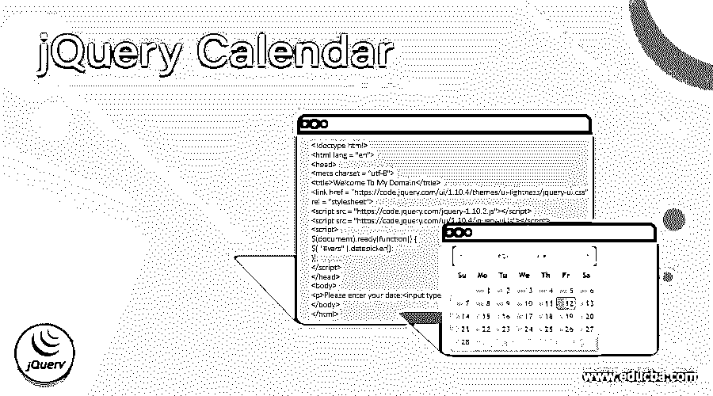
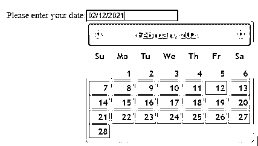
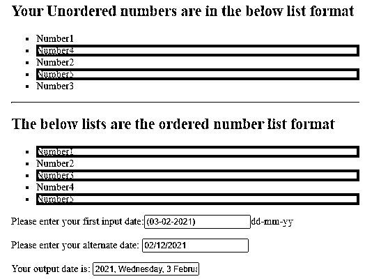
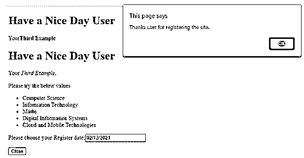

# jQuery 日历

> 原文：<https://www.educba.com/jquery-calendar/>




## jQuery 日历简介

jQuery calendar 是 widget 类型的模块之一，它主要用于启用日历，用户可以选择任何格式的数据，这些数据可以用于在应用程序或浏览器屏幕上显示视图，每月日历 widget 格式。我们还可以使用多种语言，如英语、中文等。其他功能包括更改星期、日期、每月的开始和结束日期，因此这些日历插件提供了其他日历的实现，这些日历基于用户输入通过全球范围与其他地区相关。

**语法:**

<small>网页开发、编程语言、软件测试&其他</small>

在 web 中，应用程序 jQuery 是 UI 之一，calendar 是一个小部件，可用于使用户能够选择月、日和年格式的日期。jqxCalendar 是 jQuery 小部件中的一个，它包含一些 CSS 文件对，包含边距、填充、位置和边框。

```
<html>
<head>
<script type="text/javascript" src="../../scripts/jquery-1.11.1.min.js"></script>
<script type="text/javascript" src="../../jqwidgets/jqxcalendar.js">
</script>
</head>
<body>
<script type="text/javascript">
$(document).ready(function(){
$("#demo").jqxCalendar({''});
$("#vars").datepicker();});</script>-----some UI based codes depends on the user requirements---
</body></html>
```

以上代码是在 javascript with HTML UI web 页面上使用 jQuery 日历的基本语法。这个模块将被用来改变日历输入，如月、日和年的格式。

### jQuery 中的日历插件是如何工作的？

使用 jQWidgets，我们可以像 CSS 文件一样配置 pair 文件集，它包含边距、宽度、填充、边框和位置。但基本上，这两个 CSS 文件是沿着名为 jqx.base.css 和 jqx 的 jQWidget 配对的。基本样式表将创建与每个基于 css 文件及其属性的小部件相关的样式。它还支持小工具的颜色，背景和区域的用户输入转换的基础上的要求。jqxCalendar 小部件包含一些类的列表，如 jqx 小部件、jqx 日历、jqx 日历行单元格、jqx 日历行单元格、jqx 日历列单元格、jqx 日历视图等等。这些是 jqxCalendar 小部件下的一些默认类，每个类都包含元素自己的属性和行为。日历包含行和列格式的单元格。它支持在表格类别下为每个单元格匹配用户输入，并以特定的格式放置。日历也是可以支持本地化的组件之一，因此所有语言，如中文、意大利语、英语(美国和英国)等。因此，每当我们希望在应用程序中使用日历小部件时，就会根据本地化输入值设置日历。

#### 示例#1

**代码:**

```
<!doctype html>
<html lang = "en">
<head>
<meta charset = "utf-8">
<title>Welcome To My Domain</title>
<link href = "https://code.jquery.com/ui/1.10.4/themes/ui-lightness/jquery-ui.css"
rel = "stylesheet">
<script src = "https://code.jquery.com/jquery-1.10.2.js"></script>
<script src = "https://code.jquery.com/ui/1.10.4/jquery-ui.js"></script>
<script>
$(document).ready(function() {
$( "#vars" ).datepicker();
});
</script>
</head>
<body>
<p>Please enter your date:<input type = "text" id = "vars"></p>
</body>
</html>
```

**输出:**




在上面的例子中，我们使用 datepicker()方法在网页上打印输入的日期。通过使用 jQuery version.js 文件，它将被导入到

#### 实施例 2

**代码:**

```
<!DOCTYPE html>
<html lang="en">
<head>
<meta charset="utf-8">
<title>Welcome To My Domain its a Second Example </title>
<style>
.first{
background: green;
}
</style>
<script src="https://code.jquery.com/jquery-3.5.1.min.js"></script>
<script src = "https://code.jquery.com/jquery-1.10.2.js"></script>
<script src = "https://code.jquery.com/ui/1.10.4/jquery-ui.js"></script>
<script>
$(document).ready(function(){
$("ul li").filter(":odd").addClass("first");
});
$(function() {
$( "#example" ).datepicker({
dateFormat:"(dd-mm-yy)",
appendText:"dd-mm-yy",
altFormat: "yy, DD, d MM",
altField: "#example2"
});
});
$(function() {
$( "#example1" ).datepicker({
vars4 : function (dt) {
var vars5 = dt.getDay ();
if (vars5 == 1 || vars5 == 7) return [false];
else return [true];
}
});
});
</script>
</head>
<body>
<h2>Your Unordered numbers are in the below list format</h2>
<ul>
<li>Number1</li>
<li>Number4</li>
<li>Number2</li>
<li>Number5</li>
<li>Number3</li>
</ul>
<hr>
<h2>The below lists are the ordered number list format</h2>
<ul>
<li>Number1</li>
<li>Number2</li>
<li>Number3</li>
<li>Number4</li>
<li>Number5</li>
</ul>
<p>Please enter your first input date:<input type = "text" id = "example"></p>
<p>Please enter your alternate date: <input type = "text" id = "example1"></p>
<p>Your output date is: <input type = "text" id = "example2"></p>
</body>
</html>
```

**输出:**




在第二个例子中，我们分离了 HTML 元素中有序和无序的数字列表。我们还可以在第一个文本框中输入第一个日期，然后在第三个文本框中将两个日期分开后，在第二个文本框中输入另一个日期。最终日期会被查询并显示在屏幕上。

#### 实施例 3

**代码:**

```
<!DOCTYPE html>
<html lang="en">
<head>
<meta charset="utf-8">
<title>Its a Third Example</title>
<script src="https://code.jquery.com/jquery-3.5.1.min.js"></script>
<script src = "https://code.jquery.com/jquery-1.10.2.js"></script>
<script src = "https://code.jquery.com/ui/1.10.4/jquery-ui.js"></script>
<style>
first{
background:green;
font-size: 18px;
padding:23px;
border:solid;
}
</style>
<script>
$(document).ready(function(){
$("#last").datepicker();
});
$(document).ready(function(){
$("button").click(function(){
$("first").slideToggle("slow");
alert("Thanks user for registering the site.");
});
});
</script>
</head>
<body>
<div id="vars2">
<h1>Have a Nice Day User</h1>
<p>Your<b>Third</b> Example</p>
</div>
<div class="vars2">
<h1>Have a Nice Day User</h1>
<p>Your <em>Third Example</em>.</p>
<p>Please try the below values</p>
<ul>
<li>Computer Science</li>
<li>Information Technology</li>
<li>Maths</li>
<li>Digital Information Systems</li>
<li>Cloud and Mobile Technologies</li>
</ul>
</div>
<p>Please choose your Register date:<input type="text" id="last"></p>
<button type="button">Close</button>
</body>
</html>
```

**输出:**




在最后一个例子中，我们在简单的应用程序中使用了日历。这里我们使用了一些 HTML 元素来创建所需的字段区域，如文本框、标签、输入元素等。此外，CSS 文件在部分的

### 结论

在 jQuery 中，我们有一组不同的模块，用于在 UI 端实现应用程序的 javascript 库。主要是 jQuery 对用户友好，在网页上更有吸引力。日历是利用类似周期的日期及其格式的模块和功能之一。

### 推荐文章

这是一个 jQuery 日历指南。这里我们讨论一下描述，日历插件在 jQuery 中是如何工作的？和代码实现的例子。您也可以看看以下文章，了解更多信息–

1.  [jQuery 承诺](https://www.educba.com/jquery-promise/)
2.  [jQuery JSON 编码](https://www.educba.com/jquery-json-encode/)
3.  [jQuery zindex](https://www.educba.com/jquery-zindex/)
4.  [jQuery 当](https://www.educba.com/jquery-when/)


