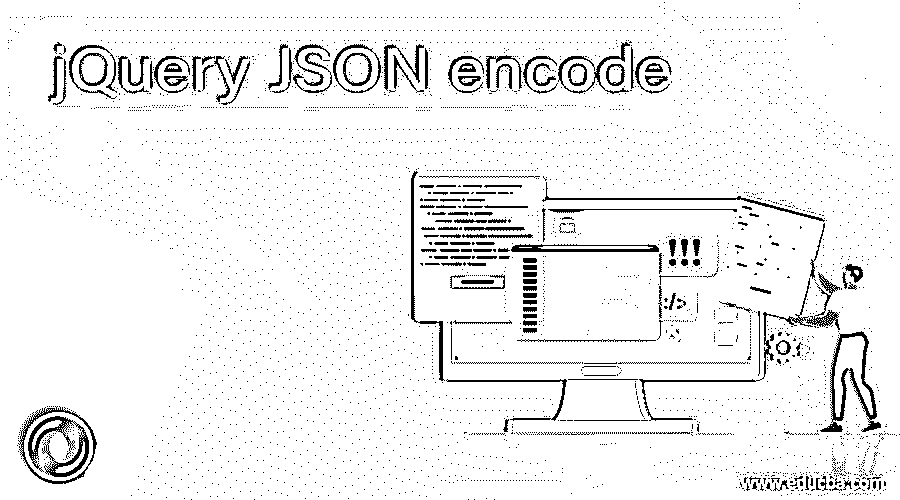
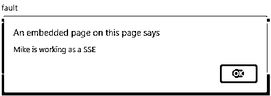
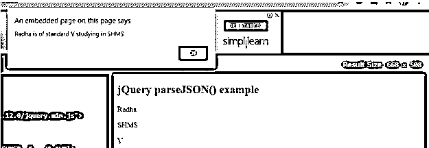
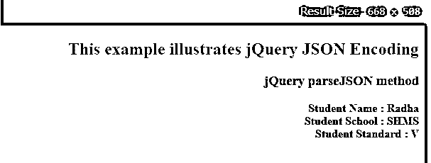

# jQuery JSON 编码

> 原文：<https://www.educba.com/jquery-json-encode/>




## jQuery JSON 编码简介

jQuery JSON Encode 用于解析 JSON 字符串并返回 JavaScript 值或输入字符串指定的对象。使用 jQuery 解析或编码字符串需要在 JavaScript 上编写一个 jQuery 库。jQuery 提供了一个名为‘parse JSON’的方法，这是一个通用的实用方法，简称$版。parseJSON()是用来返回 JavaScript 对象的方法。由于 JSON 仅限于文本和数字，它不支持二进制数据。JSON 是 JavaScript 对象符号，它是一组以“{”开始，以“}”结束的键值对。

**语法:**

<small>网页开发、编程语言、软件测试&其他</small>

```
jQuery.parseJSON( json )
```

*   参数:parseJSON (JSON)接受单参数 JSON，要解析的格式良好的 JSON 字符串。
*   返回值:该方法将返回 JavaScript 字符串或对象、数字、数组或布尔值。

上述语法的简写版本:$。帕西逊

简写版本在 jQuery 3 之前有效。由于 jQuery 3 已经取消了将 JSON 字符串解析为 JavaScript 对象的简写方法，现在 jQuery 3 中使用 JSON.parse()方法。

**Note:** The above-mentioned method only works for jQuery version less than 3.

*   向 jQuery.parseJSON()发送格式错误的 JSON 输入字符串将导致浏览器引发异常。
*   向 jQuery.parseJSON()发送空值或未定义的值或空字符串，方法将返回空值。
*   如果浏览器提供了 JSON.parse()的本机实现，这里 jQuery 使用它来编码字符串。
*   一些无效字符串，

1.  “{hello: 45}”:字符串“hello”应该有双引号。
2.  " {'hello':89} ":字符串' hello '应该用双引号括起来，而不是单引号。
3.  “' hello '”:字符串' hello '不应使用单引号。
4.  " . 94 ":数值必须以数字开头，但不能以任何特殊字符开头。“94”将是一个有效数字。
5.  “NaN”:这不能在 JSON 字符串中表示，无穷大的表示也不允许有效。
6.  “undefined”:JSON 不能接受 undefined 作为字符串，而是接受 null 作为字符串。

由于 JSON 标准不允许使用“控制字符”或“特殊字符”,如换行符或制表符，因此 JavaScript 的解析器会将字符串的换行符或制表符逐字转换成换行符或制表符。

在 jQuery 1.9 版本之前，$。当传递空字符串时，parseJSON 返回 NULL 值，而不是抛出错误，即使这些值不是有效的 JSON 字符串。

### 例子

让我们通过几个例子来了解 Json Encidng 是如何与 jQuery 一起工作的

**举例:**

```
var sample_obj = jQuery.parseJSON( '{ "empName": "Mike", "age": "24" }' );
alert(sample_obj.name === "Mike" );
alert(sample_obj.age === "25");
```

#### 示例 1: jQuery JSON 编码示例

**代码:**

```
<!DOCTYPE html>
<html>
<head>
<meta charset="utf-8">
<title>JQuery parseJSON()</title>
<script src="https://code.jquery.com/jquery-3.4.1.js"></script>
</head>
<body style="text-align:center;">
<script>
var sample_obj = jQuery.parseJSON( '{ "empName":"Mike", "age":25, "empdesg":"SSE"}' );
alert( sample_obj.empName + " is working as a " + sample_obj.empdesg );
</script>
</body>
</html>
```

**输出:**




在上面的例子中，这是主要的一行代码，它是使用 jQuery.parseJSON()方法所需要的 jQuery 库。

#### 示例 2: jQuery JSON 编码(简写版)

**代码:**

```
<!DOCTYPE html>
<html>
<head>
<script
src="https://ajax.googleapis.com/ajax/libs/jquery/1.12.0/jquery.min.js"></script>
<script>
$(document).ready(function() {
var sample_json = '{"stuName":"Radha","schName":"SHMS", "stnd":"V"}';
var stuDetails = $.parseJSON(sample_json);
document.getElementById("stuName").innerHTML = stuDetails.stuName;
document.getElementById("schName").innerHTML = stuDetails.schName;
document.getElementById("stnd").innerHTML = stuDetails.stnd;
alert(stuDetails.stuName + " is of standard " + stuDetails.stnd + " studying in " + stuDetails.schName);
});
</script>
</head>
<body>
<h2>jQuery parseJSON() example</h2>
<p id="stuName"></p>
<p id="schName"></p>
<p id="stnd"></p>
</body>
</html>
```

**输出:**




在上面的例子中，我们使用 jQuery 的简写版本，因此我们使用

```
script src="https://ajax.googleapis.com/ajax/libs/jquery/1.12.0/jquery.min.js"></script&gt; as the jQuery library.
```

#### 示例 3:使用 jQuery.parseJSON()方法显示编码的 JSON 对象。

**代码:**

```
<!DOCTYPE html>
<html>
<head>
<meta charset="utf-8">
<title>JQuery parseJSON() method</title>
<script src="https://code.jquery.com/jquery-3.4.1.js"></script>
<style>
#text {
color: green;
}
</style>
</head>
<body style="text-align:right;">
<h2 style="color: Red">
This example illustrates jQuery JSON Encoding
</h2>
<h3>jQuery parseJSON method</h3>
<b id="text"></b>
<script>
var sample_txt = '{"stuName":"Radha","schName":"SHMS", "stnd":"V"}';
var sample_obj = jQuery.parseJSON(sample_txt);
document.getElementById("text").innerHTML =
"Student Name : "+sample_obj.stuName + "<br> Student School : " + sample_obj.schName + "<br> Student Standard : " + sample_obj.stnd;
</script>
</body>
</html>
```

**输出:**




#### 实施例 4

**代码:**

```
<!DOCTYPE html>
<html>
<head>
<meta charset="utf-8">
<title>JQuery JSON Encoding</title>
<script src="https://code.jquery.com/jquery-3.4.1.js"></script>
</head>
<body style="text-align:left;">
<h3 style="color: red">
We shall alert if encoded JSON matches with the value we are searching for
</h3>
<button onclick="equal()">Click</button>
<script>
function equal(){
var sample_txt = '{ "empName":"Mike", "age":25, "empdesg":"SSE"}'
var sample_obj = jQuery.parseJSON(sample_txt);
alert( sample_obj.empName === "Mike" );
}
</script>
</body>
</html>
```

**输出:**


点击按钮时，会弹出一个警告，根据用户正在搜索的值来判断是真还是假。

#### 实施例 5

**代码:**

```
<!DOCTYPE html>
<html>
<head>
<script
src="https://ajax.googleapis.com/ajax/libs/jquery/1.12.0/jquery.min.js"></script>
<style>
body {
font-family: Times New Roman;
font-size: 14pt;
padding : 14px;
}
</style>
<script>
$(document).ready(function () {
var jsonNames = '[{"name":"Abc"},{"name":"Xyz"}]';
var sampleName = 'Both the names are: ';
var sampleobj = $.parseJSON(jsonNames);
$.each(sampleobj, function () {
sampleName += this['name'] + "<br/>";
});
$('span').html(sampleName);
});
</script>
</head>
<body>
<h2>jQuery parseJSON() example</h2>

</body>
</html>
```

**输出:**


在内部，jQuery.parseJSON()使用 JavaScript 的 JSON.parse()方法，因为 jQuery 的库位于 JavaScript 之上。

JSON.parse()方法不被 IE 7、Safari 3 等老浏览器支持。，但正如现在大多数浏览器已经发展。因此，在 jQuery 2.0 版本发布后，jQuery.parseJSON()的实现被更改为 JSON.parse。

至此，我们对主题“jQuery JSON 编码”得出了一个结论。我们已经看到了什么是 jQuery JSON 编码，以及它是如何根据版本、简写版本和现在使用的 JSON.parse()方法工作的。还看到了如何编写 JSON 输入字符串及其返回值的语法。上面列出了几个例子，涵盖了与 jQuery 的 JSON 编码相关的所有概念。请注意，jQuery 内部使用 JSON.parse()方法。为了让 jQuery 工作，我们需要一个外部库来实现 jQuery。JSONparse()方法。

### 推荐文章

这是 jQuery JSON 编码指南。在这里我们还讨论了介绍，语法，参数和不同的例子及其代码实现。您也可以看看以下文章，了解更多信息–

1.  [jQuery 宽度](https://www.educba.com/jquery-width/)
2.  [jQuery 承诺](https://www.educba.com/jquery-promise/)
3.  [jQuery 查找子节点](https://www.educba.com/jquery-find-child/)
4.  [JQuery attr()](https://www.educba.com/jquery-attr/)


