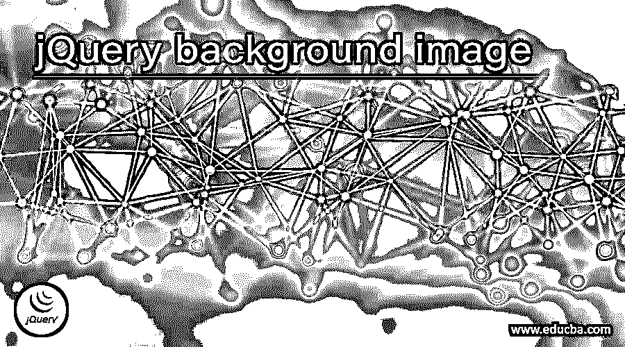
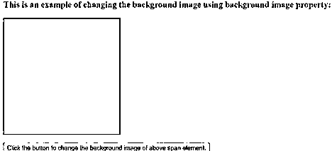
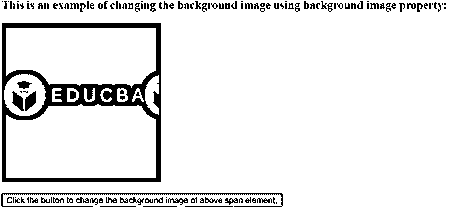
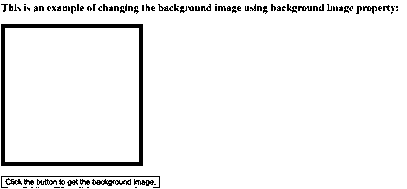
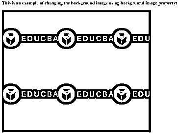

# jQuery 背景图像

> 原文：<https://www.educba.com/jquery-background-image/>




## jQuery 背景图片介绍

jQuery 背景图像属性用于设置或返回元素的背景图像。jQuery 背景图像属性是 jQuery 中 HTML 元素的内置属性。可以使用 css()函数和 url()函数来设置或获取 jQuery 背景图像属性值。背景图像属性也可用于背景颜色。

**语法—**

<small>网页开发、编程语言、软件测试&其他</small>

返回元素背景图像的语法–

```
$("selector").css("background-image");
```

设置元素背景图像的语法–

```
$( "selector" ).css( {"background-image" : "url( image )"} );
```

**其中—**

**CSS()**–CSS()函数用于设置或获取所选元素的一个或多个属性。

**URL()**–URL()函数用于指定背景图像的位置。

**返回值-**

该属性的返回值是指定背景图像的字符串。

### 处理 JQuery 背景图像属性

background image 属性设置或返回任何元素的背景图像。假设我们必须在 HTML 页面上设置一个公司的徽标图像作为背景图像。所以我们可以使用背景图像属性作为“$(“body”)。CSS({ " background-image ":" URL(logo . jpg)" })；"，其中 css()函数设置或返回背景图像属性，而 url()函数给出图像的位置，因此，徽标将被设置为背景图像。

### jQuery 背景图像属性的示例

下面举几个例子

#### 示例#1

为 div 元素设置背景图像的 jQuery 背景图像属性示例

**代码:**

```
<!doctype html>
<html lang="en">
<head>
<meta charset = "utf-8">
<script src = "https://code.jquery.com/jquery-3.5.0.js"> </script>
<title> This is an example for jQuery background image property </title>
<style>
#p1 {
border : 2px solid black;
background-color : yellow;
height : 250px;
width : 250px;
}
</style>
</head>
<script>
$( document ).ready( function() {
$( "button" ).click( function() {
$( "#p1" ).css( {"background-image" : "url(educba.jpg)"} );
});
});
</script>
<body>
<h3> This is an example of changing the background image using background image property: </h3>
<div id = "p1"> </div>
<br>
<button> Click the button to change the background image of above span element. </button>
</body>
</html>
```

上述代码的输出是–




一旦我们点击按钮，输出是




在上面的代码中，div 元素与一些应用了黄色的样式属性一起使用。接下来，使用 background image 属性将 div 元素的背景图像设置为“$(“# P1”)。CSS({ " background-image ":" URL(educba . jpg)" })；"，通过使用其 id。结果，div 元素的背景图像随着图像而改变，正如我们在上面的输出中看到的。

#### 实施例 2

获取 body 元素背景图像的背景图像属性示例–

**代码:**

```
<!doctype html>
<html lang="en">
<head>
<meta charset = "utf-8">
<script src = "https://code.jquery.com/jquery-3.5.0.js"> </script>
<title> This is an example for jQuery background image property </title>
<style>
#p1 {
background-image : url("educba.jpg");
height : 600px;
width : 600px;
}
</style>
</head>
<script>
$( document ).ready( function() {
$( "button" ).click( function() {
alert($("#p1").css( "background-image" ));
});
});
</script>
<body id = "p1" >
<h3 style = "color : white" > This is an example of changing the background image using background image property: </h3>
<br>
<button> Click the button to get the background image. </button>
</body>
</html>
```

上述代码的输出是–


一旦我们点击按钮，输出是


在上面的代码中，背景图像应用于 body 元素。接下来，使用 background image 属性获取 body 元素的背景图像“alert($(“# P1”)。CSS(" background-image ")；"，通过使用主体元素 id。背景图像属性的返回值是一个字符串，它是文件的位置，正如我们在上面的输出中看到的。

#### 实施例 3

直接修改 backgroundImage CSS 属性的背景图像属性示例–

**代码:**

```
<!doctype html>
<html lang="en">
<head>
<meta charset = "utf-8">
<script src = "https://code.jquery.com/jquery-3.5.0.js"> </script>
<title> This is an example for jQuery background image property </title>
<style>
#p1 {
border : 2px solid black;
background-color : blue;
height : 250px;
width : 250px;
}
</style>
</head>
<script>
$( document ).ready( function() {
$( "button" ).click( function() {
document.getElementById( "p1" ).style.backgroundImage = "url( 'educba.jpg' )";
document.getElementById( "p1" ).style.width = "600px";
document.getElementById( "p1" ).style.height = "500px";
});
});
</script>
<body>
<h3 > This is an example of changing the background image using background image property: </h3>
<div id = "p1" > </div>
<br>
<button style = "color : blue" > Click the button to change the background image of div element. </button>
</body>
</html>
```

上述代码的输出是–




一旦我们点击按钮，输出是




在上面的代码中，div 元素使用了一些样式属性，如应用了蓝色。接下来直接使用背景图像属性将背景图像设置为 div 元素的 CSS 属性，代码为“document . getelementbyid(" P1 "). style . background image = " URL(' educba . jpg ')”；，通过使用 div id。结果，div 元素的背景图像发生了变化，正如我们在上面的输出中所看到的。

### 结论

背景图像属性是一个预定义的属性，用于设置或获取元素的背景图像。

### 推荐文章

这是一个 jQuery 背景图片指南。这里我们讨论 JQuery 背景图像属性的工作，以及示例和输出。您也可以看看以下文章，了解更多信息–

1.  [jQuery 窗口](https://www.educba.com/jquery-window/)
2.  [jQuery 向下滚动](https://www.educba.com/jquery-scroll-down/)
3.  [jQuery map()](https://www.educba.com/jquery-map/)
4.  [jQuery :not()选择器](https://www.educba.com/jquery-not-selector/)


