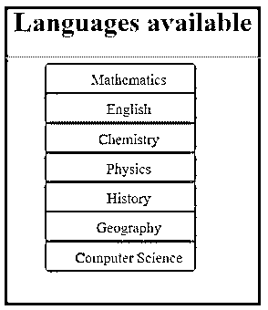
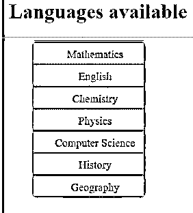
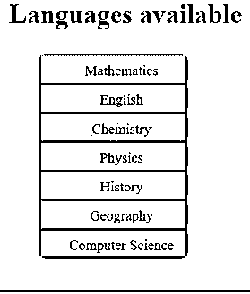
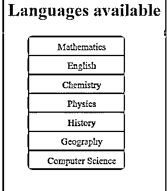
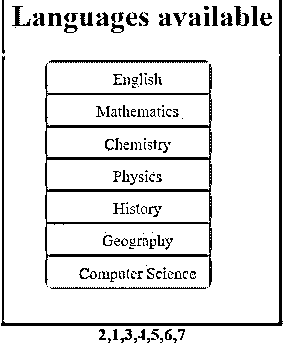
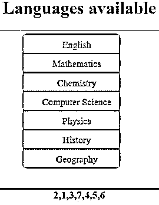

# jQuery 可排序

> 原文：<https://www.educba.com/jquery-sortable/>


## jQuery Sortable 简介

下面的文章提供了关于 jQuery Sortable 的概述。jQueryUI sortable()方法是 jQueryUI 提供的一种交互方法，用于使用鼠标水平或垂直地重新排列列表或网格中的元素。sortable 插件是 jQueryUI 提供的一个灵活的排序插件，用于将元素重新排列成一个合适的、有意义的顺序，以使分析和处理更加有效。此方法的排序操作基于作为第一个参数传递给它的操作字符串。这个插件还允许通过拖放元素来排序，以便在列表中放置新元素，并使其他元素适应。

我们可以以两种形式使用 sortable()方法:

<small>网页开发、编程语言、软件测试&其他</small>

```
$(selector, context).sortable (options)
```

```
$(selector, context).sortable ("actions", [params])
```

**语法:**

1.sortable(options)方法指定 HTML 元素包含可互换的选项。

```
$(selector,context).sortable(options)
```

其中，options 参数指的是一个对象，该对象指定重新排列所涉及的元素的行为。

此方法可以使用的一些选项如下:

*   appendTo，axis，cancel，connectWith，containment，cursorAt，delay，disabled，distance，dropOnEmpty，forceHelperSize，forcePlaceholderSize，grid，handle，helper，items，opacity，placeholder，revert，scrollSensitivity，scrollSpeed，tolerance 和 zIndex。

2.sortable ( action，params)方法可用于对可排序元素执行操作，以防止替换。

```
$(selector,context).sortable("action", [params])
```

其中，此处的 action 在方法的第一个参数中用作字符串。可以根据操作添加一个或多个参数。

此方法可以使用的一些操作如下:

*   cancel()，destroy()，disable()，enable()，option(选项名)，option()，option(选项名，值)，option(选项)，refresh()，toArray(选项)，serialize(选项)，refreshPositions()和 widget()。

### jQuery 可排序的示例

以下是 jQuery 可排序的示例:

#### 示例#1

下面的例子说明了 sortable 功能是如何在不向 sortable()方法传递任何参数的情况下工作的。

**代码:**

```
<!DOCTYPE html>
<html>
<head>
<title>jQueryUI Sortable</title>
<link
href="https://code.jquery.com/ui/1.10.4/themes/ui-lightness/jquery-ui.css"
rel="stylesheet"/>
<script src="https://code.jquery.com/jquery-1.12.4.min.js"></script>
<script src="https://code.jquery.com/ui/1.10.4/jquery-ui.js"></script>
<style>
#sort {
list-style-type: none;
margin: 0;
padding: 0;
width: 75%;
}
#sort li {
margin: 0 3px 3px 3px;
margin-left: 50px;
padding: 0.4em;
padding-left: 1.5em;
font-size: 17px;
height: 16px;
}
#divstyle {
text-align: center;
background-color: cadetblue;
width: 300px;
height: 350px;
margin-left: 100px;
}
.default {
background: #cedc98;
border: 1px solid #dddddd;
color: #333333;
}
</style>
<script>
$(function() {
$("#sort").sortable();
});
</script>
</head>
<body>
<div id="divstyle">
<h1>Languages available</h1>
<hr />
<ul id="sort">
<li class="default">Mathematics</li>
<li class="default">English</li>
<li class="default">Chemistry</li>
<li class="default">Physics</li>
<li class="default">History</li>
<li class="default">Geography</li>
<li class="default">Computer Science</li>
</ul>
</div>
</body>
lt;/html>
```

**输出:**

*   下面的屏幕截图是执行上述代码后显示在页面上的输出。




*   现在，我们可以通过重新排列来开始对列表进行排序。
*   我们可以简单地使用鼠标将一个元素从它的位置拖动出来，放到列表中的其他地方，如下面的屏幕截图所示。

**Note:** Sortable elements have the draggable properties by default.





*   我们可以通过拖放元素来重新排列它们，从而继续玩这些元素。

#### 实施例 2

以下示例说明了 jQueryUI 的 sortable()方法中占位符选项的用法。

**代码**:

```
<!DOCTYPE html>
<html>
<head>
<title>jQueryUI Sortable</title>
<link
href="https://code.jquery.com/ui/1.10.4/themes/ui-lightness/jquery-ui.css"
rel="stylesheet"
/>
<script src="https://code.jquery.com/jquery-1.12.4.min.js"></script>
<script src="https://code.jquery.com/ui/1.10.4/jquery-ui.js"></script>
<style>
#sort {
list-style-type: none;
margin: 0;
padding: 0;
width: 75%;
}
#sort li {
margin: 0 3px 3px 3px;
margin-left: 50px;
padding: 0.4em;
padding-left: 1.5em;
font-size: 17px;
height: 16px;
}
.highlight {
border: 1px solid red;
background-color: yellow;
}
#divstyle {
text-align: center;
background-color: cadetblue;
width: 300px;
height: 350px;
margin-left: 100px;
}
.default {
background: #cedc98;
border: 1px solid #dddddd;
color: #333333;
}
</style>
<script>
$(function() {
$("#sort").sortable({
placeholder: "highlight"
});
});
</script>
</head>
<body>
<div id="divstyle">
<h1>Languages available</h1>
<hr />
<ul id="sort">
<li class="default">Mathematics</li>
<li class="default">English</li>
<li class="default">Chemistry</li>
<li class="default">Physics</li>
<li class="default">History</li>
<li class="default">Geography</li>
<li class="default">Computer Science</li>
</ul>
</div>
</body>
</html>
```

**输出:**

*   一旦我们开始拖动元素，占位符将开始显示在可用空间上。
*   这里我们使用了 highlight 类来显示列表中的占位符。




#### 实施例 3

下面的示例使用 toArray(options)方法作为 jQueryUI sortable()方法的操作。

**代码:**

```
<!DOCTYPE html>
<head>
<title>jQuery Sortable</title>
<link href="https://code.jquery.com/ui/1.10.4/themes/ui-lightness/jquery-ui.css" rel="stylesheet">
<script src="https://code.jquery.com/jquery-1.12.4.min.js"></script>
<script src="https://code.jquery.com/ui/1.10.4/jquery-ui.js"></script>
<style>
#sort {
list-style-type: none;
margin: 0;
padding: 0;
width: 75%;
}
#sort li {
margin: 0 3px 3px 3px;
margin-left: 50px;
padding: 0.4em;
padding-left: 1.5em;
font-size: 17px;
height: 16px;
}
#divstyle {
text-align: center;
background-color: cadetblue;
width: 300px;
height: 350px;
margin-left: 100px;
}
.default {
background: #cedc98;
border: 1px solid #dddddd;
color: #333333;
}
</style>
<script>
$(function() {
$('#sort').sortable({
update: function(event, ui) {
var productOrder = $(this).sortable('toArray').toString();
$("#sort_1").text (productOrder);
}
});
});
</script>
</head>
<body>
<div id="divstyle">
<h1>Languages available</h1>
<hr />
<ul id="sort">
<li id="1" class="default">Mathematics</li>
<li id="2" class="default">English</li>
<li id="3" class="default">Chemistry</li>
<li id="4" class="default">Physics</li>
<li id="5" class="default">History</li>
<li id="6" class="default">Geography</li>
<li id="7" class="default">Computer Science</li>
</ul>
<br>
<h3></h3>
</div>
</body>
</html>
```

**输出:**

*   下面的屏幕截图是执行上述代码后显示在页面上的输出。




*   一旦我们开始排序元素，项目的顺序开始显示在底部，如下面的截图所示。
*   当我们不断拖放列表中的元素时，顺序会不断变化。







### 结论

在本文中，我们学习了 jQueryUI sortable()方法，它是 jQuery 提供的用于与 DOM 元素交互的交互方法之一。这种方法基本上是使用鼠标重新排列列表或网格中的元素。它允许 DOM 元素被拖动和排序。点击元素并将其拖动到列表中的新位置，允许列表中的其他元素进行调整以适应新位置。默认情况下，可排序元素具有可拖动属性。

### 推荐文章

这是一个 jQuery 可排序的指南。这里我们讨论 jQuery Sortable 的介绍和例子。您也可以看看以下文章，了解更多信息–

1.  [jQuery height()](https://www.educba.com/jquery-height/)
2.  [jQuery 是数值型的](https://www.educba.com/jquery-isnumeric/)
3.  [jQuery 数据表](https://www.educba.com/jquery-data-table/)
4.  [jQuery Tooltip](https://www.educba.com/jquery-tooltip/)


