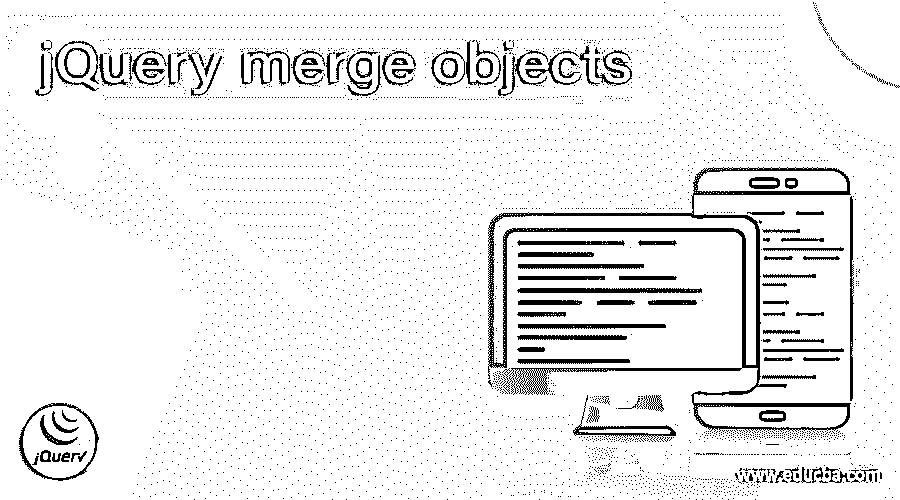
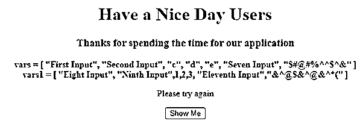
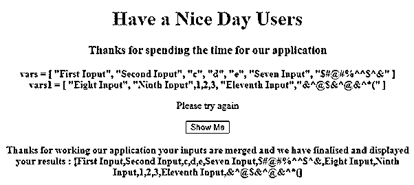
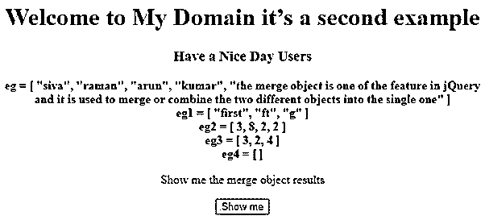
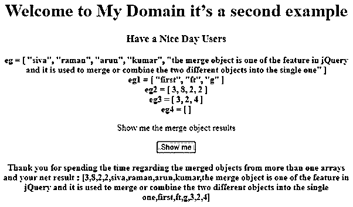
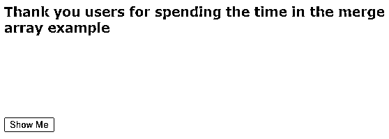
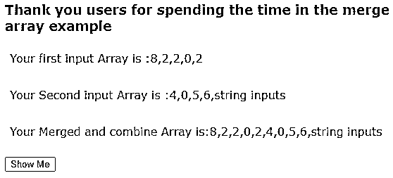

# jQuery 合并对象

> 原文：<https://www.educba.com/jquery-merge-objects/>




## jQuery 合并对象简介

jQuery merge()是用于将两个对象合并或组合成一个新的单独对象的方法之一。很可能该对象是数组类型的。它可以作为方法的参数传递，并且都是类似数组的对象类型。它从包含两个数组中所有元素的数组中获取和检索操作。数组的顺序将是最优先的，每一项都可以相互追加，计算长度和$。merge()是 jQuery 库中的破坏性方法之一。

**语法:**

<small>网页开发、编程语言、软件测试&其他</small>

Merge()是 jQuery 库的默认方法之一，它将两个不同的数组对象合并成一个对象。当我们在脚本的另一个区域调用和使用数组值时，它允许复制。

```
<html>
<head>
<script src=https://ajax.googleapis.com/ajax/libs/jquery/3.2.1/jquery.min.js>
var a= ["inputs" ];
var b = ["inputs1" ];
var result = $.merge(a,b);
---some jQuery and javascript codes depends on the user requirement------
</script>
<body>
---some html UI elements depends on the requirement---
</body>
</html>
```

以上代码是在脚本中使用 merge()方法的基本语法。这里，我们使用数组类型对两个变量进行初始化，并以数组类型的形式获得输出结果。

### jQuery 中如何合并对象？

在 jQuery 库中，merge()是在单个变量空间中追加两个数组内容的默认方法之一。数组数据可能是重复的，它将在不同的索引上初始化，但它与第一个数组具有相同的范围，即 3 个索引范围，第二个数组索引范围也是 3，这意味着它可以与两个数组数据相附加和组合。有时数组值与两个变量相同，这时它接受重复的数据并将它们合并成一个数据。数值和非数值范围都支持数组值。jQuery DOM 对象可以选择和合并对象到一个数组中，并调用 jQuery 方法，即使我们利用 jQuery 原型来扩展和合并两个对象数据到一个数组中。这些连接操作也将针对一个以上的变量对象类型进行，但特别是它会将数组对象分配到变量中。将使用 assign()和 extend()方法分配对象，而我们使用这两种方法时，assign()方法用于从多个源中复制所有相关对象的值，并将副本合并到其他目标对象。

#### 示例#1

```
<!DOCTYPE html>
<html>
<head>
<meta charset="utf-8">
<title>Welcome to My Domain it’s a First Example</title>
<script src="https://code.jquery.com/jquery-3.4.1.js"></script>
</head>
<body style="text-align:center;">
<h1 style="color: red">Have a Nice Day Users</h1>
<h3>Thanks for spending the time for our application</h3>
<b>vars = [ "First Input", "Second Input", "c", "d", "e", "Seven Input", "$#@#%^^$^&" ]</b><br>
<b>vars1 = [ "Eight Input", "Ninth Input",1,2,3, "Eleventh Input","&^@$&^@&^*(" ]</b>
<br>
<p>Please try again</p>
<button onclick="demo()">Show Me</button>
<br><br>
<b id="eg"></b>
<script>
function demo() {
var vars = [ "First Input", "Second Input", "c", "d", "e", "Seven Input", "$#@#%^^$^&" ];
var vars1 = [ "Eight Input", "Ninth Input",1,2, 3, "Eleventh Input","&^@$&^@&^*(" ];
var result = $.merge(vars, vars1 );
document.getElementById("eg").innerHTML = "Thanks for working our application your inputs are merged and we have finalised and displayed your results : [" + result + "]";
}
</script>
</body>
</html>
```

**输出:**




单击该按钮后，输出将是:




在上面的例子中，我们使用了两个变量值来组合单个合并和输出结果。

#### 实施例 2

```
<!DOCTYPE html>
<html>
<head>
<meta charset="utf-8">
<title>JQuery | merge() method</title>
<script src="https://code.jquery.com/jquery-3.4.1.js"></script>
</head>
<body style="text-align:center;">
<h1 style="color: green">
Welcome to My Domain it’s a second example
</h1>
<h3>Have a Nice Day Users</h3>
<b>eg = [ "siva", "raman", "arun", "kumar", "the merge object is one of the feature in jQuery and it is used to merge or combine the two different objects into the single one" ]</b><br>
<b>eg1 = [ "first", "ft", "g" ]</b> <br>
<b>eg2 = [ 3, 8, 2, 2 ]</b> <br>
<b>eg3 = [ 3, 2, 4 ]</b><br>
<b>eg4 = [ ]</b>
<br>
<p>Show me the merge object results</p>
<button onclick="demo()">Show me</button>
<br><br>
<b id="ex"></b>
<script>
function demo() {
var a = [ "siva", "raman", "arun", "kumar", "the merge object is one of the feature in jQuery and it is used to merge or combine the two different objects into the single one" ];
var b = ["first", "ft", "g" ];
var c = [ 3, 8, 2, 2];
var d = [ 3, 2, 4];
var e = [];
var results = $.merge(
c, $.merge($.merge(e, $.merge(a, b )), d));
document.getElementById(
"ex").innerHTML = "Thank you for spending the time regarding the merged objects from more than one arrays and your net result : [" + results + "]";
}
</script>
</body>
</html>
```

**输出:**




单击该按钮后，输出将是:




在第二个例子中，我们使用了多个带有 merge()选项的数组变量来组合单个数组变量。

#### 实施例 3

```
<!DOCTYPE html>
<html>
<head>
<title>Welcome to My Domain it’s a Third Examples</title>
<script src="https://code.jquery.com/jquery-3.4.1.js"></script>
<script>
$(document).ready(function() {
$("button").click(function(){
var vars = [8, 2, 2, 0, 2];
var vars1 = [4, 0, 5,6 , "string inputs"];
$("#eg").text("Your first input Array is :" + vars);
$("#eg1").text("Your Second input  Array is :" + vars1);
var result = $.merge(vars, vars1);
$("#eg2").text("Your Merged and combine Array is:" + result);
});
});
</script>
<style>
body{font-family:Verdana; color:violet;}
#eg, #eg1, #eg2{background:greeb; color:blue;padding:7px;}
</style>
</head>
<body>
<h3>Thank you users for spending the time in the merge array example </h3>
<div id="eg"></div><br>
<div id="eg1"></div><br>
<div id="eg2"></div><br>
<button>Show Me</button><br>
</body>
</html>
```

**输出:**




单击该按钮后，输出将是:




在最后一个示例中，我们使用了 merge()和 extend()方法将两个变量数组值与一个数组值组合在一起。

### 结论

在 jQuery 中，merge()方法是组合和合并单个变量输出的默认方法之一。我们使用 n 个数组变量与一个数组变量连接，减少了内存空间面积，提高了基于 web 的应用程序的性能。

### 推荐文章

这是一个 jQuery 合并对象的指南。在这里，我们将讨论如何在 jQuery 中合并对象，以及示例和输出。您也可以阅读以下文章，了解更多信息——

1.  [jQuery 延期](https://www.educba.com/jquery-deferred/)
2.  [jQuery 日历](https://www.educba.com/jquery-calendar/)
3.  [jQuery 替换](https://www.educba.com/jquery-replace/)
4.  [jQuery 内容](https://www.educba.com/jquery-contents/)


