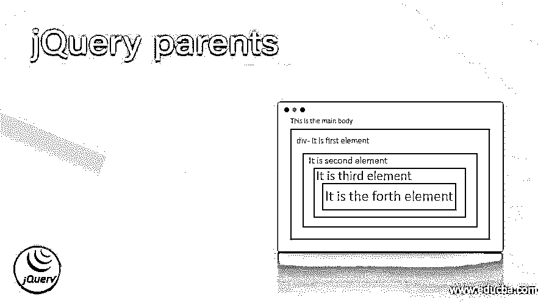
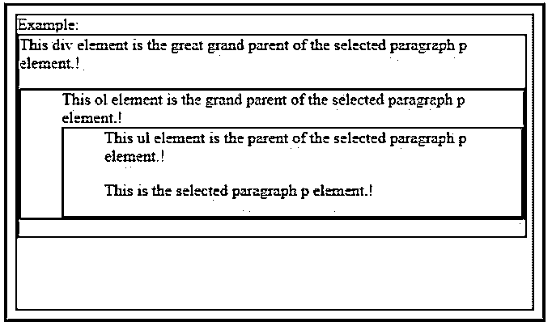
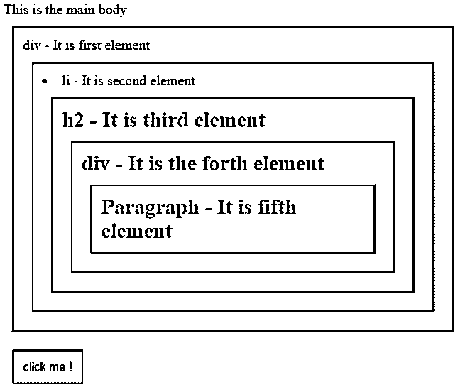
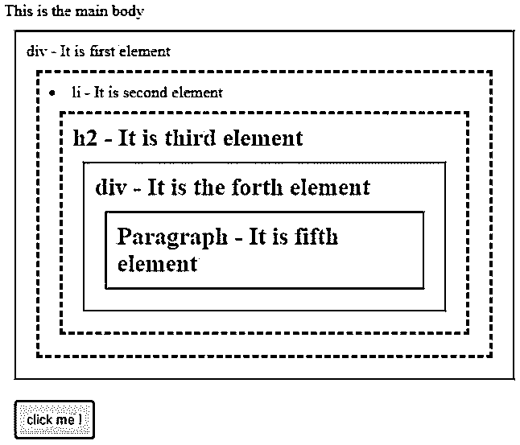

# jQuery 父代

> 原文：<https://www.educba.com/jquery-parents/>




## jQuery 父代简介

在 jQuery 中，parents()是一个内置方法，它被定义为通过在树中向上朝着曾祖父、祖父等方向遍历 DOM 树的方法。、元素，并为 parents()函数中指定的任何特定选定元素返回这些元素。因此，一般来说，我们可以将 parents()函数定义为一个函数，它在 DOM 树中向上遍历，以返回匹配或选定元素的所有祖先元素，这在 parents()函数中给出，也类似于 parent()函数，但 parents()函数返回所有祖先元素，而 parent()函数仅返回直接的父元素。

**语法:**

<small>网页开发、编程语言、软件测试&其他</small>

```
$(selector ).parents(filter_expr)
```

或者

```
$(selector).parents()
```

在上面给出的语法中，jQuery parents()函数应用于特定的元素。它是一个选择器标签，当这个 parent()函数应用于这个选择器标签时，返回所有祖先。这个函数不带任何参数，但仍然被认为是可选的。

*   选择器:在这里，选择器什么都不是，但它是一个 HTML 元素或标签，我们希望返回该元素的祖先或祖父元素。
*   **filter_expr:** 这是该函数中的一个可选参数，用于指定在 DOM 树中向上查找的选择器标签表达式，以搜索该选择器的所有祖先。

### parents()函数如何工作示例

*   在 jQuery 中，parents()函数是一个内置函数，用于显示需要应用该函数的所选 HTML 标记的所有祖先。这个函数的工作非常简单，首先，它将检查指定的选择器标签，然后是句点(点)操作符和这个选择器标签的 parents()方法。这个函数将遍历整个 DOM 树，其中这个树是 jQuery 对象元素的表示。
*   因此 parents()函数向上遍历这个 DOM 树，搜索所有元素的祖先，比如祖父元素、曾祖父元素等。都被显示出来，这意味着这个函数 parent()返回在函数声明之前指定的特定选择或匹配的 HTML 标记的所有祖先元素，并且这个特定指定的选择器可以选择过滤它。对于给定的具有原始集合的多个 DOM，该函数以相反的顺序返回元素集合，重复的元素被删除并显示。

#### 示例#1

**代码:**

```
<html>
<head>
<title> Demonstration of the parents() function in jQuery </title>
<style>
.parents_func_body* {
display: block;
border: 2px solid red;
color: red;
padding: 5px;
margin: 15px;
}
</style>
<script
src="https://ajax.googleapis.com/ajax/libs/jquery/3.3.1/jquery.min.js">
</script>
<script>
$(document).ready(function() {
$("p").parents().css({
"color": "blue",
"border": "2px solid red"
});
});
</script>
</head>
<body class="parents_func_body">
<div style="width:500px;"> This div element is the great grand parent of the selected paragraph p element.!
<ol> This ol element is the grand parent of the selected paragraph p element.!
<ul> This ul element is the parent of the selected paragraph p element.!
<p> This is the selected paragraph p element.! </p>
</ul>
</ol>
</div>
</body>
</html>
```

**输出:**




在上面的例子中，我们首先根据上面代码中给定的函数为要显示的网页准备好了文档。在这个例子中，我们使用了。ready()函数用于准备文档。然后我们指定 parents()函数，其中“P”段落标记作为这个函数的选择器，这意味着这个函数返回上面代码中元素“P”的所有祖先元素。最后，我们将应用。函数来正确地显示每个具有描述属性的元素。这个逻辑在脚本标记中定义或声明，脚本标记在 head 标记中。

现在在 body 标签中，我们将使用 head 标签中声明的类名来描述 body 标签的属性。在上面的代码中，我们首先声明了“div”标记，这使它成为元素“p”的祖父级。类似地，在没有在此内结束“div”标记的情况下，我们声明了另一个元素“ol”，这使它成为元素“p”的祖父级，然后在这个“ol”标记内，我们声明了“ul”标记， 这使它成为元素“p”的父元素，然后在这个“ul”标签中，我们声明了“p”标签，它是 parents()函数的选择器标签，然后所有这些上面的标签按照、、和的顺序关闭，最后我们也关闭了 body 和 HTML 标签。 输出显示了上面截图中的确切显示。

#### 实施例 2

现在让我们看另一个例子来演示 parents()函数，在这个例子中，我们将可选参数作为一些其他的 HTML 元素或选择器来传递。

**代码:**

```
<!DOCTYPE html>
<html>
<head>
<title> Demonstration of parents() function with optional parameters. </title>
<style>
.main *{
border: 2px solid red;
padding: 10px;
margin: 10px;
}
</style>
<script src = "https://ajax.googleapis.com/ajax/libs/jquery/3.5.1/jquery.min.js"></script>
<script>
function parents_func(){
$(document).ready(function(){
$("p").parents("li, h2").css({ "border": "3px dashed blue"});
});
}
</script>
</head>
<body class = "main"> This is the main body
<div> div - It is first element
<li> li - It is second element
<h2> h2 - It is third element
<div> div - It is the forth element
<p> Paragraph - It is fifth element
</p>
</div>
</h2>
</li>
</div>
<button onclick = "parents_func()"> click me ! </button>
</body>
</html>
```

**输出:**







在上面的例子中，代码类似于第一个代码，但是这里唯一的不同是我们将多个元素或选择器标签作为可选参数传递给 parents()函数，以便我们可以根据指定的元素来区分元素。在这段代码中，我们将

*   And

    ## tags are specified as parameters, and we also specify such an attribute that when the button is clicked, these parameters are highlighted with a blue dotted border, and the remaining elements are displayed with a red border. The output in the screenshot above shows the use of optional parameters.

### 结论 jQuery 父代

在本文中，我们得出结论，jQuery 中的 parents()函数非常简单，用于搜索或遍历 DOM 树，DOM 树由各种元素组成，可以找到父元素，以帮助任何开发人员轻松纠正或升级任何细节。类似于这个 parent()函数，它返回任何选定元素的所有祖先元素，甚至 parent()函数也返回直接的父元素，但不是所有的祖先元素。

### 推荐文章

这是 jQuery 父母指南。这里我们分别用例子讨论 parents()函数的介绍和如何工作。您也可以看看以下文章，了解更多信息–

1.  [jQuery 选择选项](https://www.educba.com/jquery-select-option/)
2.  [jQuery zindex](https://www.educba.com/jquery-zindex/)
3.  [jQuery 宽度](https://www.educba.com/jquery-width/)
4.  [jQuery id 选择器](https://www.educba.com/jquery-id-selector/)


