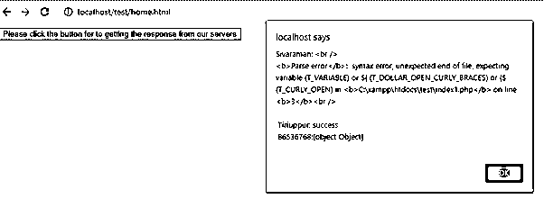
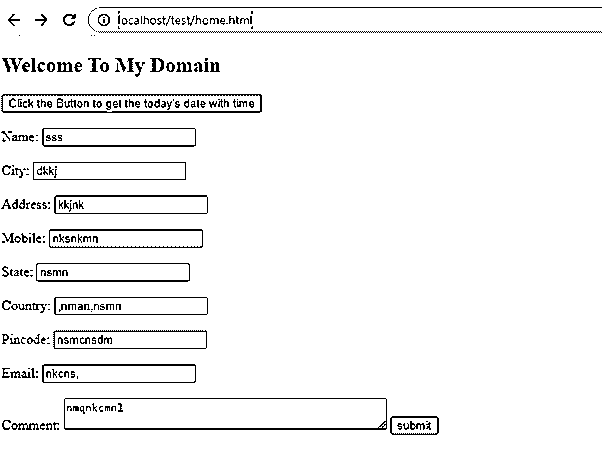

# jQuery get

> 原文：<https://www.educba.com/jquery-get/>


## jQuery get 简介

在 JQuery 中， get()被定义为 jquery 中的方法之一，它用于在异步格式的帮助下向服务器发送 http GET 请求，不仅用于发送它，还用于每当用户请求被发送到服务器时从数据库服务器检索数据。数据是查询字符串格式的，数据是加密的，如果用户请求是 成功后，get()方法将传递 url、数据和回调类型。XMLHttpRequest 对象从 get()方法返回。

**语法**

<small>网页开发、编程语言、软件测试&其他</small>

在 javascript 中，jquery 库使用一组不同的内置方法与 web 应用程序中的用户进行交互。jquery get()方法与 html 元素进行交互，以定制 web 页面。它有自己的语法，一组参数将被传递并以 XMLHttpRequest 格式返回请求。

```
<html>
<head>
<script type="text/JavaScript" src=https://ajax.googleapis.com/ajax/libs/jquery/2.1.3/jquery.min.js>
</script>
<script type="text/javascript">
$(document).ready(function() {
$(“#variablename”).click(function(event)
{
$.get( "backend programfile with extension", some datas,[callback function],[type]);
--some jquery codes---
});
});
</script>
<body>
--some html UI based tag elemenst ---
</body>
</html>
```

### get 方法在 jQuery 中是如何工作的？

jquery 是 javascript 库；它可以用于与更复杂的网页进行交互。使用 jquery，它具有默认的方法，并且其属性将更加适合 web 应用的需求；在此基础上，使用 get()方法将异步格式的数据发送到服务器。在默认参数如 URL、数据和回调函数类型的帮助下，它将传递给后端代码。

XMLHttpRequest 对象是 get()方法的返回类型。jquery 必须默认发送请求和接收服务器响应的 Ajax 方法，比如 XMLHttpRequest 对象返回值。jqueries 或 jqXHR 的 XHR 对象在其属性、方法和函数行为的帮助下将返回一些接口。

jQuery.get(url，[data]，[callback]，[type])是将用于向服务器发送异步数据的通用语法和参数，而 url 由包含特定请求被发送到服务器的 url 的任意字符串表示，data 是附加的，它是可选参数，表示结果由服务器响应的键/值对。

请求数据是任何数据类型，如整数、字符串等。，如果该方法用于键/值数据对，它将是唯一标识符。对于结果，XMLHttpRequest 对象是 get()方法的返回类型，然后“type”参数主要使用在回调函数(如用户定义的函数)后返回的数据类型来表示，这在借助 get()方法中的回调参数调用的事件中是必需的。

### jQuery get 的示例

下面是 jQuery get 的几个例子:

#### 示例#1

**代码:**

```
<html>
<head>
<title>The jQuery Example</title>
<script type = "text/javascript"
src = "https://ajax.googleapis.com/ajax/libs/jquery/2.1.3/jquery.min.js">
</script>
<script type = "text/javascript" language = "javascript">
$(document).ready(function() {
$("#example").click(function(event){
$.get(
"index.php",
{ name: 'Sivaraman',
city: "Tiruppur",
mobile: "8220244056"
},
function(data) {
$('#demo').html(data);
}
);
});
$("#example1").click(function(event){
$.get(
"index1.php",
{ name: 'Sivaraman',
city: "Tiruppur",
mobile: "8220244056"
},
function(datas) {
$('#demo1').html(datas);
}
);
});
});
</script>
</head>
<body>
<p>Welcome To My Domain </p>

Please Click the button for getting your saved datas


Your retrieved datas

<div><input type = "button" id = "example"
value = "Welcome Users" /></div>
<div><input type = "button" id = "example1"
value = "Retrieve" /></div>
</body>
</html>
<?php
$_REQUEST["name"] ="Sivaraman";
$_REQUEST["city"] ="Tup";
$_REQUEST["mobile"] ="8220244056";
echo "Thank you for storing the details Please Click the Retrieve button for to checking your stored datas";
?>
<?php
switch ($_REQUEST) {
case 1:$_REQUEST["name"] ="Sivaraman";
echo "name";
break;
case 2:$_REQUEST["city"] ="TUP";
echo "city";
break;
case 3:$_REQUEST["mobile"] ="822027689";
echo "mobile";
break;
default:
echo "no";
}
?>
```

**输出:**


#### 实施例 2

**代码:**

```
<html>
<head>
<script src="https://ajax.googleapis.com/ajax/libs/jquery/3.5.1/jquery.min.js"></script>
<script>
$(document).ready(function(){
$("button").click(function(){
$.get("index1.php",
{ name: 'Sivaraman',
city: "Tiruppur",
mobile: "8220244056",
},
function(name, city, mobile){
alert("Sivaraman: " + name + "\n Tiriuppur: " + city + "\n 86536768:" + mobile);
});
});
});
</script>
</head>
<body>
<button>Please click the button for to getting the response from our servers</button>
</body>
</html>
```

**输出:**




#### 实施例 3

**代码:**

```
<!DOCTYPE html>
<html lang="en">
<head>
<meta charset="utf-8">
<title>Welcome User To Retrieve the Current Date and Time</title>
<script src="https://code.jquery.com/jquery-3.5.1.min.js"></script>
<script>
$(document).ready(function(){
$("#btn1").click(function(){
$.get("index1.php", function(data){
$("#demo").html(data);
});
});
$("#frm").submit(function(event){
event.preventDefault();
$.get("index1.php", function(data){
$("#demo1").html(data);
});
});
});
</script>
</head>
<body>
<div id="demo">
<h2>Welcome To My Domain</h2>
</div>
<button type="button" id="btn1">Click the Button to get the today's date with time</button><br/><br/>
<form action="index.php" ide="frm">
<label>Name: <input type="text" name="name"></label><br/><br/>
<label>City: <input type="text" name="city"></label><br/><br/>
<label>Address: <input type="text" name="address"></label><br/><br/>
<label>Mobile: <input type="text" name="mobile"></label><br/><br/>
<label>State: <input type="text" name="state"></label><br/><br/>
<label>Country: <input type="text" name="country"></label><br/><br/>
<label>Pincode: <input type="text" name="pincode"></label><br/><br/>
<label>Email: <input type="text" name="email"></label><br/><br/>
<label>Comment: <textarea cols="50" name="comment"></textarea></label>
<input type="submit" value="submit">
</form>
<div id="demo1"></div>
</body>
</html>
<?php
$name = htmlspecialchars($_GET["name"]);
$city = htmlspecialchars($_GET["city"]);
$mobile = htmlspecialchars($_GET["mobile"]);
$address = htmlspecialchars($_GET["address"]);
$state = htmlspecialchars($_GET["state"]);
$pincode = htmlspecialchars($_GET["pincode"]);
$country = htmlspecialchars($_GET["country"]);
$email = htmlspecialchars($_GET["email"]);
$comment = htmlspecialchars($_GET["comment"]);
echo "Hi, $name. Your comment has been successfully Submittted thank you for your registeration" . "";
echo "Please see your latest comments: $comment";
?>
```

**输出:**




在上面的例子中，我们在不同的地方使用了 get()方法，因为它将使用 AJAX 等技术获取 UI 数据。当我们使用 ajax 时，它将在不刷新页面或重新加载页面的情况下检索数据。但是在这里，我们没有使用 ajax 我们简单地存储 UI 数据，并使用带有形参的 get()方法检索数据。

### 结论

在 jQuery 中，我们有许多带有属性的预定义方法。当我们在基于 web 的应用程序中使用这些方法时，同时，用户的浏览器也要避开安全限制，如防火墙或其他一些内部网站点保护。有时 jquery.get()会抛出编译时和运行时错误之类的错误；在 web 控制台的帮助下，我们将排除错误。

### 推荐文章

这是一个 jQuery get 的指南。在这里，我们讨论了如何在 jQuery 中使用方法、例子以及代码和输出。您也可以看看以下文章，了解更多信息–

1.  [jQuery 扩展](https://www.educba.com/jquery-extend/)
2.  [jQuery Easing](https://www.educba.com/jquery-easing/)
3.  [jQuery 小部件](https://www.educba.com/jquery-widgets/)
4.  [jQuery 重置表单](https://www.educba.com/jquery-reset-form/)


