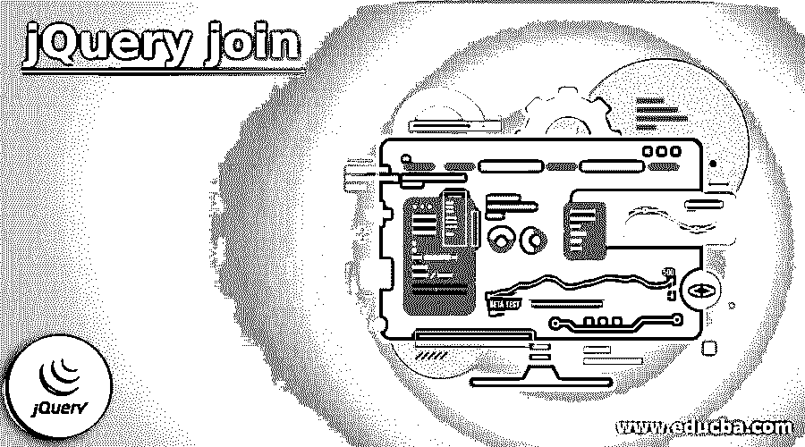
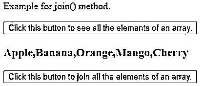
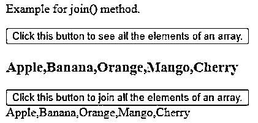
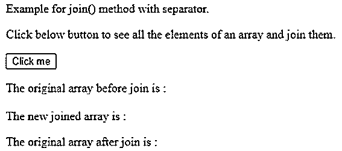
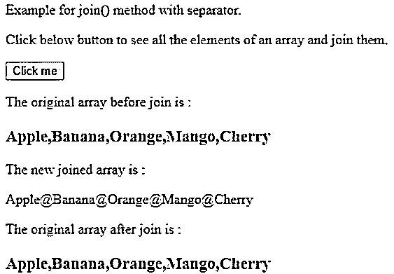

# jQuery 连接

> 原文：<https://www.educba.com/jquery-join/>




## jQuery join 简介

jQuery join()方法用于将数组元素转换为字符串并返回。jQuery join()方法是 jQuery 中的内置方法。有时我们需要将一个数组的所有元素连接成一个单独的字符串，因此 jQuery 为此提供了 join()方法。在连接元素时，每个元素将被某个分隔符分隔开，逗号(“，”)是默认分隔符。请注意，join()方法不会改变原始数组；它只是返回转换后的数组，我们可以将它存储到其他变量中。

**语法:**

<small>网页开发、编程语言、软件测试&其他</small>

```
array.join(separator);
```

**参数:**

*   **分隔符:**这是一个可选的字符串类型参数，指定用于连接数组元素的字符或字符串。

**返回值:**

此方法的返回值是由传递的分隔符分隔的连接数组元素的字符串。

**Note:** If the separator is not passed to the join() method, the join() combine the elements of an array by using a comma as a separator.

### jQuery join()的工作原理

*   join()方法适用于 array 对象，它接受一个作为分隔符的参数。
*   假设一个数组包含四个元素，我们对它调用 join()方法并传递空格作为分隔符，然后 join()方法通过使用空格作为它们之间的分隔符来组合所有四个元素，并作为字符串返回。
*   如果我们检查原始数组，数组不会改变，因为连接不会改变原始数组；它只是返回一个字符串作为结果。

### jQuery join()的示例

下面提到了不同的例子:

#### 示例#1

jQuery join()方法连接数组元素的例子。

接下来，我们用下面的例子更清楚地编写 jQuery join()方法的 html 代码，其中 join()方法用于连接不带任何分隔符的字符串数组元素。

**代码:**

```
<!doctype html>
<html lang = "en">
<head>
<meta charset="utf-8">
<title> This is an example for jQuery join method </title>
<script src = "https://ajax.googleapis.com/ajax/libs/jquery/3.3.1/jquery.min.js">
</script>
</head>
<script type="text/javascript">
$(document).ready(function () {
$("#id1").click(function() {
var fruits = [ "Apple", "Banana", "Orange", "Mango", "Cherry" ];
$("h3").text(fruits );
});
$("#id2").click(function() {
var fruits = [ "Apple", "Banana", "Orange", "Mango", "Cherry" ];
var jfruits = fruits.join();
$("div").text(jfruits );
});
});
</script>
</head>
<body>
<p> Example for join() method. </p>
<button id = "id1" >Click this button to see all the elements of an array.</button>
<h3> </h3>
<button id = "id2" >Click this button to join all the elements of an array.</button>
<div></div>
</body>
</html>
```

**输出:**


一旦我们点击“点击此按钮查看一个数组的所有元素”按钮，输出是:




一旦我们点击“点击这个按钮来连接一个数组的所有元素”按钮，输出是:




在上面的程序中，创建了水果数组，通过调用函数单击第一个按钮可以打印该数组。接下来，如果我们单击第二个按钮，它调用函数；在这个函数中，它创建同一个数组，然后连接并打印，正如我们在输出中看到的。如果我们观察输出，两个数组都打印得一样，因为数组元素默认使用“，”连接，所以 join()方法也默认使用“，”分隔符连接所有元素，如果我们没有传递任何分隔符的话。

#### 实施例 2

用指定分隔符连接数组元素的 jQuery join()方法示例。

接下来，我们编写 jQuery join()方法的 html 代码，其中 join()方法用于连接字符串数组元素，元素之间用“@”作为分隔符。

**代码:**

```
<!doctype html>
<html lang = "en">
<head>
<meta charset="utf-8">
<title> This is an example for jQuery join method </title>
<script src = "https://ajax.googleapis.com/ajax/libs/jquery/3.3.1/jquery.min.js">
</script>
</head>
<script type="text/javascript">
$(document).ready(function () {
$( "#id1" ).click(function() {
var fruits = [ "Apple", "Banana", "Orange", "Mango", "Cherry" ];
$( "#h1" ).text(fruits );
var jfruits = fruits.join( "@" );
$( "div" ).text( jfruits );
$( "#h2" ).text( fruits );
});
});
</script>
</head>
<body>
<p> Example for join() method with separator. </p>
<p> Click below button to see all the elements of an array and join them. </p>
<button id = "id1" >Click me</button>
<p> The original array before join is : </p>
<h3 id = "h1"> </h3>
<p> The new joined array is : </p>
<div> </div>
<p> The original array after join is : </p>
<h3 id = "h2"> </h3>
</body>
</html>
```

**输出:**




一旦我们点击“点击我”按钮，输出是:




如上面的程序，如果我们点击“点击我”按钮，它调用函数；在这个函数中，它创建了一个字符串数组，然后用“@”分隔符连接起来并打印，正如我们在输出中看到的。如果我们观察输出，两个数组(连接前和连接后的数组)打印的是相同的，因为连接方法不会改变原始数组。

#### 实施例 3

用指定分隔符连接数字数组元素的 jQuery join()方法示例。

接下来，我们编写 jQuery join()方法的 html 代码，其中 join()方法用于连接数字数组元素，并用“and”作为数字元素之间的分隔符。

**代码:**

```
<!doctype html>
<html lang = "en">
<head>
<meta charset="utf-8">
<title> This is an example for jQuery join method </title>
<script src = "https://ajax.googleapis.com/ajax/libs/jquery/3.3.1/jquery.min.js">
</script>
</head>
<style>
body{background: red;};
</style>
<script type="text/javascript">
$(document).ready(function () {
$( "#id1" ).click(function() {
var no = [ 14, 20, 34, 43, 51, 60 ];
document.write( "The original array is :" );
document.write( no );
document.write( "<br>" );
document.write( "The joined original array is :" );
document.write( no.join(" and ") );
});
});
</script>
</head>
<body>
<p> Example for join() method on number array. </p>
<p> Click below button to see all the elements of an array and join them. </p>
<button id = "id1" >Click me</button>
</body>
</html>
```

**输出:**


一旦我们点击“点击我”按钮，输出是:


在上面的程序中，如果我们单击“Click me”按钮，它将调用函数，在这个函数中，它将创建一个数字数组，然后用“and”分隔符连接并打印，正如我们在输出中看到的。

### 结论

jQuery join()方法是 jQuery 中的内置方法，用于通过特定的分隔符连接数组的所有元素。

### 推荐文章

这是一个 jQuery join 的指南。在这里，我们将分别讨论 jQuery join()的介绍、工作原理以及示例。您也可以看看以下文章，了解更多信息–

1.  [jQuery 承诺](https://www.educba.com/jquery-promise/)
2.  [jQuery zindex](https://www.educba.com/jquery-zindex/)
3.  [jQuery 引用](https://www.educba.com/jquery-reference/)
4.  [jQuery 修剪](https://www.educba.com/jquery-trim/)


