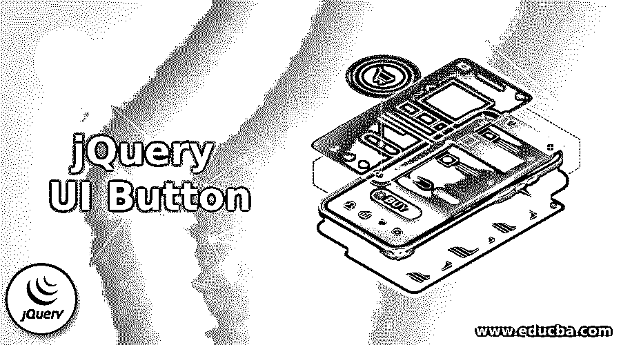
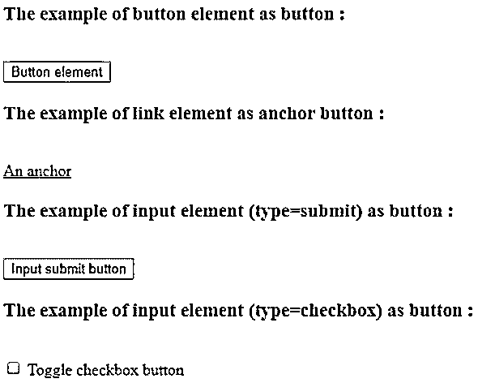
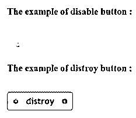

# jQuery UI 按钮

> 原文：<https://www.educba.com/jquery-ui-button/>




## jQuery UI 按钮简介

jQuery UI button()方法可以用来转换标准的表单元素，比如按钮、锚点、输入等等。button()通过适当的活动、悬停样式和对按钮上鼠标动作的管理，将表单元素增强为主题化按钮。假设对单选按钮进行分组，button()方法提供了 buttonset()方法，这是一个附加的小部件。这个附加的小部件用于通过使用 buttonset()方法来选择包含单选按钮组的容器的元素。

### jQuery UI 按钮的语法

有两种方法可以使用 button()方法:

<small>网页开发、编程语言、软件测试&其他</small>

**1。$(选择器，上下文)。button (options):** 这是第一个将特定 HTML 元素声明为按钮的方法。options 参数指定按钮的外观和行为。如果选项不止一个，则可以使用此方法，并且每个选项应使用逗号分隔，如下所示:

```
object. $(selector, context).button( {opt1 : value1, opt2 : value2 ... });
```

**2。$(选择器，上下文)。button ("action "，params):** 这是第二个方法，它将一个 html 元素声明为一个按钮，并在该按钮上执行一个操作。要执行的操作是以字符串形式传递禁用、启用、销毁按钮。

#### 因素

下面给出了参数:

##### 1.选择

在第一个方法$(选择器，上下文)中。按钮(选项)，它只接受一个参数，即选项。

我们可以为该选项使用一系列可能的值:

*   **禁用:**该选项通过将其设置为 true 来禁用或停用按钮。它的默认值是 false。
*   **图标:**该选项设置按钮中显示的图标。可以有一个或两个图标作为主要图标(左)和次要图标(右)。主要图标由主要属性的对象指定，同样，次要图标由次要属性的对象指定。两个图标的默认值都是 NULL。
*   **文本:**表示按钮上要显示的文本。该选项的默认值为 true。
*   **标签:**代表显示在按钮上的标签，而不是自然标签。例如，<标签>是单选按钮和复选框的自然标签。该选项的默认值为 NULL。

##### 2.行为

在第二个方法$(选择器，上下文)中。按钮(" action "，params)，它接受两个参数，action 和 params。action 参数指定了要在该按钮上执行的操作。

该操作的可能值为:

*   **销毁:**用于销毁或移除按钮元素的功能，并返回到原始状态。它不接受任何参数。
*   **刷新:**用于刷新按钮状态。它不接受任何参数。
*   **禁用:**用于禁用按钮元素的功能。它不接受任何参数。
*   **enable:** 用于启用按钮元素的功能。它不接受任何参数。
*   **option( optName ):** 用于获取指定选项的值，作为 optName，是一个字符串。
*   **选项:**用于获取当前包含键值对的对象。
*   **option( optName，value ):** 用于设置传递 optName 的按钮选项。
*   **option(选项):**以选项-值对映射的形式设置一个或多个按钮选项。
*   **widget:** 用来获取一个包含按钮元素的对象。它不接受任何参数。

### jQuery UI 按钮的示例

下面是提到的例子:

#### 示例#1

其中 button()方法用于将 html 元素视为按钮，而不向 button()方法传递任何参数。

**代码:**

```
<!DOCTYPE html>
<head>
<title> This is an example for button() method</title>
<link href="http://code.jquery.com/ui/1.10.4/themes/ui-lightness/jquery-ui.css" rel="stylesheet">
<script src="http://code.jquery.com/ui/1.10.4/jquery-ui.js"></script>
<script src="http://code.jquery.com/jquery-1.10.2.js"></script>
<script>
$(function() {
$( "#b1, #b2, #b3, #b4" ).button();
});
</script>
</head>
<body>
<h3> The example of button element as button :</h3><br>
<button id="b1"> Button element </button><br>
<h3> The example of link element as anchor button :</h3><br>
<a id="b3" href="">An anchor</a><br>
<h3> The example of input element (type=submit) as button :</h3><br>
<input id="b2" type="submit" value="Input submit button"><br>
<h3> The example of input element (type=checkbox) as button :</h3><br>
<input type="checkbox"  id="b4">
<label for="b4">Toggle checkbox button</label><br>
<br>
</body>
</html>
```

**输出:**




#### 实施例 2

其中 button()方法使用图标、禁用和文本等选项。

**代码:**

```
<!doctype html>
<html lang="en">
<head>
<meta charset="utf-8">
<title>This is an example for button() method</title>
<link href="http://code.jquery.com/ui/1.10.4/themes/ui-lightness/jquery-ui.css" rel="stylesheet">
<script src="http://code.jquery.com/ui/1.10.4/jquery-ui.js"></script>
<script src="http://code.jquery.com/jquery-1.10.2.js"></script>
<script>
$(function() {
$( "#b1" ).button({
icons: {
primary: "ui-icon-locked"
},
text: false
});
$( "#b2" ).button({
icons: {
primary: "ui-icon-power",
secondary: "ui-icon-disk"
}
});
$("#b3").button({
icons: {
primary: "ui-icon-gear"
}
});
$( "#b4" ).button({
disabled:true
});
});
</script>
</head>
<body>
<h3> The example of button with only icon :</h3><br>
<button id="b1">Button with icon only </button><br>
<h3> The example of button with two icons :</h3><br>
<button id="b2">Button with two icons</button>
<h3> The example of button with disabled :</h3><br>
<button id="b3">Button with icon on left </button><br>
<h3> The example of button with disabled :</h3><br>
<button id="b4"> Button Disabled </button><br>
</body>
</html>
```

**输出:**


#### 实施例 3

其中 button()方法使用了 some 操作。

**代码:**

```
<!doctype html>
<html lang="en">
<head>
<meta charset="utf-8">
<title>This is an example for button() method</title>
<link href="http://code.jquery.com/ui/1.10.4/themes/ui-lightness/jquery-ui.css" rel="stylesheet">
<script src="http://code.jquery.com/ui/1.10.4/jquery-ui.js"></script>
<script src="http://code.jquery.com/jquery-1.10.2.js"></script>
<script>
$(function() {
$( "#b1" ).button({
icons: {
primary: "ui-icon-locked"
},
text: false
});
$( "#b1" ).button('disable');
$( "#b2" ).button({
icons: {
primary: "ui-icon-power",
secondary: "ui-icon-disk"
}
});
$( "#b2" ).button('distroy');
});
</script>
</head>
<body>
<h3> The example of disable button :</h3><br>
<button id="b1">disable </button><br>
<h3> The example of distroybutton :</h3><br>
<button id="b2">distroy</button>
</body>
</html>
```

**输出:**




### 结论

button()方法是 jQuery UI 中的内置方法，可用于转换标准表单元素，如按钮、锚点、输入。所以所有 html 元素变成按钮也可以通过选项参数和动作参数来应用样式。

### 推荐文章

这是一个 jQuery UI 按钮指南。这里我们分别讨论 jQuery UI 按钮的介绍以及相应的语法、参数和示例。您也可以看看以下文章，了解更多信息–

1.  [jQuery Datepicker](https://www.educba.com/jquery-datepicker/)
2.  [jQuery 可排序](https://www.educba.com/jquery-sortable/)
3.  [jQuery hasClass()](https://www.educba.com/jquery-hasclass/)


