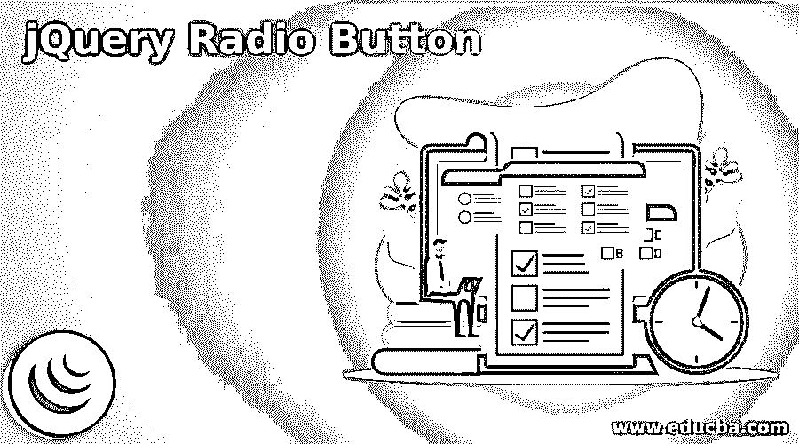
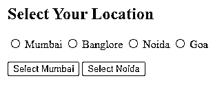
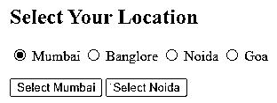
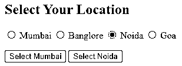
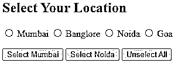
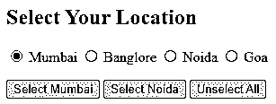
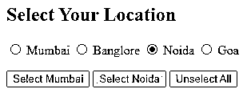
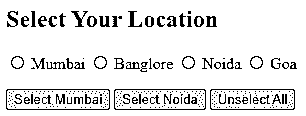

# jQuery 单选按钮

> 原文：<https://www.educba.com/jquery-radio-button/>




## jQuery 单选按钮简介

jQuery 是一个紧凑而快速的 JavaScript 库。它有很多新的增强功能。它简化了 HTML 文档的遍历和操作、动画、事件处理和 Ajax。jQuery 有一个易于使用的跨浏览器的 API。jQuery 单选按钮是常用的特性之一，用于根据选中的属性显示单选按钮。单选按钮用于选择任何形式的一组不同值中的单个值

### jQuery 单选按钮的语法

在 jQuery 中使用单选按钮的语法和下面的语法一样简单，一旦文档准备好就需要应用它。

<small>网页开发、编程语言、软件测试&其他</small>

```
$(selector).prop("checked", conditionalValue)
```

**jQuery 单选按钮的参数:**

*   **选择器:**需要应用单选按钮属性的元素。这可以是 HTML 元素类或 id 名称
*   **Checked:** 通过定义这个属性，我们根据需求将单选按钮的值设置为 true 或 false
*   **条件值:**根据需要，可以是真或假的布尔值。如果开发人员希望显示选中的单选按钮，则将该值设置为 TRUE。如果开发人员希望显示未选中的单选按钮，则将该值设置为 FALSE。

### 如何在 jQuery 中创建单选按钮？

创建 jQuery 单选按钮是一种非常简单明了的技术。最初，我们在 HTML 中声明了几个单选类型的输入字段，并将下面所有这些输入字段声明到一个组中，以便一次可以选择一个值。我们还将向每个输入字段添加类名或 id 名，以便可以在脚本中访问它们，并且我们可以操作每个单选按钮内容的检查值。下一步需要做的是在

### 使用 jQuery 单选按钮的方法

由于 jQuery 是一个快速的 JavaScript 库，它提供了两种不同的技术，通过这两种技术，单选按钮可以在仅使用 jQuery 的应用程序中使用。让我们通过一个例子来详细了解每种技术

#### 技巧 1——使用。属性

在这项技术中，我们将使用。attr 函数，然后操作单选按钮的值，该值最终将反映在 HTML DOM 中。如果您的应用程序只支持旧版本的 jQuery，那么推荐使用这种技术。

```
$(selector)
```

jQuery 单选按钮首先，我们将从 DOM 中访问按钮字段，用户将在该字段上执行单击，并在圆括号中提到类/属性名称

```
$(selector).click()
```

接下来在这个元素上，我们将添加。单击事件，这意味着每当在 UI 中单击该属性时。click 事件将被触发，并执行其中写入的任何内容。点击功能。

```
$(selector).attr("checked", conditionalValue)
```

接下来，在 click 函数中，我们将从 DOM 中选择输入单选按钮字段，并在圆括号中提到属性名称，在这个元素上，我们将调用 jQuery 函数。带两个参数的属性。第一个参数是常量，值是“checked ”,第二个参数是这个 checked 字段的值，可以是 true 或 false，用小写字母表示。

```
$(selector).attr("checked", conditionalValue).click()
```

一旦在脚本标记中操作了检查的值，最后我们对这个元素执行一个. click()操作，以便在 HTML DOM 元素中反映新修改的值。

##### jQuery 单选按钮示例

以下是 jQuery 单选按钮的示例:

**代码:**

```
<!DOCTYPE html>
<html lang="en">
<head>
<meta charset="utf-8">
<title>Using Radio Buttons in jQuery</title>
<script src="https://code.jquery.com/jquery-3.5.1.min.js"></script>
<script>
$(document).ready(function () {
$(".MUM").click(function () {
$("#mumbai").attr("checked", true).click();
});
$(".NOIDA").click(function () {
$("#noida").attr("checked", true).click();
});
});
</script>
</head>
<body>
<h2> Select Your Location</h2>
<p>
<input type="radio" name="option" id="mumbai">
Mumbai
<input type="radio" name="option" id="bglr">
Banglore
<input type="radio" name="option" id="noida">
Noida
<input type="radio" name="option" id="goa">
Goa
</p>
<p>
<button type="button" class="MUM">
Select Mumbai
</button>
<button type="button" class="NOIDA">
Select Noida
</button>
</p>
</body>
</html>
```

**输出:**




当点击选择孟买按钮时




当点击选择诺伊达按钮




**NOTE:** Unselect All doesn’t work with .attr method and so we use .prop method.

#### 技巧 2——使用。支柱

在这项技术中，我们将使用。prop 函数，然后操作单选按钮值，这最终将反映在 HTML DOM 中。如果您的应用程序只支持较新版本的 jQuery，那么推荐使用这种技术。

```
$(selector)
```

首先，我们将从 DOM 中访问按钮字段，用户将在该字段上执行单击，并在圆括号中提到类/属性名

```
$(selector).click()
```

接下来我们将添加这个元素。单击事件，这意味着每当在 UI 中单击该属性时。click 事件将被触发，并执行其中写入的任何内容。点击功能。

```
$(selector).prop(“checked”, conditionalValue)
```

接下来，在 click 函数中，我们将从 DOM 中选择输入单选按钮字段，并在圆括号中提到属性名称，在这个元素上，我们将调用 jQuery 函数。带两个参数的 prop。第一个参数是常量，其值为“checked ”,第二个参数是该 checked 字段的值，可以是 true 或 false，小写。

**NOTE**: In this technique, the jQuery click function is not required to be added as the prop method from jQuery already has it win built.

##### jQuery 单选按钮的示例

以下是 jQuery 单选按钮的示例:

**代码:**

```
<!DOCTYPE html>
<html lang="en">
<head>
<meta charset="utf-8">
<title>Using Radio Buttons in jQuery</title>
<script src="https://code.jquery.com/jquery-3.5.1.min.js"></script>
<script>
$(document).ready(function () {
$(".MUM").click(function () {
$("#mumbai").prop("checked", true);
});
$(".NOIDA").click(function () {
$("#noida").prop("checked", true);
});
$(".unselect").click(function () {
$("#mumbai").prop("checked", false);
$("#bglr").prop("checked", false);
$("#noida").prop("checked", false);
$("#goa").prop("checked", false);
});
});
</script>
</head>
<body>
<h2> Select Your Location</h2>
<p>
<input type="radio" name="option" id="mumbai">
Mumbai
<input type="radio" name="option" id="bglr">
Banglore
<input type="radio" name="option" id="noida">
Noida
<input type="radio" name="option" id="goa">
Goa
</p>
<p>
<button type="button" class="MUM">
Select Mumbai
</button>
<button type="button" class="NOIDA">
Select Noida
</button>
<button type="button" class="unselect">
Unselect All
</button>
</p>
</body>
</html>
```

**输出:**




当点击选择孟买按钮时




当点击选择诺伊达按钮




当点击取消选择按钮时




### 结论

使用 jQuery 在应用程序中实现单选按钮，并在脚本标记中操作单选按钮的值，这是一种非常简单的方法，上面提到了两种不同类型的方法。不同的技术有不同的版本支持，所以要确保在应用程序中使用正确的方法。

### 推荐文章

这是一个 jQuery 单选按钮的指南。在这里，我们讨论 jQuery 单选按钮、语法、方法、示例及其代码实现的简要概述。您也可以浏览我们推荐的其他文章，了解更多信息——

1.  [jQuery toggle()](https://www.educba.com/jquery-toggle/)
2.  [jQuery empty()](https://www.educba.com/jquery-empty/)
3.  [jQuery insertAfter()](https://www.educba.com/jquery-insertafter/)
4.  [jQuery appendTo()](https://www.educba.com/jquery-appendto/)


