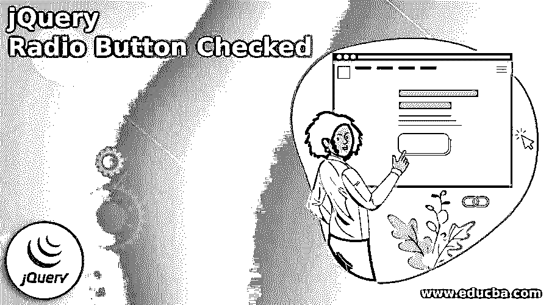
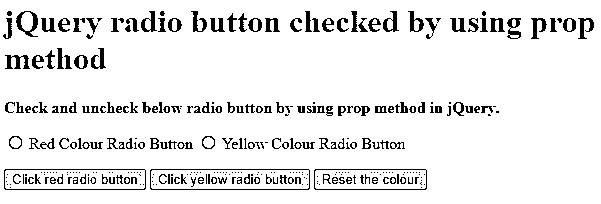
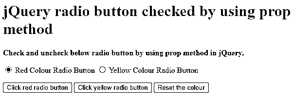
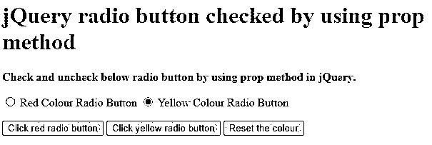
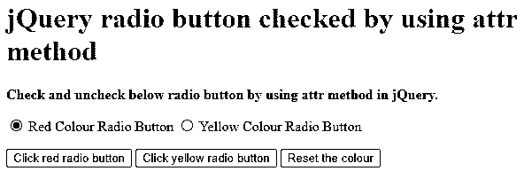
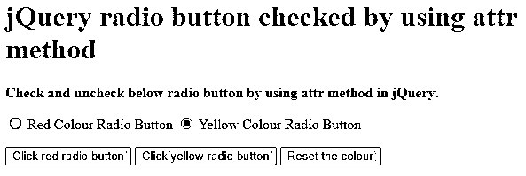

# jQuery 单选按钮已选中

> 原文：<https://www.educba.com/jquery-radio-button-checked/>




## jQuery 简介单选按钮已选中

使用 prop 方法检查 JQuery 单选按钮，或者我们可以动态地检查或取消检查单选按钮。例如当点击按钮或点击超链接时。prop 方法需要 JQuery 1.6 及更高版本。为了发现组中所选单选按钮的值，我们需要将 jQuery-checked 选择器与 Val 方法结合使用。

### jQuery 单选按钮选中概述

*   选中的选择器用于复选框、单选按钮和选择元素选项。使用所选选择器仅接收已选择元素的选项。
*   jQuery API 的 selector 和 Val 方法可用于获取所选单选输入或按钮的值。
*   我们可以利用 jQuery API 方法检查选择器来访问或选择单选值。

### 如何使用选中的 jQuery 单选按钮？

*   客户端脚本(如 jQuery 或 JavaScript)经常用于构建交互式的快速执行网站，这些网站可以进行简单的活动，如表单验证，而不需要再次访问 web 服务器。
*   一旦我们知道如何使用 jQuery 更新单选按钮，我们就可以基于按钮单击或任何其他元素选择等事件来更新选择。
*   通过 ID 引用单选按钮是预选它的最好方法之一。我们将前缀#附加到 ID，并将 checked 值设置为 true，以使用 ID 选择 DOM 元素。
*   单选按钮的值也可用于预选单选按钮。当我们不知道单选按钮的 ID 但知道其值时，按值选择会很方便。
*   我们可以使用父 div ID 选择值为 2 的元素。此时可以将 checked 属性设置为 true。
*   在某些情况下，当我们知道 DOM 中没有其他项等于预定值时，我们可以检查该值是否相等。在这种情况下，我们不需要父 ID。
*   当向用户提供互斥选项时，他们会得到单选按钮。使用 class='radio-inline '可以实现水平显示。
*   我们偶尔会从数据库表中检索条目，并希望为用户提供将字段从 True 更改为 False 的选项，反之亦然。
*   我们将根据记录的存储值选择两个单选按钮中的一个。一旦用户选择了一个单选按钮，我们需要知道两个变量。第一个是记录号，第二个是从两个单选按钮中选择哪个。
*   通过修改输入类型的 checked 属性，有两种方法可以动态改变当前选中的单选按钮。下面是用于动态更改属性的两种方法。

1.  通过使用 prop 方法。
2.  通过使用 attr 方法。

*   下面是这两种方法的详细说明如下。这个方法的语法是不同的。

### 通过使用 prop 方法

*   我们可以使用 prop 方法访问输入并更改其属性。此方法操作选中的属性，根据该属性是应选中还是应取消选中，将其设置为 true 或 false。
*   此方法对于访问输入和更改属性非常有用。下面是 jQuery 中 prop 方法的语法。

**语法—**

<small>网页开发、编程语言、软件测试&其他</small>

```
$("element").Prop("checked", true)
```

*   在上面的例子中，元素被定义为元素选项；此外，我们还使用了 prop 方法来检查 jQuery 中的单选按钮。
*   下面是 jQuery 单选按钮中 prop 方法的一个示例。

**代码—**

```
<!DOCTYPE html>
<head>
<title>
jQuery radio button checked by using prop method
</title>
<script src=
"https://code.jQuery.com/jQuery-2.2.4.min.js">
</script>
</head>
<body>
<h1 style="color: Red">
jQuery radio button checked by using prop method
</h1>
<b>
Check and uncheck the radio button below using the prop method in jQuery.
</b>
<p>
<input type="radio" name="option" id="Red">
Red Colour Radio Button
<input type="radio" name="option" id="Yellow">
Yellow Colour Radio Button
</p>
<p>
<button type="button" class="Check-Red">
Click the red radio button
</button>
<button type="button" class="check-yellow">
Click the yellow radio button
</button>
<button type="button" class="reset">
Reset the color
</button>
</p>
<script type="text/javascript">
$(document).ready(function () {
$(".Check-Red").click(function () {
$("#Red").prop("checked", true);
});
$(".check-yellow").click(function () {
$("#Yellow").prop("checked", true);
});
$(".reset").click(function () {
$("#Red").prop("checked", false);
$("#Yellow").prop("checked", false);
});
});
</script>
</body>
</html>
```










### 通过使用 attr 方法

*   它类似于 jQuery 中的 prop 方法，但更适合旧版本的 jQuery。我们可以使用 attr 方法访问输入并修改其属性。
*   无论我们想要选中还是取消选中某个内容，我们都必须更改“已选中”属性，并将其设置为 true 或 false。
*   当将属性设置为“true”时，需要提供一个 click 方法来确保选项组中的选项被修改。
*   此方法对于访问输入和修改属性非常有用。下面，jQuery 中 prop 方法的语法如下。

**语法—**

```
$("element").attr("checked", true)
```

*   在上面的例子中，元素被定义为元素选项；此外，我们还使用 attr 方法来检查 jQuery 中的单选按钮。
*   下面是 jQuery 单选按钮中 attr 方法的示例。

**代码—**

```
<!DOCTYPE html>
<head>
<title>
jQuery radio button checked by using attr method
</title>
<script src=
"https://code.jQuery.com/jQuery-2.2.4.min.js">
</script>
</head>
<body>
<h1 style="color: Red">
jQuery radio button checked by using attr method
</h1>
<b>
Check and uncheck the radio button below using the attr method in jQuery.
</b>
<p>
<input type="radio" name="option" id="Red">
Red Colour Radio Button
<input type="radio" name="option" id="Yellow">
Yellow Colour Radio Button
</p>
<p>
<button type="button" class="Check-Red">
Click the red radio button
</button>
<button type="button" class="check-yellow">
Click the yellow radio button
</button>
<button type="button" class="reset">
Reset the color
</button>
</p>
<script type="text/javascript">
$(document).ready(function () {
$(".Check-Red").click(function () {
$("#Red").attr("checked", true);
});
$(".check-yellow").click(function () {
$("#Yellow").attr("checked", true);
});
$(".reset").click(function () {
$("#Red").attr("checked", false);
$("#Yellow").prop("checked", false);
});
});
</script>
</body>
</html>
```








### 结论

jQuery API 的 prop 和 attr 方法可用于从单选输入或按钮中获取值。我们可以利用 jQuery API 方法检查选择器来访问或选择单选值。使用 prop 方法检查 JQuery 单选按钮，或者我们可以动态检查按钮。

### 推荐文章

这是一个 jQuery 单选按钮复选指南。这里我们讨论如何检查 jQuery 单选按钮以及概述和代码。您也可以阅读以下文章，了解更多信息——

1.  [Settimeout jQuery](https://www.educba.com/settimeout-jquery/)
2.  [jQuery 插入元素](https://www.educba.com/jquery-insert-element/)
3.  [jQuery 滚动平滑](https://www.educba.com/jquery-scroll-smooth/)
4.  [jQuery Ajax 同步](https://www.educba.com/jquery-ajax-synchronous/)


