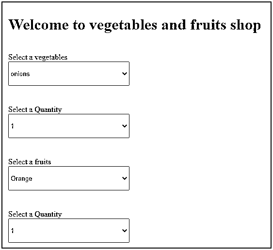
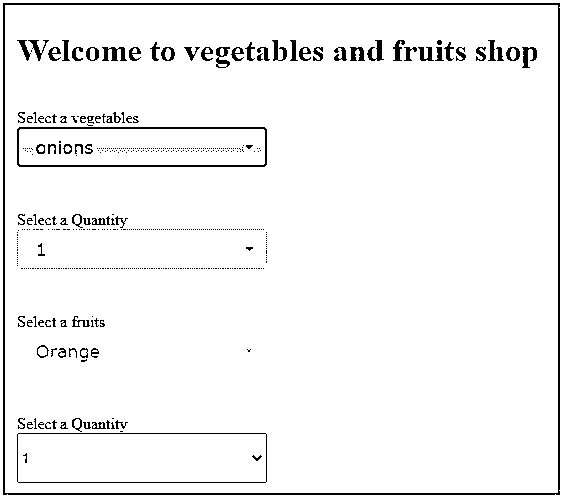
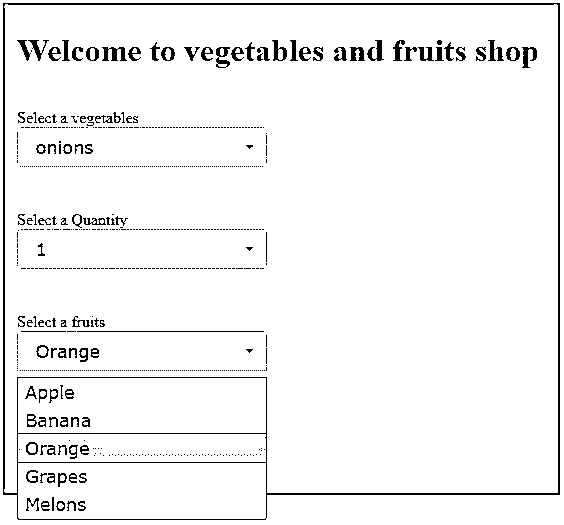

# jQuery UI Selectmenu

> 原文：<https://www.educba.com/jquery-ui-selectmenu/>


## jQuery UI 选择菜单简介

jQuery UI selectmenu 用于扩展和提供本机 HTML select 元素的行为和外观的可定制功能。jQuery UI selectmenu()函数是 jQuery UI 库中的内置函数。jQuery UI selectmenu()函数允许复制和扩展 HTML 的 select 元素的功能，使之超出其限制，因此它充当 select 元素的适当替换，小部件充当原始 select 元素的代理，并因此充当原始 select 元素的状态控件，用于提交和序列化。因此 selectmenu()将选择元素转换成可主题化和可定制的控件。

### 句法

JQuery UI selectmenu()方法的语法:

<small>网页开发、编程语言、软件测试&其他</small>

```
$("#menu").selectmenu();
```

运筹学

```
$("#menu").selectmenu(options);
```

运筹学

```
$("#menu").selectmenu("action", params);
```

#### 因素

**1。选项:**在第二个方法$(“# menu”)中。选择菜单(选项)，它只接受一个参数是选项。我们可以为该选项使用的可能值列表如下:

*   **禁用:**该选项通过设置为 true 来禁用或停用选择菜单。它的默认值是 false。
*   **appendTo:** 该选项追加菜单。它的默认值是
*   **图标:**该选项设置按钮中显示的图标。
*   **位置:**该选项设置菜单相对于按钮元素的位置。
*   **宽度:**该选项以像素为单位设置菜单的宽度。它的默认值是 NULL。

**2。动作:**在第三个方法$(“# menu”)中。selectmenu("action "，params)，它接受参数 action。action 参数指定要在该选择菜单上执行的操作。该操作的可能值为:

*   **关闭:**该动作指定关闭菜单。它不接受任何参数。
*   **destroy:** 用于破坏或移除 selectmenu 元素的功能，并返回原始状态。它不接受任何参数
*   **disable:** 用于禁用 selectmenu 元素的功能。它不接受任何参数。
*   **enable:** 用于启用 selectmenu 元素的功能。它不接受任何参数。
*   **实例:**用于获取 Selectmenu 的实例对象。它不接受任何参数。
*   **menuWidget:** 用于获取包含菜单元素的对象。它不接受任何参数。
*   **打开:**用于打开菜单元素。它不接受任何参数。
*   **选项:**用于获取当前包含键值对的对象。
*   **刷新:**用于返回原始状态，重新渲染菜单。它不接受任何参数。
*   **widget:** 用于获取包含按钮元素的对象。它不接受任何参数。

### 实现 jQuery UI selectmenu()方法的示例

让我们看看提到的例子:

#### 示例#1

我们通过下面的示例编写 HTML 代码来更清楚地理解 jQuery UI selectmenu()方法，其中 selectmenu()方法用于将 HTML 元素视为 select 元素，而不向 selectmenu()方法传递任何参数，如下所示:

**代码:**

```
<!doctype html>
<html lang ="en">
<head>
<meta charset="utf-8">
<title>This is an example for jQuery UI selectmenu() method</title>
<link rel="stylesheet" href="//code.jquery.com/ui/1.11.4/themes/smoothness/jquery-ui.css">
<link rel="stylesheet" href="https://cdn.educba.com/resources/demos/style.css">
<script src="//code.jquery.com/jquery-1.10.2.js"></script>
<script src="//code.jquery.com/ui/1.11.4/jquery-ui.js"></script>
<script>
$(function() {
$( "#vegetables" ).selectmenu();
$( "#fruits" ).selectmenu();
$( "#number" )
.selectmenu()
.selectmenu( "menuWidget" )
.addClass( "overflow" );
});
</script>
<style>
fieldset {
border: 10;
}
label {
color: green;
display: block;
margin: 40px 0 0 0;
}
select {
width: 250px;
height: 50px;
}
.overflow {
height: 200px;
}
</style>
</head>
<body>
<div>
<form action="#">
<fieldset>
<h1 color="red"> Welcome to vegetables and fruits shop </h1>
<label for="vegetables">Select a vegetables</label>
<select name="vegetables" id="vegetables">
<option>cabbage</option>
<option>cauliflower</option>
<option selected="selected">onions</option>
<option>broccoli</option>
<option>carrot</option>
<optgroup label="greens">
<option value="spinach">spinach</option>
<option value="mustard greens">mustard greens</option>
</optgroup>
</select>
<label for="number">Select a Quantity</label>
<select name="number" id="number">
<option selected="selected">1</option>
<option>2</option>
<option>3</option>
<option>4</option>
<option>5</option>
<option>6</option>
<option>7</option>
<option>8</option>
<option>9</option>
<option>10</option>
<option>11</option>
<option>12</option>
</select>
<label for="fruits">Select a fruits</label>
<select name="fruits" id="fruits">
<option>Apple</option>
<option>Banana</option>
<option selected="selected">Orange</option>
<option>Grapes</option>
<option>Melons</option>
</select>
<label for="number">Select a Quantity</label>
<select name="number" id="number">
<option selected="selected">1</option>
<option>2</option>
<option>3</option>
<option>4</option>
<option>5</option>
<option>6</option>
<option>7</option>
<option>8</option>
<option>9</option>
<option>10</option>
<option>11</option>
<option>12</option>
</select>
</fieldset>
</form>
</div>
</body>
</html>
```

**输出:**




#### 实施例 2

接下来，我们编写 HTML 代码来理解 jQuery selectmenu()方法，其中 selectmenu()方法使用类似 disabled 的选项，如下所示:

**代码:**

```
<!doctype html>
<html lang="en">
<head>
<meta charset="utf-8">
<meta name="viewport" content="width=device-width, initial-scale=1">
<title> This is an example for jQuery UI selectmenu() method </title>
<link rel="stylesheet" href="https://code.jquery.com/ui/1.11.4/themes/smoothness/jquery-ui.css">
<script src="https://code.jquery.com/jquery-1.10.2.js"></script>
<script src="https://code.jquery.com/ui/1.11.4/jquery-ui.js"></script>
<link rel="stylesheet" href="https:/resources/demos/style.css">
<script>
$(function() {
$( "#vegetables" ).selectmenu();
$( "#fruits" ).selectmenu().selectmenu( "option", "disabled", true );;
$( "#number" )
.selectmenu()
.selectmenu( "menuWidget" )
.addClass( "overflow" );
});
</script>
<style>
fieldset {
border: 10;
}
label {
color: green;
display: block;
margin: 40px 0 0 0;
}
select {
width: 250px;
height: 50px;
}
.overflow {
height: 200px;
}
</style>
</head>
<body>
<div>
<form action="#">
<fieldset>
<h1> Welcome to vegetables and fruits shop </h1>
<label for="vegetables">Select a vegetables</label>
<select name="vegetables" id="vegetables">
<option>cabbage</option>
<option>cauliflower</option>
<option selected="selected">onions</option>
<option>broccoli</option>
<option>carrot</option>
<optgroup label="greens">
<option value="spinach">spinach</option>
<option value="mustard greens">mustard greens</option>
</optgroup>
</select>
<label for="number">Select a Quantity</label>
<select name="number" id="number">
<option selected="selected">1</option>
<option>2</option>
<option>3</option>
<option>4</option>
<option>5</option>
<option>6</option>
<option>7</option>
<option>8</option>
<option>9</option>
<option>10</option>
<option>11</option>
<option>12</option>
</select>
<label for="fruits">Select a fruits</label>
<select name="fruits" id="fruits">
<option>Apple</option>
<option>Banana</option>
<option selected="selected">Orange</option>
<option>Grapes</option>
<option>Melons</option>
</select>
<label for="number">Select a Quantity</label>
<select name="number" id="number">
<option selected="selected">1</option>
<option>2</option>
<option>3</option>
<option>4</option>
<option>5</option>
<option>6</option>
<option>7</option>
<option>8</option>
<option>9</option>
<option>10</option>
<option>11</option>
<option>12</option>
</select>
</fieldset>
</form>
</div>
</body>
</html>
```

**输出:**




#### 实施例 3

接下来，我们编写 HTML 代码来理解 jQuery selectmenu()方法，其中 selectmenu()方法使用类似 open 的操作，如下所示:

**代码:**

```
<!doctype html>
<html lang="en">
<head>
<meta charset="utf-8">
<meta name="viewport" content="width=device-width, initial-scale=1">
<title> This is an example for jQuery UI selectmenu() method </title>
<link rel="stylesheet" href="https://code.jquery.com/ui/1.11.4/themes/smoothness/jquery-ui.css">
<script src="https://code.jquery.com/jquery-1.10.2.js"></script>
<script src="https://code.jquery.com/ui/1.11.4/jquery-ui.js"></script>
<link rel="stylesheet" href="https:/resources/demos/style.css">
<script>
$(function() {
$( "#vegetables" ).selectmenu();
$( "#fruits" ).selectmenu().selectmenu("open");;
$( "#number" )
.selectmenu()
.selectmenu( "menuWidget" )
.addClass( "overflow" );
});
</script>
<style>
fieldset {
border: 10;
}
label {
color: green;
display: block;
margin: 40px 0 0 0;
}
select {
width: 250px;
height: 50px;
}
.overflow {
height: 200px;
}
</style>
</head>
<body>
<div>
<form action="#">
<fieldset>
<h1> Welcome to vegetables and fruits shop </h1>
<label for="vegetables">Select a vegetables</label>
<select name="vegetables" id="vegetables">
<option>cabbage</option>
<option>cauliflower</option>
<option selected="selected">onions</option>
<option>broccoli</option>
<option>carrot</option>
<optgroup label="greens">
<option value="spinach">spinach</option>
<option value="mustard greens">mustard greens</option>
</optgroup>
</select>
<label for="number">Select a Quantity</label>
<select name="number" id="number">
<option selected="selected">1</option>
<option>2</option>
<option>3</option>
<option>4</option>
<option>5</option>
<option>6</option>
<option>7</option>
<option>8</option>
<option>9</option>
<option>10</option>
<option>11</option>
<option>12</option>
</select>
<label for="fruits">Select a fruits</label>
<select name="fruits" id="fruits">
<option>Apple</option>
<option>Banana</option>
<option selected="selected">Orange</option>
<option>Grapes</option>
<option>Melons</option>
</select>
<label for="number">Select a Quantity</label>
<select name="number" id="number">
<option selected="selected">1</option>
<option>2</option>
<option>3</option>
<option>4</option>
<option>5</option>
<option>6</option>
<option>7</option>
<option>8</option>
<option>9</option>
<option>10</option>
<option>11</option>
<option>12</option>
</select>
</fieldset>
</form>
</div>
</body>
</html>
```

**输出:**




### 结论

jQuery UI selectmenu()方法是一个内置方法，用于扩展和提供本机 HTML select 元素的行为和外观的可定制功能。

### 推荐文章

这是一个 jQuery UI 选择菜单的指南。这里我们讨论一个关于 jQuery UI 选择菜单的介绍，语法，例子来更好的理解。您也可以浏览我们的其他相关文章，了解更多信息——

1.  [jQuery UI 标签页](https://www.educba.com/jquery-ui-tabs/)
2.  [jQuery 过滤器](https://www.educba.com/jquery-filter/)
3.  [jQuery Tooltip](https://www.educba.com/jquery-tooltip/)
4.  [jQuery 包含](https://www.educba.com/jquery-contains/)


