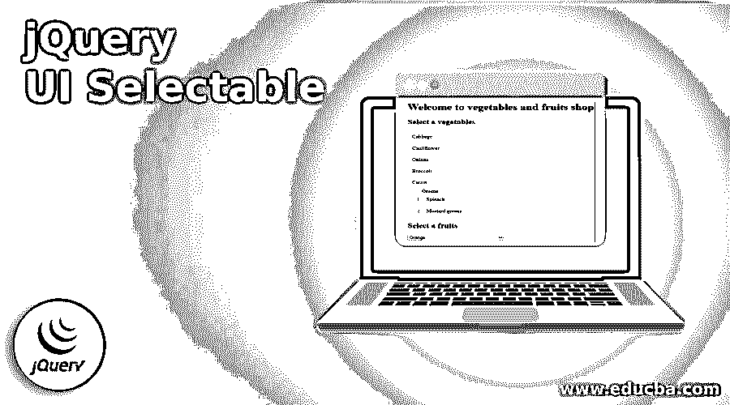
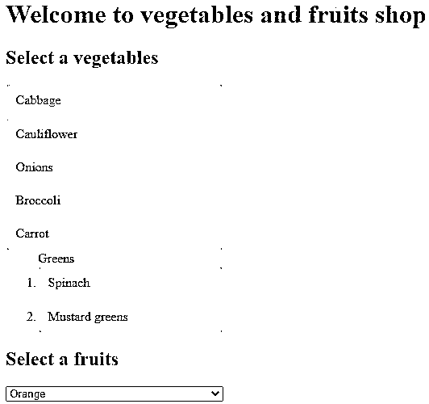
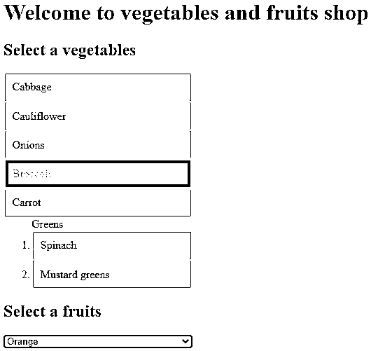
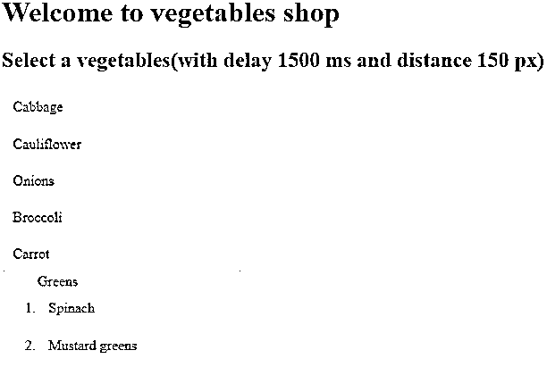
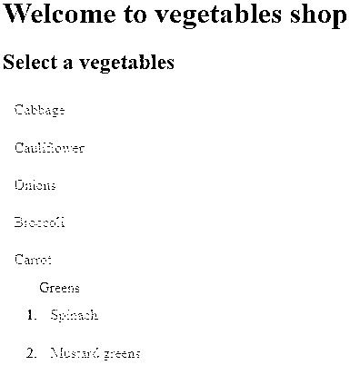

# jQuery UI 可选

> 原文：<https://www.educba.com/jquery-ui-selectable/>




## jQuery UI 可选简介

jQuery UI selectable 用于选择单个或多个 DOM 元素。jQuery UI selectable()方法是 jQuery UI 库中的内置函数。jQuery UI selectable()方法允许通过分别单击单个元素或在元素组上拖动鼠标来选择一个或多个元素。ctrl 按钮也可用于选择多个元素。

### 句法

有两种方法可以使用 selectable()方法:

<small>网页开发、编程语言、软件测试&其他</small>

```
$(selector, context).selectable(options)
```

**解释:**这是第一个声明特定 HTML 元素包含可选项目的方法。options 参数指定可选项目的外观和行为。如果选项不止一个，则可以使用此方法，并且每个选项应使用逗号分隔，如下所示:

```
object.$(selector, context).selectable({opt1 : value1, opt2 : value2 ... });
```

运筹学

```
$(selector, context).selectable("action", params)
```

**解释:**这是将 HTML 元素声明为可选元素并对该可选元素执行操作的第二种方法。要执行的操作以字符串 disable、enable、destroy 的形式传递可选元素。

### 因素

以下是给出的参数:

#### 1.选择

在第一个方法$(选择器，上下文)中。可选(选项)，它只接受一个选项参数。我们可以为该选项使用的可能值列表如下:

*   **禁用:**该选项通过设置为 true 来禁用或取消选择。它的默认值是 false。
*   **appendTo:** 该选项指定要附加选择帮助器的元素。它的默认值是 body。
*   **autoRefresh:** 该选项在每次选择操作开始时，通过将其设置为 true 来刷新大小和位置。它的默认值为 true。
*   **取消:**该选项防止点击特定元素开始选择。它的默认值是 input，button，textarea，option，select。
*   **延迟:**该选项指定元素被选中前的延迟时间，以毫秒为单位，可用于防止不必要的选择。它的默认值是 0。
*   **距离:**该选项设置在选择过程中，按下按钮时鼠标指针移动的像素距离。它可用于防止简单的单击被解释为组选择。它的默认值是 0。
*   **filter:** 该选项指定用它来过滤选择器。它的默认值是*。
*   **tolerance:** 它定义了选择帮助器应该选择一个项目的测试模式。它的默认值是 touch。

#### 2.行为

在第二个方法$(选择器，上下文)中。selectable("action "，params)，它接受两个参数，action 和 params。动作参数指定了要在这些可选元素上执行的动作。该操作的可能值为:

*   **destroy:** 用于破坏或移除可选元素的功能，并返回原始状态。它不接受任何参数。
*   **刷新:**用于刷新可选的，不接受任何参数。
*   **disable:** 它用于禁用可选的功能，它不接受任何参数。
*   **enable:** 它用于启用可选的功能，它不接受任何参数。
*   **option(optName):** 用于获取指定选项的值，作为 optName，是一个字符串。
*   **option():** 用于获取包含当前可选选项的键值对的当前对象。
*   **option(optName，value):** 用于设置传递 optName 的可选选项。
*   **选项(options):** 以选项-值对映射的形式设置一个或多个可选选项。
*   **widget:** 用来获取一个包含可选对象的对象，它不接受任何参数。

### 实现 jQuery UI selectable()方法的示例

下面是提到的一些例子:

#### 示例#1

接下来，我们编写 HTML 代码，通过下面的示例更清楚地理解 jQuery selectable()方法，其中 selectable()方法用于将 HTML 元素视为可选元素，而不向 selectable()方法传递任何参数，如下所示:

**代码:**

```
<!doctype html>
<html lang ="en">
<head>
<meta charset="utf-8">
<title>This is an example for jQuery UI selectable() method</title>
<link href="https://code.jquery.com/ui/1.10.4/themes/ui-lightness/jquery-ui.css" rel="stylesheet">
<script src="https://code.jquery.com/jquery-1.10.2.js"></script>
<script src="https://code.jquery.com/ui/1.10.4/jquery-ui.js"></script>
<script>
$(function() {
$( "#sel1" ).selectable();
});
</script>
<style>
#sel1 .ui-selecting { background: pink ; }
#sel1 .ui-selected { background: red; color: #000000; }
#sel1 { list-style-type: none; margin: 0;
padding: 0; width: 20%; }
#sel1 li { margin: 2px; padding: 0.6em;
font-size: 16px; height: 18px; }
.ui-widget-content {
border: o.5px solid #DDDDDD;
color: #8b0a58;
}
</style>  </head>
<body>
<h1> Welcome to vegetables and fruits shop </h1>
<h2> Select a vegetables</h2>
<ol name="vegetables" id="sel1">
<li class="ui-widget-content">Cabbage</li>
<li class="ui-widget-content">Cauliflower</li>
<li class="ui-widget-content">Onions</li>
<li class="ui-widget-content">Broccoli</li>
<li class="ui-widget-content">Carrot</li>
<ol label="greens">Greens
<li class="ui-widget-content" value="spinach">Spinach</li>
<li class="ui-widget-content" value="mustard greens">Mustard greens</li>
</ol>
</ol>
<h2>Select a fruits</h2>
<select name="fruits" id="sel1">
<option class="ui-widget-content">Apple</option>
<option class="ui-widget-content">Banana</option>
<option class="ui-widget-content" selected="selected">Orange</option>
<option class="ui-widget-content">Grapes</option>
<option class="ui-widget-content">Melons</option>
</select>
</body>
</html>
```

**输出:**




单击该项目后，该项目将被选中，输出如下:




#### 实施例 2

接下来，我们编写 HTML 代码来理解 jQuery selectable()方法，其中 selectable()方法使用延迟和距离等选项，如下所示:

**代码:**

```
<!doctype html>
<html lang ="en">
<head>
<meta charset="utf-8">
<title>This is an example for jQuery UI selectable() method</title>
<link href="https://code.jquery.com/ui/1.10.4/themes/ui-lightness/jquery-ui.css" rel="stylesheet">
<script src="https://code.jquery.com/jquery-1.10.2.js"></script>
<script src="https://code.jquery.com/ui/1.10.4/jquery-ui.js"></script>
<script>
$(function() {
$( "#sel1" ).selectable({
delay : 1500 ,
distance : 150
});
});
</script>
<style>
#sel1 .ui-selecting { background: pink ; }
#sel1 .ui-selected { background: red; color: #000000; }
#sel1 { list-style-type: none; margin: 0;
padding: 0; width: 20%; }
#sel1 li { margin: 2px; padding: 0.6em;
font-size: 16px; height: 18px; }
.ui-widget-content {
border: o.5px solid #DDDDDD;
color: #8b0a58;
}
</style>  </head>
<body>
<h1> Welcome to vegetables shop </h1>
<h2> Select a vegetables(with delay 1500 ms and distance 150 px) </h2>
<ol name="vegetables" id="sel1">
<li class="ui-widget-content">Cabbage</li>
<li class="ui-widget-content">Cauliflower</li>
<li class="ui-widget-content">Onions</li>
<li class="ui-widget-content">Broccoli</li>
<li class="ui-widget-content">Carrot</li>
<ol label="greens">Greens
<li class="ui-widget-content" value="spinach">Spinach</li>
<li class="ui-widget-content" value="mustard greens">Mustard greens</li>
</ol>
</ol>
</body>
</html>
```

**输出:**




#### 实施例 3

接下来，我们编写 HTML 代码来理解 jQuery selectable()方法，其中 selectable()方法使用禁用操作，如下所示:

**代码:**

```
<!doctype html>
<html lang ="en">
<head>
<meta charset="utf-8">
<title>This is an example for jQuery UI selectable() method</title>
<link href="https://code.jquery.com/ui/1.10.4/themes/ui-lightness/jquery-ui.css" rel="stylesheet">
<script src="https://code.jquery.com/jquery-1.10.2.js"></script>
<script src="https://code.jquery.com/ui/1.10.4/jquery-ui.js"></script>
<script>
$(function() {
$( "#sel1" ).selectable();
$( "#sel1" ).selectable('disable');
});
</script>
<style>
#sel1 .ui-selecting { background: pink ; }
#sel1 .ui-selected { background: red; color: #000000; }
#sel1  {list-style-type: none; margin: 0;
padding: 0; width: 20%; }
#sel1 li { margin: 2px; padding: 0.6em;
font-size: 16px; height: 18px; }
.ui-widget-content {
border: o.5px solid #DDDDDD;
color: #8b0a58;
}
</style>  </head>
<body>
<h1> Welcome to vegetables shop </h1>
<h2> Select a vegetables </h2>
<ol name="vegetables" id="sel1">
<li class="ui-widget-content">Cabbage</li>
<li class="ui-widget-content">Cauliflower</li>
<li class="ui-widget-content">Onions</li>
<li class="ui-widget-content">Broccoli</li>
<li class="ui-widget-content">Carrot</li>
<ol label="greens">Greens
<li class="ui-widget-content" value="spinach">Spinach</li>
<li class="ui-widget-content" value="mustard greens">Mustard greens</li>
</ol>
</ol>
</body>
</html>
```

**输出:**




### 结论

jQuery UI selectable()方法是 jQuery UI 库中的内置方法，用于通过分别单击和拖动元素来选择单个或多个元素。

### 推荐文章

这是一个 jQuery UI 可选的指南。在这里，我们讨论 jQuery UI Selectable 的介绍，以及相应的语法和编程示例。您也可以浏览我们的其他相关文章，了解更多信息——

1.  [jQuery UI 标签页](https://www.educba.com/jquery-ui-tabs/)
2.  [jQuery Tooltip](https://www.educba.com/jquery-tooltip/)
3.  [jQuery 过滤器](https://www.educba.com/jquery-filter/)
4.  [jQuery 包含](https://www.educba.com/jquery-contains/)


