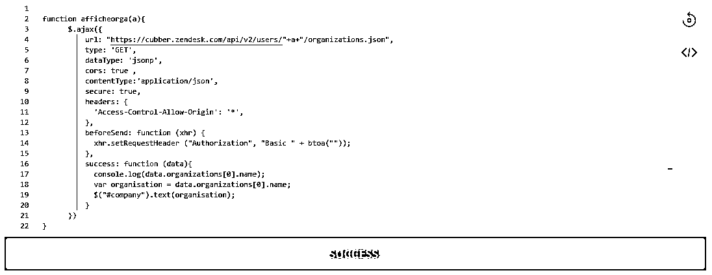

# jQuery Ajax 颜色

> 原文：<https://www.educba.com/jquery-ajax-cors/>


## jQuery Ajax CORS 简介

jQuery ajax CORS 只不过是跨来源的资源共享。JQuery ajax CORS 将 HTTP 头添加到跨域 HTTP 请求和回答中。这些头指示请求的来源，服务器必须在响应中声明是否将使用头向该来源提供资源。JQuery ajax CORS 是一种安全的技术，因为它交换了头部。

### 什么是 jQuery Ajax CORS？

*   如果我们网站上的脚本运行在一个域上，例如 domain.com，并且我们想要使用 XmlHttpRequest 或 XDomainRequest 从 otherdomain.com 域请求一个资源，那么 JQuery ajax CORS 就是一个跨源请求。出于安全原因，浏览器总是禁止这些请求。
*   服务器必须支持 CORS，并发出信号表明客户端的域被允许这样做。这种方法的好处是浏览器会自动处理它，所以 web 应用程序开发人员不必为此担心。
*   浏览器添加额外的源和引用头，以指示简单跨站点请求的请求域，即不指定自定义头的 get 和 POSTs。
*   在开发复杂的客户端应用程序时，经常需要对页面来源之外的站点进行 Ajax 调用。
*   Web 应用程序开发人员现在有了一种浏览器支持的技术，可以以安全的方式向另一个域发出 XmlHttpRequests，这就是跨源资源共享(CORS)规范，它现在是 W3C 推荐的候选规范。
*   最后，我们可以说所有的主流浏览器都支持 CORS。火狐 3.5、Safari 4、Chrome 3 是最先看到的。
*   根据 CORS 规范，浏览器必须对符合标准的请求进行预检。因此，除了 GET、POST 和 HEAD 之外，请使用其他请求方法。
*   可以使用自定义标题。在请求正文中使用除 text/plain、application/x-www-form 或 multipart/form-data 之外的内容类型。
*   在预检请求中使用 OPTIONS request 方法，以确保服务器支持 CORS，并且支持客户端要提交的请求类型。
*   在跨域 XmlHttpRequest 中，浏览器不会传递 Cookies 或 HTTP Auth 信息。
*   客户端应用程序必须设置 XmlHttpRequest 或 XDomainRequest 的凭据属性，以指示应该发送它们。
*   默认情况下，该值为 false 且未设置。如果我们想在请求访问位于 otherdomain.com 的名为 some-resource 的资源时包含用户可能已经获得的域 otherdomain.com 的任何 cookies

### 使用 jQuery ajax CORS

*   CORS 有许多解决方案，用于处理必须在不支持 CORS 的浏览器中运行的 web 应用程序中的跨来源通信约束。
*   JSONP 是一种使用 HTML 脚本元素异常来规避同源安全限制的方法。
*   脚本标签可以从单独的域中加载 JavaScript，查询参数可以添加到脚本 URI 中，以向托管脚本的服务器传达我们想要访问的资源的信息。
*   OpenAjax 是一个 JavaScript Ajax 模块，允许将许多客户端组件集成到一个 web 应用程序中。
*   OpenAjax Hub JavaScript 模块允许可信和不可信组件在同一页面上共存并相互通信。
*   该框架有一个安全管理器，使应用程序能够定义组件消息安全策略。
*   Easy XDM 是一个 JavaScript 包，允许通过 iframes 使用字符串进行跨域通信。它的功能类似于 OpenAjax Hub，但是没有安全管理器。
*   被代理的 iframe 是来自我们希望在页面上与之通信的域的 iframe。
*   这意味着我们可以在这个额外的域上托管页面。iframe 中的 JavaScript 充当包含我们想要使用的资源的服务器的反向代理。
*   后消息协议将在我们的应用程序和 rest 代理之间进行通信。

### CORS 错误 jQuery ajax

*   浏览器拒绝访问远程资源是开发人员面临的一个典型问题。这通常发生在利用 jQuery Ajax 接口、Fetch API 或基本 XMLHttpRequest 发出 Ajax 跨域请求时。
*   因此，AJAX 请求没有完成，也没有返回任何数据。相反，当进行跨原点请求时，浏览器发送具有当前域值的原点头。CORS 是一种描述通过与浏览器和 web 服务器交互来确定网页是否可以访问来自不同来源的资源的过程的技术。
*   直截了当的单个请求直截了当的跨域请求包含以下元素。
*   当进行跨来源请求时，浏览器发送具有当前域值的来源报头。
*   该服务器似乎不支持 CORS。服务器答案缺少“Access-Control-Allow-Origin”标头。
*   通过包含自定义标题，我们触发了预检请求。浏览器代理自动向出站同源 AJAX 连接添加特殊的头，以实现分布式跟踪功能。
*   当 AJAX 请求返回重定向状态代码时，浏览器将立即对重定向的 URL 进行相同的 AJAX 调用。
*   API 是将丰富的 web 体验结合在一起的缝线。但是，跨域请求仅限于 JSON-P 或在浏览器中设置自定义代理。
*   W3C 的跨来源资源共享规范允许浏览器跨域通信。通过构建在 XMLHttpRequest 对象之上，CORS 使开发人员能够使用与相同域请求相同的习惯用法。
*   下面是一个 CORS 错误的例子，jQuery ajax 如下。

**代码—**

<small>网页开发、编程语言、软件测试&其他</small>

```
function afficheorga(a){
$.ajax({
url: "https://cubber.zendesk.com/api/ organizations.json",
type: 'GET',
dataType: 'jsonp',
CORS: true ,
contentType:'application/json',
secure: true,
headers: {
'Access-Control-Allow-Origin': '*',
},
beforeSend: function (xhr) {
xhr.setRequestHeader ("Authorization", "Basic " + btoa(""));
},
success: function (data){
console.log(data.organizations[0].name);
var organisation = data.organizations[0].name;
$("#company").text(organisation);
}
}) }
```




### JQuery ajax CORS 代码示例

下面是 jQuery ajax CORS 的例子如下。

**示例—**

```
<!DOCTYPE html>
<html>
<head>
<script src = "https://ajax.googleapis.com/ajax/libs/jQuery/3.3.1/jQuery.min.js"></script>
<script>
var settings = {
'cache': false,
'dataType': "jsonp",
"async": true,
"crossDomain": true,
"url": "https://maps.googleapis.com/maps/api/distancematrix/json?units ",
"method": "GET",
"headers": {
"accept": "application/json",
"Access-Control-Allow-Origin":"*"
}
}
$.ajax(settings).done(function (response) {
console.log(response);
});
</script>
</head>
<body>
<p id="pid">JQuery ajax Code executed successfully.</p>
</body>
</html>
```


### 结论

如果我们网站上的脚本运行在一个域上，例如 domain.com，并且我们想要使用 XmlHttpRequest 或 XDomainRequest 从 otherdomain.com 域请求资源，则 JQuery ajax CORS 是跨源请求。JQuery ajax CORS 将 HTTP 头添加到跨域 HTTP 请求和回答中。

### 推荐文章

这是一个 jQuery Ajax CORS 指南。这里我们讨论 jQuery ajax CORS 的例子以及代码和输出。您也可以看看以下文章，了解更多信息–

1.  [jQuery 数组推送](https://www.educba.com/jquery-array-push/)
2.  [jQuery 插入元素](https://www.educba.com/jquery-insert-element/)
3.  [jQuery 插入](https://www.educba.com/jquery-insert/)
4.  [jquery ajax url](https://www.educba.com/jquery-ajax-url/)


