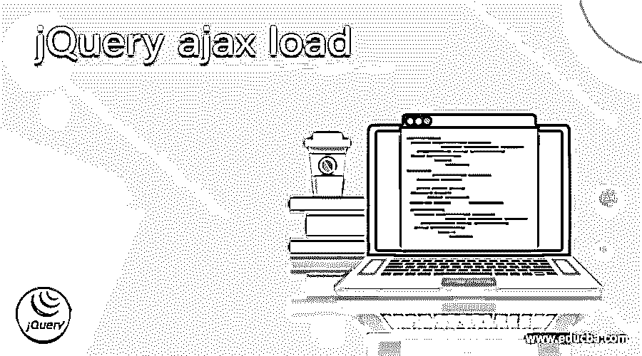
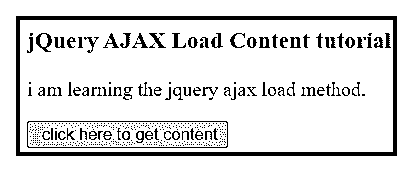
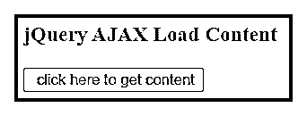

# jQuery ajax 加载

> 原文：<https://www.educba.com/jquery-ajax-load/>




## jQuery ajax 加载简介

*   jQuery ajax 负载处理其他服务器的数据或数据文件。
*   jQuery ajax load 是将信息加载到服务器并显示数据的过程。
*   Ajax load 是一种从 HTTP 服务器加载数据并将数据返回到所需元素的简单方法。
*   jQuery Ajax load 是一个在 HTTP 服务器上工作的函数，用于从其他文件(如 HTML 和文本)中访问数据。
*   Ajax load 是一种使用 HTTP 向服务器发送请求以加载数据并在输出屏幕中显示数据的方法。
*   Ajax load 是将另一个文件的数据加载到 HTTP 服务器并将数据显示到 web 应用程序页面的过程。
*   Ajax load 是一个与 jQuery 选择器一起工作的参数，并与 HTTP 服务器连接。
*   Ajax load 是连接服务器和其他数据文件的一种简单而重要的方法。

### 句法

*   Ajax load 是一种连接服务器、其他数据文件和网页的简单方法。
*   Ajax 加载语法如下。

```
$(" jQuery selector ").load (URL parameter, Data parameter, Callback function);
```

*   语法描述:
    *   Ajax load 语法使用三个术语来加载、访问和返回数据。
    *   URL 参数:URL 参数是从服务器加载数据所必需的。URL 可以将请求发送到服务器。
    *   数据参数:这是一个可选参数。普通对象或字符串是参数的数据类型。它有助于发送带有键和值的请求。
    *   回调函数:这是一个可选函数。该函数在请求完成后工作。
*   基本的 Ajax 加载语法如下。

```
$("jQuery selector").load ("URL parameter");
```

*   语法描述:
    *   该语法只向选择器返回 URL 数据。
    *   这个 URL 向 HTTP 服务器发送一个请求。
*   基本的 Ajax load with ID 语法如下。

```
$("jQuery selector").load ("URL #ID");
```

*   语法描述:
    *   此语法在使用选择器时仅返回部分数据。
    *   “#ID”正在选择选择器，并且只显示选择器的部分数据。
*   基本的 Ajax 加载语法如下。

```
<script>
$(document).ready (function () {
$("selector").load (" URL ");
});
</script>
```

*   语法描述:
    *   选择器被称为 ID、类、标签或属性。
    *   URL 是数据文件，如 HTML 文件、文本文件或 web 链接。

### Ajax load 方法在 jQuery 中是如何工作的？

*   HTML 页面是通过带有。html 扩展。
    *   例如:jQueryLoad.html
*   JQuery 文件放在主体部分的 jQueryLoad.html 文件中。
*   对于 jQuery，Ajax load 需要下载 jQuery 库或者使用 jQuery CDN 版本链接。
    *   从 jQuery.com 下载 jQuery 的最新开发版本或产品版本。
    *   用户可以通过 jQuery 库在 web 应用程序中使用离线 jQuery。
    *   HTML 页面中的 jQuery 版本。jQuery 链接在下面。

```
<script src = "https://ajax.googleapis.com/ajax/libs/jQuery/3.5.1/jQuery.min.js">
</script>
```

*   用户可以通过 jQuery CDN 版本链接在 web 应用中使用在线 jQuery。

```
<script>
$(document).ready (function () {
$("#click").click (function () {
$("#load").load (" jQuery.html ");
});
});
</script>
```

*   在网页的主体部分写一段 HTML 代码。

```
<body>
<div id = "load">
<h3>  jQuery AJAX Load Content </h3>
</div>
<input type = "button" value = "click here to get content" id = "click">
</body>
```

*   在 jQuery.html 中写入数据。

```
<h3>  jQuery AJAX Load Content tutorial </h3>
<p id="point"> i am learning the jQuery ajax load method. </p>
```

*   结合 jQuery Ajax 加载方法的工作流程。

```
<!DOCTYPE html>
<html>
<head>
<title> jQuery Ajax load example </title>
<script src="https://ajax.googleapis.com/ajax/libs/jQuery/3.5.1/jQuery.min.js">
</script>
<script>
$(document).ready (function () {
$("#click").click (function () {
$("#load").load ("jQuery.html");
});
});
</script>
</head>
<body>
<div id = "load">
<h3> jQuery AJAX Load Content </h3>
</div>
<input type = "button" value = "click here to get content" id = "click">
</body>
</html>
```

### jQuery ajax 加载示例

下面提到了不同的例子:

#### 示例#1

基本的 Ajax 加载示例和输出。

<small>网页开发、编程语言、软件测试&其他</small>

**代码:**

```
<!DOCTYPE html>
<html>
<head>
<title> jQuery Ajax load example </title>
<script src="https://ajax.googleapis.com/ajax/libs/jQuery/3.5.1/jQuery.min.js">
</script>
<script>
$(document).ready (function () {
$("#click").click (function () {
$("#load").load ("jQuery.html");
});
});
</script>
</head>
<body>
<div id = "load">
<h3> jQuery AJAX Load Content </h3>
</div>
<input type = "button" value = "click here to get content" id = "click">
</body>
</html>
```

**输出:**

*   在点击输出按钮之前


*   点击输出按钮后




#### 实施例 2

带有 id 的基本 Ajax 加载示例和输出。

**代码:**

```
<!DOCTYPE html>
<html>
<head>
<title> jQuery Ajax load example </title>
<script src = "https://ajax.googleapis.com/ajax/libs/jQuery/3.5.1/jQuery.min.js">
</script>
<script>
$(document).ready (function () {
$("#click").click (function () {
$("#load").load ("jQuery.html #point");
});
});
</script>
</head>
<body>
<div id = "load">
<h3> jQuery AJAX Load Content </h3>
</div>
<input type = "button" value = "click here to get content" id = "click">
</body>
</html>
```

**输出:**

*   在点击输出按钮之前




*   点击输出按钮后


#### 实施例 3

基本的 Ajax 加载示例和输出。

**代码:**

```
<!DOCTYPE html>
<html>
<head>
<title> jQuery Ajax load example </title>
<script src = "https://ajax.googleapis.com/ajax/libs/jQuery/3.5.1/jQuery.min.js">
</script>
<script>
$(document).ready (function () {
$("#click").click (function () {
$("#load").load ("https://www.educba.com");
});
});
</script>
</head>
<body>
<div id = "load">
<h3> jQuery AJAX Load Content </h3>
</div>
<input type = "button" value = "click here to get content" id = "click">
</body>
</html>
```

**输出:**


点击按钮后，您可以直接进入“educba.com”网站。这个网站链接了服务器上的所有数据。

### 结论

*   jQuery Ajax load 方法使服务器数据变得安全，并简单地在 web 应用程序上显示数据。
*   它为 HTTP 服务器提供数据支持，并管理内存大小。
*   在 jQuery Ajax 中，这是一种用户友好、易于使用的交互式方法。

### 推荐文章

这是一个 jQuery ajax 加载指南。这里我们讨论 Ajax load 方法如何在 jQuery 中工作，并给出例子和输出。您也可以看看以下文章，了解更多信息–

1.  [jQuery scrollLeft](https://www.educba.com/jquery-scrollleft/)
2.  [jQuery 数组](https://www.educba.com/jquery-array/)
3.  [jQuery 前置到](https://www.educba.com/jquery-prependto/)
4.  [jQuery ajax 超时](https://www.educba.com/jquery-ajax-timeout/)


