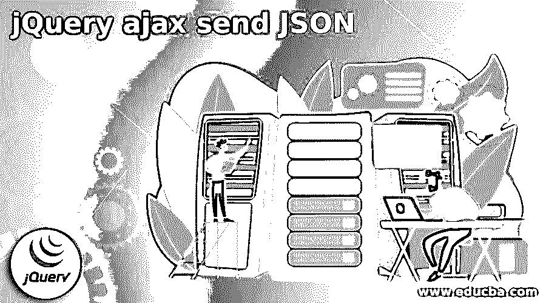
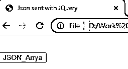

# jQuery ajax 发送 JSON

> 原文：<https://www.educba.com/jquery-ajax-send-json/>




## jQuery ajax send JSON 简介

基本上，Ajax 用于与服务器交换数据并更新当前网页，而无需刷新和重新加载整个页面。通过使用 jQuery ajax 方法，我们可以调用它们，或者我们可以说，我们可以从远程服务器请求不同类型的文本和 post，如 HTML、XML 和 JSON，它使用 HTTP 协议的 get 和 post 方法。所以在这个请求和方法的帮助下，我们可以很容易地将外部数据直接加载到当前网页中。JSON 是一个 JavaScript 库，用于遍历 HTML 文档。

### 什么是 jQuery ajax send json？

jQuery 承担了许多需要多行 JavaScript 代码才能完成的普通任务，并将它们包装成可以用一行代码调用的策略。jQuery 同样处理大量来自 JavaScript 的复杂事物，类似于 AJAX 调用和 DOM 控制。

<small>网页开发、编程语言、软件测试&其他</small>

jQuery 库包含附带的组件:

*   HTML/DOM 控件
*   CSS 控件
*   HTML 场合技巧
*   影响和活动
*   创建交互式、快速动态网页应用的网页开发技术
*   公用事业

jQuery 改进了 HTML 报告导航、事件处理、生动化和 Ajax 通信，以加快 web 发展。jQuery 是一个 JavaScript 工具舱，旨在通过编写更少的代码来完成不同的任务。下面是 jQuery 支持的重要中心组件的概要

*   DOM control : JQuery 通过使用一个名为 Sizzle 的跨程序开源选择器引擎，简化了 DOM 的选择、编排和改变。
*   JQuery 提供了一种精致的方法来捕捉各种各样的场合，例如，一个客户端点击一个连接，而不需要用场合监督来弄乱 HTML 代码本身。
*   AJAX 支持:通过使用 jQuery，我们可以根据自己的需求响应一个结构良好的网页。
*   **Activities:** JQuery 伴随着许多潜在的活跃性影响，您可以在您的站点中使用它们。
*   **轻量化:**非常轻量化。
*   跨浏览器支持:jQuery 有跨程序支持，在 IE 6.0+，FF 2.0+，Safari 3.0+，Chrome 和 Opera 9.0+中运行良好
*   最新技术: JQuery 支持 CSS3 选择器和基本的 XPath 语法

JSON 代表 JavaScript 对象符号。这是一种语言自治的、基于文本的安排，通常用于 web 应用程序中的信息交流。在本文中，我们将看看如何利用 HTTP GET 需求来堆叠 JSON 信息(我们同样可以利用不同的动作词，比如 POST)。

我们为什么会选择 JSON 而不是 XML 呢？使用 JSON 的最大好处是生产率。JSON 不那么冗长和混乱，带来了更少的字节和更快的解析方法。这允许我们处理更多的以 JSON 形式发送的消息，而不是 XML 形式。此外，JSON 有一个非常有效和规则的项目描述提示配置，例如，在 BSON，类似 JSON 的文章被放在一个双重组织中。

JSON jQuery 的语法如下。

的美元。如果不需要很多额外的设计，getJSON()技术是直接使用 JSON 的方便伙伴。基本上，它归结为更广泛的美元。ajax()助手，当然是被利用的理想选择。

### 如何发送 JSON 而不是查询？

现在让我们看看如何发送 JSON 而不是查询，如下所示。

使用 JSON 代替查询有不同的方法，如下所示。

在第一种方法中，我们需要使用 JSON.stringify 将您的项目序列化为 JSON，然后确定 contentType，以便您的工人理解它的 JSON。如下面代码所示。

```
$.ajax({
url: specified url,
type: "POST",
data: JSOM.stringify(data),
contentType: "app/json",
complete:
});
```

第二种方式，我们可以使用 dataType 选项来解析接收到的数据。对于第二种方法，我们需要使用如下代码。

```
$.ajax({
url: specified url,
type: "POST",
data: JSOM.stringify(data),
contentType: "app/json: charset=UTF-8",
complete:
});
```

第三种方式，我们意识到许多像 ASP.NET MVC 这样的结构对于处理 JSON.stringify 有着内在的用处。作为内容类型，我的情况有些独特，所以这可能对以后的人有所帮助。

### jquery ajax 发送 json 代码示例

现在让我们看看 ajax 发送 JSON 的例子，以便更好地理解。

首先，我们需要创建一个新项目，并指定您想要的任何名称。之后，我们需要创建具有任何指定名称的 Html 文件，这里我们创建了 index.html 文件并编写了下面提到的代码。

```
<!DOCTYPE html>
<html>
<head>
<meta name="view" content="width=device-width" />
<title>Json sent with JQuery</title>
<script src="https://ajax.googleapis.com/ajax/libs/jquery/3.3.1/jquery.min.js"></script>
<script type="text/javascript" src="http://cdnjs.cloudflare.com/ajax/libs/json2/20130526/json2.min.js"></script>
<script>
$(document).ready(function () {
$("#btnSend").click(function () {
var Book = [{ BookId: 1, BookName: 'ABX', BookPrice: 1520 }
, { BookId: 2, StockName: 'DEMO', BookPrice: 520 }
, { BookId: 3, BookName: 'Sample', BookPrice: 120 }];
$.ajax({
type: "POST",
url: '@Url.Action("GetJsonData", "Book")',
dataType: "json",
data: JSON.stringify({ Book }),
contentType: "application/json; charset=utf-8",
dataType: "json",
success: function (data) {
let output = data.map(i => "<tr><td>" + i.bookId + "</td><td>" + i.BookName + "</td><td>" + i.BookPrice + "</td></tr>");
$("#output").html(output);
$("#tbstock").show();
}
});
});
});
</script>
</head>
<body>
<p>
<table style="display:none" id="tbstock" class="table table-bordered">
<tr class="table-head">
<th>Book Id</th>
<th> Book Name</th>
<th> Book Price</th>
</tr>
<tbody id="output">
</table>
</p>
<br />
<input type="Submit" id="btnSend" name="Send Array" value="Send Array" />
</body>
</html>
After that, we need to create the Models and write the following code.
public class Bookkmodel
{
public int bookid { get; set; }
public string BookName { get; set; }
public decimal BookPrice { get; set; }
}
Now create a Book Controller as follows.
public class BookController : Controller
{
public ActionResult Index()
{
return View();
}
public JsonResult GetJsonData(List<Bookmodel> Book)
{
return Json(Book);
}
}
```

**解释**

上面程序的输出将通过下面的屏幕截图来说明。




### 结论

我们希望通过这篇文章，您能够了解更多关于 jQuery ajax send JSON 的知识。从上面的文章中，我们已经了解了 jQuery ajax 的基本思想，我们还看到了 jQuery ajax send JSON 的表示和示例。从本文中，我们了解了如何以及何时使用 jQuery ajax 发送 JSON。

### 推荐文章

这是一个 jQuery ajax 发送 JSON 的指南。这里我们讨论了 jQuery ajax 的基本思想，我们还看到了 jQuery ajax send JSON 的表示和示例。您也可以看看以下文章，了解更多信息–

1.  [jQuery json stringify](https://www.educba.com/jquery-json-stringify/)
2.  [jQuery keycode](https://www.educba.com/jquery-keycode/)
3.  [jQuery ajax 请求](https://www.educba.com/jquery-ajax-request/)
4.  [jquery Ajax uccess()](https://www.educba.com/jquery-ajaxsuccess/)


