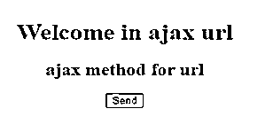
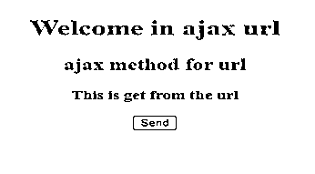

# jquery ajax url

> 原文：<https://www.educba.com/jquery-ajax-url/>


## jquery ajax url 简介

基本上，jQuery ajax 提供了不同的方法来执行不同类型的 ajax 核心功能。Ajax URL 是 Ajax 提供给用户的核心功能之一，用户可以根据自己的需求使用这种方法并执行不同的操作。Ajax URL 使用异步 HTTP 请求通过服务器发送请求，我们也可以使用 URL 从服务器检索数据。通常，URL 是一个字符串，用于提交和从服务器检索数据。通过 URL，我们可以选择发送 JSON 的具体格式；我们可以根据需要使用任何格式。

### 什么是 jquery ajax URL？

Ajax 是一项创新，它允许工程师做出与众不同的 HTTP 要求，而不需要整页更新。为了使这个循环不像在纯 JavaScript 中那样庞大，开发人员已经使用 jQuery 库很长时间了。在我的文章《jQuery 简写 Ajax 方法介绍》中，我研究了 jQuery 最常用的 Ajax 简写技术的一部分:$。get()，$。post()和$。加载()。它们是用几行代码实现 Ajax 需求的有用技术。

<small>网页开发、编程语言、软件测试&其他</small>

有时，我们需要更多的能力来调用 Ajax。例如，我们需要确定万一 Ajax 调用失败时应该发生什么，或者我们需要完成一个 Ajax 请求，但是无论何时在特定时间内恢复，都可能需要它的结果。在这种情况下，我们可以依赖 jQuery 提供的另一个容量，称为$。ajax()

jQuery ajax()技术给出了 ajax 在 jQuery 中的主要用途。它向服务器发送不同寻常的 HTTP 请求。jQuery $。ajax()工作被用来完成一个与众不同的 HTTP 请求。它是很久以前添加到库中的，从 rendition 1.0 开始就存在了。的美元。ajax()工作是在最近引用的文章中检查的每个容量利用预设设置在后台调用的事情。

现在让我们看看 ajax url 的语法如下。

```
$.ajax(url);
$.ajax(url,[specified format of JSON]);
```

**解释**

通过使用上面的语法，我们尝试实现如图所示的 ajax URL，这里 URL 用于指定 URL 为字符串，用于根据我们的要求从服务器提交和检索数据。在下一个字段中，我们有一个带有选项的 ajax URL，如图所示，该字段用于根据用户要求提交特定格式的 JSON。

URL 边界是一个字符串，包含 Ajax 调用需要到达的 URL，而指示的设计是一个 item struct，包含 Ajax 需求的安排。

在它的第一个结构中，这个容量利用 URL 边界和指定设计中确定的选择来完成 Ajax 需求。在随后的结构中，URL 在预定义的设计边界中指示，或者可以被忽略，在这种情况下，对当前页面进行请求。

这种能力所承认的选择的纲要，在下面的区域中被描绘，是非常长的，所以我将保持他们的描绘简短。如果您需要从里到外关注它们的重要性，您可以参考$的权威文档。ajax()。

### 如何使用 jQuery ajax url？

现在让我们看看如何使用 ajax URL，如下所示。

下面给出了几个阶段。遵循这些方法可以更加明白无误地理解 ajax()技术的使用。

*   首先，我们需要下载一个 jQuery 库，或者通过访问其权威站点来发现 jQuery 最新版本的连接。
*   第二，我们需要做一个 HTML 报表，包括 jQuery 库。
*   然后，在这一点上，在

现在，我们来看看利用 ajax()策略的代码。在这个模型中，我们包括了 URL 边界和任意种类边界。在该模型中，利用 ajax()技术来添加利用 ajax 需求的内容。

**所有参数**

现在让我们看看实现 ajax() URL 需要使用哪些参数，如下所示。

实现 ajax URL 有不同的方法，如下所示。

**Async:** 布尔型参数，用于表示请求是否被处理。默认情况下，这是真的。

**beforeSend():** 这是一个在请求之前运行的函数。默认情况下，这是真的。

**缓存:**也是一个布尔值，用来表示浏览器是否缓存页面。

**complete(xhr，status):** 当请求完成时，执行该函数。

**contentType:** 用于通过服务器发送数据。

**数据类型:**来自服务器响应的预期数据类型。

**error(xhr，status，error):** 该函数用于在请求失败后执行。

**全局:**用于处理全局 ajax 事件。

**ifModified:** 用于查看上次更新的响应。

**processData:** 如果发送的数据不是在服务器上发送的，则使用该函数将其转换为查询字符串。

**超时:**显示请求的本地时间。

### jQuery ajax url 示例

现在让我们看一个 ajax url 的例子，如下所示。

```
<!DOCTYPE html>
<html>
<head>
<title>
Welcome in jquery ajax url
</title>
<script src=
"https://ajax.googleapis.com/ajax/libs/jquery/3.3.1/jquery.min.js">
</script>
<script>
$(document).ready(function() {
$("li:parent").css("background-color", "red");
});
</script>
</head>
<body style="text-align:center;">
<h1 style="color:rgb(32, 6, 128)">
Welcome in ajax url
</h1>
<h2>
ajax method for url
</h2>
<h3 id="h11"></h3>
<button>Send</button>
<script>
$(document).ready(function() {
$("button").click(function() {
$.ajax({url: "sample.txt",
success: function(result) {
$("#h11").html(result);
}});
});
});
</script>
</body>
</html>
```

**解释**

我们使用下面的屏幕截图展示了上面代码的输出。




点击发送后，我们得到如下结果，如下图所示。




### 结论

我们希望通过这篇文章，您能够了解更多关于 jQuery ajax URL 的知识。从上面的文章中，我们已经理解了 ajax URL 的基本思想，我们也看到了 ajax URL 的表示和例子。从本文中，我们了解了如何以及何时使用 jQuery ajax URL。

### 推荐文章

这是一个 jquery ajax URL 指南。这里我们讨论了 ajax URL 的基本思想，我们也看到了它的表现形式。您也可以看看以下文章，了解更多信息–

1.  [jQuery ajax 失败](https://www.educba.com/jquery-ajax-fail/)
2.  [jQuery 滚动条](https://www.educba.com/jquery-scrollbar/)
3.  [jquery Ajax uccess()](https://www.educba.com/jquery-ajaxsuccess/)
4.  [jQuery 通知](https://www.educba.com/jquery-notify/)


